# Conflict Mapper

Open-source geopolitical intelligence platform for live RSS monitoring, country dossiers, theater analysis, AI-generated reports, and Cloudflare-native scheduled intelligence workflows.


Conflict Mapper can run locally as a Node/Express app with JSON-file persistence, or in production on Cloudflare Pages Functions with R2, D1, KV, and a scheduled Worker. It aggregates 184 configured RSS feeds, keeps a 5,000-article cache, maps geotagged articles, and generates source-backed analysis reports through configured LLM providers.

## Screenshots

| Feature | Screenshot |
| --- | --- |
| Home dashboard and Daily Country Analysis cards | 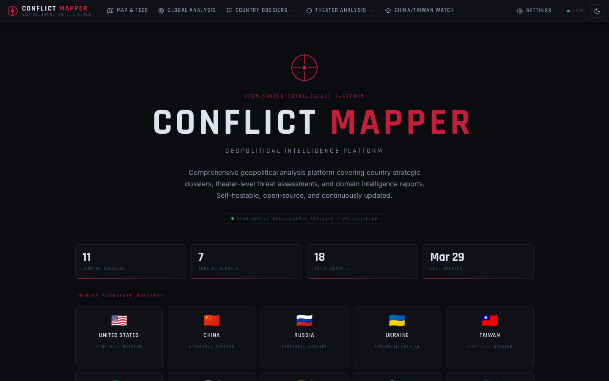 |
| Global Map & Feed | 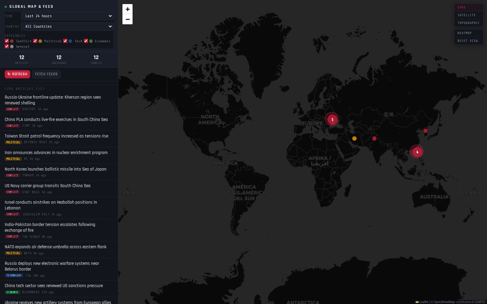 |
| News and country map workflow | 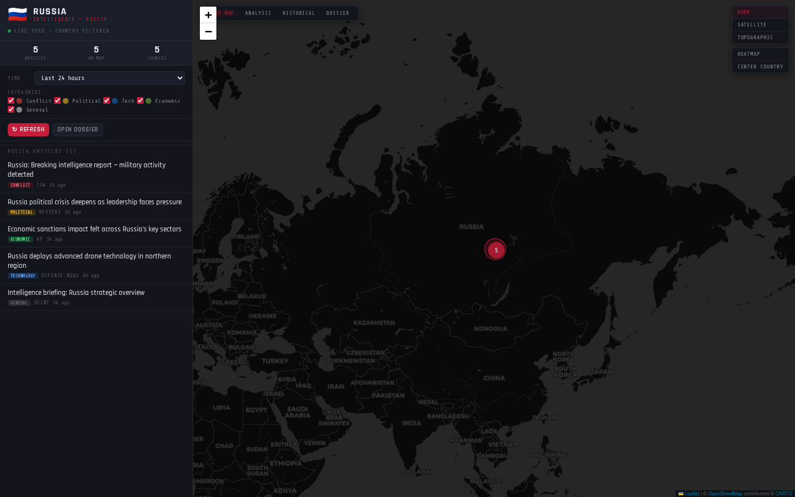 |
| Daily Global Analysis report | 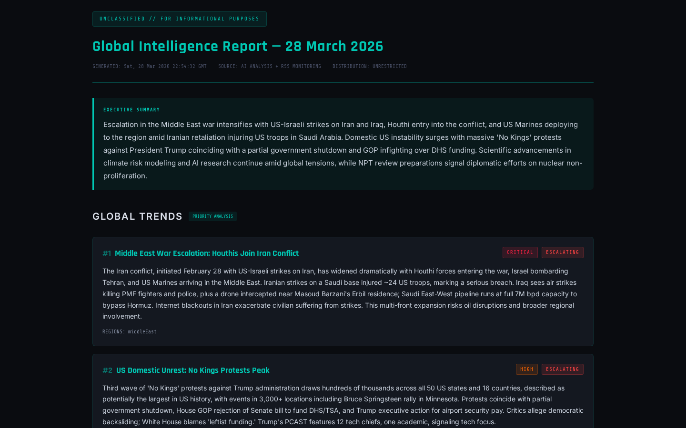 |
| Russia country analysis report | 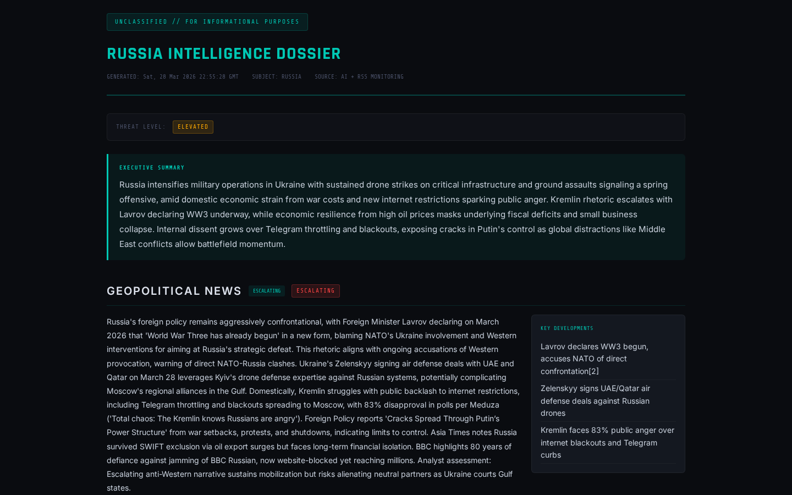 |
| China/Taiwan Watch | 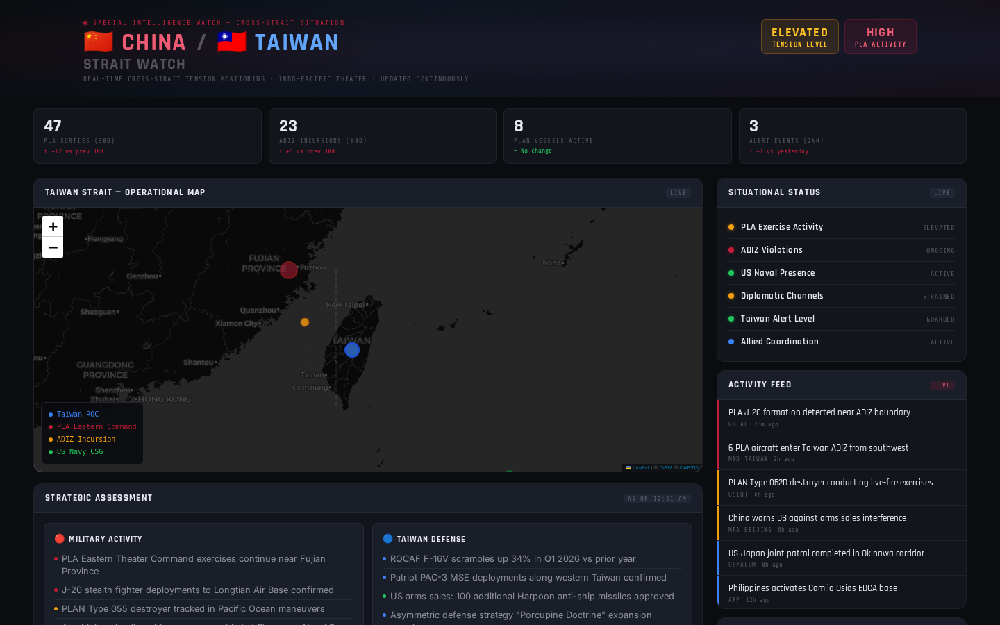 |
| Taiwan invasion window analysis | 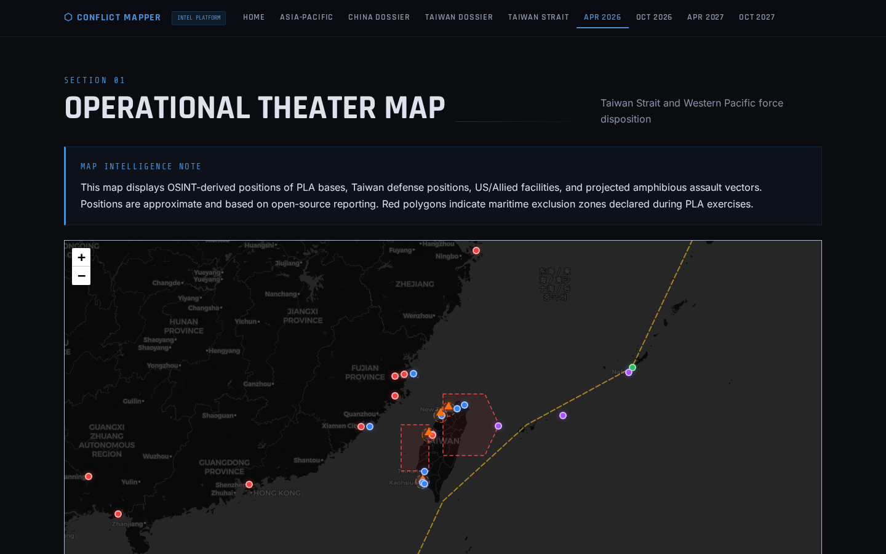 |
| Historical report browser | 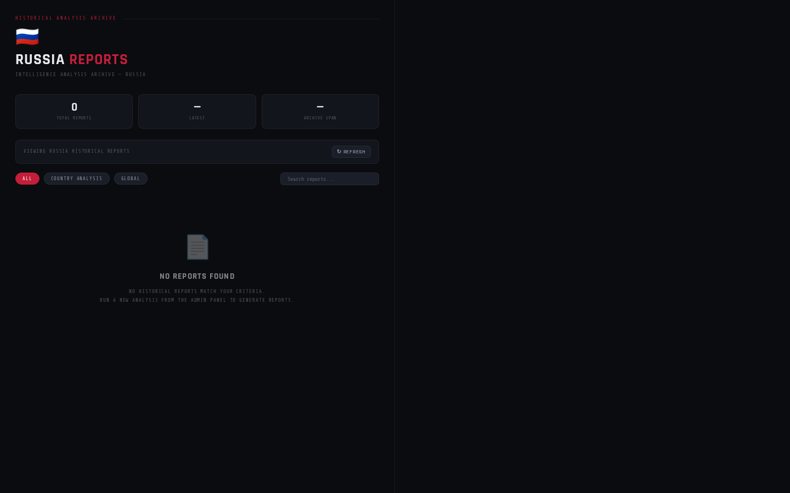 |
| RSS feed administration | 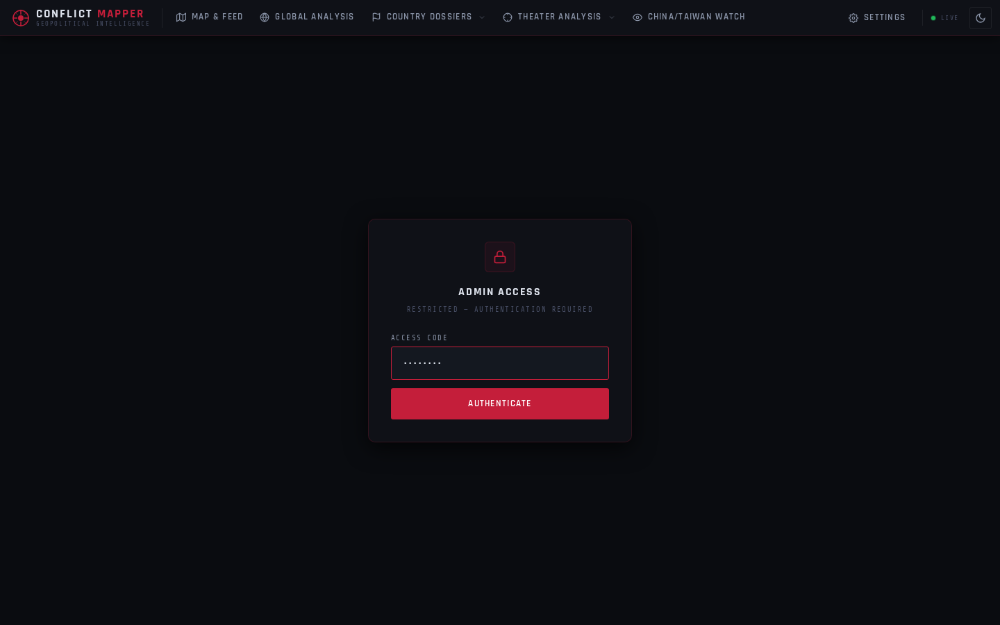 |
| Report generation administration |  |
| AI configuration | 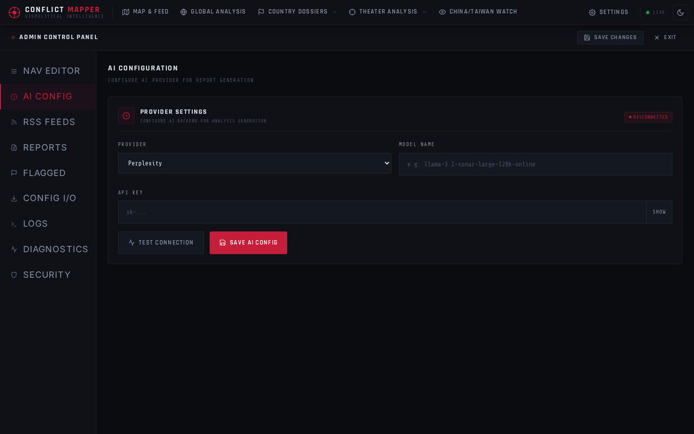 |
| Diagnostics and logs | 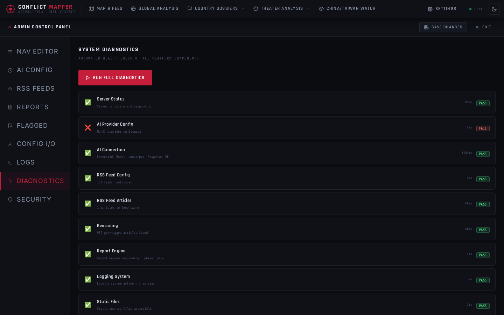 |
| Iran conflict analysis | 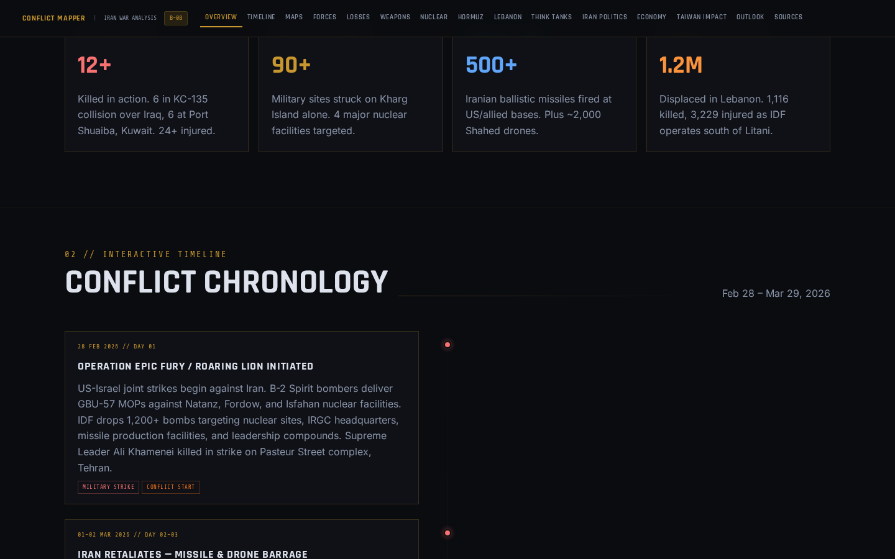 |
| Nuclear deep dive | 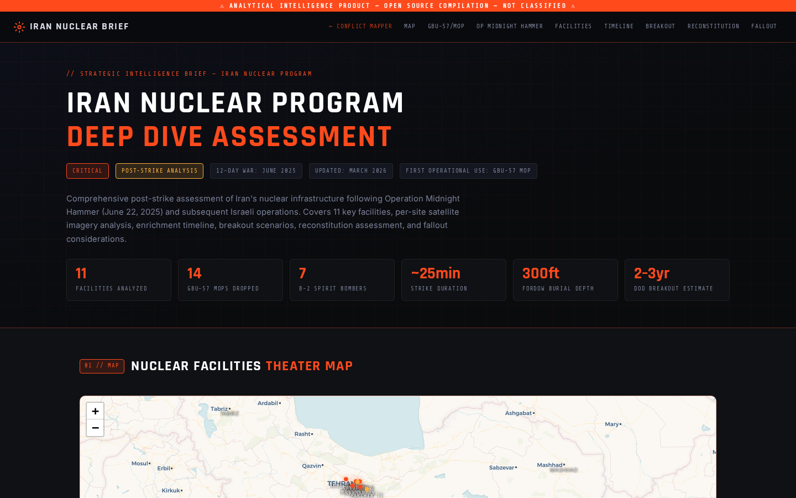 |

## Major Features

- **Daily Global Analysis**: Current global report, threat picture, map/feed entry points, and News Library access.
- **Daily Country Analysis**: 11 country cards linked to current report metadata so the card timestamp advances with the generated report.
- **News Library**: Live RSS cache browser with search, date, region, topic, and country filters, sorted newest first.
- **Map & Feed**: Leaflet-based article map with geotagged markers, clusters, heatmap density, and source links.
- **Country Dossiers**: Static strategic dossiers for USA, China, Russia, Ukraine, Taiwan, Iran, Israel, India, Pakistan, North Korea, and NATO.
- **Theater and domain analysis**: Eastern Europe, Asia-Pacific, Middle East, Arctic, Africa, Space Domain, and Cyber & Asymmetric pages.
- **Watch pages**: China/Taiwan Watch and Korean Peninsula Watch with current report, source stack, status cards, and intelligence feed.
- **Think Tanks**: Research organization directory and latest think-tank news page.
- **Admin console**: RSS sources, report generation, prompts, storage browser, diagnostics, logs, style settings, and config import/export.
- **Cloudflare-native backend**: Pages Functions for `/api/*`, R2 for reports and prompts, D1 for report metadata, KV for runtime config/status/article cache, and a separate scheduled Worker.

## Local Quick Start

```bash
git clone https://github.com/Marslauncher/conflict-mapper.git
cd conflict-mapper
npm install
npm start
```

Open `http://localhost:5000`.

Useful local checks:

```bash
npm test
node --check server.js
curl http://localhost:5000/api/status
curl "http://localhost:5000/api/articles?limit=5"
curl "http://localhost:5000/api/reports?scope=country&slug=usa&limit=1"
```

## Local Runtime Data

Local Express mode persists mutable data under `data/`:

| File | Purpose |
| --- | --- |
| `data/articles.json` | Cached RSS articles, capped at 5,000 newest records |
| `data/feeds-config.json` | 184 feed definitions, currently 166 enabled |
| `data/countries-config.json` | Monitored country and topic configuration |
| `data/ai-config.json` | Local provider config; keep real keys out of git |
| `data/server.log` | Local server log |

Do not commit real API keys, incident-private data, or production-only runtime exports.

## Cloudflare Deployment

The production path uses:

- **Cloudflare Pages** for static assets and Pages Functions.
- **Pages Functions bindings** for KV, R2, and D1.
- **R2** bucket `conflict-mapper-reports` for generated reports, historical report archives, article cache snapshots, and prompt files.
- **D1** database `conflict-mapper` for current/historical report metadata.
- **KV** namespace `CONFIG_KV` for encrypted app settings, AI config ciphertext, report status/logs, RSS fetch status, and runtime configuration.
- **Worker** `conflict-mapper-report-cron` for RSS refresh and scheduled report generation.

Cloudflare references:

- [Pages Functions bindings](https://developers.cloudflare.com/pages/functions/bindings/)
- [Wrangler Pages secrets](https://developers.cloudflare.com/workers/wrangler/commands/pages/#pages-secret-put)
- [Worker secrets](https://developers.cloudflare.com/workers/configuration/secrets/)
- [Worker environment variables and secrets](https://developers.cloudflare.com/workers/development-testing/environment-variables/)
- [Cron Triggers](https://developers.cloudflare.com/workers/configuration/cron-triggers/)

### 1. Authenticate Wrangler

```bash
npx wrangler login
```

### 2. Create Cloudflare Storage

```bash
npx wrangler kv namespace create CONFIG_KV
npx wrangler r2 bucket create conflict-mapper-reports
npx wrangler d1 create conflict-mapper
npx wrangler d1 migrations apply conflict-mapper --remote
```

Record the returned KV namespace ID and D1 database ID.

### 3. Configure `wrangler.toml`

The root `wrangler.toml` configures the Pages project:

```toml
name = "conflict-mapper"
compatibility_date = "2026-05-28"
pages_build_output_dir = "."

[[r2_buckets]]
binding = "REPORTS_BUCKET"
bucket_name = "conflict-mapper-reports"

[[d1_databases]]
binding = "DB"
database_name = "conflict-mapper"
database_id = "YOUR_D1_DATABASE_ID"

[[kv_namespaces]]
binding = "CONFIG_KV"
id = "YOUR_KV_NAMESPACE_ID"
```

Keep non-secret runtime values in `[vars]`. Do not put API keys or encryption keys in `[vars]`.

### 4. Configure Pages Bindings

In Cloudflare Dashboard:

`Workers & Pages` -> `conflict-mapper` -> `Settings` -> `Bindings`

Add production bindings:

| Type | Binding name | Resource |
| --- | --- | --- |
| KV namespace | `CONFIG_KV` | namespace created above |
| R2 bucket | `REPORTS_BUCKET` | `conflict-mapper-reports` |
| D1 database | `DB` | `conflict-mapper` |

Add preview bindings too if preview deployments should exercise real APIs.

### 5. Configure Pages Variables and Secrets

In Cloudflare Dashboard:

`Workers & Pages` -> `conflict-mapper` -> `Settings` -> `Variables and Secrets`

Set these as non-secret variables:

| Name | Current value or recommended value |
| --- | --- |
| `AI_PROVIDER` | `perplexity` |
| `OPENROUTER_MODEL` | `anthropic/claude-sonnet-4` |
| `NVIDIA_MODEL` | `nvidia/llama-3.3-nemotron-super-49b-v1` |
| `REPORT_STATUS_STALE_MINUTES` | `8` for Pages, `90` for cron worker batch status |
| `TRANSLATE_RSS_ARTICLES` | `true` |
| `RSS_TRANSLATION_LIMIT` | `80` |
| `REPORT_MAX_TOKENS` | `10000` on Pages, `12000` on cron worker |
| `ALLOW_REPORT_FALLBACK` | `true` |
| `REPORT_AI_TIMEOUT_MS` | `75000` |
| `REPORT_AI_ARTICLE_LIMIT` | `24` |

Create secrets with Wrangler:

```bash
openssl rand -base64 32
npx wrangler pages secret put AI_CONFIG_ENCRYPTION_KEY --project-name conflict-mapper
npx wrangler pages secret put ADMIN_ACCESS_TOKEN --project-name conflict-mapper
```

Provider API keys are optional Pages secrets if you prefer fixed environment secrets instead of encrypted app-managed KV config:

```bash
npx wrangler pages secret put PERPLEXITY_API_KEY --project-name conflict-mapper
npx wrangler pages secret put OPENROUTER_API_KEY --project-name conflict-mapper
npx wrangler pages secret put OPENAI_API_KEY --project-name conflict-mapper
npx wrangler pages secret put ANTHROPIC_API_KEY --project-name conflict-mapper
npx wrangler pages secret put GOOGLE_API_KEY --project-name conflict-mapper
npx wrangler pages secret put NVIDIA_API_KEY --project-name conflict-mapper
```

Security rule: Cloudflare secrets are for credentials. `wrangler.toml` `[vars]` is only for non-sensitive config.

### 6. Deploy Pages

Recommended Pages settings:

| Setting | Value |
| --- | --- |
| Repository | `Marslauncher/conflict-mapper` |
| Production branch | `master` |
| Build command | empty |
| Build output directory | `.` |
| Root directory | empty |
| Compatibility date | `2026-05-28` or newer |

Push to `master`, then verify:

```bash
curl https://conflictmapper.com/api/status
curl "https://conflictmapper.com/api/articles?limit=1"
curl "https://conflictmapper.com/api/reports?scope=global&limit=1"
curl "https://conflictmapper.com/api/reports?scope=country&slug=usa&limit=1"
```

### 7. Configure and Deploy the Cron Worker

The cron worker lives in `workers/report-cron`.

```bash
cp workers/report-cron/wrangler.example.toml workers/report-cron/wrangler.toml
```

Edit `workers/report-cron/wrangler.toml`:

- Set the same `CONFIG_KV`, `REPORTS_BUCKET`, and `DB` bindings used by Pages.
- Set `STATIC_SITE_BASE_URL = "https://conflictmapper.com"` or your Pages production URL.
- Keep `FETCH_FEEDS_BEFORE_REPORTS = "true"` so the global job refreshes articles before generation.
- Keep `REPORT_WATCH_CRONS = "15 3 * * *|25 3 * * *"` so Taiwan/China and Korean Peninsula watch reports run in separate Worker invocations after the global job.
- Keep `FETCH_FEEDS_BEFORE_COUNTRY_REPORTS = "false"` unless each country shard should pay the RSS refresh cost.
- Confirm `REPORT_COUNTRIES = "usa,china,russia,ukraine,taiwan,iran,israel,india,pakistan,north-korea,nato"`.
- Keep `REPORT_COUNTRY_PARALLELISM = "2"` unless provider limits require stricter serial execution.

Current cron triggers:

| Cron | Purpose |
| --- | --- |
| `* * * * *` | Feed-only refresh trigger; `shouldRunFeedRefresh()` respects the configured app interval before doing work |
| `0 3 * * *` | Daily global report plan |
| `15 3 * * *` | Daily Taiwan/China watch report shard |
| `25 3 * * *` | Daily Korean Peninsula watch report shard |
| `30 8 * * *` | Daily country report shard |
| `35 8 * * *` | Daily country report shard |
| `40 8 * * *` | Daily country report shard |

Set worker secrets:

```bash
cd workers/report-cron
npx wrangler secret put AI_CONFIG_ENCRYPTION_KEY
npx wrangler secret put ADMIN_ACCESS_TOKEN
npx wrangler secret put PERPLEXITY_API_KEY
npx wrangler deploy
```

Repeat provider key secrets on the Worker only for providers used by scheduled generation.

Manual worker tests:

```bash
cd workers/report-cron
npx wrangler dev --test-scheduled
curl "http://localhost:8787/__scheduled?cron=0+3+*+*+*"
curl "http://localhost:8787/__scheduled?cron=15+3+*+*+*"
curl "http://localhost:8787/__scheduled?scope=country&slug=usa"
curl "http://localhost:8787/__scheduled?scope=watch&slug=taiwan"
```

### 8. Verify Production Behavior

After deploy, validate the actual rendered site, not only API `200` responses:

```bash
curl https://conflictmapper.com/api/logs
curl https://conflictmapper.com/api/analysis/status
curl "https://conflictmapper.com/api/articles/geo?limit=25"
curl "https://conflictmapper.com/reports/global/current/report.html"
curl "https://conflictmapper.com/reports/countries/usa/current/report.html"
```

In the browser:

1. Open `https://conflictmapper.com`.
2. Confirm **Daily Country Analysis** cards show a report-updated date.
3. Open **News Library** and confirm latest cards are sorted newest first.
4. Open **Settings -> Logs** and check RSS/report phases.
5. Open **Settings -> Reports** and verify current/historical report links.
6. Open **Contact** and verify the email and GitHub links.

## API Surfaces

Local Express and Cloudflare Pages Functions expose the same core read paths:

| Path | Purpose |
| --- | --- |
| `/api/status` | Runtime health and summary stats |
| `/api/feeds` | Feed configuration |
| `/api/articles` | Cached article list with filters |
| `/api/articles/geo` | Geotagged article subset |
| `/api/reports` | Current and historical report metadata |
| `/api/analysis/status` | Report generation status |
| `/api/logs` | Runtime logs and feed/report status |

Mutation paths such as AI config, feed fetch, report generation, prompt editing, settings writes, and storage browsing are administrative surfaces. The local server and Cloudflare API middleware require `ADMIN_ACCESS_TOKEN` for those routes. Add Cloudflare Access as an outer control when the admin surface is not intended for public operators.

## Security Notes

- Never commit real provider API keys, encryption keys, Cloudflare tokens, admin tokens, or private incident data.
- Use Cloudflare secrets for credentials. Do not put secrets in `wrangler.toml`, `assets/*.json`, screenshots, docs, browser localStorage, or public issue reports.
- `ADMIN_ACCESS_TOKEN` gates server-backed admin authentication and sensitive `/api/*` routes. Successful admin login sets a scoped, HttpOnly `/api` cookie; logout clears it server-side.
- Static middleware blocks implementation and reference paths from public serving, including `/cloudflare/`, `/functions/`, `/workers/`, `/lib/`, `/scripts/`, `/docs/`, `/datasources/`, `/data/`, screenshots, generated samples, dotfiles, package files, and local config files.
- Generated HTML reports are sanitized before storage, but analyst review is still required before using generated content as trusted intelligence.
- Public static files should contain only intended documentation, screenshots, generated public reports, and non-secret config.
- R2 reports are served through `/reports/*`; cache is intentionally short so current report links can advance after cron generation.
- The Contact page warns users not to send credentials or private incident data through public GitHub issues.

## Project Structure

```text
conflict-mapper/
├── index.html
├── server.js
├── wrangler.toml
├── workers/report-cron/
│   ├── src/index.js
│   └── wrangler.toml
├── functions/api/
├── functions/reports/
├── cloudflare/lib/
├── lib/
├── pages/
├── countries/
├── reports/
├── assets/
├── data/
├── docs/
└── screenshots/
```

## Development Commands

```bash
npm start
npm test
node --check server.js
npx wrangler pages dev .
cd workers/report-cron && npx wrangler dev --test-scheduled
```

## Docker

```bash
docker build -t conflict-mapper .
docker run -p 5000:5000 -v "$(pwd)/data:/app/data" conflict-mapper
```

Mount `data/` to persist articles and runtime configuration across container restarts.

## Contributing

1. Fork the repository.
2. Create a feature branch: `git checkout -b feature/my-feature`.
3. Make the change and test locally with `npm start`.
4. Run syntax and route smoke checks before opening a pull request.

Useful contribution areas:

- Additional country dossiers and country intel-tool pages.
- Feed coverage improvements in `data/feeds-config.json`.
- Geotagging coverage improvements in `cloudflare/lib/articles.js` and `lib/geocoder.js`.
- Automated tests for report metadata, article sorting, and Cloudflare function parity.

## Data Sources and Disclaimer

Conflict Mapper aggregates public open-source reporting and research sources including ISW, IISS, RAND, CSIS, SIPRI, Bellingcat, Reuters, AP, BBC, Defense News, USNI News, Foreign Affairs, 
