# Air Power Comparison: PLAAF/PLAN Aviation vs. US & Allied Air Forces — Taiwan Scenario
### Comprehensive Platform-by-Platform Analysis Including Experimental Aircraft, Loyal Wingman Drones, Munitions, and Near-Future Capabilities — Updated June 2026
---
## Executive Summary
The air battle over and around Taiwan would be the largest and most technologically complex aerial conflict since the Second World War. China's People's Liberation Army Air Force (PLAAF) is now producing up to 400 advanced fighters annually, has fielded the world's second-largest fleet of fifth-generation stealth aircraft, and is developing a sixth-generation ecosystem anchored by the J-20S drone command node and H-20 stealth bomber. The United States and its Pacific allies — Japan, South Korea, Australia, and Taiwan — counter with the world's only operational sixth-generation fighter program (F-47), the largest stealth fleet in history (1,300+ F-35s globally), and a growing portfolio of standoff munitions, loyal wingman drones, and cargo-launched cruise missiles that dramatically multiply strike mass. This report provides a complete platform-by-platform comparison, organized by role, with full specifications, weapons loadouts, ranges, and an honest assessment of which side holds the edge in each category.[^1][^2]

***
## PART I: FIFTH-GENERATION FIGHTERS
### 1.1 China — Chengdu J-20 "Mighty Dragon" (All Variants)
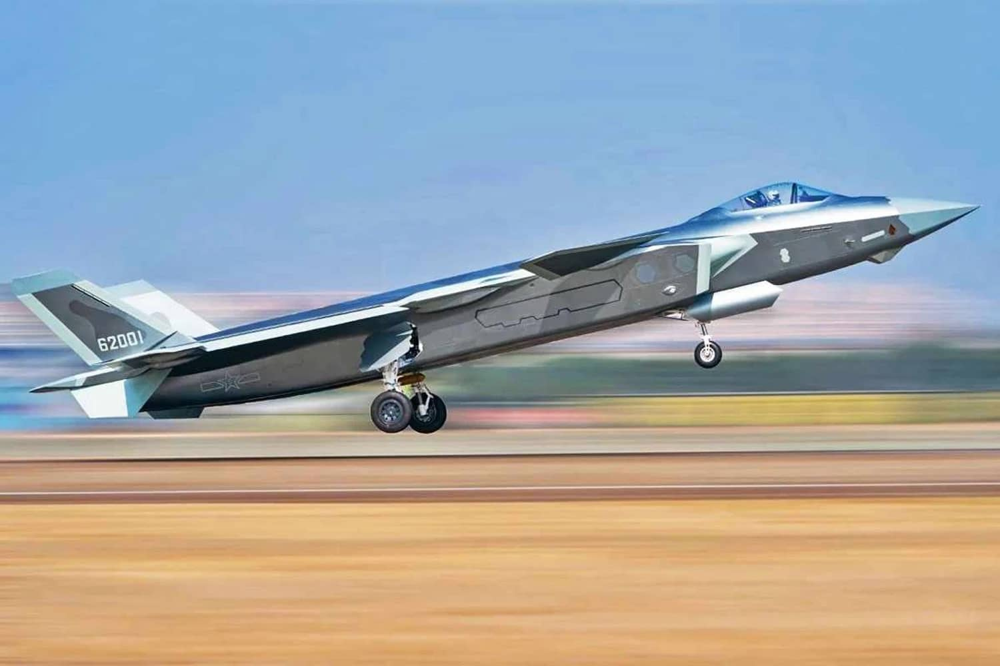
Chengdu J-20 fighter jet
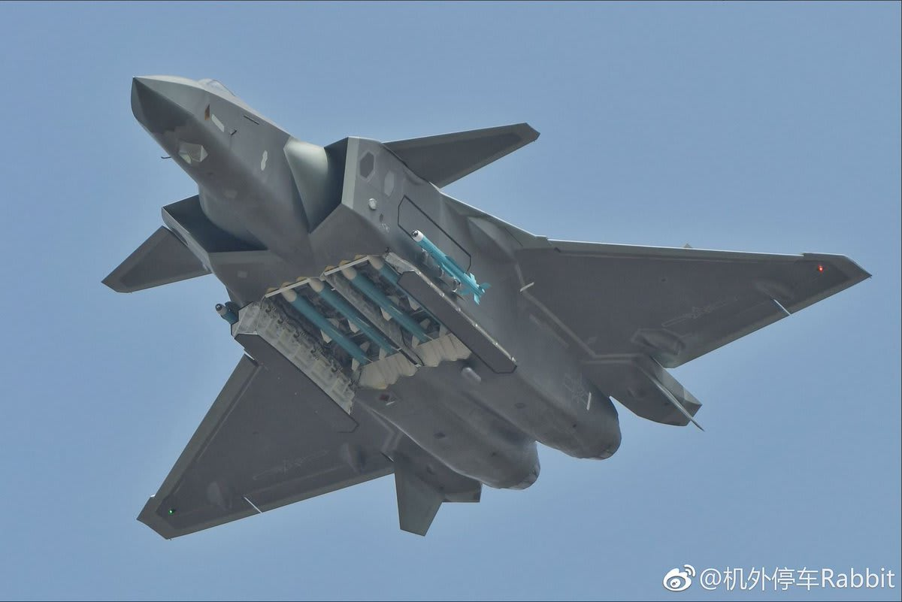
Chengdu J-20 stealth fighter
The J-20 is China's flagship stealth air superiority and multi-role strike platform, the first operational fifth-generation fighter outside the United States. With approximately 300+ J-20s in service as of mid-2025, and production running at 100–120 airframes annually, China is projected to field over 1,000 fifth-generation fighters by 2030.[^3]
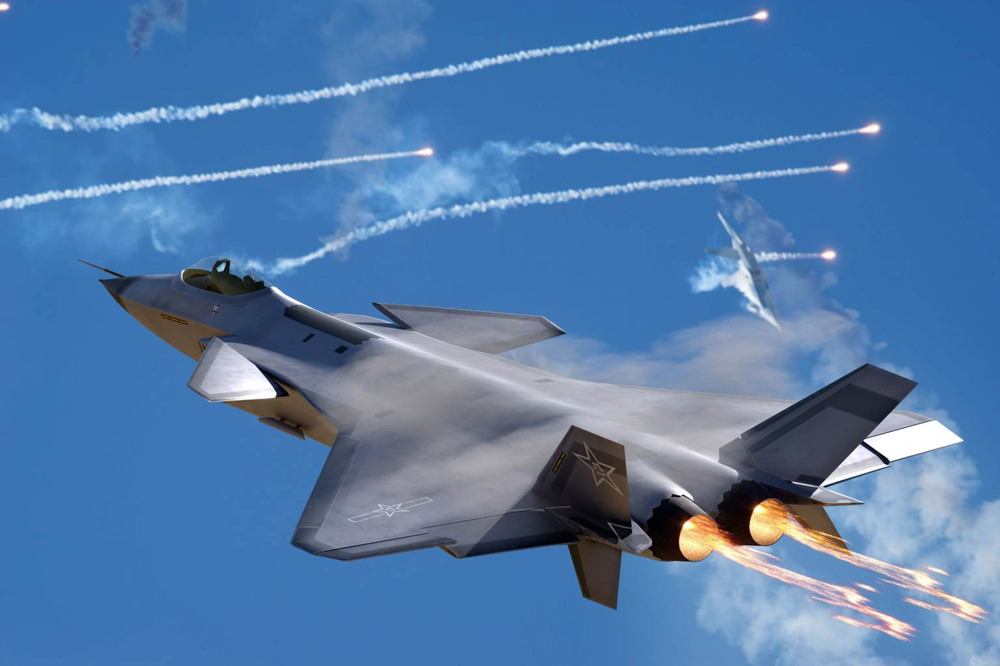
J-20 fighter jets
The J-20 is a large, heavyweight twin-engine stealth fighter featuring canard-delta wing configuration, DSI air intakes, and three internal weapons bays. The most recent J-20A variant is powered by the domestic WS-15 engine delivering approximately 30,000 lb thrust per engine with supercruise capability. The J-20S is the twin-seat combat variant — not a trainer — designed to act as an airborne command node for drone swarms and maritime strike, with a Mission Systems Officer (MSO) managing electronic warfare and loyal wingman UAVs.[^4][^5]
| Specification | J-20 / J-20A | J-20S (Twin-Seat) |
|---|---|---|
| **Role** | Air superiority / stealth strike | Drone command node / EW / maritime strike[^5] |
| **Length** | 66.9 ft (20.4 m)[^6] | Same airframe |
| **Wingspan** | 44.6 ft (13.6 m)[^6] | Same |
| **Max Speed** | Mach 2.0+ (J-20A: Mach 2.55 reported)[^5] | Mach 2.55[^5] |
| **Supercruise** | Yes (WS-15 engine)[^4] | Yes[^5] |
| **Ceiling** | 65,000 ft[^5] | 65,000 ft[^5] |
| **Combat Radius** | 1,100 nmi (internal fuel)[^7][^5] | ~1,100 nmi |
| **Engine** | 2× WS-15 (30,000 lb thrust ea.)[^4] | 2× WS-15 |
| **Stealth** | DSI intakes, internal bays, RAM coating, blended wing-body[^8] | Same |
| **Radar** | GaN AESA (largest aperture among stealth fighters)[^9] | Same |
| **Crew** | 1 | 2 (Pilot + MSO)[^5] |
| **Hardpoints** | 3 internal bays + 4 underwing (beast mode)[^10] | Same |
| **Fleet Size** | 300–350 operational (mid-2025)[^3] | Entering service 2025–2026[^5] |
| **Production Rate** | 100–120/year; 400 J-20/J-35/J-16 combined by 2027[^1] | |

**Weapons Loadout:**

| Weapon | Type | Range | Notes |
|---|---|---|---|
| **PL-15** | BVR AAM | 200–300 km[^10] | Standard internal load; 4 internal + 8 external (beast mode) = 12 BVR missiles[^10] |
| **PL-17** | Very Long-Range AAM | ~400 km against fighters; ~800 km against AWACS/tankers[^11] | Dual-pulse motor, AESA seeker; targets high-value assets[^12] |
| **PL-16** (emerging) | Long-Range AAM | 220–300 km est.[^13] | Successor to PL-15; more compact (6 fit where 4 PL-15s fit)[^13]; integrates into J-20 and J-35[^13] |
| **PL-10** | WVR AAM | ~20 km | Side bay carriage; high-off-boresight IRST guidance[^8] |
| **YJ-12** | Anti-Ship (air-launched) | 400+ km | Supersonic (Mach 2.0+); J-20 maritime strike variant confirmed Jan 2026[^14] |
| **LS-6/LS-500 GPS bombs** | Precision strike | Stand-in | Internal carriage for ground attack |

**Edge Assessment:** The J-20's primary BVR missile (PL-15) and the emerging PL-16 now rival or exceed the US AIM-120D in range, and the PL-17 specifically targets the US ISTAR architecture — tankers, AWACS, and ISR aircraft — at ranges that outshoot their escorts. The J-20S's ability to simultaneously pilot the aircraft, coordinate drone swarms, and execute EW from a single platform is unprecedented among fielded aircraft. However, the J-20 still lacks a domestic engine fully comparable to the F-22's Pratt & Whitney F119, and reports of RAM coating durability issues persist.[^9]

***
### 1.2 China — Shenyang J-35 / J-35A "Falcon Hawk" (Carrier & Land-Based)
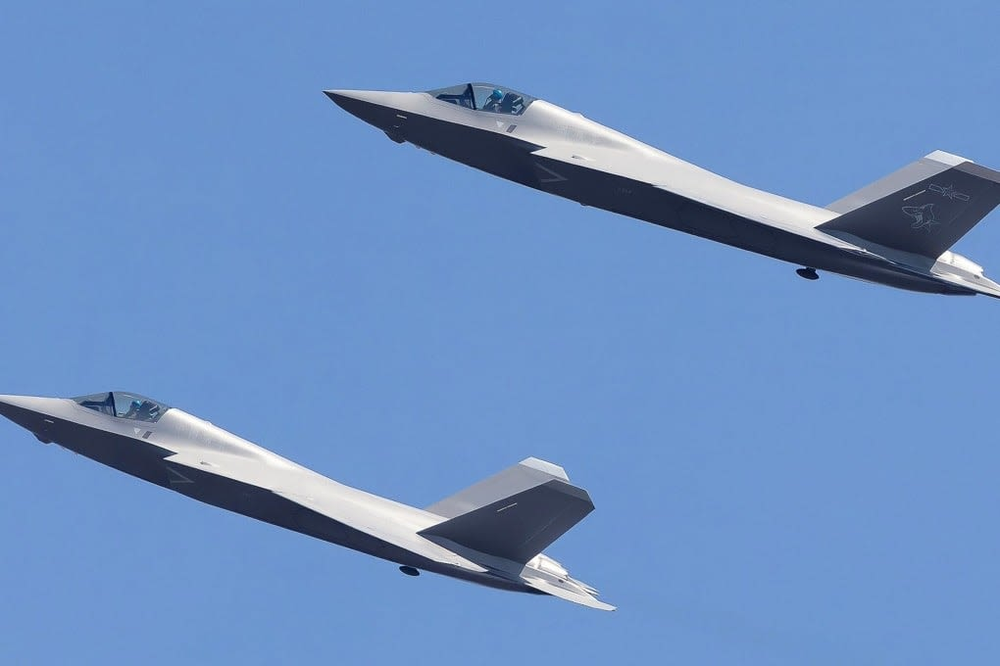
J-35 stealth fighters
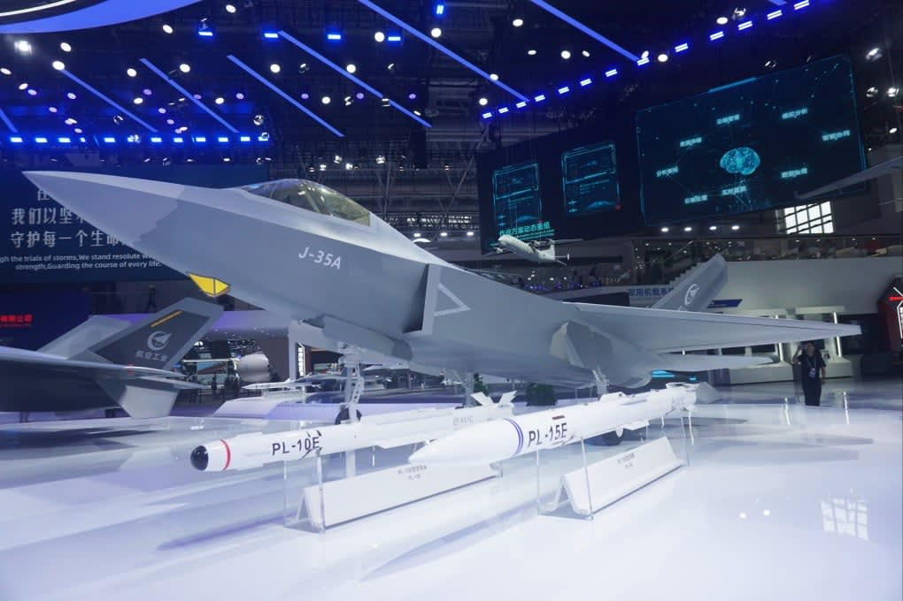
Stealth fighter jet
The J-35 is China's second stealth fighter family, making China and the United States the only nations with two distinct fifth-generation types. The carrier-based J-35 entered low-rate initial production (LRIP) in 2025 with hull numbers 0011 and 0012 observed in air-to-air photography, and conducted its first EMALS catapult launch from the carrier *Fujian* in September 2025. The land-based J-35A is intended for PLAAF service, potentially replacing J-10Cs.[^15][^16]
| Specification | J-35 (Carrier) | J-35A (Land-Based) |
|---|---|---|
| **Role** | Carrier multirole stealth fighter[^15] | Land-based multirole stealth[^17] |
| **Length** | ~17.3 m[^15] | ~17.3 m[^15] |
| **Wingspan** | ~11.5 m[^15] | ~11.5 m |
| **Max Speed** | ~Mach 1.8–1.9[^18] | ~Mach 1.8–1.9 |
| **Engine** | WS-19 (intended production fit)[^15] | WS-19[^15] |
| **Payload** | 6–8 tons[^18] | 6–8 tons |
| **Internal Weapons** | 4 BVR AAMs baseline; up to 6 with extended bays[^15] | Same |
| **External Stores** | PL-15 (4 underwing) for beast mode[^19] | Same |
| **Carrier Launch** | EMALS (first launch Sep 2025 from *Fujian*)[^15] | N/A |
| **Key Upgrade** | Lifespan extended to 2050s; WS-21 tested; WS-19 production fit[^17] | Same |
| **Status** | LRIP; PLAN service entry imminent[^16] | Acceptance flights Jan 2026[^17] |

**Weapons Loadout:** PL-15 (BVR), PL-10 (WVR), PL-16 (emerging), YJ-12 anti-ship missile (4 reported per jet), AKF-98A land-attack cruise missile.[^19][^20]

**Edge Assessment:** The J-35 is broadly analogous to the F-35C in carrier role but enters service several years later. Its carrier EMALS capability from the *Fujian* gives the PLAN a credible 5th-gen deck aviation arm for the first time. The key limiting factor is production rate and pilot training depth; the J-35 program is still in LRIP while the F-35 fleet now exceeds 1,300 globally.[^2]

***
### 1.3 US — F-22 Raptor (USAF — 183 operational)

F-22 Raptor weapon bays
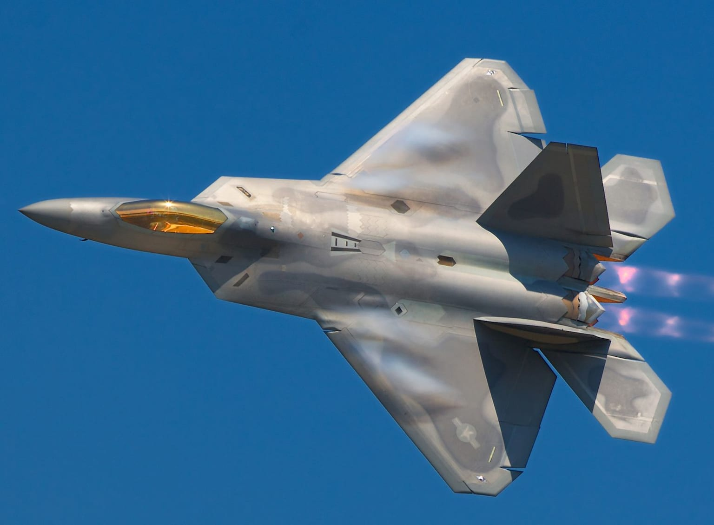
F-22 Raptor
The F-22 Raptor remains the world's most capable pure air superiority fighter — the only aircraft specifically designed from the outset to achieve and maintain air dominance against the best peer threats. All 183 operational Raptors are assigned primarily to the Pacific and European theaters.[^21]
| Specification | F-22A Raptor |
|---|---|
| **Role** | Air dominance, penetrating SEAD, limited strike |
| **Speed** | Mach 2.25+ (supercruise: Mach 1.82 without afterburner)[^22] |
| **Ceiling** | 65,000 ft[^22] |
| **Combat Radius** | ~410 nmi internal fuel (limited by fuel; no external tanks in LO config)[^22] |
| **Stealth** | Lowest RCS of any operational fighter — classified, estimated 0.0001–0.0003 m²[^23] |
| **Radar** | AN/APG-77 GaN AESA; BVR detection >200 km against fighter-sized targets |
| **Main Weapons (Air-to-Air)** | 6× AIM-120C/D AMRAAM (internal); 2× AIM-9X Sidewinder (side bays)[^21] |
| **Upgrade: AIM-260 JATM** | Replacing AIM-120; F-22 is first operational platform; range 120+ miles (193+ km)[^24][^25] |
| **Ground Attack** | 2× GBU-32 1,000 lb JDAM (internal)[^22]; GBU-39 SDB (8 internal)[^22] |
| **Gun** | M61A2 Vulcan 20 mm, 480 rounds[^21] |
| **Engine** | 2× P&W F119-PW-100; 35,000 lb thrust ea. with TVC[^22] |
| **Key Limitation** | Short combat radius requires tanker support; no Block 30 upgrades due to cost; fleet size too small (183) to replace in large-scale attrition conflict |

**Edge Assessment:** The F-22 retains the edge in within-visual-range and close-in BVR engagements, supercruise performance, and raw stealth. The AIM-260 integration directly counters the PL-15/PL-17 range challenge. However, 183 Raptors spread across a global theater is a thin force. The F-22's short combat radius relative to Taiwan's distance from US bases (Guam is ~2,700 km from Taiwan) requires persistent tanker support under A2/AD threat.

***
### 1.4 US — F-35A / B / C Lightning II (USAF, USN, USMC, Allied)
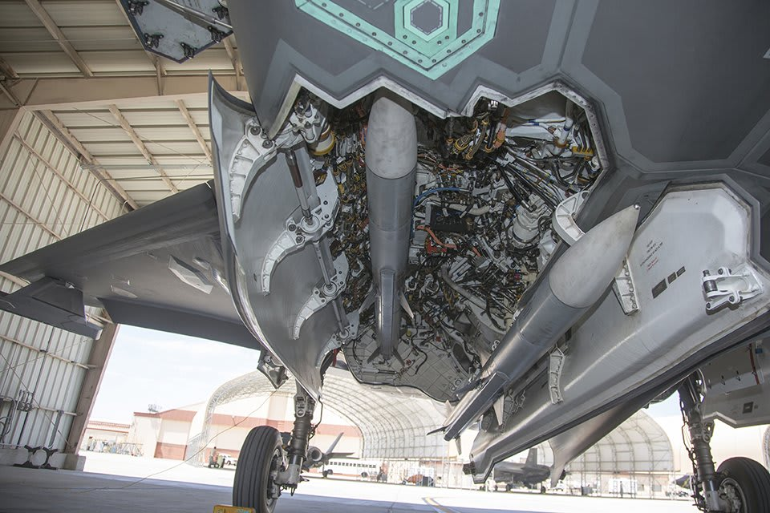
F-35 internal weapons bay
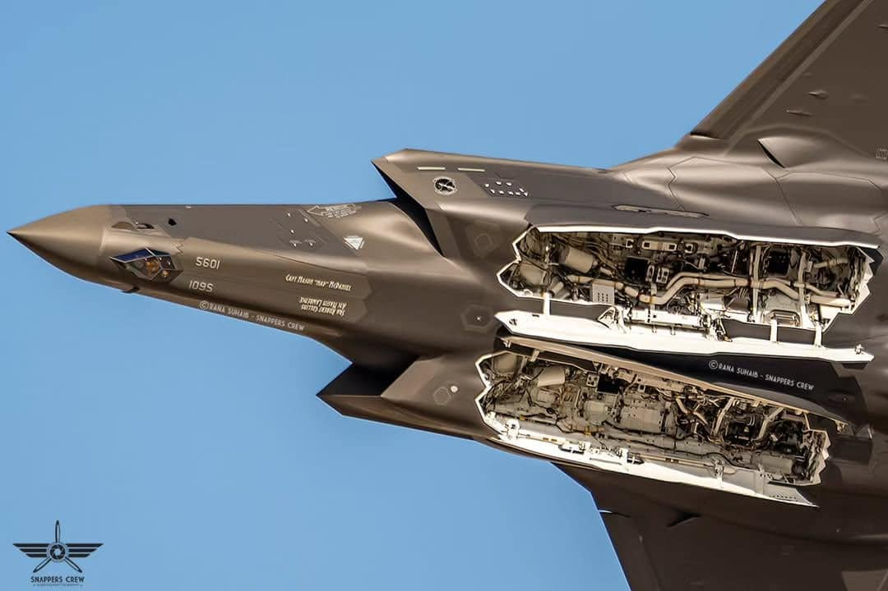
F-35 fighter jet
The F-35 Lightning II is the backbone of US and Allied 5th-generation tactical airpower, with 1,300+ airframes delivered globally as of April 2026, making it the most numerous stealth aircraft on Earth. The three variants (F-35A conventional, F-35B STOVL, F-35C carrier) share a common sensor suite but differ in performance envelope.[^2]
| Specification | F-35A (USAF/Allies) | F-35B (USMC/Allies) | F-35C (USN) |
|---|---|---|---|
| **Role** | Multirole stealth strike/ISR | STOVL multirole, amphibious ops | Carrier multirole stealth |
| **Speed** | Mach 1.6[^26] | Mach 1.6 | Mach 1.6 |
| **Combat Radius** | 1,200+ nmi[^26] | 900+ nmi | 1,250+ nmi |
| **Ceiling** | 50,000 ft[^26] | 50,000 ft | 50,000 ft |
| **Internal Weapons** | 2× AIM-120 + 2× GBU-31/32[^26] | Same | Same |
| **External Beast Mode** | Up to 18,000 lb across 6–8 hardpoints[^26] | Less (STOVL weight budget) | 18,000 lb |
| **Sensor Fusion** | AN/APG-81 AESA + AN/AAQ-40 EOTS + AN/ASQ-239 EW + DAS (360°)[^26] | Same | Same |
| **Key Weapons** | AIM-120D (160 km); AIM-260 JATM (200+ km); JDAM; JSOW; SDB II; LRASM[^26] | Same | Same |
| **Nuclear** | B61-12 nuclear bomb integration[^2] | No | No |
| **USAF Fleet** | 1,763 F-35A (total planned)[^27] | 353 F-35B (planned)[^27] | 340 F-35C (planned)[^27] |
| **Key Advantage** | Sensor fusion and data sharing eclipse any peer; acts as flying battlespace node[^26] | Operates from LHAs, forward austere strips, island chain[^28] | Carrier operations; long combat radius |

**Weapons Available on F-35 (Pacific Mission Set):**

| Weapon | Type | Range | Carriage |
|---|---|---|---|
| **AIM-120D AMRAAM** | BVR AAM | 160+ km | Internal (2) or external (6) |
| **AIM-260 JATM** | Next-gen BVR AAM | 193+ km (120+ mi)[^24] | Internal; F-22 first; F-35 integration ongoing |
| **AIM-9X Sidewinder** | WVR AAM | ~35 km | Internal side bays |
| **JDAM GBU-31/32/38** | Precision gravity bomb | Delivery altitude + glide | Internal (2 × 2,000 lb) |
| **GBU-39/B SDB** | Small Diameter Bomb | ~110 km glide | 8 per bomb bay |
| **JASSM-ER AGM-158B** | Cruise missile | 925+ km (575 mi)[^29] | External pylons |
| **LRASM AGM-158C** | Anti-ship cruise missile | 370+ km | External; stealthy low-observable |
| **JSM Joint Strike Missile** | Anti-ship / land attack | 280 km | Internal bay compatible (F-35A/C) |
| **B61-12 nuclear bomb** | Tactical/strategic nuclear | N/A | Internal (F-35A; F-35B/UK)[^2] |

***
### 1.5 Japan — JASDF F-35A / F-35B (105 + 42 on order)

JASDF F-35A fighter jet
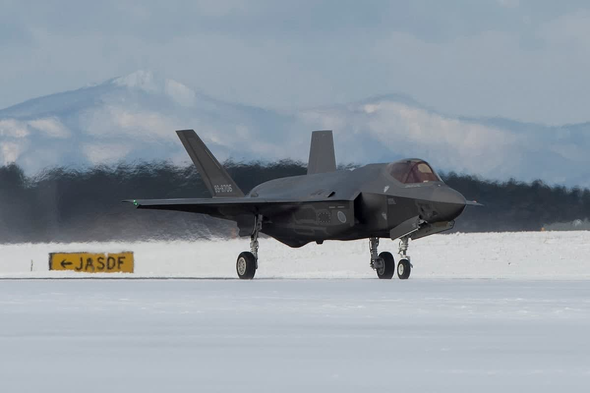
F-35A fighter jet
Japan is the largest international F-35 customer, with a program of record for 105 F-35As and 42 F-35Bs. The F-35Bs will operate from the JS *Izumo*-class helicopter destroyer conversions, providing Japan with its first carrier aviation capability since World War II. The first TR-3 standard F-35s were delivered to Komatsu Air Base in April 2025.[^30][^31]
Japan's F-35s are being armed with the Mitsubishi Type 12 Kai Extended Range surface-to-ship missile (900–1,200 km), making JASDF aircraft key strike platforms in any first island chain interdiction scenario. Japan plans to field Tomahawk BGM-109 cruise missiles from its Aegis destroyers and is exploring integration with F-35 data networking for cooperative engagement.[^32]

***
### 1.6 South Korea — ROKAF KF-21 Boramae (Block I entering service 2026)
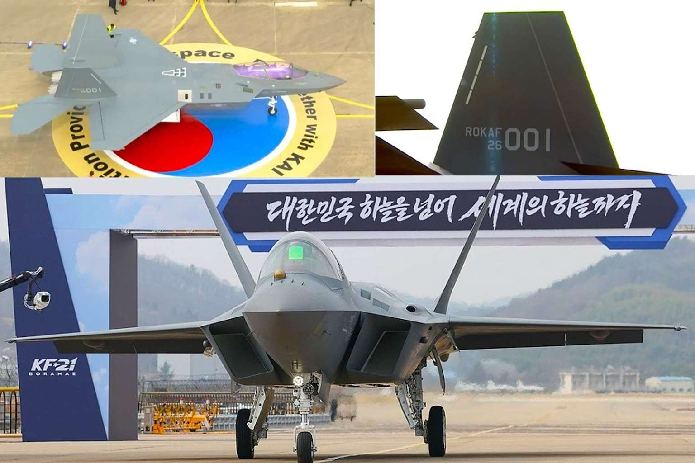
KF-21 Boramae fighter jet
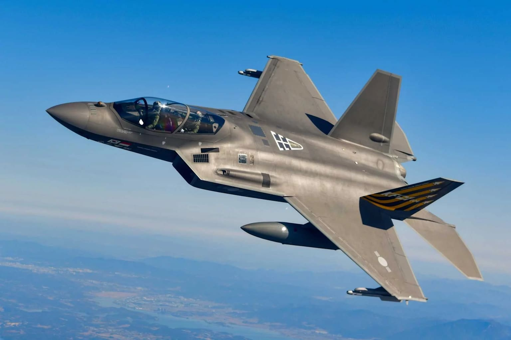
KF-21 Boramae fighter
The KF-21 Boramae is South Korea's indigenous 4.5+ generation fighter, with the first production aircraft rolled out in March 2026. Eight aircraft are set for delivery in 2026, with 31 in 2027 and 47 in 2028. The ROKAF will operate 120 KF-21s by 2032, complementing F-35As and F-15Ks.[^33]
| Specification | KF-21 Block I | KF-21 Block II (2028+) | KF-21 Block III (future) |
|---|---|---|---|
| **Role** | Air-to-air multirole[^33] | Air-to-air + ground attack[^33] | Full 5th-gen (stealth, supercruise)[^33] |
| **Speed** | Mach 2.25+[^34] | Same | Same |
| **Range** | ~1,000 km operational[^34] | Extended | Extended |
| **Max TOW** | 25,500 kg[^34] | Same | Same |
| **Engine** | 2× GE F414-400K[^34] | Same | Upgraded |
| **Payload** | ~17,000 lb across 10 hardpoints[^33] | Same | Internal bay added |
| **BVR Missiles** | MBDA Meteor (PK ratio vs. AIM-120: 3×+), IRIS-T WVR[^33] | + AMRAAM, AIM-9X[^33] | |
| **Strike** | JDAM (limited)[^33] | GBU-12, GBU-56 LJDAM, KALCM cruise missile[^33] | |
| **Radar** | AESA, IRST[^34] | Same | Sensor fusion upgraded |
| **Stealth** | RAM coating absent (Block I); semi-recessed missile carriage[^33] | Improved RAM | Full LO coating + weapons bay[^33] |

The Meteor BVR missile carried by Block I KF-21 is particularly notable — it uses a ramjet sustainer motor, meaning it does not coast to target like rocket-propelled missiles but arrives at the target with full kinetic energy, giving it a No-Escape Zone (NEZ) roughly 3× that of an AIM-120C at the same nominal range.

***
### 1.7 Taiwan — ROCAF F-16V "Viper" Block 70 (141 upgraded)
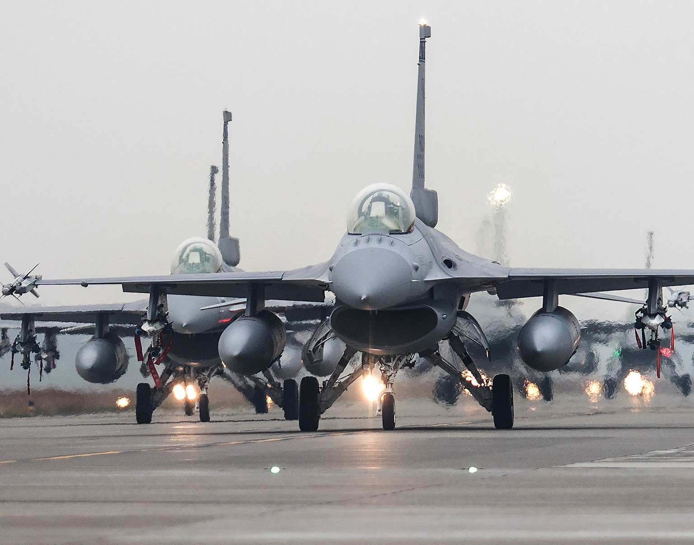
F-16 fighter jets
Taiwan's backbone fighter following a $8 billion F-16 upgrade program. All 141 aircraft are in the process of being converted to F-16V "Viper" Block 70 standard, the most advanced F-16 configuration ever built, featuring the AN/APG-83 AESA radar, advanced EW suite, and full compatibility with AIM-120D, AIM-9X, JDAM, and HARM.
**Key Taiwan Air-to-Air Missiles:**
- **AIM-120D AMRAAM**: 160+ km, active radar guidance; F-16V carries 6 externally
- **AIM-9X Block II**: Mach 3+, 360° off-boresight via JHMCS helmet cuing
- **Tien Chien-2 (TC-2) "Sky Sword II"**: Indigenously developed BVR; ~100 km range; AESA-guided; deployed as backup to AMRAAM

***
### 1.8 Taiwan — AIDC F-CK-1 "Ching-kuo" IDF (130 in service — 70 in combat wing)
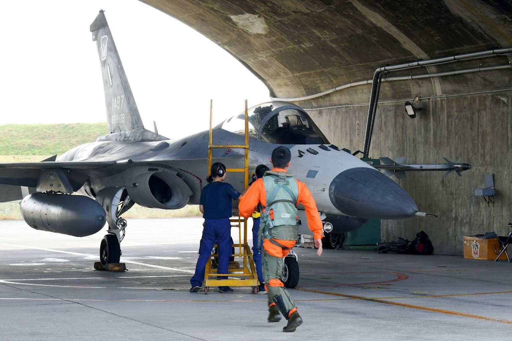
F-CK-1 fighter jet maintenance
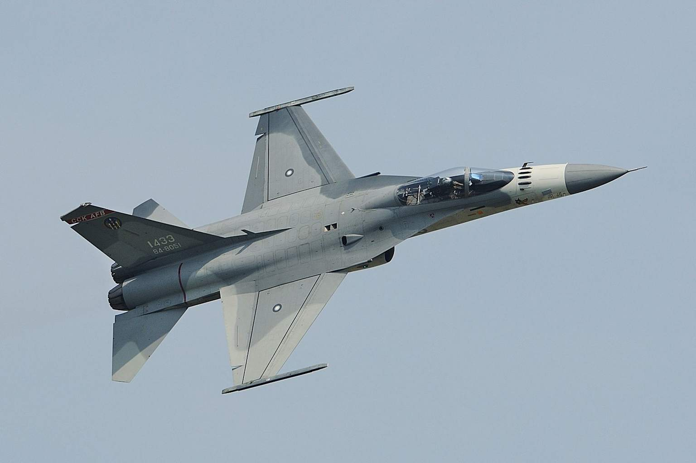
AIDC F-CK-1 Ching-kuo
Taiwan's indigenously designed fighter, named after President Chiang Ching-kuo. Not a stealth aircraft, but carries a unique weapon now being integrated that dramatically elevates its value: the air-launched Hsiung Feng III anti-ship missile. This Mach 3.5 weapon, miniaturized to fit the IDF's hardpoints, transforms every F-CK-1 into a carrier-killing strike platform.[^35]
| Specification | F-CK-1 C/D |
|---|---|
| **Speed** | Mach 1.8[^36] |
| **Ceiling** | 55,100 ft[^36] |
| **Radar** | GD-53 "Golden Dragon" pulse-Doppler; detects 5 m² target at 148 km[^36] |
| **Key Anti-Ship Weapon** | HF-III (air-launched): Mach 3.5, 250–400 km range[^35] |
| **Air-to-Air** | TC-1, TC-2 (BVR ~100 km), AIM-9 Sidewinder[^36] |
| **Ground Attack** | Wan Chien air-launched stand-off munition (JSOW-equivalent, 200–240 km)[^36] |
| **Strike** | HF-2 anti-ship missile (150 km, subsonic)[^36] |
| **Gun** | M61A1 Vulcan 20 mm[^36] |

***
## PART II: STRIKE AND MULTI-ROLE 4.5-GENERATION FIGHTERS
### 2.1 China — Shenyang J-16 "Flanker-N" (450+ in service)
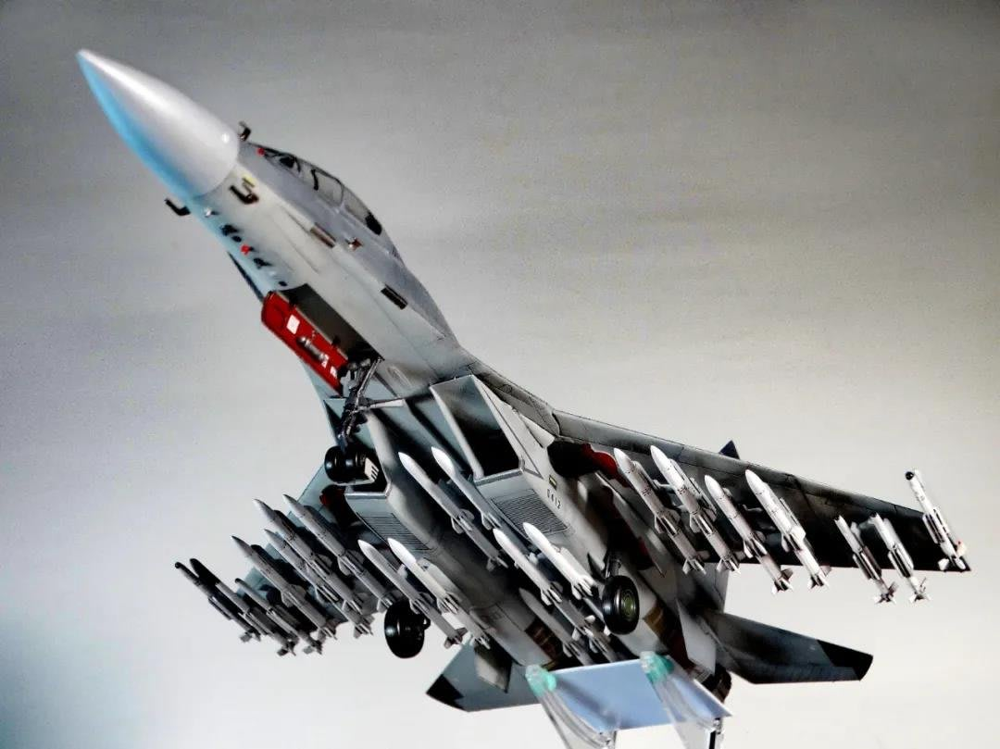
Fighter jet with missiles
The J-16 is China's most numerous advanced strike fighter and its primary "missile truck" — a 4.5-generation heavy multirole aircraft optimized to carry maximum weapons loads against surface fleets, radar sites, and ground targets. As of end-2025, approximately 450 J-16s have been delivered.[^1][^19]
| Specification | J-16 |
|---|---|
| **Role** | All-weather multirole strike; primary SEAD/DEAD; anti-ship "missile truck"[^37] |
| **Speed** | Mach 2.0+[^37] |
| **Hardpoints** | 12 external hardpoints[^37] |
| **Max AAM Load** | 8× PL-15 + 2× PL-10 = 10 AAMs simultaneously[^19] |
| **BVR Missiles** | PL-15 (200–300 km), PL-17 (400+ km vs fighters, 800 km vs tankers)[^12] |
| **Anti-Ship** | YJ-12 supersonic ASCM (Mach 2.0+, 400+ km)[^38]; J-16 primary carrier of YJ-12[^20] |
| **SEAD** | Anti-radiation missiles; KD-88 standoff air-to-ground missile[^38] |
| **Land Attack** | KD-20 cruise missile (2,000 km range) — standoff strike[^38] |
| **Gun** | 30 mm GSh-30-1 cannon[^37] |
| **EW Variant** | J-16D: dedicated electronic warfare aircraft; jammer pods instead of combat missiles; SEAD-EW mission[^37] |

**Edge Assessment:** As a "missile truck" carrying up to 10 BVR missiles, the J-16 in pure air-to-air configuration carries more long-range missiles than any other operational fighter. Each J-16 armed with PL-17s could theoretically deny airspace to US tankers and AWACS at ranges of 400–800 km, collapsing the aerial refueling architecture on which the US air campaign depends. The J-16D EW variant is the PLAAF's primary Wild Weasel/SEAD platform, targeting US radar-guided SAMs and AWACS tracking systems.

***
### 2.2 China — Chengdu J-10C "Vigorous Dragon" (350+ in service)

J-10C fighter jet
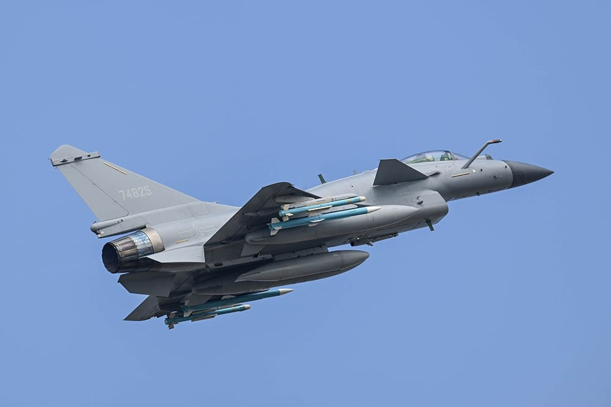
Fighter jet
The J-10C is China's lightweight multirole fighter and the first Chinese aircraft to demonstrate combat effectiveness in the real world — it was used by Pakistan to claim kills against Indian Rafales in the May 2025 India-Pakistan aerial clashes, leading Indonesia to announce a $9 billion purchase of 42 J-10Cs. The combat claim has been disputed but it triggered a surge in J-10C export interest.[^39][^40]
| Specification | J-10C |
|---|---|
| **Role** | Lightweight multirole air superiority / strike[^41] |
| **Speed** | Mach 2.0+[^41] |
| **Radar** | AESA, IRST[^41] |
| **BVR Weapons** | PL-15 (200–300 km)[^41]; PL-10 WVR |
| **Anti-Ship** | YJ-91 anti-radiation/anti-ship[^41] |
| **Role in Taiwan Scenario** | Combat air patrol; escort of H-6K/N bombers; SEAD support |
| **Combat Debut** | Pakistan vs. India May 2025 — PL-15 used in real combat[^39] |

***
### 2.3 US — F/A-18E/F Super Hornet + EA-18G Growler (USN — 500+ active)

Boeing EA-18G Growler
The Super Hornet is the US Navy's carrier-based multirole workhorse and will remain in service through 2035 alongside the F-35C. The EA-18G Growler is the world's only dedicated carrier-based electronic warfare aircraft, capable of destroying and suppressing every known enemy radar, SAM, and communications system.
| Specification | F/A-18E/F Super Hornet | EA-18G Growler |
|---|---|---|
| **Role** | Carrier multirole strike/fighter | Carrier-based EW/SEAD |
| **Speed** | Mach 1.8 | Mach 1.8 |
| **Hardpoints** | 11 | 9 |
| **Key Air-to-Air** | AIM-120D, AIM-9X; AIM-260 JATM (being fielded)[^24] | AIM-120D self-defense |
| **Strike** | JASSM-ER (925 km), JSOW, Harpoon Block II, SLAM-ER, JDAM | ALQ-99 jammer pods; HARM AARGM-ER |
| **Anti-Radiation** | AGM-88E AARGM-ER (range: 150+ km) | Primary Growler weapon |
| **EW Capability** | ALQ-214 integrated defensive EW | ALQ-99 + NGJ (Next-Gen Jammer); suppresses all known IADS |
| **Australia** | 24 F/A-18F (Super Hornet) + 12 EA-18G Growler (RAAF); RAAF only Growler operator outside US[^42] | |

The EA-18G is one of the most asymmetrically powerful assets in any Taiwan conflict. China's entire A2/AD architecture — including its HQ-9/S-400 SAMs, J-20's active radar seekers, KJ-500 AWACS uplinks, and Type 055 fire control radars — is vulnerable to being blinded by sustained Growler jamming supported by AARGM-ER anti-radiation missiles. RAAF operates 12 Growlers, making Australia the only allied non-US nation with this capability.[^42]

***
## PART III: SIXTH-GENERATION AND EXPERIMENTAL PLATFORMS
### 3.1 US — Boeing F-47 (NGAD) — Sixth-Generation Fighter (Development)
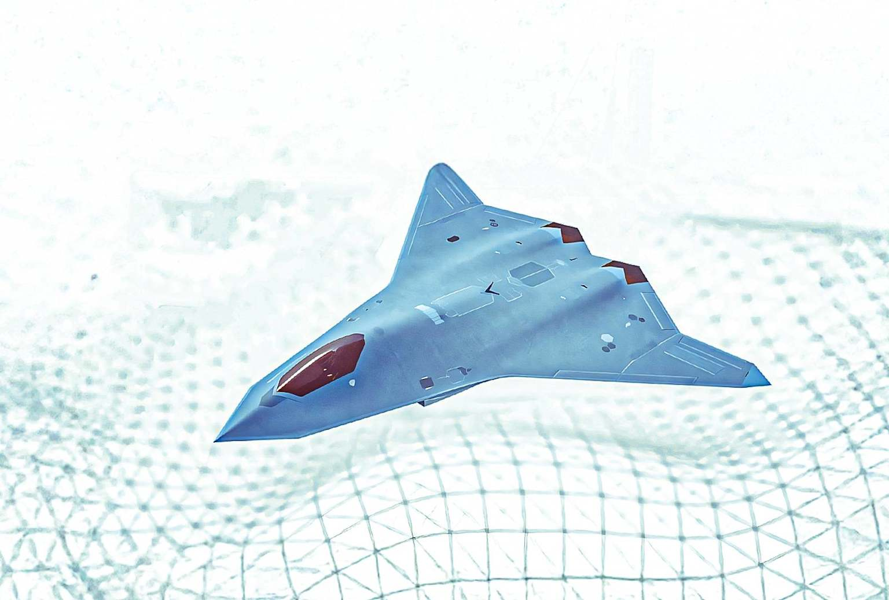
Boeing F-47 fighter jet
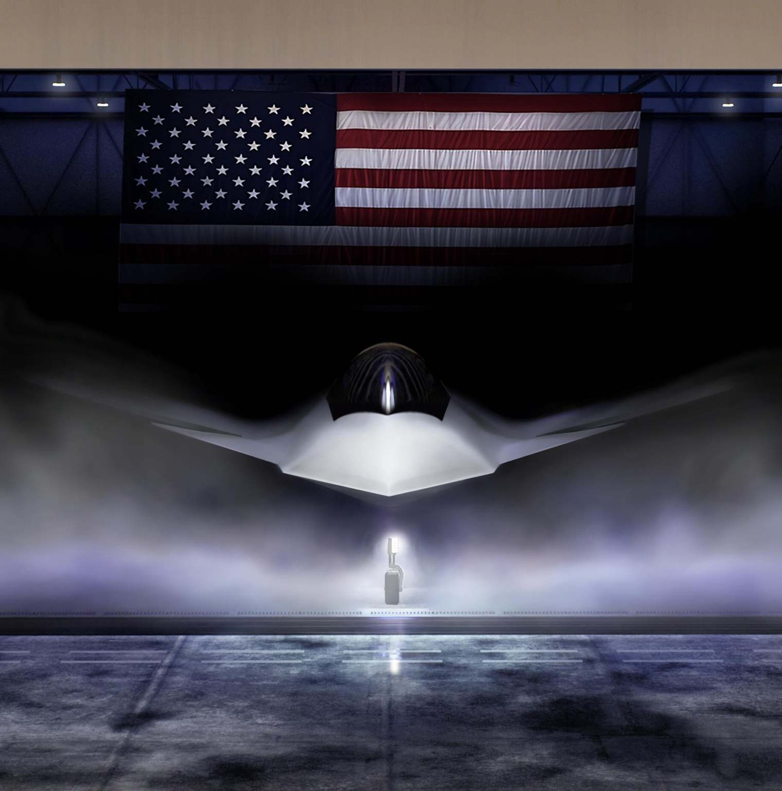
Stealth fighter jet
The F-47 is the world's first confirmed sixth-generation fighter program. The contract was awarded to Boeing on March 21, 2025, under the Next Generation Air Dominance (NGAD) program. Manufacturing is underway; first flight is projected for 2028, with operational fielding targeted for the early 2030s.[^43][^44]
| Specification | F-47 (Estimated/Reported) |
|---|---|
| **Contractor** | Boeing[^43] |
| **Contract Award** | March 21, 2025 — Engineering & Manufacturing Development[^43] |
| **First Flight** | Projected 2028[^44][^45] |
| **IOC** | Early 2030s[^44] |
| **Fleet Size** | Minimum 185 aircraft (replaces F-22 one-for-one)[^44] |
| **Speed** | Mach 2+[^44] |
| **Combat Radius** | 1,000+ nmi — double the F-22's radius[^45][^44] |
| **Stealth** | Unprecedented LO; modular, adaptable hardware/software[^44] |
| **Engine** | NGAP (Next-Generation Adaptive Propulsion), R&D peaking at $906M in FY2028[^45] |
| **Drone Control** | "Quarterback" for 2–8 CCA loyal wingmen per F-47[^44] |
| **Key Innovation** | Network-centric warfare; operates as command node for drone swarms; out-senses, out-thinks, out-performs any known threat[^44] |
| **R&D Budget** | $5+ billion requested FY2027; $5.3B FY2028[^45] |

**Edge Assessment:** The F-47 directly addresses the F-22's two critical limitations — combat radius and fleet size relative to CCA multiplication. By pairing each F-47 with up to 8 loyal wingmen, 185 crewed aircraft could control 1,480 autonomous wingmen. The 1,000+ nmi combat radius means F-47s can operate from Guam or Okinawa without the persistent tanker support currently required for F-22s.

***
### 3.2 US/Allied — Collaborative Combat Aircraft (CCAs) / Loyal Wingmen
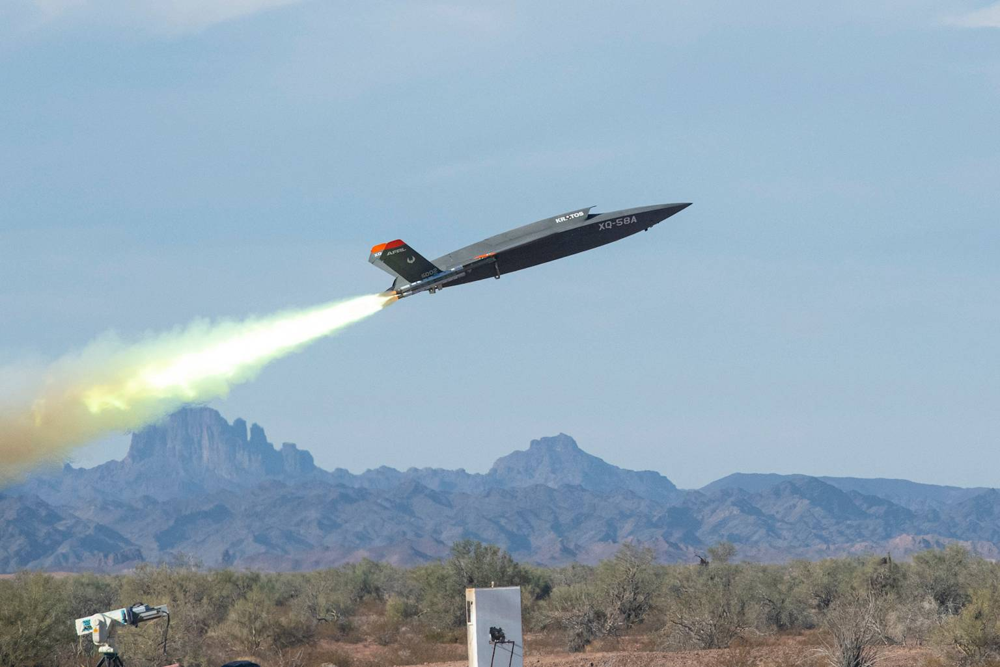
XQ-58A Valkyrie drone
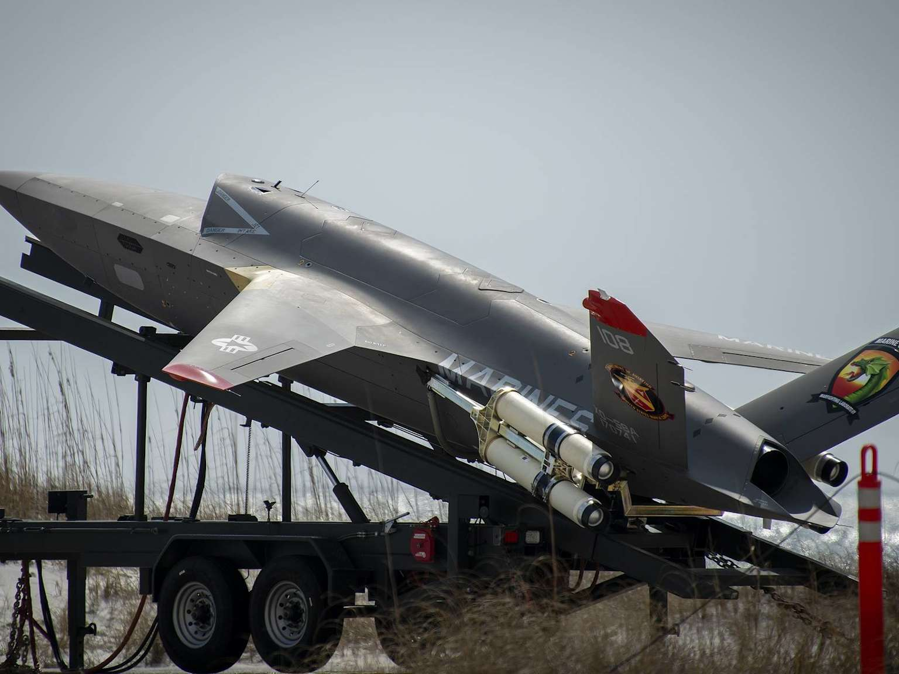
Military drone on trailer
The CCA concept pairs AI-driven unmanned combat aircraft with manned fighters to multiply mass, absorb attrition, and execute high-risk missions while keeping pilots at safer stand-off distances.
| Platform | Operator | Role | Status |
|---|---|---|---|
| **XQ-58A Valkyrie** (Kratos) | USAF / USN | Penetrating attritable strike/ISR; launches from RATO or cargo pallet | Operational testing; USN buying[^46] |
| **MQ-58 Valkyrie CTOL** | USMC (MUX TACAIR) | EW, strike support, ISR from land bases; pairs with F-35B | First deliverable prototypes mid-2029[^47][^48] |
| **CCA Increment 1** (USAF) | USAF | Air-to-air attrition absorber; autonomous wingman for F-35A/F-47 | Development; contracts awarded to General Atomics and Anduril 2024 |
| **MQ-28 Ghost Bat** | Australia RAAF | Autonomous loyal wingman for FA-50 and F-35A; ISR, EW, strike | Development with Boeing; Pacific-focused[^42] |

**XQ-58A Valkyrie Key Specifications:**

| Spec | Value |
|---|---|
| **Speed** | High-subsonic (Mach 0.72)[^46] |
| **Range** | ~3,000+ miles (ferry)[^46] |
| **Payload** | Internal weapons bay: 2× JDAM or SDB; underwing pylons |
| **Cost** | ~$3–5 million per unit (attritable)[^46] |
| **Key Advantage** | Can be launched from a standard RATO rail or C-130 cargo bay; no runway required; expendable in high-threat environments[^46] |
| **Launch Platforms** | F-35, F-22, F-47 (future), MC-130J special ops aircraft |

***
### 3.3 China — Emerging Sixth-Generation / Drone Concepts
China has demonstrated several unconfirmed but widely reported drone and sixth-generation concepts:

- **GJ-X Flying Wing**: A large stealthy UCAV spotted in satellite imagery at Chengdu; likely an ISR/strike drone, not the H-20 bomber[^49]
- **WZ-8 Supersonic Reconnaissance Drone**: H-6N-launched; Mach 4+; operational 2022[^49]
- **GJ-11 Sharp Sword UCAV**: Flying-wing stealthy UCAV; operational; now carried aboard Type 076 LHD via EMALS[^50]
- **J-20S as Drone Node**: The J-20S's dedicated MSO seat enables real-time manned-unmanned teaming with loyal wingman drones, a capability China has advanced rapidly but with less confirmed operational depth than the US CCA program[^5]

***
## PART IV: STRATEGIC BOMBERS
### 4.1 China — Xian H-6K / H-6N "Badger" (120+ operational)
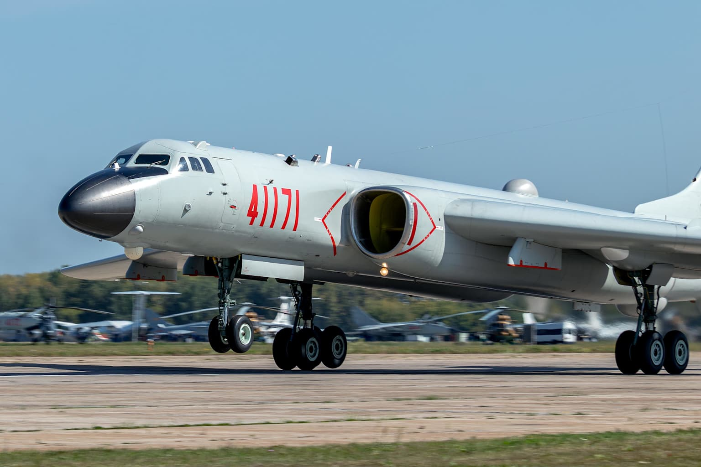
Xian H-6K bomber
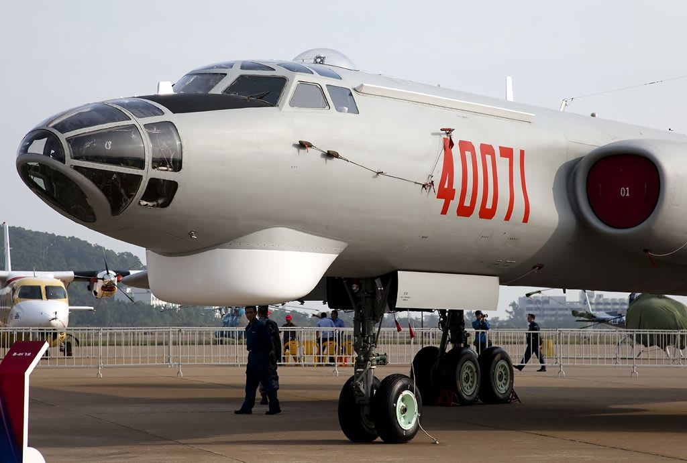
Chinese H-6 Bomber
The H-6 series, derived from the Soviet Tu-16, is China's primary nuclear and conventional standoff bomber. Over 120 H-6K and H-6N variants are operational. The H-6N is nuclear-capable and features an in-flight refueling probe, extending its range toward the Second Island Chain and beyond.[^51][^52]
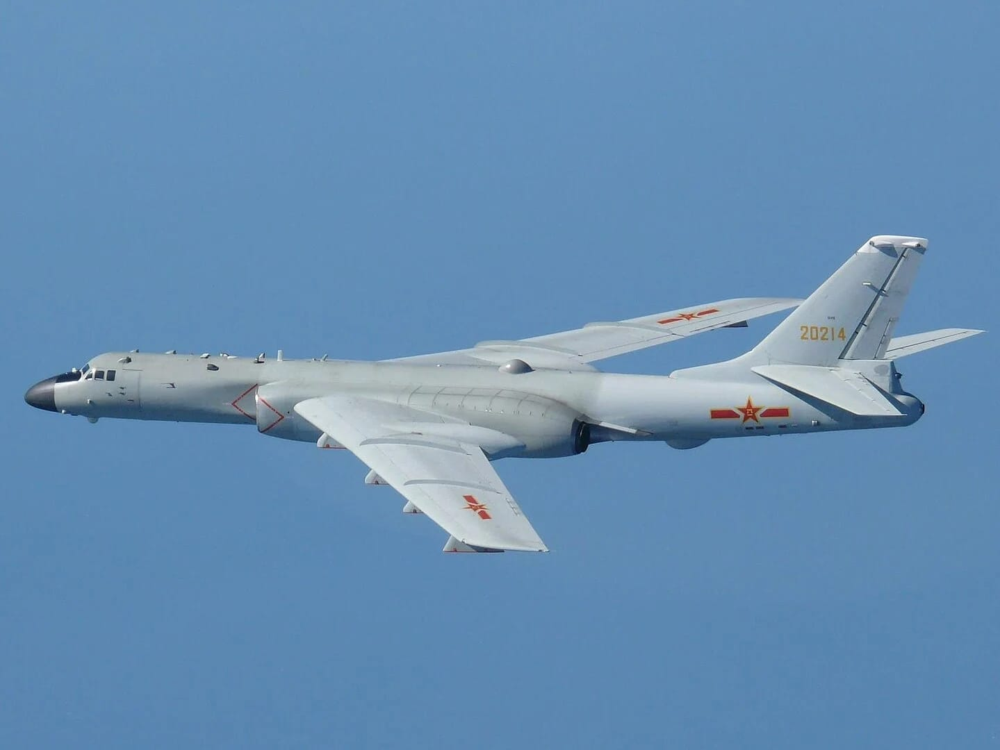
Chinese H-6 bomber
| Specification | H-6K | H-6N |
|---|---|---|
| **Role** | Conventional long-range standoff strike[^38] | Nuclear/conventional + air-to-air refueling[^52] |
| **Speed** | ~Mach 0.75[^53] | ~Mach 0.75 |
| **Unrefueled Range** | 3,500 km (combat radius)[^53] | Extended by refueling; can reach 2nd Island Chain |
| **Ceiling** | 42,000 ft[^53] | 42,000 ft |
| **Weapons Pylons** | 6 underwing + 1 centreline (H-6N) | 7 total[^38] |
| **Land Attack** | CJ-20 LACM: 2,000+ km range; nuclear-capable[^38] | Same |
| **Anti-Ship** | YJ-12 (Mach 2.0+, 400+ km)[^38]; YJ-21 hypersonic[^38] | Same + YJ-21 hypersonic[^38] |
| **Hypersonic** | YJ-21 air-launched HGV: Mach 6+[^38] | Ballistic/hypersonic glide vehicle under centreline[^52] |
| **Conventional Strike** | KD-88 standoff missile (~200 km)[^53] | Same |
| **Nuclear** | Carries nuclear-armed CJ-20[^52] | Carries nuclear free-fall bombs + ALBM[^52] |
| **Taiwan Role** | Launch CJ-20s from beyond Taiwan's air defense envelope; saturate Guam with 6×120 = 720 cruise missiles in a single strike wave[^51] | Strategic deterrence + precision nuclear strike |
---
### 4.2 China — Xian H-20 Stealth Bomber (Development — 2030s IOC)
The H-20 is China's planned strategic stealth bomber — a flying-wing design broadly comparable to the B-2 Spirit and B-21 Raider. Despite years of hints from Chinese officials and a wave of speculation in early 2025, the H-20 has not been officially unveiled and no confirmed flight tests have been disclosed. US intelligence assesses the H-20 will not "debut" until the 2030s.[^54]

| Specification | H-20 (Estimated) |
|---|---|
| **Design** | Flying-wing, subsonic, low-observable — modeled on B-2/B-21[^55] |
| **Range** | Unrefueled: ~8,500–13,000 km[^55][^56]; combat radius: ~5,000 km[^55] |
| **Payload** | 10–45 tons (estimates vary)[^55] |
| **Speed** | High subsonic[^55] |
| **Weapons** | Nuclear gravity bombs, air-launched cruise missiles, hypersonic weapons, anti-ship payloads[^55] |
| **Status** | In development; no confirmed maiden flight; IOC likely 2030s[^54] |
| **Strategic Impact** | Completes China's nuclear triad; enables strikes on Guam, Hawaii, and potentially CONUS with in-flight refueling[^56] |

**Edge Assessment:** Until the H-20 is operational, China has no penetrating stealth bomber. The H-6K/N fleet can deliver standoff cruise missiles from safe distances, but cannot penetrate defended airspace the way a B-2 or B-21 can. This is one of the most significant gaps in China's air power relative to the United States.

***
### 4.3 US — Northrop Grumman B-21 Raider (Development — IOC 2029)
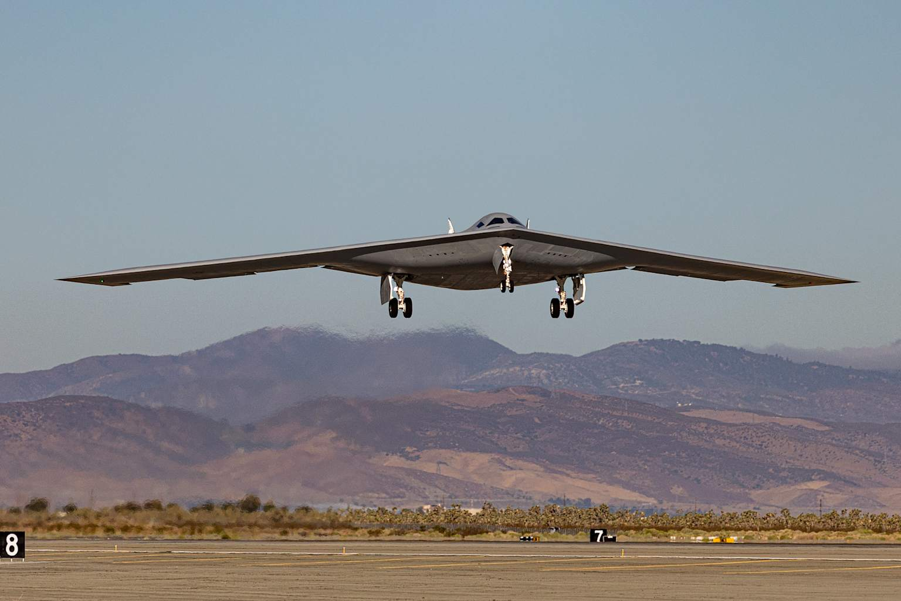
B-21 Raider aircraft
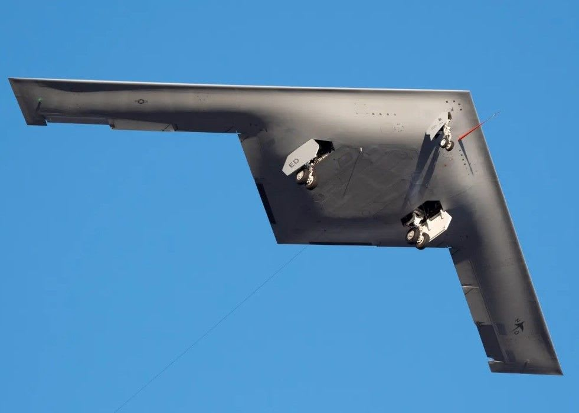
B-21 Raider stealth bomber
The B-21 Raider is the USAF's next-generation nuclear and conventional stealth strategic bomber. It made its maiden flight on November 10, 2023, and a minimum of 100–145 aircraft are planned.[^57][^58][^59]
| Specification | B-21 Raider |
|---|---|
| **Role** | Nuclear-capable penetrating stealth bomber[^58] |
| **First Flight** | November 10, 2023[^57] |
| **IOC** | 2029[^59] |
| **Wingspan** | ~140 ft (estimated)[^57] |
| **Length** | ~55 ft (estimated)[^57] |
| **Speed** | High subsonic[^57] |
| **Range** | Intercontinental (unrefueled)[^57][^58] |
| **Crew** | 2 pilots; autonomous operations planned[^57] |
| **Nuclear Weapons** | AGM-181 LRSO nuclear cruise missile (stealthy standoff); B61-12 guided nuclear gravity bomb; B61-13 nuclear bunker buster[^60] |
| **Conventional Weapons** | AGM-158B JASSM-ER (925 km); full range of conventional precision munitions[^60] |
| **Stealth** | Multi-spectral — radar, IR, acoustic, visual LO; designed for next-gen S-band/L-band SAM environments[^58] |
| **Cost** | ~$692M per aircraft (base year 2022 dollars)[^58] |
| **Inventory Target** | 100–145 aircraft[^59] |
| **Key Advantage** | Can penetrate Chinese IADS — including HQ-9, HQ-22, S-400 — that would shoot down any legacy bomber; no Chinese aircraft can intercept a B-21 in contested airspace |

***
### 4.4 US — Northrop Grumman B-2A Spirit (20 operational)
The B-2 Spirit is the only currently operational US stealth bomber and remains one of the most capable strike aircraft on Earth, with an intercontinental range and the ability to penetrate even advanced IADS with extremely low radar cross-section.

| Specification | B-2A Spirit |
|---|---|
| **Payload** | 40,000 lb (18,144 kg)[^61][^62] |
| **Range** | Intercontinental (6,000+ nmi unrefueled)[^63] |
| **Wingspan** | 172 ft (52.4 m)[^62] |
| **Nuclear** | B61-12, B83 nuclear gravity bombs[^63] |
| **Conventional** | JDAM (up to 80× Mk.82 500 lb), GBU-28 bunker buster; JASSM-ER from B-2 integration[^61] |
| **Stealth** | ~0.1 m² RCS (classified)[^61] |
| **Crew** | 2[^62] |
| **Note** | Only 20 aircraft; all nuclear-capable[^63]; most likely pre-positioned to Diego Garcia or Andersen AFB (Guam) in any conflict |

***
### 4.5 US — Boeing B-52H Stratofortress (76 combat-coded)
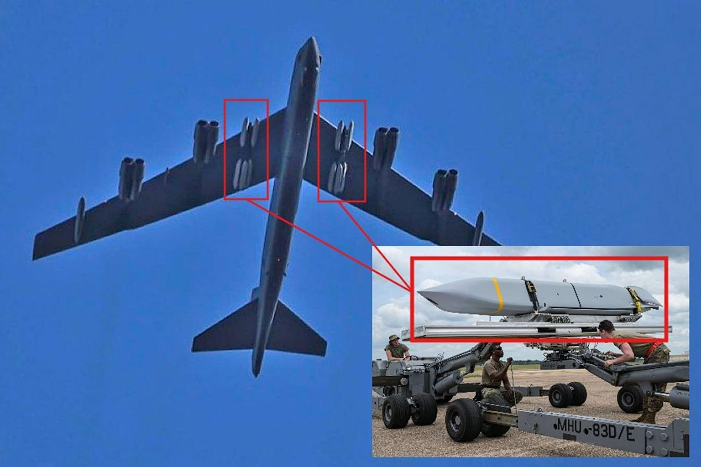
B-52H with AGM-158 missiles
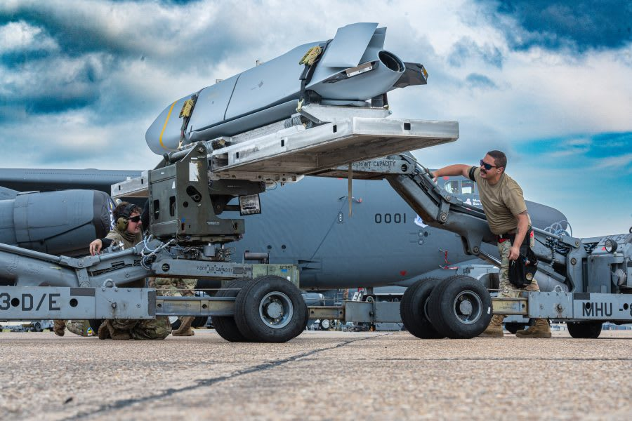
JASSM missile on B-52
The B-52H, entering service in 1961 and now flying until at least 2050 with the B-52J re-engining program, carries the heaviest conventional weapons load in the USAF inventory and is the primary JASSM-ER carrier for long-range standoff strike from outside China's A2/AD envelope.
| Specification | B-52H |
|---|---|
| **Payload** | 70,000 lb (31,751 kg)[^63] |
| **Range** | 8,800 miles (14,162 km) unrefueled[^63] |
| **Speed** | Mach 0.86 |
| **Nuclear** | AGM-86B ALCM nuclear cruise missile; B61 gravity bomb (being phased to LRSO)[^63] |
| **Conventional** | AGM-158B JASSM-ER (up to 12–20 per aircraft, 925 km range)[^29]; LRASM anti-ship; JSOW; 70,000 lb conventional bomb capacity[^63] |
| **ARRW Integration** | AGM-183A ARRW hypersonic boost-glide (Mach 5+); program revived with $345.7M FY2027 request; B-52H confirmed test platform[^64] |
| **Limitation** | No stealth; must remain outside Chinese integrated air defense envelope (~1,500+ km from mainland) |

***
### 4.6 US — Boeing B-1B Lancer (45 combat-coded)
| Specification | B-1B Lancer |
|---|---|
| **Payload** | 75,000 lb — largest conventional weapons load in USAF[^63] |
| **Speed** | Mach 1.25 |
| **Sweep** | Variable geometry wing (15°–67.5° sweep) |
| **Strike** | JASSM-ER (24 per aircraft); LRASM (24 per aircraft)[^63] |
| **Notable** | Non-nuclear since 1994 START compliance; primary conventional standoff carrier for fleet strikes |

***
## PART V: INNOVATIVE STANDOFF STRIKE — DRAGON CART (CARGO PLANE CRUISE MISSILES)

C-130 loading munitions pallets
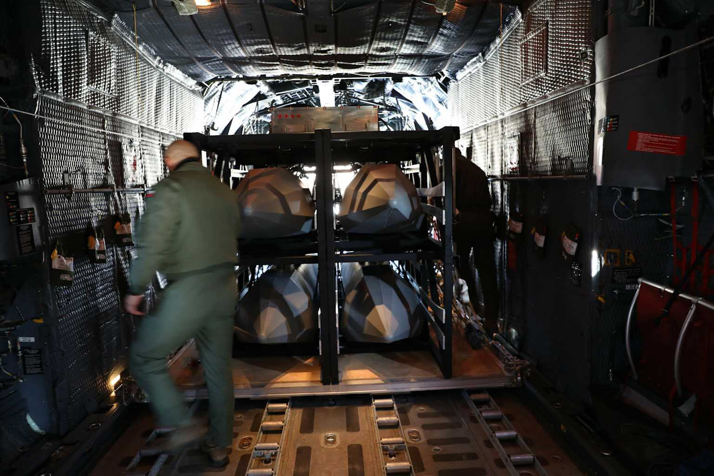
Airmen loading pallets in aircraft
One of the most disruptive US capability developments for a Taiwan scenario is **Dragon Cart** (formerly Rapid Dragon) — officially a Program of Record as of April 1, 2026.[^65][^66]
### How Dragon Cart Works
A standard intermodal shipping pallet loaded with AGM-158B JASSM-ER cruise missiles is rolled onto a C-130J or C-17A cargo aircraft with zero airframe modification. The pallet is airdropped from the ramp like standard cargo, stabilized by parachute, and each missile self-ejects, ignites its Williams F107 turbofan, and flies independently to its target at 925+ km range.[^65][^29]

| Specification | Dragon Cart System |
|---|---|
| **Status** | Program of Record (April 1, 2026); fielding target 2027[^65][^66] |
| **Aircraft** | C-130J Super Hercules, C-17A Globemaster III (no modification required)[^67] |
| **Missiles per pallet** | 4–45 JASSM-ER per pallet; configurable[^68] |
| **C-17 capacity** | A single C-17 could potentially carry more cruise missiles per flight than some dedicated bombers[^67] |
| **Missile** | AGM-158B JASSM-ER: range 925 km (575 mi); stealthy; GPS/INS/IIR guidance[^29] |
| **Strategic Implication** | Converts every one of ~500 US cargo aircraft into a standoff strike platform overnight[^69] |
| **Allied Use** | Works with any NATO C-130 or C-17 — multiplies allied strike mass without F-35 integration[^69] |
| **Retargeting** | Real-time BLoS C2 can retarget missiles while still airborne[^70] |

**Edge Assessment:** Dragon Cart is potentially war-changing in a Taiwan scenario. It allows the USAF to surge hundreds of JASSM-ER strikes from C-130Js operating out of dispersed island airstrips across the Pacific — even from Palau, Tinian, or Yap — saturating PLAN fleet defenses and shore-based missile batteries simultaneously, without risking a single manned tactical aircraft.

***
## PART VI: HYPERSONIC MISSILES — AIR-LAUNCHED
### 6.1 US — AGM-183A ARRW (Revived)
The AGM-183A Air-Launched Rapid Response Weapon (ARRW) is a boost-glide hypersonic missile launched from the B-52H. After cancellation in 2023 and revival in 2025, the program is now receiving $345.7M in FY2027 for Increment 2 development.[^64]

| Specification | AGM-183A ARRW |
|---|---|
| **Type** | Boost-glide hypersonic missile (air-launched)[^71] |
| **Speed** | Mach 20+ terminal (boost-glide)[^72] |
| **Launch Platform** | B-52H (confirmed)[^64] |
| **Status** | Revived as Program of Record; Increment 2 phase; ALBM derivative in design[^64] |
| **FY2027 Funding** | $345.7M[^64] |
| **Total Program** | ~$1.7B through FY2030[^64] |

***
### 6.2 China — YJ-21 Air-Launched Hypersonic
| Specification | YJ-21 (Air-Launched) |
|---|---|
| **Type** | Air-launched hypersonic glide vehicle / anti-ship ballistic missile[^38] |
| **Speed** | Mach 6+ (air-launched variant)[^38] |
| **Range** | ~1,000–2,000 km (estimated)[^38] |
| **Platforms** | H-6K/N bomber (underwing/centreline); J-16 (underwing)[^38] |
| **Target** | Carrier strike groups; large surface combatants; Guam airfields[^38] |
| **Status** | Operational (confirmed on H-6K; J-16 reported)[^38] |

***
## PART VII: AIR SUPERIORITY MISSILES — HEAD-TO-HEAD
| Missile | Side | Range | Speed | Guidance | Status | Platform |
|---|---|---|---|---|---|---|
| **PL-17** | China | ~400 km (fighters); ~800 km (AWACS)[^11] | Mach 4+[^12] | AESA seeker + datalink; passive anti-rad[^12] | Operational on J-16[^12] | J-16, J-20 (external) |
| **PL-15** | China | 200–300 km[^10] | Mach 5 | AESA active radar[^8] | Operational | J-20 (internal), J-16, J-10C, J-35 |
| **PL-16** (emerging) | China | 220–300 km est.[^13] | Mach 5+ | Dual-pulse, AESA, possibly dual-mode IR/radar[^13] | Near operational on J-20 and J-35[^13] | J-20, J-35 |
| **PL-10** | China | ~20 km | Mach 3+ | IRST high-off-boresight[^8] | Operational | J-20 (side bay), J-16, J-10C |
| **AIM-260 JATM** | US | 193+ km (120+ mi)[^24][^73] | Mach 5+ | AESA; frequency-hopping ECCM[^25] | Flight testing; production funding FY2026[^73] | F-22 (first), F/A-18E/F, F-35 (future) |
| **AIM-120D AMRAAM** | US | ~160 km | Mach 4+ | Active radar | Operational — mainstay | F-22, F-35, F/A-18, F-16V |
| **AIM-9X Sidewinder** | US | ~35 km | Mach 3+ | IRST + HMD cuing | Operational | All US/allied fighters |
| **MBDA Meteor** | Allied (KF-21, Typhoon) | ~200 km NEZ[^33] | Ramjet (sustained Mach 4) | AESA + datalink | Operational on KF-21 Block I[^33] | KF-21, Typhoon, Gripen E |
| **TC-2 (Tien Chien-2)** | Taiwan | ~100 km | Supersonic | AESA | Operational | F-CK-1, F-16V |

***
## PART VIII: INTELLIGENCE, SURVEILLANCE, AND EARLY WARNING (ISR/AEW)
### 8.1 China — KJ-500 AWACS (40+ operational)
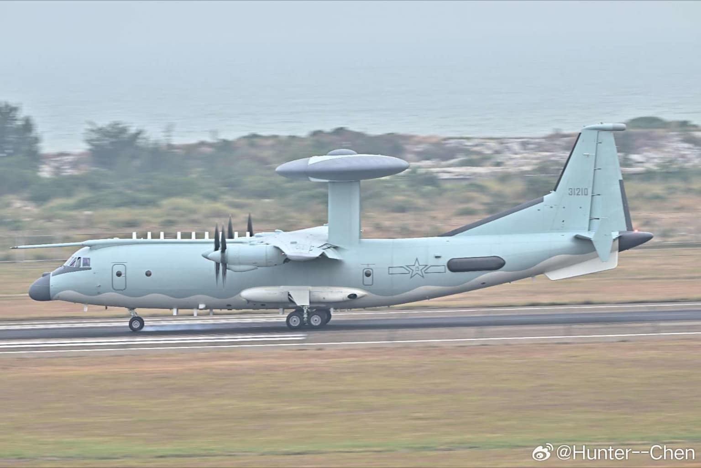
KJ-500 airborne early warning aircraft
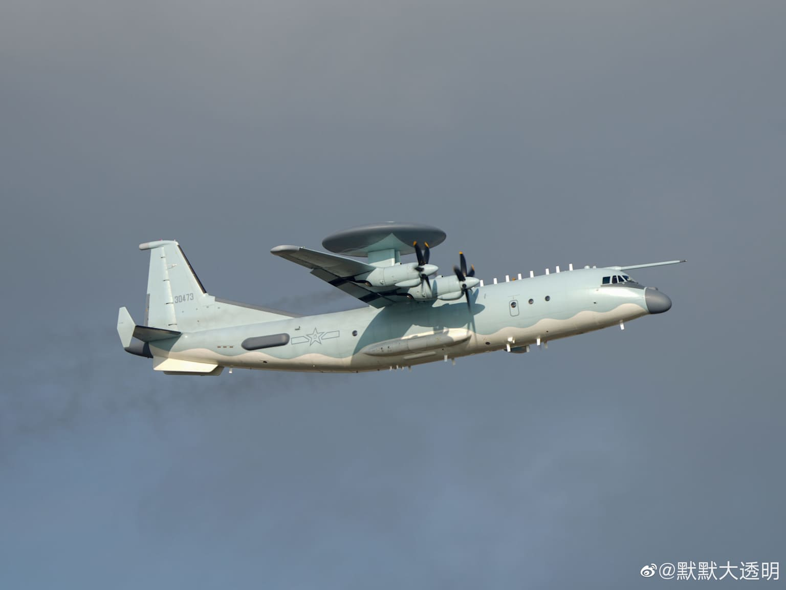
Chinese KJ-500 radar plane
The KJ-500 is China's most advanced AEW&C aircraft, with a fixed tri-array AESA radar providing 360° coverage without a rotating rotodome. More than 40 are operational with the PLAAF.[^74]

| Specification | KJ-500 |
|---|---|
| **Length / Wingspan** | 34 m / 38 m[^74] |
| **Range** | 5,700 km[^75] |
| **Endurance** | 8–12 hours[^75][^76] |
| **Radar** | Tri-array fixed AESA; 360° coverage[^74][^76] |
| **Detection Range** | ~470 km against conventional targets; F-22/F-35 detection capability being enhanced[^74] |
| **Tracking** | Simultaneous track of 60–100 targets[^74] |
| **Roles** | AEW&C, maritime patrol, EW, C2 node for fighters[^76] |

***
### 8.2 US/Allied ISR & AWACS
| Platform | Operator | Key Capability |
|---|---|---|
| **E-3G Sentry AWACS** | USAF | 600 km radar detection; C2 for up to 100+ aircraft simultaneously; being replaced by E-7 Wedgetail |
| **E-7A Wedgetail** | USAF (buying) + Australia (6) + Japan (in eval) | Multi-role electronically scanned array (MESA); 360° coverage; smaller crew, better processing than E-3 |
| **E-2D Advanced Hawkeye** | USN | Carrier-based AEW; AN/APY-9 AESA; supports up to 2 guided weapon engagements simultaneously |
| **RC-135V/W Rivet Joint** | USAF | SIGINT; detects, locates, classifies all EM emitters; critical for targeting PLA radar/comms |
| **RQ-4 Global Hawk Block 30/40** | USAF | Broad-area maritime/ISR; ~34 hours endurance; SIGINT + EO/IR + SAR radar |
| **MQ-9B SeaGuardian** | US/Allied navies | Maritime patrol; anti-submarine; ISTAR |

***
## PART IX: COMPREHENSIVE SIDE-BY-SIDE COMPARISON TABLES
### 9.1 Fifth-Generation Fighter Head-to-Head
| Feature | J-20A (China) | J-20S (China) | J-35 (China) | F-22A (US) | F-35A (US) | KF-21 Blk III (future) |
|---|---|---|---|---|---|---|
| **Gen** | 5th | 5th+ (node)[^5] | 5th | 5th | 5th | 4.5→5th[^33] |
| **Speed** | Mach 2.55[^5] | Mach 2.55[^5] | Mach 1.8–1.9[^18] | Mach 2.25+[^22] | Mach 1.6[^26] | Mach 2.25+[^34] |
| **Supercruise** | Yes (WS-15)[^4] | Yes[^5] | No | Yes[^22] | No | Block III only |
| **Combat Radius** | 1,100 nmi[^5] | 1,100 nmi | ~600 nmi est. | ~410 nmi[^22] | 1,200 nmi[^26] | ~500 nmi |
| **Internal Missiles** | 4 PL-15 + 2 PL-10[^10] | Same | 4–6 BVR[^15] | 6 AIM-120 + 2 AIM-9X[^22] | 4 AIM-120 + 2 AIM-9X[^26] | 4 Meteor (semi-recessed)[^33] |
| **Max BVR Load** | 14 (beast mode: 12 PL-15/17 + 2 PL-10)[^10] | Same | 6 internal + 4 external | 8 AIM-120 (beast mode)[^21] | 6 AIM-120 + 2 AIM-9X | 10+ |
| **Drone Control** | J-20S only[^5] | Yes (primary role)[^5] | Limited | No | Limited (testing) | No |
| **Nuclear Strike** | No | No | No | No | F-35A: B61-12[^2] | No |
| **Fleet (2026)** | 300–350[^3] | Entering service | LRIP[^16] | 183[^22] | 1,300+ globally[^2] | 8 (first year)[^33] |
### 9.2 Bomber / Long-Range Strike Comparison
| Feature | H-6K (China) | H-6N (China) | H-20 (China) | B-52H (US) | B-2A (US) | B-21 (US) |
|---|---|---|---|---|---|---|
| **Stealth** | No | No | Yes (planned)[^55] | No | Yes[^62] | Yes (superior)[^58] |
| **Range** | 3,500 km combat radius[^53] | Extended via refueling[^52] | 5,000 km combat radius[^55] | 14,162 km unrefueled[^63] | ~11,000 km | Intercontinental[^58] |
| **Payload** | 6 missiles[^38] | 7 + centreline[^38] | 10–45 tons est.[^55] | 70,000 lb[^63] | 40,000 lb[^61] | Nuclear + conventional[^58] |
| **Key Weapon** | CJ-20 LACM (2,000 km); YJ-21 hypersonic[^38] | CJ-20 + nuclear ALBM[^52] | All of above + more[^55] | JASSM-ER (925 km); ARRW (hypersonic)[^64] | JASSM-ER; B61-12 nuclear[^60] | LRSO nuclear; JASSM-ER[^60] |
| **Nuclear** | Yes (CJ-20)[^38] | Yes (primary)[^52] | Yes (planned)[^55] | Yes (ALCM/LRSO)[^63] | Yes[^63] | Yes (primary nuclear)[^58] |
| **IOC** | Operational | Operational[^52] | 2030s[^54] | Operational (1961-present) | Operational (1997)[^62] | 2029[^59] |
| **Fleet** | ~120 (K+N combined)[^51] | Subset of 120 | Development | 76 combat-coded[^63] | 20[^62] | 100–145 (planned)[^59] |
### 9.3 Key Air-to-Air Missiles
| Missile | Side | Range | Speed | Edge |
|---|---|---|---|---|
| **PL-17** | China | 400 km (fighters) / 800 km (AWACS)[^11] | Mach 4+[^12] | **China** — no Western equivalent; specifically designed to eliminate the US ISTAR architecture |
| **PL-15 / PL-16** | China | 200–300 km[^10][^13] | Mach 5 | **China** — in service before AIM-260; already confirmed in combat (Pakistan, May 2025)[^39] |
| **AIM-260 JATM** | US | 193+ km[^24] | Mach 5+ | **US** (narrowly) — superior ECCM; frequency-hopping; wider platform integration pipeline[^25] |
| **Meteor (MBDA)** | Allied (KF-21) | ~200 km NEZ | Sustained Mach 4 (ramjet) | **Allied niche** — ramjet sustainer gives largest No-Escape Zone of any BVR missile[^33] |
### 9.4 Dragon Cart / Standoff Strike Comparison
| System | Side | Missiles | Range | Launch Platform |
|---|---|---|---|---|
| **Dragon Cart (JASSM-ER)** | US | 4–45 per pallet per aircraft[^68] | 925 km[^29] | Any C-130J or C-17; no modification[^67] |
| **H-6K x 120 aircraft** | China | 720 CJ-20s (6 per aircraft × 120 aircraft)[^51] | 2,000 km[^38] | H-6K dedicated bomber |
| **B-52H x 76 aircraft** | US | ~1,520+ JASSM-ER (20 per aircraft × 76)[^63] | 925 km[^29] | B-52H; standoff from Guam/Diego Garcia |

***
## PART X: STRATEGIC ASSESSMENT
### Who Holds the Edge by Category
| Category | Edge | Rationale |
|---|---|---|
| **5th-Gen Fighter Volume** | **China** (narrow) | 300–350 J-20s vs. 183 F-22s; production rate 100–120/yr vs. F-22 fleet frozen at 183[^3][^22] |
| **5th-Gen Fighter Quality** | **US** (narrow) | F-22 superiority in stealth and supercruise; F-35's sensor fusion is unmatched; AIM-260 now matching PL-17 range[^25][^24] |
| **Long-Range BVR Missiles** | **China** (currently) | PL-17 at 400–800 km has no current US equivalent in service; AIM-260 will close gap but not yet fielded at scale[^12][^73] |
| **Stealth Bomber** | **US** (decisive) | B-2 + B-21 (2029) vs. no operational H-20 until 2030s[^54]; US can penetrate Chinese IADS; China cannot penetrate defended US airspace with H-6K[^55] |
| **Electronic Warfare** | **US** (decisive) | EA-18G Growler (US + Australia) has no Chinese equivalent carrier EW aircraft; NGJ jammer suppresses any known radar |
| **Standoff Strike Mass** | **US** (after 2027) | Dragon Cart + B-52H JASSM-ER fleet provides overwhelming cruise missile mass from safe stand-off[^66][^67] |
| **Drone / CCA Ecosystem** | **US** (currently) | F-47 + CCA Increment 1 program + XQ-58 Valkyrie more advanced; China's J-20S concept is real but ecosystem depth is unclear[^44][^47] |
| **6th-Gen** | **US** (decisive) | F-47 under contract (2025); China's 6th-gen programs unconfirmed[^43][^44] |
| **Production Rate (near-term)** | **China** (decisive) | 400 advanced fighters/year by 2027 vs. ~150 F-35s/year for entire USAF production share[^1] |
| **Nuclear Air Delivery** | **Parity** | H-6N + CJ-20 nuclear ALCM vs. B-52H + B61-12 + LRSO; US retains penetrating delivery edge with B-2/B-21 |
| **Allied 5th-Gen Integration** | **US + Allies** | Japan (147 F-35), Australia (72 F-35A), South Korea (40+ KF-21 + F-35A); no PLAN-equivalent allied 5th-gen force |
### Key Observations
**China's Production Advantage Is Real:** The PLAAF will field over 1,000 J-20s by 2030 at current rates. This numerical advantage in 5th-gen fighters complicates any US planning that assumes technology parity means force parity. In a sustained attrition war, numbers matter.[^3]

**The PL-17 Is the Most Dangerous Missile No One Is Talking About:** A range of 400–800 km against slow-moving tankers, AWACS, and ISR aircraft means every KC-135, KC-46, E-3, and P-8 must operate from extreme stand-off or risk attrition — and without tankers, the F-22's 410 nmi combat radius cannot reach Taiwan from Guam.[^12][^11]

**Dragon Cart Is a Peer Disruptor:** Converting 500 cargo aircraft into JASSM-ER strike platforms by 2027 fundamentally changes the calculus. A C-130J operating from Tinian launching 45 JASSM-ERs at a PLAN amphibious group is indistinguishable on radar from a logistics flight until missiles ignite.[^66]

**The F-47 + CCA Multiplication Effect:** 185 F-47s each controlling 8 loyal wingmen = 1,480 autonomous combat aircraft that can be expended without crew loss. This is fundamentally how the US plans to counter China's numerical advantage in both aircraft and missiles in the 2030s.[^44]

**Japan Is a Tier-1 Air Power Ally:** 147 F-35s (105A + 42B), Growler-equivalent EW under evaluation, Type 12 Kai (900–1,200 km strike range), and Aegis BMD integration make the JASDF the most capable US ally in the Pacific theater. Japan's 2022 National Security Strategy authorizing counter-strike capabilities fundamentally changes the operational calculus for any PLAN planner.[^32]

**South Korea's KF-21 Block III (mid-2030s) Will Add Genuine 5th-Gen Mass:** 120 KF-21s with full stealth coating, weapons bay, and supercruise will be the most capable indigenous fighter program of any US ally since WWII. The Meteor BVR missile's ramjet motor already gives early Block I aircraft a decisive No-Escape Zone advantage over PL-15-equipped opponents.[^33]

---

## References

1. [With 400 J-20, J-35, and J-16 produced each year, China is set to ...](https://meta-defense.fr/en/2026/03/23/china-j20-j35-j16-production-strategy/) - China plans to produce up to 400 J-20, J-35, and J-16 fighters annually by 2027, aiming for a major ...

2. [Lockheed Martin F-35 Lightning II - Wikipedia](https://en.wikipedia.org/wiki/Lockheed_Martin_F-35_Lightning_II) - With 883 aircraft in service as of 2025 , it is the world's fourth-most-numerous military aircraft, ...

3. [China's Fifth-Generation Fighter Production Exploding | J-20 ...](https://www.youtube.com/watch?v=L0D9c5nYO5E) - China's Chengdu Aircraft Corporation has more than doubled J-20 production efficiency using autonomo...

4. [J-20](https://www.deagel.com/Aerospace%20Forces/J-20/a002624) - The aircraft is fitted with an Active Electronic Scanned Array (AESA) radar capable of spotting a F-...

5. [Sorry, F-22 and F-35: China's New Mach 2.55 J-20S ... - 19FortyFive](https://www.19fortyfive.com/2026/02/sorry-f-22-and-f-35-chinas-new-mach-2-55-j-20s-strategic-stealth-fighter-simply-summed-up-in-2-words/) - The J-20S, the newest variant, is a twin-seat, fifth-generation stealth fighter developed by China f...

6. [J-20 - Mitchell Institute for Aerospace Studies](https://www.mitchellaerospacepower.org/weapons/j-20/) - J-20 Technical Data ; Contractors: Chengdu Aircraft Industry Group ; IOC: 2017 ; Operator: PLAAF ; A...

7. [China Reveals New J-20 Fifth-gen Fighter Variant Can Strike](https://www.facebook.com/NavalInstitute/posts/china-reveals-new-j-20-fifth-gen-fighter-variant-can-strike-maritime-targets-usn/1419486036506649/) - Like the F-35, additional weapons can be carried in underwing hardpoints. ... The aircraft boasts a ...

8. [Chengdu J-20 - Wikipedia](https://en.wikipedia.org/wiki/Chengdu_J-20) - Specifications · PL-15 long-range AAM · PL-17 very-long-range AAM · 4× under-wing pylon capable of c...

9. [How Advanced Is PLAAF J-20 Series In comparison to the F-22A or ...](https://www.reddit.com/r/FighterJets/comments/1r8a4t6/how_advanced_is_plaaf_j20_series_in_comparison_to/) - J-20A has a GaN AESA radar mounted on the largest radar aperture of all stealth fighters. · F-35 AN/...

10. [China's J-20 Flying in 'Beast Mode' Again with Eight Air-to-Air Missiles](https://theaviationist.com/2025/09/29/china-j-20-beast-mode-again/) - In both the clips, the external stores consist of eight AAMs, of either the 300 km range PL-15, or t...

11. [China's Massive PL-17 Air-To-Air Missile Seen Up Close - Reddit](https://www.reddit.com/r/LessCredibleDefence/comments/1qp4n6v/chinas_massive_pl17_airtoair_missile_seen_up_close/) - A bit late but the range against manoeuvrable fighter jet is 400km and against slower aircraft like ...

12. [China's Massive PL-17 Air-To-Air Missile Seen Up Close](https://www.twz.com/air/chinas-massive-pl-17-air-to-air-missile-seen-up-close) - From the start, the PL-17 was considered to be a very long-range AAM, based on its prodigious size, ...

13. [China's Secret PL-16 Now Armed on J-20 & J-35 Stealth Jets!](https://www.youtube.com/watch?v=adFgtplAbE4) - Breakthrough: China's Secret PL-16 Now Armed on J-20 & J-35 Stealth Jets!” A newly leaked seminar im...

14. [China Reveals New J-20 Fifth-gen Fighter Variant Can Strike ...](https://news.usni.org/2026/01/14/china-reveals-new-j-20-fifth-gen-fighter-variant-can-strike-maritime-targets) - Built in 2017, the aircraft was designed for air supremacy missions and prioritized air-to-air missi...

15. [What the J-35 Tells Us About China's Stealth Fighter Strategy](https://www.youtube.com/watch?v=FGgSwtTwqU8) - ... Specifications 03:12 Propulsion, Avionics and Weapons 05:18 Production and Variants Sources: htt...

16. [China's J-35 Naval Stealth Fighter Looks Set For Service](https://www.twz.com/air/chinas-j-35-naval-stealth-fighter-looks-set-for-service) - A new photo suggests that China's Shenyang J-35, its next-generation carrier-based fighter, has now ...

17. [China's New J-35 Stealth Fighter Is Getting So Many Upgrades It ...](https://www.19fortyfive.com/2026/01/chinas-new-j-35-stealth-fighter-is-getting-so-many-upgrades-it-will-now-fly-until-2050/) - -Marking the PLA's first tests of 2026, the J-35B features a distinct twin-wheel nose gear designed ...

18. [China's J-35 Stealth Fighter Marks First Flight of 2026 for ... - YouTube](https://www.youtube.com/watch?v=oLdCNAUjuRI) - As China continues to surge ahead in advanced technology and aerospace development, the country has ...

19. [How One J-16 Equipped With Long-Range PL-15 Missiles Can ...](https://www.youtube.com/watch?v=9x_scV9FS3U) - China may have just shown its hand on how it plans to fight for control of the skies over Taiwan and...

20. [Chinese Carrier-based Fighter Seen Equipped with New ...](https://news.usni.org/2026/02/10/chinese-carrier-based-fighter-seen-equipped-with-new-supersonic-anti-ship-missile) - According to Chinese military media, the J-15 has been equipped with YJ-12s and AKF-98A land attack ...

21. [F-22 Raptor | Air & Space Forces Magazine](https://www.airandspaceforces.com/weapons/f-22/) - Armament: One internal M61A2 20 mm gun (480 rds); two AIM-9 Sidewinders inside internal weapons bays...

22. [F-22 Raptor > Air Force > Fact Sheet Display - AF.mil](https://www.af.mil/About-Us/Fact-Sheets/Display/Article/104506/f-22-raptor/) - In the air-to-ground configuration the aircraft can carry two 1,000-pound GBU-32 Joint Direct Attack...

23. [F-22 Raptor Explained: Stealth, Speed & Supercruise (2025)](https://www.ultidefense.com/f-22-raptor/) - AIM-260 JATM: Integration is underway for the AIM-260 Joint Advanced Tactical Missile, designed to o...

24. [Secretive AIM-260 Air-To-Air Missile Finally Breaks Cover](https://www.twz.com/air/secretive-aim-260-air-to-air-missile-finally-breaks-cover) - The AIM-260 has been in development for years as a much-needed longer-range successor to the venerab...

25. [Forget the F-47: AIM-260 Missile Will Give the F-22 Raptor Some ...](https://www.19fortyfive.com/2025/03/forget-the-f-47-aim-260-missile-will-give-the-f-22-raptor-some-dangerous-claws/) - The Joint Advanced Tactical Missile AIM-260 is a sleek, long air-fired missile configured for optima...

26. [F-35A Lightning II > Air Force > Fact Sheet Display - AF.mil](https://www.af.mil/About-Us/Fact-Sheets/Display/Article/478441/f-35a-lightning-ii/) - The F-35A is the U.S. Air Force's latest fifth-generation fighter. It will replace the U.S. Air Forc...

27. [The World's Largest Air Forces By Number Of F-35s - Simple Flying](https://simpleflying.com/worlds-largest-air-forces-number-of-f-35s/) - F-35 Fleet Numbers (Total Planned). 1. USA. 1,763 F-35As, 340 F-35Cs, 353 F-35Bs. 2. Japan. 105 F-35...

28. [Aircraft Facts - 1st Marine Aircraft Wing](https://www.1stmaw.marines.mil/Subordinate-Units/Marine-Aircraft-Group-12/Aircraft-Facts/) - The F-35B supports the Marine Air-Ground Task Force (MAGTF) and Joint Force operations across a wide...

29. [Our Best Look Yet At 'Rapid Dragon' Cargo Plane-Launched Stealth ...](https://www.twz.com/42469/our-best-look-yet-at-rapid-dragon-cargo-plane-launched-stealth-cruise-missiles-in-action) - In real-world testing, so far, we have seen four missiles loaded on a single pallet in a 2-by-2 arra...

30. [Japan - F35.com](https://www.f35.com/f35/global-enterprise/japan.html) - The F-35 Lightning II is designed and built to counter the most advanced threats – making it a perfe...

31. [Japan Begins New Chapter with First F-35s Delivered - DVIDS](https://www.dvidshub.net/news/497171/japan-begins-new-chapter-with-first-f-35s-delivered) - On April 26, 2025, the JASDF and Komatsu Air Base achieved a historic milestone with the delivery of...

32. [Japan's Defense Shift With New Submarines and Long-Range ...](https://armyrecognition.com/news/navy-news/2025/japans-defense-shift-with-new-submarines-and-long-range-missiles-draws-chinas-concern) - The move fits into Japan's broader shift toward long-range strike and expanded undersea capabilities...

33. [First Production KF-21 Boramae Rolled Out of Factory in South Korea](https://theaviationist.com/2026/03/26/first-production-kf-21-boramae-rolled-out/) - All 40 Block I aircraft are set to be delivered by 2028, with a further 80 Block II aircraft, integr...

34. [KF-21 Boramae: South Korea's New 4.5th-Generation Fighter Jet](https://www.youtube.com/watch?v=iO8PjPcTo-8) - South Korea has long aimed to develop its own fighter jet. As the country's defense industry has gro...

35. [Taiwan's F-CK-1 Ching-kuo Seen Carrying Air-Launched Hsiung ...](https://theaviationist.com/2025/02/25/taiwan-f-ck-1-ching-kuo-air-launched-hsiung-feng-iii/) - The photo of the HF-III on the F-CK-1 follows the reports about the RoCAF and NCSIST working to inte...

36. [AIDC F-CK-1 Ching-Kuo | Can the Indigenous Defense Fighter (IDF ...](https://www.youtube.com/watch?v=MPeVqE0yYsQ) - We are investigating the F-CK-1 Ching-Kuo with its intriguing story and features. #fck1 #rocaf #avia...

37. [Shenyang J-16 - Wikipedia](https://en.wikipedia.org/wiki/Shenyang_J-16) - Specifications · 1 × 30 mm GSh-30-1 cannon · Munitions on 12 external hardpoints, including: Air-to-...

38. [China Arms H-6K Bomber With Air-Launched YJ-21 Hypersonic ...](https://warriormaven.com/news/china/china-arms-h-6k-bomber-with-air-launched-yj-21-hypersonic-missile) - The H-6K bomber is capable of carrying a wide variety of munitions including the KD-20 land attack m...

39. [Chinese Fighter Sales Surged After the 2025 India-Pakistan Aerial ...](https://thediplomat.com/2026/05/chinese-fighter-sales-surged-after-the-2025-india-pakistan-aerial-clashes/) - In June 2025, Reuters reported that Indonesia was evaluating China's J-10 while considering cost, co...

40. [Indonesia has approved a $9 billion budget to procure China's ...](https://www.facebook.com/TheAviationist/posts/indonesia-has-approved-a-9-billion-budget-to-procure-chinas-chengdu-j-10-single-/822311400546862/) - Indonesia has approved a $9 billion budget to procure China's Chengdu J-10 single-engine delta-wing ...

41. [Vigorous Dragon: China's J-10C fighter ready to roar in Indonesia](https://asiatimes.com/2025/10/vigorous-dragon-chinas-j-10c-fighter-ready-to-roar-in-indonesia/) - The J-10C, developed by China's Chengdu Aircraft Corporation, features advanced active electronicall...

42. [Australia Receives Its 72nd F-35 Stealth Fighter - The National Interest](https://nationalinterest.org/blog/buzz/australia-receives-its-72nd-f-35-stealth-fighter-214201) - In December, the Australian military received its seventy-second F-35A stealth fighter jet, completi...

43. [Air Force Awards Contract for Next Generation Air Dominance ...](https://www.af.mil/News/Article-Display/Article/4131345/air-force-awards-contract-for-next-generation-air-dominance-ngad-platform-f-47/) - The contract, awarded to Boeing, will lead to the development of the F-47, the world's first sixth-g...

44. [Sorry, Stealth F-22 Raptor and China: Boeing F-47 NGAD Will Be ...](https://www.19fortyfive.com/2026/03/sorry-stealth-f-22-raptor-and-china-boeing-f-47-ngad-will-be-the-most-powerful-fighter-ever-and-will-have-swarm-weapons/) - The NGAP engine is intended to power the Next Generation Air Dominance (NGAD) fighter for which Boei...

45. [What the F-47's Projected Budget Suggests About Its Development](https://www.airandspaceforces.com/f-47-2027-2028-projected-budget-development/) - It is intended to have advanced stealth capabilities, a 1,000-nautical mile range greater than other...

46. [XQ-58 Valkyrie - Kratos Defense](https://www.kratosdefense.com/unmanned-systems/air/uncrewed-tactical-aircraft/xq-58a) - The XQ-58 Valkyrie is a collaborative-combat aircraft designed to help Joint and Allied Forces be mo...

47. [First USMC MQ-58 Valkyrie CCA Drones To Arrive In 2029](https://www.twz.com/air/first-usmc-mq-58-valkyrie-cca-drones-to-arrive-in-2029) - The U.S. Marine Corps wants to field its first conventional takeoff and landing Collaborative Combat...

48. [Valkyrie to fly with F-35 as US Marine Corps eyes 2029 CCA debut](https://aerospaceglobalnews.com/news/us-marines-mq-58-valkyrie-cca-2029/) - The USMC has revealed plans to field its first MQ-58 Valkyrie collaborative combat aircraft (CCA) pr...

49. [What do we know about China's H-20 stealth bomber so far?](https://aerospaceglobalnews.com/news/china-h-20-stealth-bomber/) - Its bomb payloads are estimated to range from 66,000 lbs to 88,000 lbs (30 to 40 tons). If realised,...

50. [China's Type 076 Supersized Amphibious Assault Ship Heads To ...](https://www.twz.com/sea/chinas-type-076-supersized-amphibious-assault-ship-heads-to-sea-on-its-maiden-voyage) - China's first super-sized Type 076 amphibious assault ship, the Sichuan, has left port for its first...

51. [China's 120 H-6K/N Bombers Could Saturate the Pacific With ...](https://defencesecurityasia.com/en/china-120-h6k-h6n-bombers-hypersonic-carrier-killer-missiles-pacific-pentagon-warning/) - China's fleet of more than 120 H-6K and H-6N bombers can launch YJ-21 hypersonic “carrier killer” mi...

52. [PLA Air Force Bomber Force Organization - Air University](https://www.airuniversity.af.edu/CASI/Display/Article/3016239/pla-air-force-bomber-force-organization/) - The H-6K can carry six land-attack cruise missiles (LACMs), giving the PLA a long-range standoff pre...

53. [H-6 - Mitchell Institute for Aerospace Studies](https://www.mitchellaerospacepower.org/weapons/h-6/) - H-6 Technical Data ; Ceiling: 42,000 ft. ; Cannon System: 7x Nudelman-Rikhter NR-23 ; Anti-ship Miss...

54. [China's H-20 Stealth Bomber Unlikely To 'Debut' Until 2030s ...](https://www.twz.com/air/chinas-h-20-stealth-bomber-unlikely-to-debut-until-2030s-according-to-u-s-intel) - The H-20, which may debut sometime in the next decade, will have a range of more than 10,000 km [nea...

55. [China's New H-20 Strategic Stealth Bomber Can Be Summed Up in ...](https://www.19fortyfive.com/2025/12/chinas-new-h-20-strategic-stealth-bomber-can-be-summed-up-in-2-words/) - The H-20 is expected to carry nuclear gravity bombs, air-launched cruise missiles, hypersonic weapon...

56. [China Developing H-20 Stealth Bomber to Rival U.S. B-21 Raider](https://www.youtube.com/watch?v=de4EuSx0J2U) - ... 2026, it remains unseen. The Xian H-20, expected to become China's first true strategic stealth ...

57. [B-21 Raider | Air & Space Forces Magazine](https://www.airandspaceforces.com/weapons/b-21/) - The B-21 Raider is a developmental, penetrating strike bomber planned to deliver both conventional a...

58. [B-21 Raider > Air Force > Fact Sheet Display - AF.mil](https://www.af.mil/About-Us/Fact-Sheets/Display/Article/2682973/b-21-raider/) - The B-21 Raider will be a dual-capable penetrating strike stealth bomber capable of delivering both ...

59. [B-21 Raider](https://www.deagel.com/aerospace%20forces/b-21%20raider/a002918) - The United States Air Force (USAF) Long Range Strike-Bomber (LRS-B), now the B-21 Raider, is a new g...

60. [Northrop Grumman B-21 Raider - Wikipedia](https://en.wikipedia.org/wiki/Northrop_Grumman_B-21_Raider) - It is to carry the AGM-181 LRSO strategic nuclear cruise missile, the B61 Mod 12 and Mod 13 strategi...

61. [B-2 Spirit Stealth Bomber, US - Airforce Technology](https://www.airforce-technology.com/projects/b2/) - The B-2 stealth bomber has the capacity to carry up to 40,000lb of weapons, including conventional a...

62. [B-2 Spirit > Air Force > Fact Sheet Display](https://www.af.mil/About-Us/Fact-Sheets/Display/Article/104482/b-2-spirit/) - The B-2 Spirit is a multi-role bomber capable of delivering both conventional and nuclear munitions....

63. [U.S. Strategic Bombers - EveryCRSReport.com](https://www.everycrsreport.com/reports/IF12945.html) - These nuclear-capable B-52s are equipped to carry air-launched cruise missiles (ALCMs) armed with th...

64. [USAF Revives AGM-183 ARRW Hypersonic Missile with $345 ...](https://theaviationist.com/2026/04/29/usaf-revives-agm-183-arrw-hypersonic-missile/) - The U.S.'s next-gen hypersonic missile, AGM-183A ARRW (Air-Launched Rapid Response Weapon), was spot...

65. [Air Force to Field Cruise Missiles on Cargo Plane Pallets in 2027](https://www.airandspaceforces.com/air-force-fielding-cruise-missiles-cargo-planes-pallets-2027/) - Program officials expect to award prototype contracts for Dragon Cart in late May, with the goal of ...

66. [U.S. Air Force Plans to Deploy Cruise Missiles from Cargo Aircraft by ...](https://theaviationist.com/2026/05/10/usaf-to-dragon-cart-by-2027/) - U.S. Air Force Plans to Deploy Cruise Missiles from Cargo Aircraft by 2027 · The Rapid Dragon progra...

67. [The U.S. Air Force has officially moved an experimental concept into ...](https://www.facebook.com/themilitarychannelusa/posts/read-the-us-air-force-has-officially-moved-an-experimental-concept-into-a-formal/122205763760902462/) - With Dragon Cart, the military can take a standard wooden or metal shipping pallet, load it with mis...

68. [Rapid Dragon (missile system) - Wikipedia](https://en.wikipedia.org/wiki/Rapid_Dragon_(missile_system)) - The size of the deployment boxes is configurable and ranges from 4 to 45 AGM-158B JASSM-ER (extended...

69. [Rapid Dragon is a new way to air-launch cruise missiles. You just ...](https://www.reddit.com/r/EngineeringPorn/comments/1cjenmy/thinking_outside_the_box_rapid_dragon_is_a_new/) - This system effectively converts 500 US military cargo planes into heavy missile launchers overnight...

70. [Rapid Dragon conducts first system-level demonstration of ...](https://afresearchlab.com/rapid-dragon-conducts-first-system-level-demonstration-of-palletized-munitions/) - The JASSM-ER emulator successfully demonstrated the ability to retarget missiles while the aircraft ...

71. [AGM-183 ARRW - Wikipedia](https://en.wikipedia.org/wiki/AGM-183_ARRW) - Developed by Lockheed Martin, the boost-glide vehicle is propelled to a maximum speed of more than M...

72. [ARRW Rises From the Dead — USAF Revives Its Mach-20 Missile](https://migflug.com/jetflights/agm-183-arrw-hypersonic-missile-revival-iran-lessons/) - Weapon: Lockheed Martin AGM-183A ARRW (Air-Launched Rapid Response Weapon) ; Type: Boost-glide hyper...

73. [U.S. Rushes $1 Billion AIM-260 JATM Missile Program After ...](https://defencesecurityasia.com/en/us-aim260-missile-program-pakistan-pl15-strike-indian-jets/) - Unlike the AIM-120, the AIM-260 is being engineered to exceed 200 kilometers in range, placing it in...

74. [China's KJ-500 airborne early warning aircraft upgrade boosts ...](https://armyrecognition.com/news/aerospace-news/2024/chinas-kj-500-airborne-early-warning-aircraft-upgrade-boosts-detection-of-us-f-22-and-f-35-stealth-fighters) - China's KJ-500 airborne early warning aircraft upgrade boosts detection of US F-22 and F-35 stealth ...

75. [Shaanxi KJ-500 - Wikipedia](https://en.wikipedia.org/wiki/Shaanxi_KJ-500) - The Shaanxi KJ-500 also known as Qianliyan-500 is a third-generation airborne early warning and cont...

76. [Shaanxi KJ-500: China's Advanced Airborne Early Warning Aircraft](https://www.youtube.com/watch?v=F6_2HBdzRAM) - The Shaanxi KJ-500 is China's third-generation airborne early warning and control (AEW&C) aircraft, ...
