# Army Forces Comparison: PLA Ground Forces vs. US Army & Allied Armies — Taiwan Scenario
### Comprehensive Platform-by-Platform Analysis Including Tanks, Artillery, Long-Range Fires, Loitering Munitions, Hypersonic Weapons, and Emerging Systems — Updated June 2026
---
## Executive Summary
The ground battle for Taiwan would be fought across three distinct phases: pre-invasion fires (ballistic and hypersonic missile strikes on Taiwan's defenses), the amphibious-to-beach breaking phase (ZTD-05 assault vehicles storming beaches under direct fire), and the inland combined-arms phase (tanks, mechanized infantry, and artillery fighting through Taiwan's mountainous urban terrain). China's People's Liberation Army Ground Force (PLAGF) and PLA Rocket Force (PLARF) together field the world's largest missile inventory, growing at ~50% in four years to an estimated 3,500 missiles, the most capable amphibious assault vehicle fleet ever assembled for a specific contested-crossing mission, and emerging fourth-generation tank concepts including the Type 100 with an unmanned turret and AI-powered fire control. Taiwan's ground forces, increasingly supplemented by US-supplied M1A2T Abrams tanks, 111 HIMARS launchers with ATACMS, Switchblade and ALTIUS loitering munitions, and indigenously developed Hsiung Feng anti-ship missiles numbering 1,400+ by 2026, are structured to deny, delay, and attrite — not to match China in open maneuver warfare. The US Army's Multi-Domain Task Forces (MDTFs) deployed across the Pacific, wielding Dark Eagle hypersonic weapons, Typhon ground-launched Tomahawk and SM-6 launchers deployed to Japan, and PrSM missiles combat-proven in Operation Epic Fury, constitute the decisive long-range fires layer that would shape the battlefield before any boots touch Taiwan's shores.[^1][^2][^3][^4]

***
## PART I: MAIN BATTLE TANKS
### 1.1 China — Type 99A (ZTZ-99A) "Black Eagle" (500–1,200 operational)
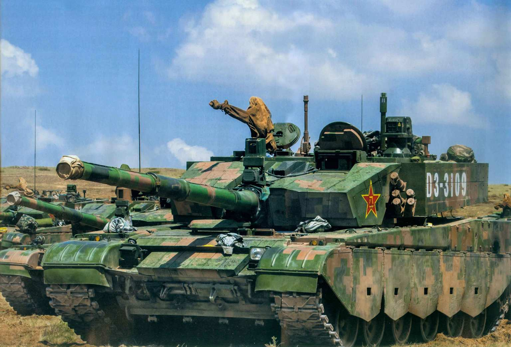
Type 99A tanks
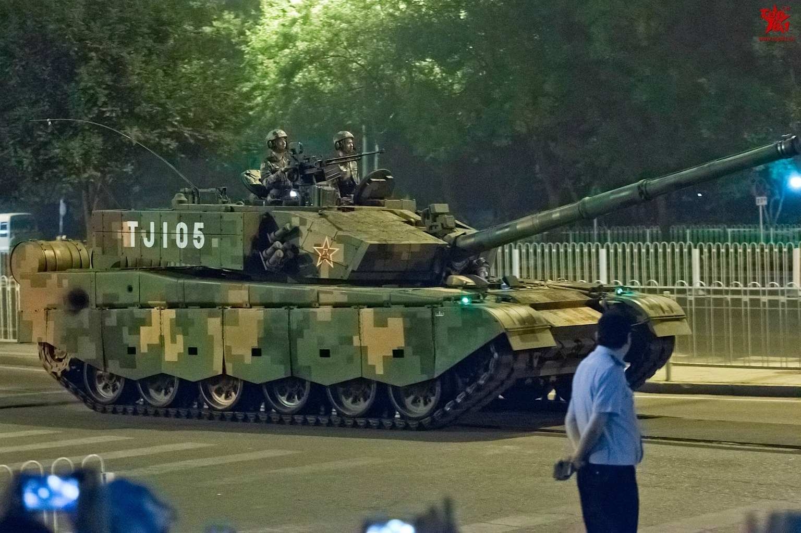
Type-99 tank
The Type 99A is China's premier main battle tank and the most technically ambitious armored platform the PLA has ever fielded. Weighing 55–58 tonnes, it is broadly comparable to the German Leopard 2A7 and US M1A2 SEPv3 in ambition and weight class.[^5]
| Specification | Type 99A |
|---|---|
| **Weight** | 55–58 tonnes[^6][^5] |
| **Main Gun** | ZPT-98 125mm smoothbore (derived from Soviet 2A46)[^5] |
| **Ammunition Types** | APFSDS (penetrates ~700 mm RHA), HEAT, HE-FRAG, laser-guided ATGM through barrel[^5][^7] |
| **Autoloader** | Carousel autoloader, 3-man crew[^5] |
| **Engine** | 150HB 1,500 hp turbocharged diesel[^5] |
| **Power-to-Weight** | ~27 hp/tonne[^5] |
| **Road Speed** | 80 km/h (claimed)[^5] |
| **Composite Armor** | Steel-ceramic-composite + ERA blocks on turret front/sides and hull glacis[^5] |
| **Active Protection** | GL-5 hard-kill APS (mmW radar intercepts ATGMs and RPGs)[^5] |
| **Laser Self-Defense** | JD-3 laser dazzler — blinds enemy optics, thermal cameras, missile seekers at several km[^5] |
| **Fire Control** | Hunter-killer capability; digital FCS; thermal imager[^5] |
| **Fleet Size** | Estimated 500–1,200 Type 99/99A; deployed to elite Eastern Theater units facing Taiwan[^5] |
| **Combat Record** | None — never exported, never used in combat[^5] |

**Key Ammunition Details:**

| Round | Penetration / Effect | Range |
|---|---|---|
| **125mm APFSDS** | ~700 mm RHA penetration[^5] | ~2,000 m effective |
| **Laser-guided ATGM (barrel-launched)** | Tandem HEAT; engages beyond gun range of 4,000–5,000 m[^7] | Up to 5 km |
| **HEAT** | Shaped-charge; effective vs. light armor | ~2,000 m |

**Edge Assessment:** The Type 99A is a formidable paper threat, but its combat capabilities are entirely unproven. The GL-5 APS has never been tested in combat. The laser dazzler is a unique feature with no Western equivalent, but its effectiveness against modern battlefield thermal cameras is contested. Crucially, the Type 99A is too heavy for the ZBD-05/ZTD-05 amphibious vehicles — it would cross the strait on RO-RO ferries and LSTs, not under its own amphibious power.[^5]

***
### 1.2 China — Type 100 "Next-Generation MBT" (Development — debut September 2025)
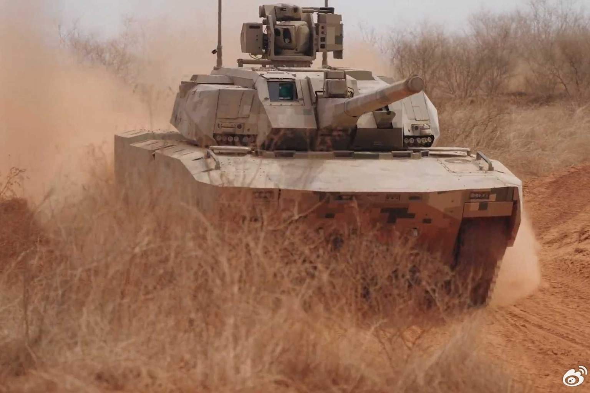
Military tank
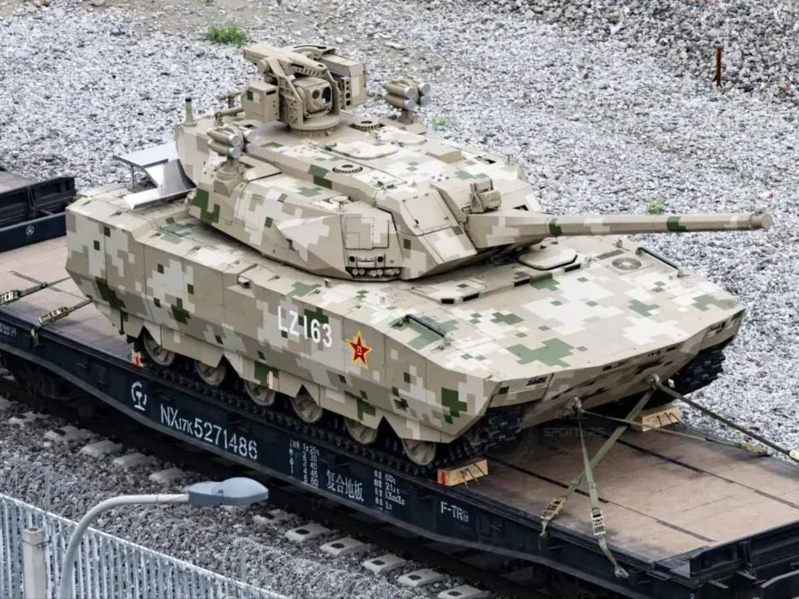
Camouflaged tank
On September 3, 2025, China publicly revealed its first model of the Type 100 fourth-generation main battle tank at a parade marking the 80th anniversary of Japan's defeat in WWII.[^3][^8]
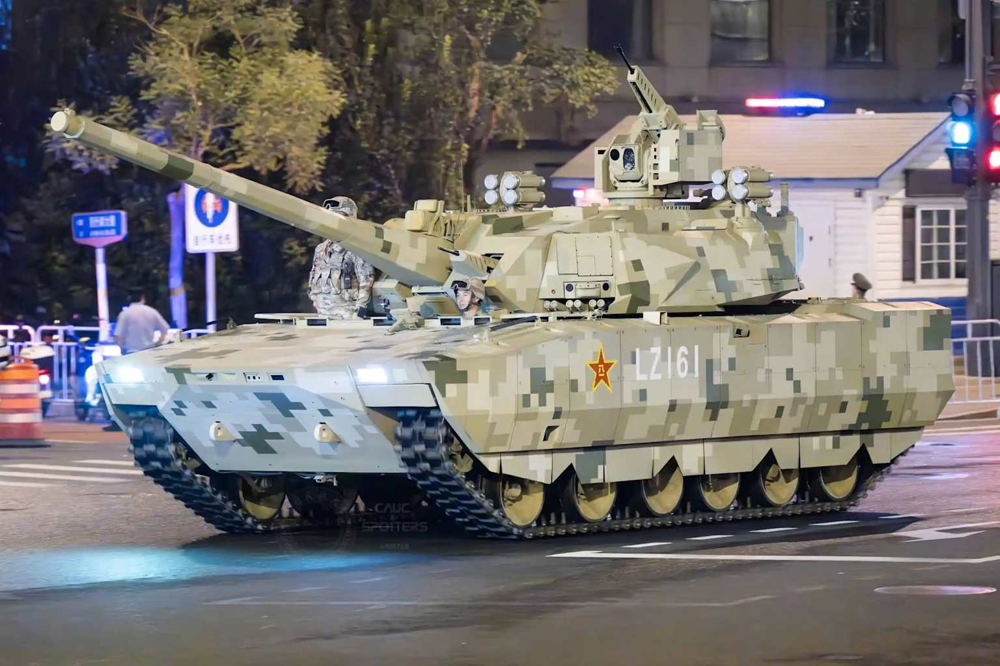
Type 100 medium tank
| Specification | Type 100 (Fourth-Generation MBT) |
|---|---|
| **Unmanned Turret** | Crew located entirely in hull; no personnel in turret[^3] |
| **Main Gun** | ~105 mm caliber (estimated from imagery; smaller than Type 99's 125 mm)[^3][^9] |
| **Active Protection** | Four-quadrant radar APS + optical APS; designed to engage kamikaze drones and ATGMs[^9] |
| **AR/VR Crew Interface** | Crew wears AR headsets connected to external sensors; "see-through" 360° battlefield awareness[^3] |
| **Drive** | Hybrid diesel-electric[^10] |
| **AI Fire Control** | AI-automated target recognition and weapon aiming; head-tracking weapon control[^3][^8] |
| **Drone Integration** | Designed to network with drone swarms; ZBD-100 support vehicle companion[^10] |
| **Weight** | 7 pairs of road wheels (heavier configuration than Type 100 LRIP)[^11] |
| **Status** | Model revealed September 2025; limited production vehicles deployed late 2025 |
| **Combat Record** | None — brand new[^10] |
**Edge Assessment:** The Type 100 is one of the most conceptually advanced tank designs in the world. The unmanned turret removes the most vulnerable crew position in tank warfare (the loader/gunner exposed in a rotating turret) and dramatically increases crew survivability. The drone-integrated APS capable of engaging kamikaze UAVs — the dominant ground threat in modern warfare, as seen in Ukraine — gives the Type 100 a unique capability that neither the US M1A2 SEPv3 nor the German Leopard 2A7 currently match. However, the system is brand new, production numbers are minimal, and claims have not been combat-validated.

***
### 1.3 China — Type 15 "Black Panther" Light Tank (ZTQ-15) — Amphibious / Airborne Role
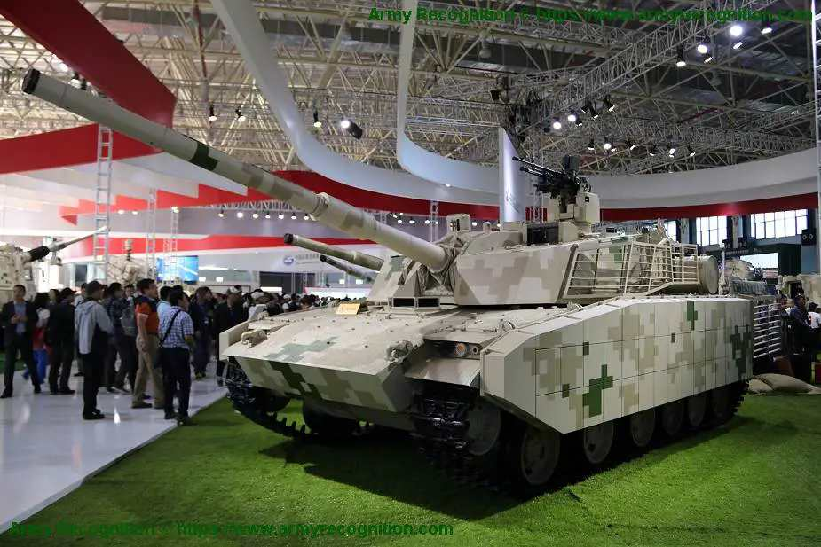
ZTQ-15 light tank
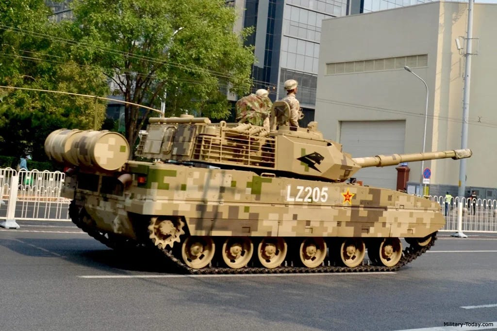
Type 15 light tank
The Type 15 is China's purpose-built light tank for amphibious and mountain warfare, operated by the PLAN Marine Corps and PLA Army Airborne Corps.[^12]
| Specification | Type 15 / ZTQ-15 |
|---|---|
| **Weight** | 33 tonnes (standard); 36 tonnes (with additional armor)[^12] |
| **Main Gun** | ZPL-151 105mm rifled gun[^13] |
| **Secondary Armament** | QJT-88 5.8mm coaxial MG; QLZ-04 35mm auto grenade launcher; QJC-88 12.7mm HMG (remote)[^12] |
| **Speed (road)** | ~70 km/h[^12] |
| **Speed (water)** | Can ford water obstacles with preparation |
| **Engine** | 132HB 883 hp diesel[^13] |
| **Armor** | Composite + ERA; lighter than MBT but can defeat IFV-caliber weapons |
| **Combat Record** | None (PLA service only) |
| **Amphibious Role** | Airlifted by Y-20 transport; deployed from PLAN amphibious ships; first-wave armored support for marines[^12] |
| **Fleet Size** | ~500+ in service[^12] |

The Type 15 fills the critical tactical gap between the ZTD-05 (105mm wheeled amphibious gun) and the Type 99A (full MBT too heavy for first-wave landing). With the Y-20 capable of transporting Type 15s directly to seized airfields, the PLA envisions a "vertical envelopment with armor" concept where airborne forces seize an airfield, Y-20s land Type 15s, and inland armored exploitation begins before the main amphibious wave is fully ashore.

***
### 1.4 US — M1A2 SEPv3 Abrams (Active Army — ~1,000 combat-coded; Taiwan M1A2T — 108 total delivery 2024–2026)
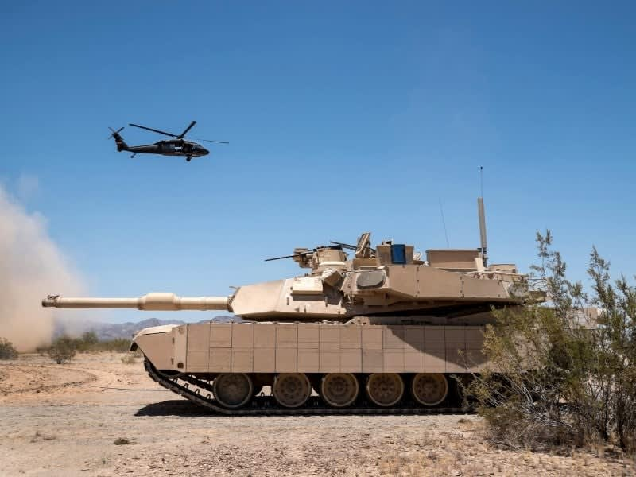
M1A2 Abrams tank
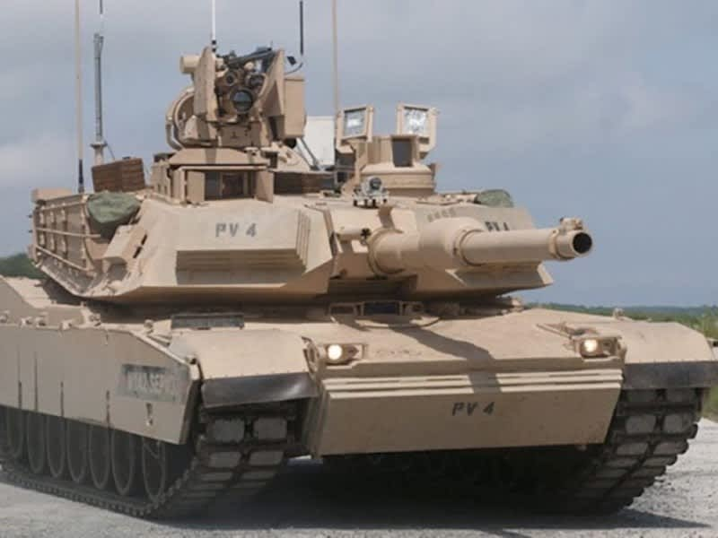
M1A2 Abrams tank
The M1A2 SEPv3 is the most combat-proven main battle tank on Earth, with validated lethality across Operation Desert Storm, Iraqi Freedom, and persistent counter-insurgency deployments. The Taiwan-specific M1A2T is a customized SEPv3 variant.
| Specification | M1A2 SEPv3 / M1A2T |
|---|---|
| **Weight** | 67 tonnes[^14] |
| **Main Gun** | 120mm M256 smoothbore[^15] |
| **Ammunition** | M829A4 APFSDS (penetrates ~750 mm+ RHA), M830A1 HEAT-MP, M1028 canister, M1147 MPAT[^16][^15] |
| **Engine** | AGT1500 Honeywell gas turbine, 1,500 hp[^14] |
| **Speed** | 67+ km/h road; 48 km/h cross-country[^14] |
| **Range** | 425 km[^14] |
| **Composite Armor** | Chobham/Burlington composite; depleted uranium inserts in US Army version (M1A2T lacks DU inserts)[^15] |
| **Active Protection** | Trophy APS (Israeli; integration ongoing for M1A2T)[^16] |
| **Fire Control** | Commander's Independent Thermal Viewer (CITV); hunter-killer capability; day/night targeting[^15] |
| **Taiwan Delivery** | 38 delivered Dec 2024; 42 in 2025; 28 in 2026 = 108 total[^16][^17] |
| **Limitation** | M1A2T lacks depleted uranium armor inserts of US Army version[^15] |
| **Combat Record** | Extensively proven in Iraq, Kuwait; top kill ratio of any MBT in history[^15] |

**Taiwan M1A2T Context:** The 108 M1A2T Abrams are being positioned as the northern corridor heavy "stopper" force against any PLAN breakout from potential Keelung landing sites toward Taipei. At 67 tonnes, they cannot be moved by the ZBD-05/ZTD-05 combination and would need to be engaged by PLA field artillery or air-delivered ATGMs.[^15]

| Head-to-Head | Type 99A | M1A2 SEPv3 |
|---|---|---|
| **Main Gun** | 125mm smoothbore | 120mm smoothbore[^5][^15] |
| **Penetration** | ~700 mm RHA | ~750 mm+ RHA (M829A4)[^5][^15] |
| **Speed** | 80 km/h (claimed) | 67 km/h[^5][^14] |
| **Active Protection** | GL-5 (untested in combat)[^5] | Trophy (proven in Gaza, West Bank)[^16] |
| **Unique Capability** | Laser dazzler; barrel-launched ATGM | Gas turbine engine for surge power |
| **Combat Record** | None[^5] | Extensive[^15] |
| **Edge** | **Neither definitively** — Type 99A is powerful on paper; M1A2 SEPv3 is proven in battle |

***
### 1.5 Japan — Type 10 "Hitomaru" MBT (113 in service) and Type 90 (341 in service)
Japan's Type 10 is the world's most technologically sophisticated production tank by several metrics, including its C4I integration, modular protection, and automated loading with 4-man crew flexibility.

| Specification | Type 10 | Type 90 |
|---|---|---|
| **Weight** | 44 tonnes (core); up to 48 tonnes with add-on armor | 50.2 tonnes |
| **Main Gun** | Japan Steel Works 120mm smoothbore (Japanese-developed) | Rheinmetall 120mm smoothbore |
| **Engine** | Mitsubishi 8VA34WT 1,200 hp diesel | Mitsubishi 10ZG diesel 1,500 hp |
| **Speed** | 70 km/h road | 70 km/h road |
| **APS** | APS integration approved 2024 + Kongsberg RS6 Protector 30mm RWS (procurement in progress)[^18] | None currently |
| **C4I** | Advanced Japanese FBCB2-equivalent digital network; can command autonomous vehicles | Older C4I |
| **Status** | 113 in service; production ongoing[^19] | 341 in service; older platform |
| **Role** | Ryukyu island chain defense; Kyushu mainland rapid-response armor | Northern Hokkaido defense |

The Type 10's low weight (44 tonnes vs. M1A2's 67 tonnes) is critical in Japan's context — it can operate on the Ryukyu island road network where Abrams tanks cannot.

***
## PART II: AMPHIBIOUS ASSAULT ARMOR
### 2.1 China — ZBD-05 Infantry Fighting Vehicle (Amphibious) + ZTD-05 Assault Gun
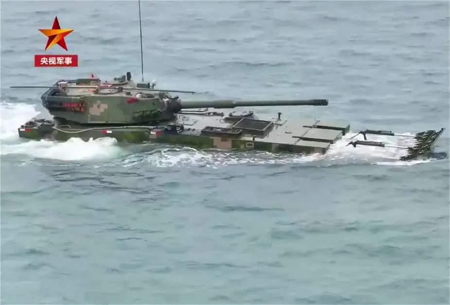
ZBD-05 amphibious vehicle
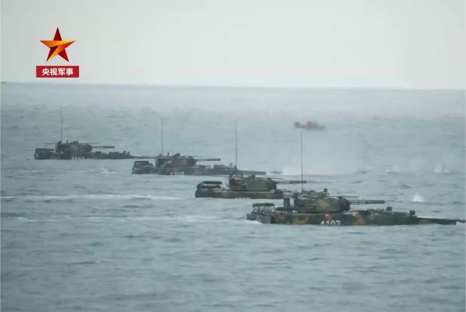
Amphibious military vehicles
The ZBD-05 and ZTD-05 are the assault vehicles designed specifically to take Taiwan's beaches. They are the fastest amphibious armored vehicles ever built, with water speeds of up to 45 km/h (25 mph) — compared to 13 km/h for the US AAV7.[^20]

| Specification | ZBD-05 IFV | ZTD-05 Assault Gun |
|---|---|---|
| **Role** | Amphibious infantry carrier / fire support | Amphibious armored direct fire support[^20] |
| **Weight** | ~26 tonnes[^20] | ~26 tonnes[^20] |
| **Main Armament** | ZPT-99 30mm autocannon + HJ-73C ATGM[^21] | ZPL-98A 105mm rifled gun[^20] |
| **Secondary** | 7.62mm coaxial MG | QJC-88 12.7mm anti-aircraft HMG[^20] |
| **Anti-Armor** | HJ-73C ATGM (3.5 km range)[^21] | APFSDS: penetrates 600mm RHA at 2,000m; laser-guided ATGM barrel-launched[^20] |
| **Water Speed** | 45 km/h (25 mph)[^20] | 45 km/h[^20] |
| **Land Speed** | 65+ km/h[^20] | 65+ km/h[^20] |
| **Key Capability** | Can fire 30mm cannon and ATGM while still in water — engages beach defenses before landing[^20] | Can fire 105mm gun and guided missiles while afloat — unique worldwide[^20] |
| **Variants** | IFV, ATGM carrier (new HJ-10/HJ-13 8-tube variant Apr 2025)[^22], command vehicle, ADA (HQ-13 amphibious SAM announced Nov 2025)[^23] | Base assault gun |
| **HQ-13 Variant** | Amphibious air defense: merges HQ-13 SAM with ZBD-05 chassis — provides AD coverage during sea crossing[^23] | N/A |

**Edge Assessment:** The ZTD-05's ability to fire its 105mm gun while swimming is the single most operationally significant capability of China's amphibious armored force. It means beach defenders face direct tank fire while the assault vehicles are still 2,000–3,000 meters offshore, before conventional defenders can effectively engage them. The new HQ-13 amphibious SAM variant effectively gives the assault wave its own air defense umbrella during the crossing — a direct response to Taiwan's shoulder-fired MANPADS and F-16V strafing threat.

***
### 2.2 US/Allied Amphibious Armor Counterpart — ACV-30 / M2A3 Bradley / AAV-P7 (USMC Context)
This section focuses on ground Army assets. US Marine amphibious armor is covered in the Marines report. The US Army does not have dedicated amphibious assault armor comparable to the ZTD-05; this mission belongs to the USMC. Taiwan's ground forces rely on defensive anti-armor weapons — Javelin, TOW, and M60A3 tanks in beach defense positions — rather than competing amphibious vehicles.

**Taiwan Beach Defense Anti-Armor Assets:**

| Weapon | Type | Range | Effect |
|---|---|---|---|
| **BGM-71 TOW-2B** | Anti-tank guided missile | 3,750 m | Top-attack; 630mm RHA penetration; effective vs. ZTD-05 at full water speed |
| **FGM-148 Javelin (Block II)** | Fire-and-forget ATGM | 4,750 m (Block II)[^20] | Top-attack mode; penetrates 600mm+ RHA; defeats ERA; shoots ZTD-05 while it is still in water[^20] |
| **M60A3 TTS (upgraded 2025)** | MBT (105mm) | 2,000 m effective gun | ~250 upgraded tanks confirmed at training facility Mar 2025[^24] |
| **CM-11 Brave Tiger** | MBT hybrid (105mm) | 2,000 m | M1 Abrams FCS in M60 hull; ERA blocks added 2015[^25][^26] |

***
## PART III: ROCKET ARTILLERY AND LONG-RANGE FIRES
### 3.1 US — M142 HIMARS with PrSM / ATACMS (Taiwan + Pacific MDTF)
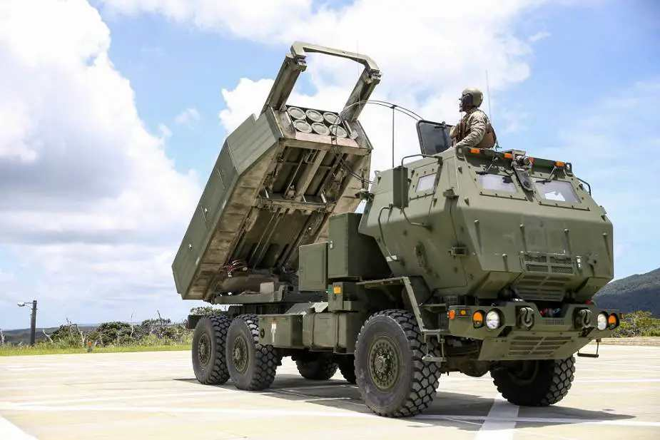
HIMARS M142 launcher
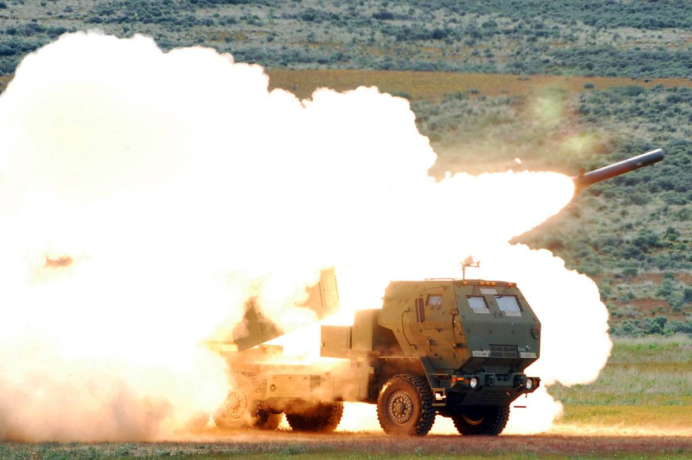
M142 HIMARS
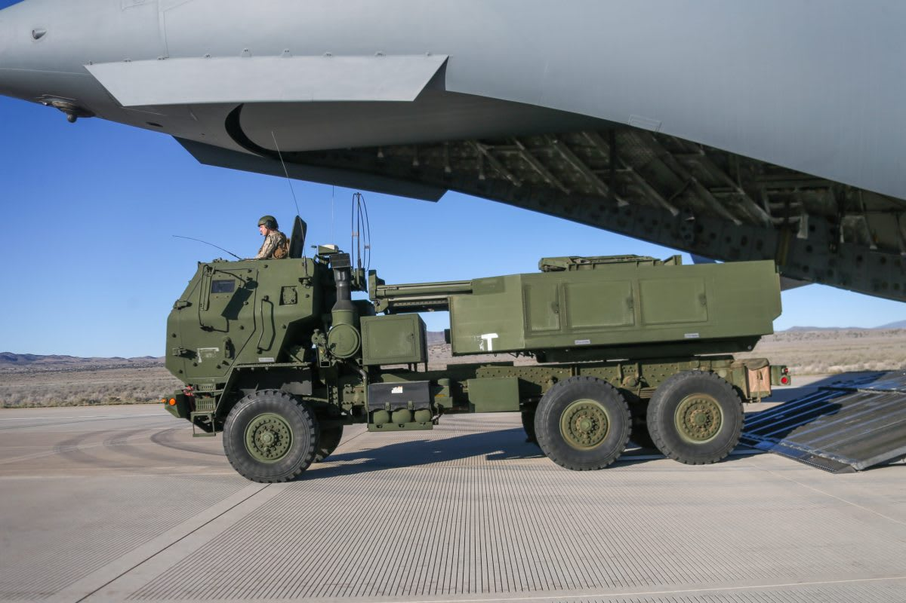
M142 HIMARS launcher
The M142 HIMARS is the West's most battle-proven precision rocket artillery system, validated in combat in Ukraine and — for the first time — in Operation Epic Fury against Iran in March 2026, where the Precision Strike Missile (PrSM) achieved its first-ever operational deployment.[^2]

| Specification | M142 HIMARS |
|---|---|
| **Platform** | Wheeled 5-ton truck; single launch pod[^27] |
| **Munitions** | GMLRS guided rockets (70 km), ATACMS (300 km), PrSM (500 km); future PrSM Increment 4 (1,000+ km)[^28][^29] |
| **Crew** | 3 |
| **Reload** | ~5 minutes in combat (pod swap) |
| **Speed** | 85 km/h road |
| **C-17 Transportable** | 1 × HIMARS per C-17; 2 per C-5 |
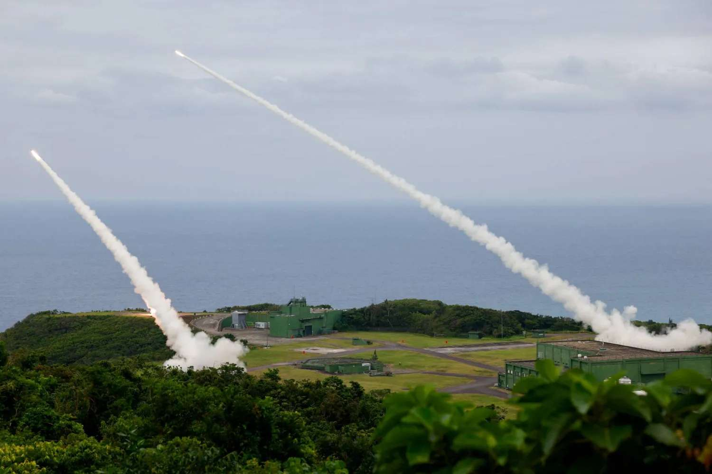
HIMARS rocket launch

HIMARS rocket launcher firing
**PrSM Variants and Roadmap:**

| Increment | Status | Range | Key Capability |
|---|---|---|---|
| **Increment 1 (baseline)** | Production / combat-proven (Iran, March 2026)[^2] | 500 km[^28][^29] | GPS/INS precision; replaces ATACMS |
| **Increment 2 (Land-Based Anti-Ship)** | Development | 500 km+ | Multimode seeker; targets ships at sea[^29] — critical for Taiwan Strait interdiction |
| **Increment 3** | Development | 500 km+ | Enhanced warhead / harder targets |
| **Increment 4** | Competition ongoing (Lockheed vs Northrop-Raytheon)[^29] | 1,000+ km[^28][^30] | Near-IRBM range from land launcher; can reach mainland targets from Okinawa |
| **Increment 5** | Science & Technology phase FY2026[^30] | TBD | Autonomous vehicle launch — no human crew required |

**Taiwan HIMARS Program:**
- 11 HIMARS delivered November 2024; first unit formed July 2025[^31]
- Total program: 111 HIMARS + 504 ATACMS[^32]
- Forward deployment to Penghu and Dongyin Islands approved January 2026[^33]
- From Dongyin (19 km from mainland), ATACMS reaches Fuzhou Naval Base in ~7 minutes[^33]
- Target sets include: PLARF Base 61 in Huangshan, J-20 airbases at Fuzhou and Longtian, PLAN amphibious staging ports Xiamen/Quanzhou/Zhangzhou[^33]
---
### 3.2 China — PCL-181 (155mm Wheeled SPH) and PLZ-05A (155mm Tracked SPH)
| Specification | PCL-181 | PLZ-05A |
|---|---|---|
| **Type** | Truck-mounted 155mm/52-cal wheeled SPH[^34][^35] | Tracked 155mm SPH[^36] |
| **Range (conventional)** | 40 km[^34] | 30 km standard; 39 km with RAP[^36] |
| **Range (rocket-assisted)** | Up to 72 km reported[^37] | 39 km (RAP)[^36] |
| **Rate of Fire** | Automated laying; 3-round burst + sustained[^35] | Up to 10 rounds/min[^36] |
| **Speed** | 90 km/h road[^34] | 56 km/h[^36] |
| **Redeployment** | Under 3 minutes (shoot-and-scoot)[^34] | Slower (tracked) |
| **Crew** | 5 | 4[^36] |
| **Precision Munitions** | GP-155 guided projectile family (~5 m CEP)[^36] | Same GP-155 family[^36] |
| **Role** | Mobile fire support; rapid deployment to island-chain scenarios | Heavy direct-support artillery |

**Edge Assessment:** The PCL-181's combination of 90 km/h road speed, 3-minute displacement capability, and 40–72 km range makes it a highly survivable counter-battery threat. In a Taiwan scenario, PCL-181 batteries in Fujian could begin pre-H-Hour bombardment of beach obstacles, radar sites, and air defense positions at ranges that exceed most of Taiwan's counter-battery capability.

***
### 3.3 US — M109A7 Paladin (155mm Tracked SPH)
| Specification | M109A7 Paladin |
|---|---|
| **Caliber** | 155mm M284 cannon[^38] |
| **Standard Range** | 24 km (HE); 30 km (RAP)[^38][^39] |
| **Excalibur (XM982)** | GPS/INS-guided; 40+ km range; ~2 m CEP[^38] |
| **M109-52 Upgrade** | BAE Systems/US Army CRADA signed Jun 2025; Rheinmetall L52 barrel; 30 km (HE) → 60+ km (RAP/BB)[^39] |
| **Rate of Fire** | Max 4 rds/min; sustained 1 rd/min[^38] |
| **Weight** | 35,380 kg[^38] |
| **Crew** | 4[^38] |

***
## PART IV: MULTI-DOMAIN LONG-RANGE STRIKE — US ARMY PACIFIC
### 4.1 US Army — Typhon Mid-Range Fires System (Deployed to Japan September 2025)
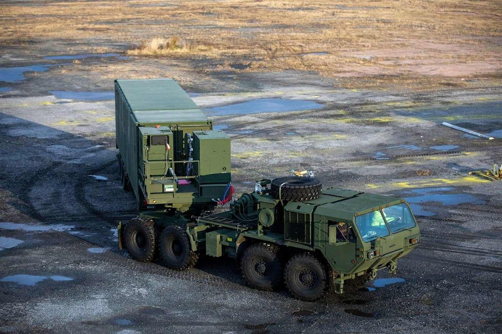
Military missile system truck
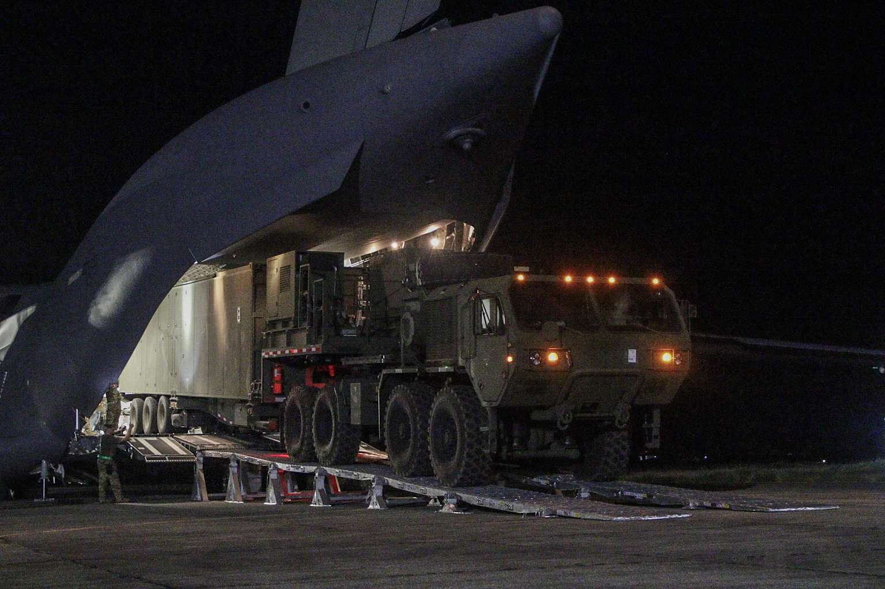
Typhon missile system
The Typhon system (formerly "Mid-Range Capability" / MRC) is the US Army's ground-based launcher for Standard Missile 6 and Tomahawk cruise missiles. It was deployed to Japan for the first time in September 2025 during Resolute Dragon, an unmistakable strategic signal to Beijing.[^40][^41]

| Specification | Typhon (SMRF) |
|---|---|
| **Platform** | 40-foot ISO container footprint; 4 × Mk.41 VLS strike-length cells per launcher[^42] |
| **Missiles** | SM-6 multi-purpose (surface-to-surface, anti-ship, BMD) + Tomahawk Block V (land attack + anti-ship)[^41] |
| **SM-6 Range** | ~370 km (surface-to-surface mode)[^40][^41] |
| **Tomahawk Range** | ~1,600 km (Block V land attack); ~1,100 km (Block Va anti-ship)[^41] |
| **Location (2025)** | Deployed to MCAS Iwakuni, Japan (Sep 2025)[^41] |
| **From Iwakuni** | Tomahawks can strike China's eastern seaboard from Japan[^41] |
| **Transport** | Standard semi-trailer; C-17 transportable; no specialized infrastructure required[^41] |
| **Live Fire** | SM-6 hit maritime target at Talisman Sabre 2025 (Australia, July 2025)[^40] |
| **Status** | Deployed; permanent basing in Japan under negotiation[^41][^43] |

**Strategic Significance:** A Typhon battery on Okinawa or Miyako Island — both within the first island chain — can range the entirety of the Taiwan Strait approach routes and China's amphibious staging ports with Tomahawk cruise missiles, without deploying a single surface ship into contested waters. The 4-cell container resembles a standard ISO shipping container — creating a "needle-in-a-haystack" targeting problem for PLA reconnaissance satellites.

***
### 4.2 US Army — Dark Eagle LRHW (Long-Range Hypersonic Weapon) — IOC January 2026
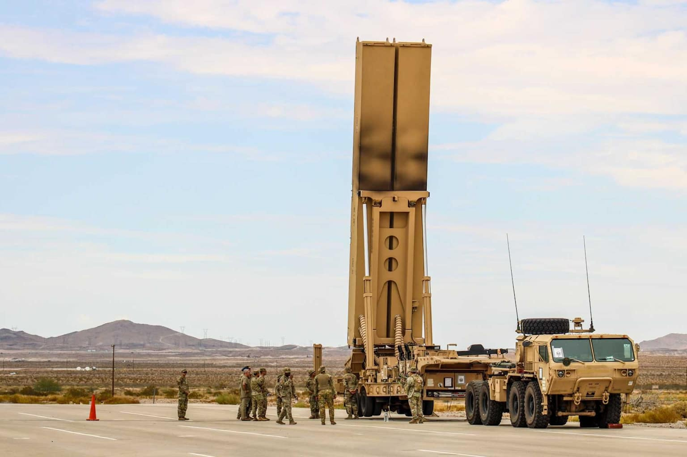
Dark Eagle LRHW Missile
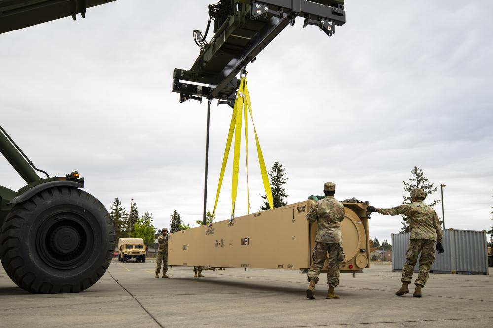
Missile canister handling
The Dark Eagle is the United States' first-ever operational hypersonic weapon system. The Army formally designated the Long-Range Hypersonic Weapon (LRHW) as "Dark Eagle" on April 24, 2025. Fielding began December 2025 and was expected to complete in early 2026.[^44][^45]

| Specification | Dark Eagle (LRHW) |
|---|---|
| **Type** | Ground-launched boost-glide hypersonic weapon[^46] |
| **Speed** | Mach 5+; maneuvering hypersonic glide phase[^44] |
| **Range** | Intermediate-range; classified, assessed 2,775+ km (1,725 mi)[^46] |
| **Launcher** | 4× M983 trucks, each carrying 2 missiles in launch canisters + command vehicle (8-missile battery)[^46] |
| **Warhead** | Conventional (unitary penetrating warhead for hardened targets) |
| **Guidance** | Inertial + GPS; maneuvers in terminal phase to defeat TMD/BMD |
| **Contractor** | Lockheed Martin[^44] |
| **IOC** | December 2025 / January 2026[^44] |
| **Pacific Role** | From Okinawa or Guam: can strike PLARF missile bases, PLAN port facilities, and command bunkers in eastern China within minutes |
| **Key Advantage** | No current Chinese ground-based defense system can intercept a maneuvering hypersonic glide vehicle at this speed |

***
### 4.3 China — PLA Rocket Force (PLARF) Ground-Based Ballistic Missiles — Taiwan Theater

DF-26 missile transporter
China's PLARF is the most operationally relevant force in the first 72 hours of any Taiwan conflict. With over 1,000 missiles aimed at Taiwan and growing rapidly, the PLARF is China's primary instrument for suppressing Taiwan's air defenses, destroying runway infrastructure, neutralizing radar sites, and threatening US Pacific bases — all before a single amphibious soldier sets foot on a beach.[^47]

**PLARF Missile Arsenal — Taiwan Theater:**

| Missile | Type | Range | Speed | Warhead | Status | Taiwan Threat |
|---|---|---|---|---|---|---|
| **DF-11A / DF-15B** | SRBM | 300–600 km[^47] | Mach 6+ terminal | Conventional/cluster/EMP | Operational (1,000+ aimed at Taiwan)[^47] | Beach obstacles, airfields, radar |
| **DF-16** | SRBM | 800–1,000 km[^47] | Mach 8+ | Conventional/nuclear; up to 3 MIRVs[^47] | Operational | Can reach all of Taiwan + US bases in Japan |
| **DF-17** | MRBM + HGV | 1,800–2,500 km[^48][^49] | Mach 5–10 (HGV phase)[^48] | Conventional/nuclear | Operational (2019)[^48] | Guam; all US Pacific bases; carrier groups |
| **DF-21D** | MRBM (anti-ship) | 1,500–2,000 km[^47] | ~Mach 10 terminal | Maneuvering RV | Operational — "carrier killer" | USN CVN within 2,000 km |
| **DF-26 / DF-26B** | IRBM (dual-capable) | 4,000 km[^50] | Mach 18 terminal[^51] | Nuclear or conventional; anti-ship variant (DF-26B)[^50] | Operational (2016); 200–350+ launchers[^52] | Guam; 2nd island chain; carrier groups |
| **DF-26D** | IRBM (enhanced) | 4,000–5,000 km[^51] | Mach 18[^51] | Active radar + multispectral seeker; decoys; possible MRV/HGV[^53] | Revealed Sep 2025 parade; entering service[^51] | **Defeats THAAD, Aegis BMD, Patriot** |
| **DF-27** | IRBM (intercontinental anti-ship) | 5,000–8,000 km[^54] | Hypersonic glide | Conventional anti-ship + land attack | Fielding late 2025[^54] | Second island chain and beyond; Hawaii |
| **DF-41** | ICBM (MIRV) | 15,000 km[^55] | Mach 25+ terminal | 10× MIRV nuclear warheads | Operational | Continental US strategic deterrence |
**PLARF Arsenal Explosion:** China's missile stockpile grew ~50% in four years, reaching ~3,500 missiles. In a pre-invasion strike, PLA planners reportedly call for a "missile campaign" that would fire hundreds of SRBMs at Taiwan within the first 30 minutes, designed to suppress all radar, air defense, and command nodes before the amphibious force launches.[^1]

***
## PART V: US & ALLIED LONG-RANGE PRECISION FIRES — GROUND-BASED
### 5.1 US Army Multi-Domain Task Forces (MDTFs) — Pacific
[^56][^57]

The US Army has three MDTFs currently operational globally, with two focused on the Indo-Pacific: the **1st MDTF** and **3rd MDTF**. The Army plans two additional commands — Multi-Domain Command Pacific and Multi-Domain Command Japan — to be operational by 2028.[^57][^56]

| MDTF | Location | Key Assets | Pacific Role |
|---|---|---|---|
| **1st MDTF** | Fort Lewis, WA | Dark Eagle LRHW, Typhon, PrSM; Cyber/EW battalion; Intel/targeting battalion[^56][^57] | Strike planning and execution in INDOPACOM AOR |
| **3rd MDTF** | Fort Shafter, Hawaii | Dark Eagle, Typhon (deployed to Japan Sep 2025)[^58]; PrSM; Long-range sensing | Forward-deployed strikes; tested SM-6 vs maritime target at Talisman Sabre 2025[^40] |
| **4th MDTF (forming)** | Japan-aligned | Same capabilities; Multi-Domain Command Japan[^56] | Permanent Japan-based long-range strike presence |

**MDTF Fires Arsenal:**

| System | Range | Target Set | Status |
|---|---|---|---|
| **Dark Eagle LRHW** | 2,775+ km | PLARF missile bases, carrier docks, C2 bunkers | IOC Jan 2026[^44] |
| **Typhon (SM-6 / Tomahawk)** | 370 km / 1,600 km | Surface fleet, amphibious task force, air bases | Deployed Japan Sep 2025[^41] |
| **PrSM Increment 1** | 500 km | Amphibious staging areas, radar, airfields | Production; combat proven Iran Mar 2026[^2] |
| **PrSM Increment 2 (LBASM)** | 500 km+ | Moving ships — Taiwan Strait interdiction | Development[^29] |
| **PrSM Increment 4** | 1,000+ km | Long-range area denial; near-IRBM | Competition ongoing[^29] |
| **ATACMS M57** | 300 km | Staging areas, SAM sites, PLARF TELs | Operational; in Taiwan inventory[^32][^59] |

***
## PART VI: TAIWAN GROUND FORCES — DEFENSE IN DEPTH
Taiwan's ground doctrine following the 2022–2026 reform cycle is explicitly asymmetric: do not try to out-tank China, out-missile China, or fight a linear conventional battle. Instead, layer defenses to make every kilometer of advance cost-prohibitive.
### 6.1 Taiwan's Three-Layer Ground Defense Concept
**Layer 1 — Pre-Crossing Strike (HIMARS / Hsiung Feng / Mines):**
- 111 HIMARS + 504 ATACMS: destroy amphibious staging ports, TEL positions, marshaling areas at 16–300 km[^32][^33]
- 1,400+ anti-ship missiles (HF-2/HF-3) deployed on mobile launchers along the coast by 2026[^60][^4]
- Minefield programs across the 13 viable landing beaches

**Layer 2 — Beach Breaking Defense:**
- M60A3 TTS upgraded tanks (250+) and CM-11 Brave Tiger (250+) in prepared firing positions[^25][^24]
- 108 M1A2T Abrams providing a heavy armor reserve in the northern approach corridors[^15]
- Javelin ATGMs: direct kill of ZTD-05 as it exits the water[^20]
- Switchblade 300 (720 munitions) and ALTIUS 600M (up to 291 systems) loitering munitions[^61]

**Layer 3 — Urban and Mountain Defense:**
- Taiwan's mountainous interior is impassable for armor except via limited road axes — Chinese tanks can only advance along the coastal plains and through mountain passes, creating choke points
- Urban warfare training accelerated post-2022; "fortress Taiwan" concept based on Israeli/Ukrainian models
- NCSIST "suicide drones" — domestically developed loitering munitions unveiled 2023[^62]

***
### 6.2 Taiwan Anti-Ship Missile Ground Forces — The Strait Denial Layer
[^60][^4]

By mid-2026, Taiwan will have the highest density of anti-ship missiles per square kilometer of any nation on Earth.[^4]

| Missile | Speed | Range | Guidance | Deployment |
|---|---|---|---|---|
| **HF-3 (Hsiung Feng III) Baseline** | Mach 2.3[^60] | 150–300 km[^60] | Active radar + INS | Mobile coastal batteries; Hengchun Peninsula[^60] |
| **HF-3 Extended Range** | Mach 3.5[^63] | 400 km[^60] | Active radar + INS | Mobile; reaches Fujian cities[^60] |
| **HF-2 (Hsiung Feng II)** | Mach 0.85 (subsonic) | 150+ km | Active radar + INS | Coastal batteries |
| **Wan Chien** | Subsonic | 200–240 km | GPS/INS | Air-launched (F-CK-1, F-16V); cluster/unitary warhead |
| **Thunderbolt-2000** | Supersonic | 150+ km (SAT-1 GMLRS) | INS/GPS | Deployed Penghu Islands[^32] |

***
## PART VII: LOITERING MUNITIONS AND DRONE GROUND FORCES
### 7.1 US / Taiwan — Switchblade, ALTIUS 600M, and Hellscape Drones
The US Hellscape concept — overwhelming a Taiwan Strait crossing with hundreds of thousands of drones — is now being translated into procurement.[^64][^61]

| Platform | Operator | Warhead | Range | Role |
|---|---|---|---|---|
| **Switchblade 300** | Taiwan (720 munitions approved)[^61] | Anti-personnel + anti-armor | 10+ km | Fire-and-forget loitering; anti-infantry and light armor |
| **ALTIUS 600M-V** | Taiwan (up to 291 systems)[^61] | Extensible warhead + EO/IR | 450+ km | Autonomous; ISR + precision strike; anti-armor |
| **COTS drone swarms** | Taiwan (NCSIST indigenous) | Varied; fragmentation/shaped charge | 50–100 km | Saturate beach approaches during H-Hour; expend in swarms[^62] |
| **Phoenix Ghost** | US Army (stockpile) | Precision anti-armor | >100 km | Anti-armor loitering munition; Ukraine-proven |
| **JUMP 20 / Altius 700** | MDTF | ISR + strike | 400+ km | Launched from ground; networked ISR feeds targeting data for PrSM/Typhon |

***
### 7.2 China — PLA Ground Drone Forces
China's drone ecosystem for ground forces is rapidly maturing, with a notable development: the PLA has converted over 200 old fighter jets into attack drones and deployed them to six air bases near Taiwan by early 2026. For ground forces specifically:[^65]

| Platform | Role | Notes |
|---|---|---|
| **Converted J-6/J-7 drone jets (200+)** | Expendable attack drone; swarm saturation | Deployed to 6 bases near Taiwan; overwhelm air defenses[^65] |
| **CH-4/CH-5 UCAV** | Armed ISR/strike; ATGM delivery | Export proven in combat (Yemen, Iraq, Libya) |
| **TB-001/WZ-7** | ISR/strike support | Operational with PLAAF/PLAGF |
| **SkyWing Switchblade clone** | Infantry loitering munition | $13,000 commercial clone of Switchblade[^66]; mass procurement for PLA infantry |
| **UGV remote weapon stations** | Forward CAS; mine clearing | Reported under development; no confirmed Taiwan-focused deployment |

***
## PART VIII: JAPAN GROUND SELF-DEFENSE FORCE (GSDF) — ISLAND DEFENSE "SOUTHERN SHIELD"
Japan's "southern shield" doctrine is a fundamental transformation of JGSDF posture from Hokkaido-focused Soviet-era defense to Ryukyu island-chain denial strategy targeting China.[^43]

| System | Qty / Status | Role | Range |
|---|---|---|---|
| **Type 12 Kai Extended Range SSM** | Mass production approved; deployed Kumamoto Mar 2026[^43] | Land-based anti-ship; strikes PLAN naval forces | 900–1,200 km[^67] |
| **Type 10 MBT** | 113 in service[^19] | Island and Kyushu mainland armor | Tank engagement 2,000m+ |
| **Type 90 MBT** | 341 in service[^68] | Northern Japan heavy armor | Tank engagement 2,000m+ |
| **FH-70 155mm howitzer** | Legacy towed | Fire support | 24 km (30 km RAP) |
| **Type 99 155mm SPH** | Japanese-developed | Mobile fire support | 30 km |
| **Type 03 Chū-SAM** | Air defense SAM | Medium-altitude air defense | ~50 km |
| **Type 93/11 MANPADS** | Shoulder-fired AD | Low-altitude air defense | ~6 km |
| **Patriot PAC-3 MSE** | Multiple batteries | Theater BMD; intercepts DF-17 | 40 km intercept altitude |
| **HIMARS (US Army units)** | MDTFs deploying | Long-range fires | 500 km (PrSM) |
| **Typhon (US Army 3rd MDTF)** | Deployed to Iwakuni Sep 2025[^41] | Tomahawk/SM-6 from Japan | 1,600 km / 370 km |
| **FY2026 Defense Budget** | Record ¥9.04 trillion ($58B)[^69] | Drives 4th consecutive record year of spending | N/A |

Japan deployed ground-launched Type 12 Kai missiles to Kumamoto Prefecture on Kyushu in March 2026 — the first time Japan has stationed missiles capable of striking the Chinese mainland. This represents an epochal shift in Japanese defense posture.[^43]

***
## PART IX: SIDE-BY-SIDE COMPARISON TABLES
### 9.1 Main Battle Tank Comparison
| Feature | Type 99A (China) | Type 100 (China) | M1A2T (Taiwan) | M1A2 SEPv3 (US) | Type 10 (Japan) |
|---|---|---|---|---|---|
| **Weight** | 55–58 t[^5] | ~50 t (est.)[^10] | 67 t[^14] | 67 t[^14] | 44 t[^19] |
| **Main Gun** | 125mm smoothbore[^5] | 105mm (unmanned turret)[^3] | 120mm M256[^15] | 120mm M256[^15] | 120mm JSW[^19] |
| **APS** | GL-5 (untested)[^5] | Drone-killing quad APS[^9] | Trophy (integrating)[^16] | Trophy (ongoing) | APS approved 2024[^18] |
| **Unique Feature** | Laser dazzler; barrel ATGM[^5] | Unmanned turret + AR crew interface[^3] | Hunter-killer CITV[^15] | DU armor; gas turbine | Lightweight (road-capable Ryukyus)[^19] |
| **AI/Digital** | Hunter-killer FCS[^5] | Full AI fire control + head-tracking[^3] | Digital FCS | Digital FCS | Advanced C4I network[^19] |
| **Combat Proven** | No[^5] | No[^10] | M1 variants: Yes | Extensively[^15] | No |
### 9.2 Ground-Based Long-Range Fires — Range Comparison
| System | Side | Range | Warhead | Platform | Status |
|---|---|---|---|---|---|
| **DF-17 + DF-ZF HGV** | China | 1,800–2,500 km[^48] | Conv/nuclear; Mach 5–10[^48] | Road-mobile TEL | Operational[^48] |
| **DF-26D** | China | 4,000–5,000 km[^51] | Conv/nuclear; anti-ship; Mach 18[^51] | 12×12 TEL[^51] | Entering service 2025[^51] |
| **DF-27** | China | 5,000–8,000 km[^54] | Anti-ship intercontinental | Road-mobile | Fielding 2025[^54] |
| **Dark Eagle LRHW** | US | 2,775+ km[^46] | Conv; Mach 5+ HGV[^44] | 4× M983 trucks | IOC Jan 2026[^44] |
| **Typhon (Tomahawk Block V)** | US | 1,600 km[^41] | Conv land/anti-ship | ISO container TEL | Deployed Japan[^41] |
| **PrSM Increment 1** | US/Taiwan | 500 km[^28] | Conv precision | HIMARS/M270 | Production; combat-proven[^2] |
| **PrSM Increment 4** | US | 1,000+ km[^30] | Conv | HIMARS | Competition ongoing |
| **Type 12 Kai SSM** | Japan | 900–1,200 km[^67] | Conv anti-ship | Ground-mobile | Deployed Kumamoto Mar 2026[^43] |
| **ATACMS M57** | Taiwan | 300 km[^59] | Conv unitary | HIMARS | Operational; Taiwan 111 HIMARS[^32] |
### 9.3 Amphibious Assault Armor
| Feature | ZTD-05 (China) | ZBD-05 (China) | M1A2T vs. Javelin (Taiwan defense) |
|---|---|---|---|
| **Role** | Beach-storming direct fire[^20] | Amphibious IFV[^21] | Heavy armor stopper vs. fire-and-forget ATGM |
| **Main Armament** | 105mm gun + laser ATGM[^20] | 30mm cannon + HJ-73C ATGM[^21] | 120mm gun / FGM-148 Javelin (4,750 m)[^20] |
| **Water Speed** | 45 km/h — **fastest amphibious AFV in world**[^20] | 45 km/h[^20] | N/A |
| **Fires while afloat** | Yes — 105mm gun + guided missile[^20] | Yes — 30mm + ATGM[^21] | N/A (defensive position on shore) |
| **ADA Variant** | HQ-13 amphibious SAM (Nov 2025)[^23] | HQ-13 variant[^23] | Stinger MANPADS |
| **Counter** | Javelin (top-attack, 4,750 m range)[^20] | TOW-2B, Javelin | Type 99A (if it crosses)[^5] |

***
## PART X: STRATEGIC ASSESSMENT
### Ground Forces Edge by Category
| Category | Edge | Rationale |
|---|---|---|
| **Ballistic Missile Fires** | **China (decisive)** | 3,500 missiles; PLARF saturating strike pre-H-Hour; 1,000+ aimed at Taiwan[^47][^1] |
| **Hypersonic Ground-Launched** | **Parity (emerging US advantage)** | DF-17 operational since 2019; Dark Eagle IOC Jan 2026[^48][^44]; DF-26D/DF-27 outrange Dark Eagle but US Typhon+PrSM Increment 4 close gap |
| **Amphibious Assault Armor** | **China (decisive)** | ZTD-05 fires 105mm while swimming — no Allied equivalent; HQ-13 variant provides own AD cover[^20][^23] |
| **MBT Quality (combat-proven)** | **US** | M1A2 SEPv3 proven; Trophy APS proven; Type 99A all unproven claims[^5][^15] |
| **MBT Concept (future)** | **China (potentially)** | Type 100 unmanned turret, drone APS, AI fire control — no current US equivalent[^3] |
| **Precision Rocket Artillery** | **US/Allies** | PrSM combat-proven at 500 km; HIMARS in Taiwan now; Typhon on Japan soil[^2][^41] |
| **Island-Chain Denial** | **Allied** | Japan Type 12 Kai (1,200 km) + Typhon Tomahawk (1,600 km) + Dark Eagle (2,775 km) = layered fires from 1st island chain that China must destroy before landing[^43][^41][^44] |
| **Loitering Munitions Mass** | **China (volume); US/Allied (quality)** | China producing $13K commercial clones at scale[^66]; US fields combat-proven Switchblade/ALTIUS with ALTIUS 600M's 450+ km range[^61] |
| **Taiwan Forward HIMARS Threat** | **Taiwan/US** | ATACMS from Dongyin reaches Fuzhou Naval Base in 7 minutes; threatens PLAN staging before ships depart[^33] |
| **Drone Swarm Saturation** | **China** | 200+ converted fighter jet drones at bases near Taiwan[^65]; industrial-scale loitering munition production[^66] |
### Key Observations
**The Pre-H-Hour "Missile Campaign" Is China's Greatest Ground-Based Advantage:** The PLARF's 3,500-missile arsenal means that in any invasion, the first 30–90 minutes would see hundreds of DF-11s, DF-15s, and DF-16s raining on Taiwan's radar installations, runways, HIMARS positions, Patriot batteries, and command nodes before the amphibious fleet even enters the Strait. Taiwan's ability to survive this first wave — through hardened shelters, dispersal, and mobile HIMARS survivability — is arguably the most important single factor in the ground campaign.[^1]

**Taiwan's HIMARS Forward Deployment Is a Deterrence Masterstroke:** By stationing ATACMS-armed HIMARS on Dongyin Island, 19 km from the mainland, Taiwan forces a binary choice on Beijing: tolerate missiles that can strike Fuzhou Naval Base in 7 minutes and PLARF Base 61 in Huangshan, or launch a pre-emptive strike on Dongyin — which itself constitutes an unambiguous act of war that triggers international response before the amphibious force even launches.[^33]

**The Type 100 Is the Most Conceptually Disruptive Ground Platform Revealed in 2025:** The unmanned turret solves the single most lethal vulnerability in tank warfare — the crew member in the turret. If the AI fire control system, drone-killing APS, and AR crew interface perform as advertised, the Type 100 would be survivable against Javelin, FGM-148, and loitering munition attacks that currently kill even the best Western MBTs in Ukraine. The key uncertainty is whether these systems actually work as claimed.[^3][^8]

**Japan's "Southern Shield" Completes the Allied Ground-Based Fires Architecture:** With Type 12 Kai missiles deployed to Kumamoto (range 1,200 km), US Army Typhon deployed to Iwakuni with 1,600 km Tomahawks, and Dark Eagle batteries at 2,775+ km, the entire Taiwan Strait crossing zone is now covered by ground-launched precision fires from the first island chain. The PLA must neutralize these before the amphibious fleet is exposed — which forces China into a broader war with Japan immediately, something Beijing has historically sought to avoid.[^44][^41][^43]

---

## References

1. [up along China's east coast, threatening Taiwan & US bases in Asia ...](https://www.facebook.com/GlobalDefenseInsight/posts/-china-rapidly-expands-missile-forcessatellite-imagery-reveals-major-pla-rocket-/822220460315310/) - Bases 611 & 616 now host DF-17 hypersonic & DF- 26 “Guam Express” missiles Pentagon: Missile arsenal...

2. [Combat Debut of the Precision Strike Missile (PrSM): Implications](https://smallwarsjournal.com/2026/03/23/combat-debut-of-the-precision-strike-missile-prsm-implications/) - PrSM has proven its value in combat and addresses a specific operational requirement: long-range, su...

3. [China debuts 'revolutionary' battle tank model - Chinadaily.com.cn](https://global.chinadaily.com.cn/a/202509/04/WS68b8ec49a3108622abc9ec92.html) - China made public on Wednesday its first model of a fourth-generation main battle tank, which featur...

4. [Taiwan will deploy 1400 anti-ship missiles by 2026](https://www.globaldefensecorp.com/2026/03/13/taiwan-will-deploy-1400-anti-ship-missiles-by-2026/) - Taiwan Deploys 250KM Hsiung Feng III Anti-ship Missile. Date: August 20, 2025. Taiwan is expected to...

5. [The Type 99: China's Main Battle Tank - Military Machine](https://militarymachine.com/type-99-china-main-battle-tank) - It carries a 125mm smoothbore gun with an autoloader, composite armor augmented by explosive reactiv...

6. [Type 99A: China's most advanced tank delivers firepower, agility ...](https://www.scmp.com/news/china/military/article/3320318/type-99a-chinas-most-advanced-tank-delivers-firepower-agility-and-survivability) - China's Type 99A main battle tank sets benchmark for capability, survivability ... The tank's main g...

7. [Type 99A 99A2 ZTZ99A - Army Recognition](https://armyrecognition.com/military-products/army/main-battle-tanks/main-battle-tanks/type-99a-99-a2-ztz-99a-main-battle-tank-china-11408171) - The Type 99A can also fire a laser-guided missile from its 125 mm/50 caliber smoothbore gun similar ...

8. [China debuts 'revolutionary' battle tank model](https://www.chinadailyhk.com/hk/article/619211) - China made public on Wednesday its first model of a fourth-generation main battle tank, which featur...

9. [China unveiled its next gen, futuristic tank - Here's a deep analysis](https://www.youtube.com/watch?v=Mne4d7vhX20&vl=en) - The APS looks purpose built to be able to engage kamikaze drones, and the secondary gun seems to be ...

10. [China has unveiled its new Type 100 hybrid-electric tanks along ...](https://www.facebook.com/fossbytes/posts/china-has-unveiled-its-new-type-100-hybrid-electric-tanks-along-with-zbd-100-sup/1289762109858497/) - *Key Features:* - _Unmanned Turret_: Enhances crew survivability and internal space - _AI-Powered Fi...

11. [World's Best Armour Protection: China Reveals New Heavier Next ...](https://militarywatchmagazine.com/article/world-best-armour-protection-china-heavier-tank) - The new heavier next generation tank has seven pairs of road wheels, where the Type 100 had six, and...

12. [Type 15 tank - Wikipedia](https://en.wikipedia.org/wiki/Type_15_tank) - Type 15 tank ; 33 tonnes (standard), 36 tonnes (with armor package) · Gun forward: 9.2 metres (30.18...

13. [In Development: ZTQ-15 | Armored Warfare - Official Website](https://armoredwarfare.com/en/news/general/development-ztq-15) - The ZTQ-15 Light Tank weighs 33 tons and is powered by the 132HB 883hp diesel engine. The firepower ...

14. [M1A2 Abrams tank - Australian Army](https://www.army.gov.au/equipment/vehicles-and-surveillance/m1a2-abrams-tank) - Weight 67 mt Length 9.7 m Width 3.7 m Height 3.09 m Crew engine 1500 shaft horsepower Speed More tha...

15. [108 Brand New American-Made M1A2T Abrams Tanks Will Soon Be ...](https://www.19fortyfive.com/2026/02/108-brand-new-american-made-m1a2t-abrams-tanks-will-soon-be-based-in-chinas-backyard/) - The M1A2T Abrams is a customized variant of the U.S. M1A2 SEPv3 main battle tank, designed specifica...

16. [M1A2 Abrams Tanks Arrive In Taiwan - The War Zone](https://www.twz.com/land/m1a2-abrams-tanks-arrive-in-taiwan) - The SEPv3 version offers increased electrical power, vehicle health management systems, upgraded arm...

17. [Taiwan to Receive Tested US M1A2 Tanks to Counter China](https://japan-forward.com/taiwan-to-receive-tested-us-m1a2-tanks-to-counter-china/) - M1A2C (SEP v.3) Abrams tanks. Taiwan is slated to receive 42 more in 2025 and the remaining 28 in 20...

18. [Japan explores Type 10 MBT lethality and survivability upgrades](https://www.asianmilitaryreview.com/2024/09/japan-explores-type-10-mbt-lethality-and-survivability-upgrades/) - The JGSDF plans to modernize the Type 10 MBT for increased effectiveness in combat through upgrades ...

19. [[PDF] Type 10 - Forecast International](https://www.forecastinternational.com/archive/disp_pdf.cfm?DACH_RECNO=1688) - The Type 10 MBT is intended to serve as a successor and supplement to the JGSDF's Type 90 MBT invent...

20. [China's ZTD-05 Amphibious Assault Vehicle Is Meant To Do One ...](https://nationalinterest.org/blog/buzz/chinas-ztd-05-amphibious-assault-vehicle-is-meant-to-do-one-thing/) - With a crew of four—commander, driver, gunner, and loader—and a 36-round ammunition reserve, the ZTD...

21. [Chinese Navy combat units training signals amphibious escalation ...](https://stationhypo.com/2025/07/14/chinese-navy-combat-units-training-signals-amphibious-escalation-opposite-taiwan/) - The ZBD-05 is armed with a 30mm automatic cannon, a 7.62mm coaxial machine gun, and HJ-73C anti-tank...

22. [China shows off amphibious Type-05 ATGM carrier](https://www.asianmilitaryreview.com/2025/05/china-shows-off-amphibious-type-05-atgm-carrier-foc/) - The type intended to be deployed at sea and swim under its own power to contested landing sites at s...

23. [Breaking News: China Unveils Amphibious HQ-13 Air-Defense ...](https://www.facebook.com/Mcognizance/posts/-breaking-news-china-unveils-amphibious-hq-13-air-defense-system-ahead-of-possib/1464006805732432/) - The new system merges the HQ-13 missile platform with the Type 05/ZBD-05 amphibious infantry fightin...

24. [Upgraded Taiwanese M60A3 MBTs emerge - Asian Military Review](https://www.asianmilitaryreview.com/2025/03/upgraded-taiwanese-m60a3-mbts-emerge/) - Upgraded tanks are expected to be redelivered in batches by October 2025. Taiwan has also contracted...

25. [The CM-11 "Brave Tiger": Taiwan's Evolving Main Battle Tank](https://www.youtube.com/watch?v=0Vm7zOuyBTQ) - The CM-11 "Brave Tiger" is a Taiwanese Main Battle Tank (MBT) that showcases the fusion of American ...

26. [CM11 Brave Tiger - Wikipedia](https://en.wikipedia.org/wiki/CM11_Brave_Tiger) - The CM-11 Brave Tiger is a Taiwanese main battle tank (MBT) that was developed by the American Gener...

27. [M142 HIMARS - Wikipedia](https://en.wikipedia.org/wiki/M142_HIMARS) - HIMARS ammunition pods are interchangeable with the M270 MLRS. It has a single pod, as opposed to th...

28. [Precision Strike Missile (PrSM) - Lockheed Martin](https://www.lockheedmartin.com/en-us/products/precision-strike-missile.html) - Two PrSM rounds per launch pod · Ranges from 60 to 499+ kilometers · Open systems architecture · Mod...

29. [Precision Strike Missile, made possible by Trump's treaty withdrawal ...](https://defensescoop.com/2026/03/05/prsm-precision-strike-missile-iran-operation-epic-fury/) - The most notable capability of the PrSM is its extended range, as it is able to strike targets from ...

30. [Precision Strike Missile - Wikipedia](https://en.wikipedia.org/wiki/Precision_Strike_Missile) - The Precision Strike Missile (PrSM; PRI-zim) is a series of ballistic missiles, both short- and late...

31. [U.S. ATACMS Ballistic Missiles Deploying on Dongyin Island 16km ...](https://militarywatchmagazine.com/article/us-atacms-dongyin-chinese-mainland) - The first batch of 11 launchers were delivered in November 2024, after which the first unit equipped...

32. [Taiwan's HIMARS Capable of Striking China's Coast and Inland ...](https://militarnyi.com/en/news/taiwan-s-himars-capable-of-striking-china-s-coast-and-inland-military-bases/) - Taiwan is set to receive 111 HIMARS launchers and 504 ATACMS ballistic missiles from the United Stat...

33. [Taiwan's HIMARS gambit: forward deployment to China's doorstep](https://www.fw-mag.com/shownews/894/taiwan-s-himars-gambit-forward-deployment-to-china-rsquo-s-doorstep) - Reports emerging in late January 2026 confirm Taiwanese military plans to forward-deploy M142 HIMARS...

34. [Chinese Army Demonstrates PCL-181 Precision Artillery ...](https://militarywatchmagazine.com/article/chinese-army-pcl181-precision-artillery-high-altitude) - The Chinese People's Liberation Army Ground Force has demonstrated the capabilities of the PCL-181 1...

35. [PCL-181 is a Chinese 155 mm, 52-caliber wheeled self - Facebook](https://www.facebook.com/militarymechanicsie/posts/pcl-181-is-a-chinese-155-mm-52-caliber-wheeled-self-propelled-howitzer-on-a-66-c/122276946530191911/) - PCL-181 is a Chinese 155 mm, 52-caliber wheeled self-propelled howitzer on a 6×6 chassis. It integra...

36. [The Most Modern Self-propelled Howitzer of the Chinese Army](https://www.youtube.com/watch?v=rUuBTWXO0KE) - Unveiling the Power: Exploring China's Cutting-edge PLZ-05 155mm Self-Propelled Howitzer! ... PLA PC...

37. [China PCL-181 truck-mounted 155 mm howitzer & PLZ-52 (PLZ-05A ...](https://defencehub.live/threads/china-pcl-181-truck-mounted-155-mm-howitzer-plz-52-plz-05a-155mm-tracked-self-propelled-howitzer.9141/) - Being 25 ton lighter is quite impressive. The vehicle seems to be jumping when firing. 40km range co...

38. [Paladin M109A7 155mm Artillery System, USA - Army Technology](https://www.army-technology.com/projects/paladin-m109a7-155mm-artillery-system/) - The vehicle is controlled by a crew of four and has an overall length of 9.7m, width of 3.9m, height...

39. [BAE, US Army Partner to Develop 52-Caliber M109 Paladin Howitzer](https://thedefensepost.com/2025/06/30/bae-us-army-m109/) - The L52 barrel is expected to extend the howitzer's range from 24 kilometers (15 miles) to 30 kilome...

40. [Army Bullseyes Maritime Target with Portable Launcher - USNI News](https://news.usni.org/2025/07/17/army-bullseyes-maritime-target-with-sm-6-fired-from-portable-launcher) - The US Army hit an at-sea target with a Standard Missile 6 fired from its Typhon missile system as p...

41. [Army Deploys Typhon Missile System To Japan For The First Time](https://www.twz.com/land/army-deploys-typhon-missile-system-to-japan-for-the-first-time) - Typhon brings the means to rapidly deploy Tomahawk cruise missiles and SM-6 missiles, giving the abi...

42. [Typhon missile system - Wikipedia](https://en.wikipedia.org/wiki/Typhon_missile_system) - This article is about the US Army's present-day mid-range missile launcher; not to be confused with ...

43. [Japan builds up its 'southern shield' as faith in US security cover falters](https://www.aljazeera.com/news/2026/4/24/japan-builds-up-its-southern-shield-as-faith-in-us-security-cover-falters) - Much of Japan's growing defence budget, which hit a record $58bn for the fiscal year 2026, has been ...

44. [Army expects to complete fielding of Dark Eagle hypersonic missile ...](https://defensescoop.com/2026/01/21/dark-eagle-hypersonic-weapon-army-fielding-plans/) - Army expects to complete fielding of Dark Eagle hypersonic missile in 'early 2026'. The Army origina...

45. [Report to Congress on U.S. Army's Dark Eagle Hypersonic Weapon](https://news.usni.org/2026/04/09/report-to-congress-on-u-s-armys-dark-eagle-hypersonic-weapon) - On April 24, 2025, the Army formally designated the LRHW as the Dark Eagle. LRHW Components. Missile...

46. [Long-Range Hypersonic Weapon - Wikipedia](https://en.wikipedia.org/wiki/Long-Range_Hypersonic_Weapon) - The Long-Range Hypersonic Weapon (LRHW), also known as the Dark Eagle, is an intermediate-range surf...

47. [Understanding the People's Liberation Army Rocket Force](https://www.armyupress.army.mil/Journals/Military-Review/English-Edition-Archives/China-Reader-Special-Edition-September-2021/Mihal-PLA-Rocket-Force/) - The DF-16 is China's newest solid-fueled, road-mobile SRBM and may replace the older DF-11s and DF-1...

48. [DF-17 - Missile Threat - CSIS](https://missilethreat.csis.org/missile/df-17/) - U.S. intelligence assessments suggest that the DF-17 possesses a range between 1,800 and 2,500 km. A...

49. [DF-17 Dongfeng-17 - Army Recognition](https://armyrecognition.com/military-products/army/missiles/hypersonic-missiles/df-17-mobile-ballistic-missile-hypersonic-glide-vehicle-data-fact-sheet) - It can reach a top speed of 70 km/h with a maximum cruising range of 650 km. Accessories. The DF-17 ...

50. [DF-26 - Missile Threat - CSIS](https://missilethreat.csis.org/missile/dong-feng-26-df-26/) - With its range of 4,000 km, it is China's first conventionally-armed ballistic missile capable of st...

51. [China's new DF-26D Guam Killer, in a dual-capable, More precision ...](https://www.youtube.com/watch?v=K3h4phn_GIk) - China has revealed the DF-26D, a new variant of the Dong Feng-26 intermediate-range ballistic missil...

52. [China increases number of DF-26 'Guam killer' nuclear missiles in ...](https://www.washingtontimes.com/news/2024/oct/28/china-increases-number-df-26-guam-killer-nuclear-m/) - Chinese state media has called the DF-26 a “Guam killer” and the “Guam Express,” based on its range ...

53. [China may unveil enhanced 'Guam Killer' ballistic missile during ...](https://www.stripes.com/theaters/asia_pacific/2025-08-26/china-guam-killer-ballistic-missile-18890484.html) - It has an estimated range of 3,100 miles. The DF-26 is “the most likely weapon system to field a low...

54. [Chinese Forces Fielding Intercontinental Anti-Ship Ballistic Missiles ...](https://news.usni.org/2025/12/26/chinese-forces-fielding-intercontinental-anti-ship-ballistic-missiles-capable-of-reaching-u-s-west-coast-pentagon-says) - The People's Liberation Army DF-27 can strike land and maritime targets between 5,000 to 8,000 kilom...

55. [China's DF-26 missile, dubbed "Guam Express" - Facebook](https://www.facebook.com/groups/Pacificnewsroom/posts/1873573189896175/) - Df-41 intercontinental ballistic missile have speed 36000 km/h and maxim range 15000 km. Guidance sy...

56. [US Army tailoring Pacific commands for Multi-Domain force](https://www.defensenews.com/land/2025/06/27/us-army-tailoring-pacific-commands-for-multi-domain-force/) - The units are designed to operate across all domains — land, air, sea, space and cyberspace — are eq...

57. [The Army's Newest Units Are Needed in the Indo-Pacific](https://www.heritage.org/defense/commentary/the-armys-newest-units-are-needed-the-indo-pacific) - The third MDTF (3MDTF) is located at Fort Shafter, Hawaii, where it has demonstrated its multi-domai...

58. [News - Tag 3rd Multi-Domain Task Force (MDTF) - PACOM](https://www.pacom.mil/Media/NEWS/Tag/306699/3rd-multi-domain-task-force-mdtf/) - NORTHERN TERRITORY, Australia — The 3rd Multi-Domain Task Force (MDTF) deployed a Mid-Range Capabili...

59. [Why China is alarmed by potential deployment of ATACMS-armed ...](https://www.youtube.com/watch?v=IdF7QowyJqM) - Beijing has further warned that forces in Taiwan ... Why China is alarmed by potential deployment of...

60. [Taiwan's New Anti-Ship Supersonic Missiles Are a Game Changer](https://nationalinterest.org/blog/buzz/taiwans-new-anti-ship-supersonic-missiles-game-changer-ps) - The Taiwanese military had begun deploying the HF-III, along with the older Hsiung Feng II, to multi...

61. [Sale Of Over 1,000 Kamikaze Drones To Taiwan Points To Grand ...](https://www.twz.com/air/sales-of-over-1000-kamikaze-drones-to-taiwan-point-to-grand-hellscape-counter-china-plans) - The US government has approved potential sales of Switchblade 300 and ALTIUS 600M loitering munition...

62. [Military research unit unveils Taiwan-made 'suicide drone'](https://www.facebook.com/focus.tw/posts/taiwans-top-military-research-unit-unveiled-nine-domestically-developed-drones-i/588584359978972/) - Taiwan's top military research unit unveiled nine domestically developed drones in Taichung Tuesday,...

63. [Hsiung Feng III Anti-Ship Missiles Seen on Taiwan's F-CK-1 Ching ...](https://theaviationist.com/2025/08/17/hsiung-feng-iii-ashm-f-ck-1-ching-kuo/) - According to UDN, the basic version of the missile can reach a speed of Mach 3.5 and touch ranges be...

64. [Is the United States Prepared for a War with China? - CSIS](https://www.csis.org/analysis/united-states-prepared-war-china) - America couldn't fully execute contingency plans to defend Taiwan from a Chinese invasion if it occu...

65. [China Deploys Jets Turned Drones at Bases Near Taiwan - YouTube](https://www.youtube.com/watch?v=ijsJclHEosc) - ... Taiwan. And given the large numbers, they could overwhelm air defenses, with potential targets i...

66. [China sells $13K clone of U.S. loitering munition - The Defence Blog](https://defence-blog.com/china-sells-13k-clone-of-u-s-loitering-munition/) - Chinese startup ShenZhen SkyWing is offering a Switchblade-style loitering munition for $13,000, exc...

67. [Japan's Defense Shift With New Submarines and Long-Range ...](https://armyrecognition.com/news/navy-news/2025/japans-defense-shift-with-new-submarines-and-long-range-missiles-draws-chinas-concern) - The move fits into Japan's broader shift toward long-range strike and expanded undersea capabilities...

68. [Type 90 Japanese Main Battle Tank (MBT) - ODIN](https://odin.t2com.army.mil/WEG/Asset/c478bf34154a6980d43ce4a18c65b88d) - The Type 90 tank is the main battle tank (MBT) of the Japan Ground Self-Defense Force (JGSDF). ... I...

69. [Japan Accelerates Defense Buildup With Record Budget and ...](https://thediplomat.com/2025/12/japan-accelerates-defense-buildup-with-record-budget-and-expanded-unmanned-capabilities/) - December 26, 2025. Japan Accelerates Defense Buildup With Record Budget and Expanded Unmanned Capabi...
