# China vs. US/Allied Naval Forces: Taiwan Invasion Capability Comparison
### A Comprehensive Side-by-Side Analysis of PLAN Amphibious, Surface, Undersea, and Dual-Use Assets vs. US/Allied Countermeasures — Updated June 2026
---
## Executive Summary
The People's Liberation Army Navy (PLAN) has undergone the most rapid naval expansion in modern history, surpassing the US Navy in total hull count and achieving near-parity in several key warfare categories. In a Taiwan invasion scenario, China's challenge is not merely naval — it is a massive cross-strait logistics and fire-support operation requiring the simultaneous delivery of tens of thousands of troops, heavy armor, and supplies across 180 km of contested water. The US, Taiwan, Japan, and potentially Australia/South Korea form the Allied counter-force. This report provides a comprehensive, class-by-class comparison of all major vessel categories, their specifications, weapons loadouts, ranges, and operational roles.

***
## PART I: PLAN AMPHIBIOUS ASSAULT FORCES
### 1.1 Type 076 "Sichuan" — Yulan-Class LHD (NEWEST)
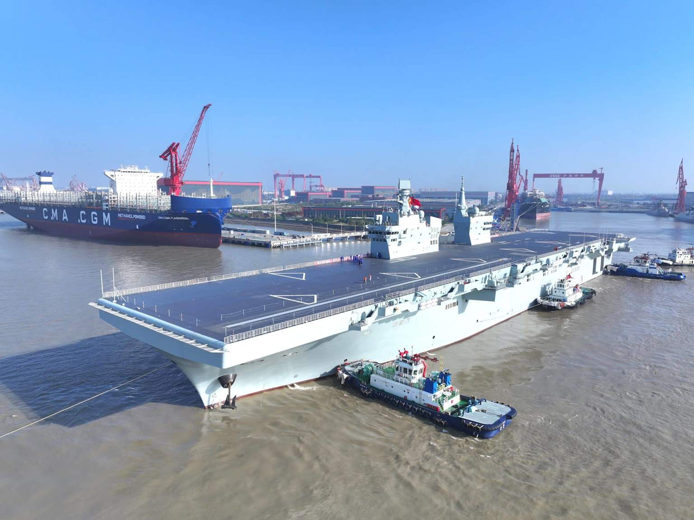
Type 076 Amphibious Carrier
The Type 076 is China's most advanced and largest amphibious warship, representing a generational leap over all predecessors. The *Sichuan* was launched in late December 2024 and completed its first sea trials beginning in November 2025. It is the world's largest amphibious assault ship, displacing over 40,000 metric tons with a flight deck spanning approximately 264 meters x 43 meters.[^1][^2][^3]

![Chinese Type 076 amphibious carrier Sichuan during sea trials]
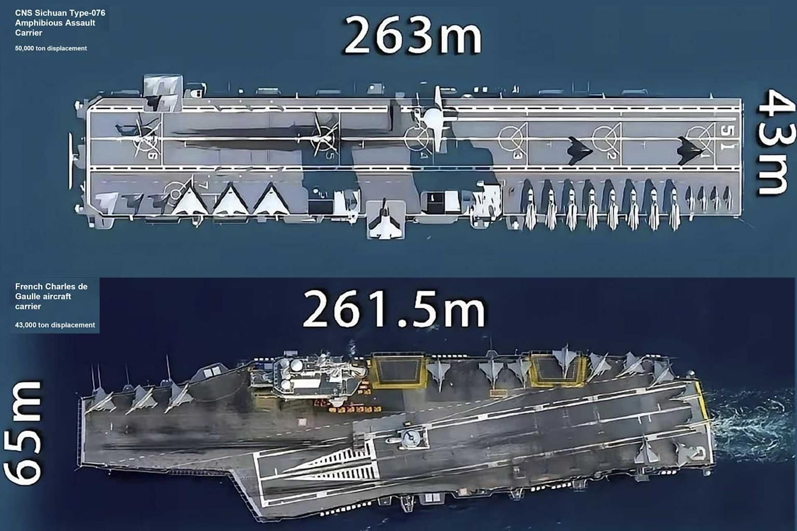
Aircraft carrier comparison graphic
**Key Differentiator:** Unlike any other amphibious assault ship in the world, the Type 076 features an **electromagnetic catapult system (EMALS)**, enabling launch of fixed-wing unmanned combat air vehicles (UCAVs) such as the GJ-11 stealth flying-wing drone. This makes it simultaneously a drone carrier, an amphibious command ship, and a special operations mothership.[^1][^3]

| Specification | Detail |
|---|---|
| **Displacement** | 40,000+ metric tons (full load) |
| **Length** | ~264 m (864 ft) |
| **Beam** | ~43 m (141 ft) |
| **Status** | Sea trials commenced Nov 2025[^3] |
| **Aircraft Capacity** | GJ-11 UCAVs, WZ-7 drones, helicopters (Z-20, Z-18), tiltrotor |
| **Well Deck** | Yes — floodable for Type 726 LCAC and amphibious vehicles[^2] |
| **Troop Capacity** | 1,000+ marines |
| **Catapult** | EMALS (electromagnetic) — world's first on an amphibious ship[^3] |
| **Self-Defense** | HHQ-10 SAM launchers, 30 mm CIWS (H/PJ-14) |
| **Special Role** | Unmanned systems mothership / joint command platform[^1] |

A size comparison showing the Type 076 against France's nuclear carrier (Charles de Gaulle):

![Type 076 size comparison with France's aircraft carrier]
---
### 1.2 Type 075 "Yushen" Class — LHD (4 in service)

Type 075 landing helicopter dock
The Type 075 is China's primary operational big-deck amphibious assault ship, closely analogous to the US Wasp class but with important differences. Four hulls are now in commission: *Hainan* (April 2021), *Guangxi* (December 2021), *Anhui* (October 2022), and a fourth hull.[^4][^5]

![Type 075 LHD of the PLAN at pier]
The ship displaces approximately 35,000–40,000 tons at full load and measures around 232–250 meters in length with a beam of 36.8 meters. A full-length flight deck with six helicopter landing spots and an estimated well deck enables simultaneous helicopter assault and hovercraft/vehicle launch.[^6][^7]

| Specification | Detail |
|---|---|
| **Displacement** | 35,000–40,000 tons (full load)[^7] |
| **Length** | ~232–250 m |
| **Speed** | ~23–24 knots |
| **Aircraft** | Up to 28–30 helicopters: Z-8, Z-18, Z-20 transport; Z-10 attack helicopters[^6][^7] |
| **Well Deck** | 2–3 Type 726 LCAC or landing craft utility (LCU)[^7] |
| **Vehicles** | ~60 armored fighting vehicles[^8] |
| **Troops** | 800–1,600 marines[^7] |
| **Self-Defense** | 2× HHQ-10 24-tube SAM launchers (FL-3000N); 2× H/PJ-14 11-barrel 30 mm CIWS[^8][^7] |
| **No fixed-wing** | Does NOT operate F-35B or equivalent; no ski-jump or catapult[^9] |

***
### 1.3 Type 071 "Yuzhao" Class — LPD (9 in service)
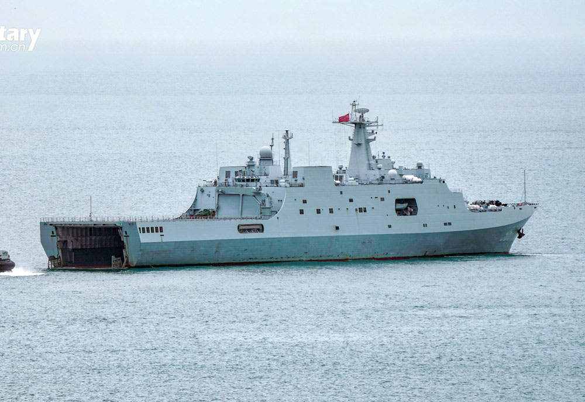
Amphibious transport dock
The Type 071 LPD was China's first modern amphibious transport dock with a floodable well deck, entering service in 2007. Nine hulls are operational. At 25,000 tons full load and 210 meters, it is roughly comparable to the US San Antonio class.[^10][^11]

![Type 071 Yuzhao-class LPD at sea]
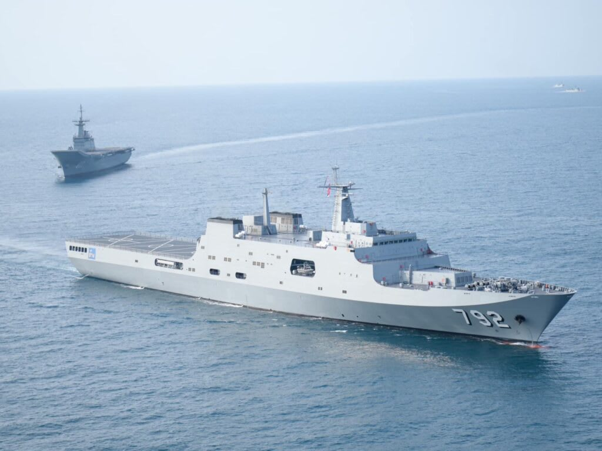
Type 071 amphibious ship
![Aerial view of Type 071 LPD (hull 732) underway]
| Specification | Detail |
|---|---|
| **Displacement** | 25,000 tons (full load)[^10] |
| **Length** | 210 m |
| **Speed** | 25 knots |
| **Range** | 10,000 nmi at 18 knots[^10] |
| **Troops** | 600–800 marines[^10][^12] |
| **Vehicles** | 60 armored fighting vehicles |
| **Well Deck** | 4× Type 726 LCAC[^11] |
| **Helicopters** | 4× Harbin Z-8 |
| **Main Gun** | 1× AK-176 76 mm naval gun |
| **CIWS** | 4× AK-630 30 mm close-in weapon systems[^10] |
| **Countermeasures** | 4× 18-tube Type 726-4 decoy/chaff launchers[^10] |
| **Note** | Hull 986 modified with laser directed energy weapon in 2024[^10] |

***
### 1.4 Type 072A "Yuting II / III" Class — LST (25+ in service)
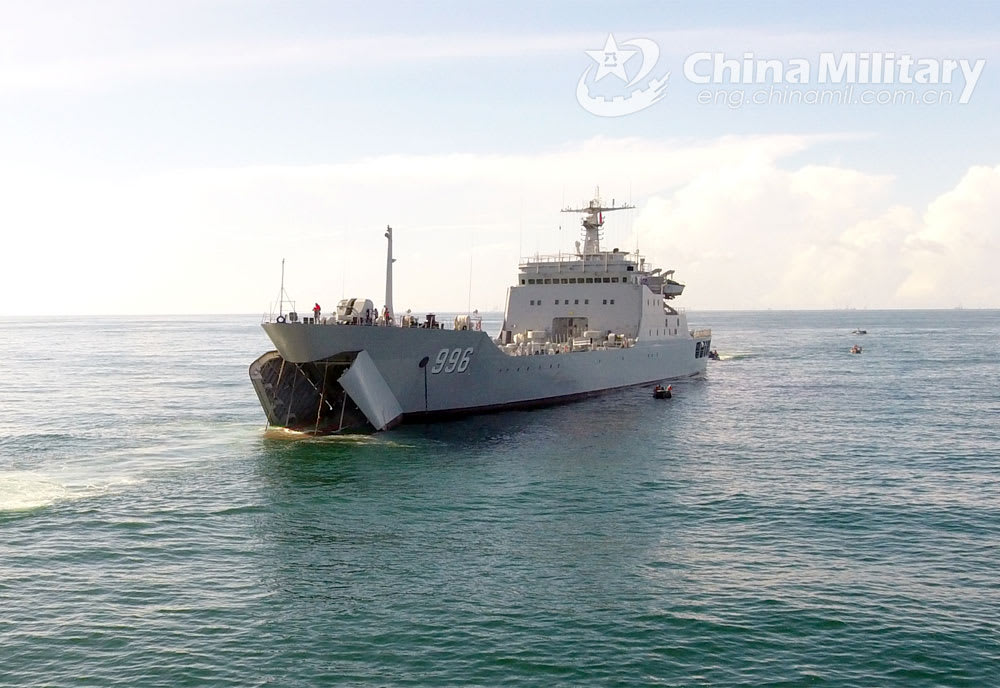
Type 072A Landing Ship
The Type 072A is a workhorse landing ship tank (LST), purpose-built for delivering tanks, heavy vehicles, and infantry directly onto beaches. Approximately 15 Type 072A and 15 Type 072III ships are in PLAN service. These ships are critical to any Taiwan landing operation, providing the mass sealift for armored formations.[^13][^14]

![Type 072A Landing Ship Tank at sea with bow ramp]
| Specification | Type 072A | Type 072III |
|---|---|---|
| **Displacement** | 4,800–5,000 tons (full) | 4,800 tons (full)[^14] |
| **Length** | 120 m | 119.5 m |
| **Speed** | 17–18 knots | 18 knots |
| **Range** | 3,000 nmi | 3,000 nmi[^14] |
| **Troops** | 250 fully armed | 250 troops[^15] |
| **Vehicles** | 10 tanks + 4 landing craft | 10 tanks or 500 tons cargo[^14] |
| **Armament (Batch 1)** | 37mm twin autocannon | 3× 37mm twin guns[^14] |
| **Armament (Batch 2)** | H/PJ-17 30 mm autocannon[^15] | — |
| **Helicopter** | Helipad for 2× Z-8 or Z-9 (no hangar)[^15] | Platform only |

***
### 1.5 Type 726 "Yuyi" Class LCAC — Hovercraft (40+ units)
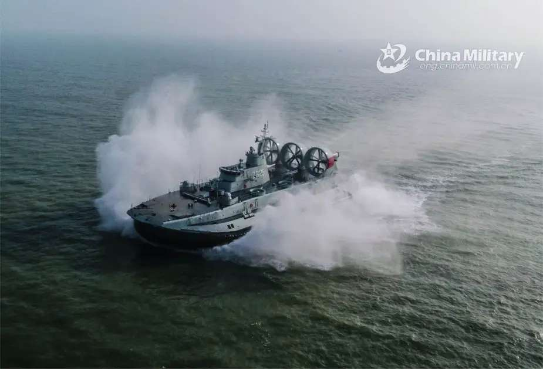
Landing craft air cushion
The Type 726 is China's primary LCAC (Landing Craft Air Cushion), analogous to the US Navy's LCAC. Approximately 40+ units are believed to be in service. Up to four can be carried in the well deck of each Type 071 LPD and Type 075 LHD.[^11][^16]

![Type 726 LCAC conducting high-speed beach landing training]
| Specification | Detail |
|---|---|
| **Normal Displacement** | 150 tons |
| **Full Load Displacement** | 160 tons[^16] |
| **Length** | 33 m |
| **Beam** | 16.8 m |
| **Propulsion** | 2× gas turbines |
| **Payload** | 1 MBT (e.g., Type 96 tank) or 4 armored vehicles[^16] |
| **Speed** | Estimated ~50 knots (speed not officially confirmed) |
| **Note** | Larger troop compartment than US LCAC; includes dedicated infantry transport module[^17] |

***
### 1.6 "Shuiqiao" Class — Offshore Landing Bridge Ships (LPUs) ⚠️ CRITICAL NEW CAPABILITY
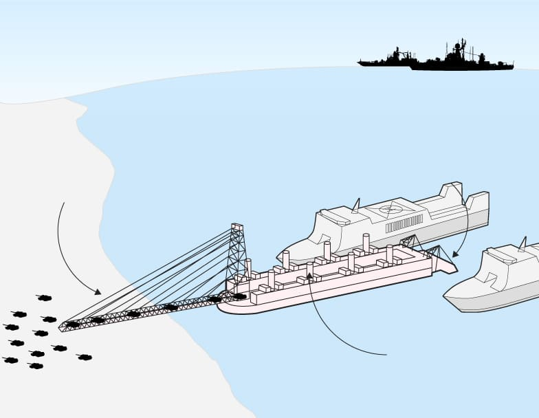
Amphibious invasion barges
This is China's most strategically significant new amphibious asset and the one most likely to determine operational success or failure in a Taiwan scenario. The *Shuiqiao* (水桥, "water bridge") class self-propelled landing platform utility (LPU) barges were developed by COMEC (CSSC Offshore & Defense Engineering Company) at Guangzhou Shipyard International (GSI), Longxue Island, Guangdong Province.[^18][^19]

At least two full sets (6+ barges) have been observed, with at least three more under construction as of July 2025. The first set conducted sea trials in March 2025, forming a full-length composite pier near Zhanjiang, Guangdong — headquarters of the Southern Theater Command Navy.[^20][^21][^18]

![Shuiqiao landing bridge system operational concept diagram]
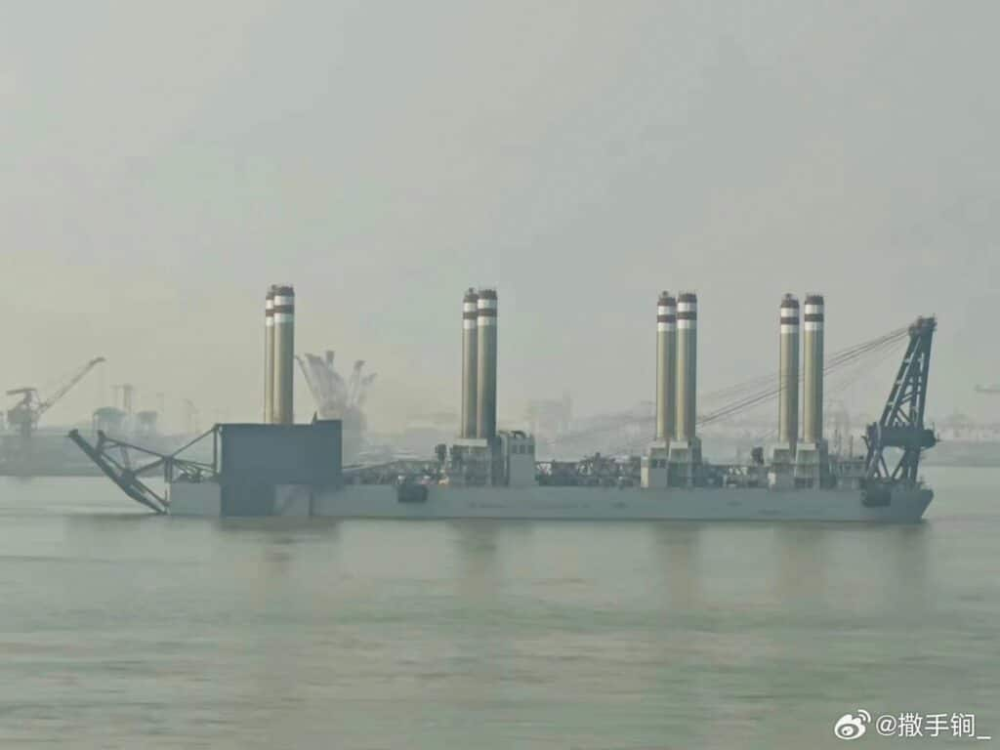
Chinese Amphibious Bridging Ship
![Shuiqiao barge photographed at shipyard with bridging equipment visible]
#### How the Shuiqiao System Works

Three variants link together end-to-end to form a single continuous 820-meter (2,690 ft / 7.5 football fields) relocatable causeway extending from deep water to the shoreline:[^19][^22]

1. **Shuiqiao-185** (seaward end) — the largest unit, docks with arriving RO-RO ferries and Type 072 LSTs via its stern ramp and two lateral ramps
2. **Shuiqiao-135** (middle section) — connects the outer and inner units via Bailey bridge extensions, with side ramps for additional ship-docking
3. **Shuiqiao-110** (shore end) — the shallowest-draft unit, connects directly to the beach, coastal road, or seawall

Each barge is self-propelled (with bow radars, pilothouses, and exhaust stacks observed in satellite imagery) and can anchor itself to the seabed using jack-up "spud" legs — retractable pilings that push down into the seabed and lift the hull above wave action, similar to offshore oil platform technology.[^23][^24][^19]

#### Detailed Specifications by Variant

| Specification | Shuiqiao-110 | Shuiqiao-135 | Shuiqiao-185 |
|---|---|---|---|
| **Hull Length (bridge stowed)** | 110 m (361 ft)[^25] | 135 m (443 ft)[^25] | 185 m (607 ft)[^25] |
| **Beam** | 38 m (125 ft)[^25] | 36 m (118 ft)[^25] | 36 m (118 ft)[^25] |
| **Draft** | ~2 m or less (6 ft)[^25] | ~4 m (13 ft)[^25] | ~4 m (13 ft)[^25] |
| **Jack-up Legs** | 4 legs (short, shallow water)[^23] | 6 legs (164 ft tall)[^26] | 8 legs (180 ft tall)[^26] |
| **Max Seabed Depth** | Shallow only | Moderate | ~32 m (105 ft)[^24] |
| **Bailey Bridge Length** | ~140 m extendable[^23] | ~140 m extendable[^23] | ~140 m extendable[^23] |
| **Side Ramps** | None[^19] | 2 (port + starboard)[^23] | 2 (plus stern ramp)[^25] |
| **Ship Docking Points** | Shore connection only | 2 ferry berths[^24] | 3 ferry berths (sides + stern)[^24] |
| **Propulsion** | Waterjet (suspected)[^23] | Propellers + rudders[^23] | Propellers + rudders[^23] |
| **AIS Transmitting** | No — haze gray painted, military[^20] | No | No |
| **Role** | Beach/road connection; shallowest water bridging | Middle causeway section | Seaward anchor; primary vehicle transfer hub |

#### Combined System Capabilities

When all three variants link up in their standard end-to-end formation:

| Combined System Metric | Value |
|---|---|
| **Total causeway length** | ~820 m (2,690 ft)[^18][^19] |
| **Total ship docking points** | 5 simultaneous RO-RO/LST berths[^19][^24] |
| **Bridge lane width** | 6 meters — accommodates vehicles up to 50-ton MBTs[^24] |
| **Vehicle throughput** | 150 vehicles (heavy arms battalion) in 40–60 minutes[^24][^27] |
| **Vehicle types supported** | Light tactical trucks → Type 99A MBTs and ZTZ-15 tanks[^24] |
| **Weather stability** | Jack-up legs absorb wave action; can operate in moderate seas[^19] |
| **Ballast capability** | Shuiqiao-110 can flood aft tanks to raise bow and beach itself[^25] |

#### Why This Changes the Calculus

Taiwan's coastline is notoriously unfavorable for amphibious landings. Approximately 90% of the coast is characterized by rocky cliffs, steep sea walls, or narrow beaches dominated by surf, restricting viable landing zones to perhaps 13 beaches with hard sand suitable for standard LSTs — all of which are heavily fortified. The Shuiqiao system demolishes this defensive advantage:[^5][^19]

- **Extends the bridge over seawalls, rocky shores, and mined beaches** — the 120–140 m Bailey bridge reaches far beyond obstacles to deliver vehicles directly onto coastal roads[^28][^19]
- **Multiplies viable landing sites** from ~13 to dozens of previously unsuitable coastline segments[^29][^19]
- **Self-contained logistics hub**: each formation can simultaneously dock 5 ships from deep water, eliminating the need for dedicated port facilities
- **D-Day parallel**: Andrew Erickson (US Naval War College) describes the system as a "direct echo of the US Mulberry Harbors used at Normandy in 1944 — but faster, self-propelled, and redeployable"[^20][^19]

#### Vulnerabilities

The Shuiqiao system is not invulnerable. Key weaknesses include:
- Slow transit speed (self-propelled but not fast) — vulnerable during approach
- No self-defense weapons observed — entirely dependent on naval/air escort
- Once jack-up legs are deployed, the barge cannot maneuver
- A single well-aimed anti-ship missile or artillery round can disable a causeway section
- Vulnerable to underwater demolition by ROC/US combat swimmers, mines, and UUVs[^24][^5]

***
### 1.7 Roll-On/Roll-Off (RO-RO) Civilian Dual-Use Ferries

Tank unloading from ship
China's largest and most underappreciated amphibious asset is its civil-military dual-use RO-RO fleet. In September 2022, satellite imagery captured the exercise showing the *Bo Hai Heng Tong*, a 15,000-ton RO-RO vessel, launching ZTD-05 amphibious assault vehicles and military equipment from a civilian car ferry during live drills.[^30]

![Tank offloading from Chinese RO-RO ferry during military exercise]

Ship route map
![Chinese RO-RO ship route data crossing Taiwan Strait]
| Feature | Detail |
|---|---|
| **Key Vessel** | *Bo Hai Heng Tong* (example); 15,000+ tons |
| **Internal Lane** | 1.6 miles of vehicle lanes across 3 decks[^30] |
| **Vehicle Capacity** | ~3× the vehicle capacity of a US San Antonio-class LPD[^30] |
| **Launched** | 2020, CIMC Raffles shipyard, Yantai — described as largest multipurpose RO-ROs in Asia[^30] |
| **Helicopter Deck** | Large flight deck integrated into design[^30] |
| **Military Use** | Can launch ZTD-05 amphibious tanks at sea; directly loads main battle tanks[^30][^31] |
| **Shuiqiao Integration** | Designed to dock with Shuiqiao-135/185 lateral ramps; civilian RO-ROs in China are systematically built to Chinese standards to support heavy MBT loading[^24] |
| **Civil-Military Fusion** | Hundreds of commercial RO-RO vessels in Chinese coastal fleet can be rapidly requisitioned[^32] |
| **Vulnerability** | Slow, lightly defended; critically dependent on escort ships and air cover[^5] |

Analysts assess that civilian sealift — not dedicated naval amphibious ships — will provide the majority of required lift capacity in any Taiwan invasion, with the Shuiqiao system serving as the critical interface between these civilian vessels and the Taiwanese shoreline.[^24][^30][^32]

***
## PART II: US / ALLIED AMPHIBIOUS FORCES
### 2.1 America Class (LHA-6/7) — US Navy (2 operational + building)
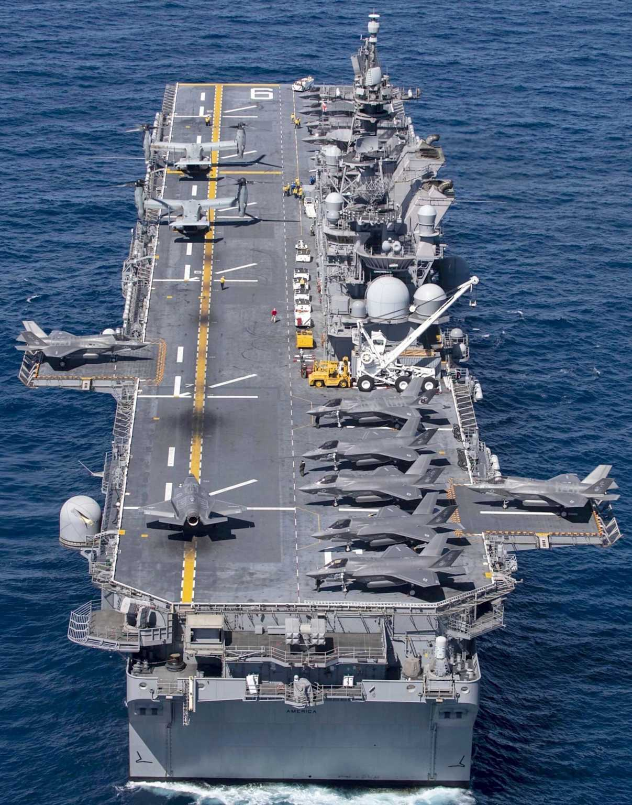
America-class amphibious assault ship
The America class is the US Navy's newest and most capable big-deck amphibious assault ship. *USS America* (LHA-6) and *USS Tripoli* (LHA-7) are in service; *Bougainville* (LHA-8) is under construction.[^33]

![America-class LHA with F-35Bs on deck]
| Specification | Detail |
|---|---|
| **Displacement** | 45,693 tons (full load)[^34] |
| **Length** | 257 m (844 ft)[^33] |
| **Beam** | 32 m |
| **Speed** | 20+ knots |
| **Cost** | ~$3.4 billion per unit[^34] |
| **Aircraft (Flight 0)** | F-35B Lightning II (stealth), AV-8B Harrier, MV-22B Osprey, CH-53E Super Stallion, AH-1Z Viper, UH-1Y Venom[^33] |
| **Aviation Focus** | Flight 0 has NO well deck — aviation-dominant design; Flight I restores well deck[^33] |
| **Armament** | 2× Mk.29/RAM launchers (RIM-116); 2× Mk.49 (ESSM); 2× 20mm Phalanx CIWS; 3× Mk.38 25mm MGS; 7× twin .50 cal[^33][^34] |
| **Key Advantage** | Carries F-35B — the only amphibious ship in the world doing so operationally; provides organic 5th-gen CAS and ISR[^9] |

***
### 2.2 Wasp Class (LHD-1 through LHD-8) — US Navy (7–8 operational)
The Wasp class is the backbone of US big-deck amphibious power, with 7–8 hulls in service. *USS Wasp* (LHD-1) received a 5-year service life extension to 2034 in 2026.[^35][^34]

| Specification | Detail |
|---|---|
| **Displacement** | 41,150 tons (full load)[^34] |
| **Length** | 257 m |
| **Speed** | 22 knots[^34] |
| **Range** | 9,500 nmi at 18 knots[^34] |
| **Troops** | Up to 2,000 Marines[^36] |
| **Aircraft** | F-35B, AV-8B, MV-22 Osprey, CH-53E, AH-1Z, UH-1Y |
| **Well Deck** | Yes — supports 3× LCAC or 12× AAV[^34] |
| **Armament** | 2× RIM-116 RAM; 2× RIM-7 Sea Sparrow; 3× 20mm Phalanx CIWS; 4× Mk.38 25mm MGS; .50 cal MGs[^34] |
| **Hospital** | 600-bed hospital, 6 operating rooms[^36] |
| **Cost** | ~$2.3 billion per unit[^34] |

***
### 2.3 San Antonio Class (LPD-17) — US Navy (11+ in service)
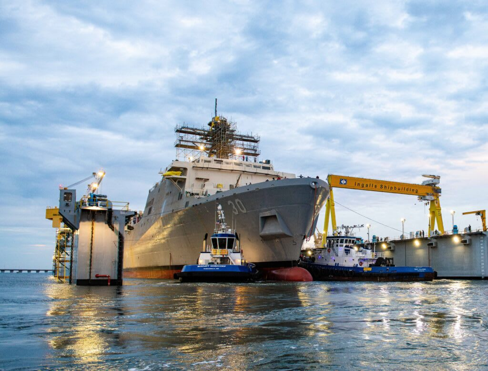
Amphibious transport dock ship
The San Antonio class is the primary US amphibious transport dock, directly comparable in role to the PLAN Type 071. Eleven Flight I ships have been commissioned; a Flight II variant is in production.[^37]

![USS San Antonio class LPD in dry dock]
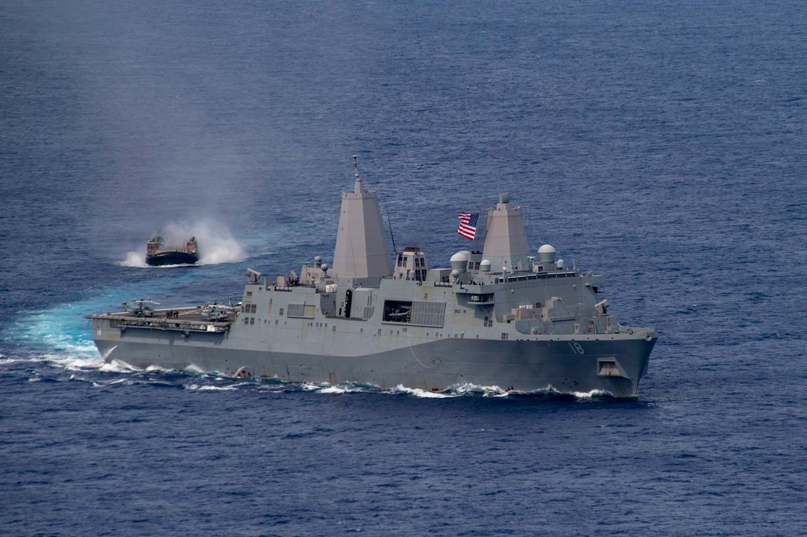
Amphibious warship at sea
![San Antonio-class LPD underway at sea]
| Specification | Detail |
|---|---|
| **Mission** | Transport Marines + equipment via LCAC, AAV, MV-22[^38] |
| **Armament** | 2× Mk.46 30 mm guns (fore/aft); 2× RAM launchers; 10× .50 cal MGs[^38] |
| **Aircraft** | 2× CH-53E or MV-22 Osprey or 4× AH-1Z/UH-1Y/MH-60 helicopters[^38] |
| **Landing Craft** | 2× LCAC or 1× LCU; 14× AAV[^38] |
| **Marines** | 700+ troops |
| **VLS Note** | Space and weight reserved for future Mk.41 16-cell VLS installation[^39] |

***
### 2.4 US Navy LCAC / Ship-to-Shore Connector (SSC)
The US LCAC is the gold-standard hovercraft for amphibious operations, with the newer Ship-to-Shore Connector (SSC) now entering service.[^40]

| Specification | LCAC | SSC (New) |
|---|---|---|
| **Length** | 91 ft 9.5 in (28 m)[^41] | Similar |
| **Beam** | 48 ft 4 in (14.7 m)[^41] | |
| **Speed** | 40+ knots with full load[^41] | Improved |
| **Payload** | 60 tons (75 ton overload)[^41] | 74 tons[^40] |
| **Range** | 200 miles at 35 kts with 50-ton load[^41] | |
| **Propulsion** | 4× gas turbines, 16,000 hp[^41] | |
| **Crew** | 5 (legacy); 4 (SSC)[^40][^41] | |
| **Armament** | M2HB .50 cal; M240 7.62mm; Mk.19 40mm grenade launcher[^41] | |
| **Capacity** | M-1 Abrams MBT + personnel[^41] | |

***
## PART III: PRINCIPAL SURFACE COMBATANTS
### 3.1 PLAN Surface Combatants
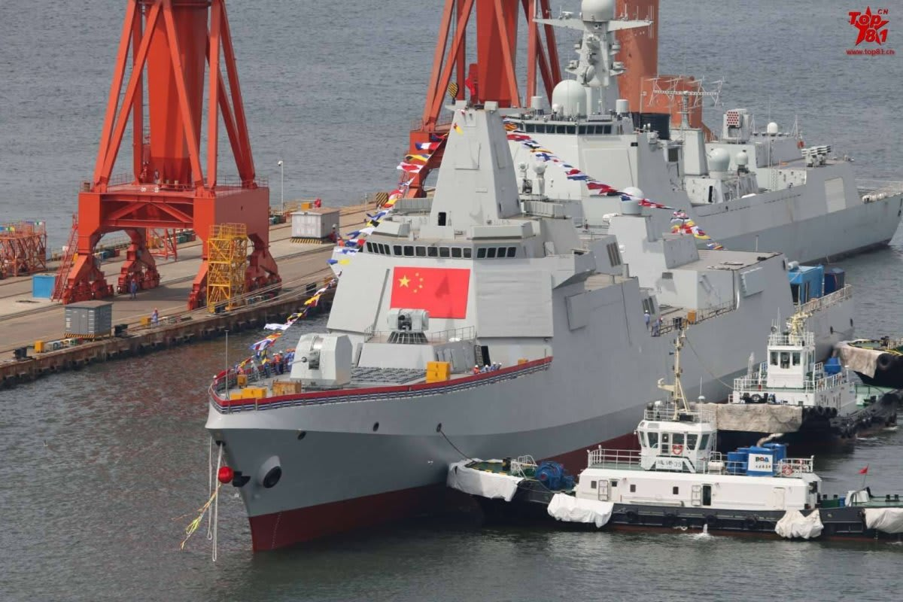
Type 055 warships
#### Type 055 "Renhai" Class — Guided-Missile Destroyer/Cruiser (8 in service)

NATO/OSD classifies the Type 055 as a cruiser due to its size and capabilities. It displaces 11,000–13,000 tons and carries 112 VLS cells.[^42][^43]

![PLAN Type 055 destroyers at harbor]
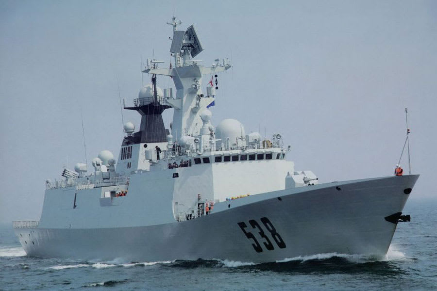
Type 054A Frigate
| Specification | Detail |
|---|---|
| **Displacement** | 11,000–13,000 tons (full load)[^42] |
| **Length** | 180 m |
| **Speed** | 30+ knots |
| **Range** | 5,000 nmi at 12 knots[^42] |
| **VLS Cells** | 112 (64 forward + 48 aft)[^42][^43] |
| **Anti-Ship** | YJ-18A (range: 220–540 km, terminal sprint Mach 2.5–3.0)[^44]; YJ-20 and YJ-21 anti-ship ballistic missiles (speed: up to Mach 10 terminal)[^42][^45] |
| **Land Attack** | CJ-10 land-attack cruise missile[^42] |
| **AAW** | HHQ-9B SAM (range: 185 km / ~100 nmi)[^45]; HHQ-10 CIWS (range: ~9 km) |
| **ASW** | Yu-8 anti-submarine rocket (ASROC) from VLS; Yu-7 torpedoes (324 mm tubes)[^43][^45] |
| **Main Gun** | H/PJ-38 130 mm dual-purpose[^43] |
| **CIWS** | H/PJ-11 30 mm, 11-barrel Gatling[^42] |
| **Radar** | 4× Type 346B AESA phased array (L-band + X-band)[^43] |

#### Type 052D "Luyang III" Class — Destroyer (25+ in service)

The Type 052D is the most numerous modern PLAN destroyer, with 25+ hulls in service and more building. It carries 64 VLS cells.[^46]

| Specification | Detail |
|---|---|
| **Displacement** | 7,500–7,700 tons (full load)[^47] |
| **Length** | 156–157 m |
| **Range** | 4,500 nmi at 15 knots[^47] |
| **VLS Cells** | 64 cells[^46] |
| **Anti-Ship** | YJ-18 ASCM (range: 220–540 km)[^44] |
| **Land Attack** | CJ-10 LACM[^46] |
| **AAW** | HHQ-9/HHQ-9B SAM (range: ~100–200 km)[^46] |
| **ASW** | CY-5 anti-submarine missiles; torpedo tubes[^47] |
| **Main Gun** | H/PJ-45 130 mm (range: ~30 km)[^46] |
| **CIWS** | Type 730 30 mm Gatling + HHQ-10 24-cell SAM[^47] |

#### Type 054A "Jiangkai II" Class — Frigate (30+ in service)

![Type 054A Jiangkai II frigate at sea]
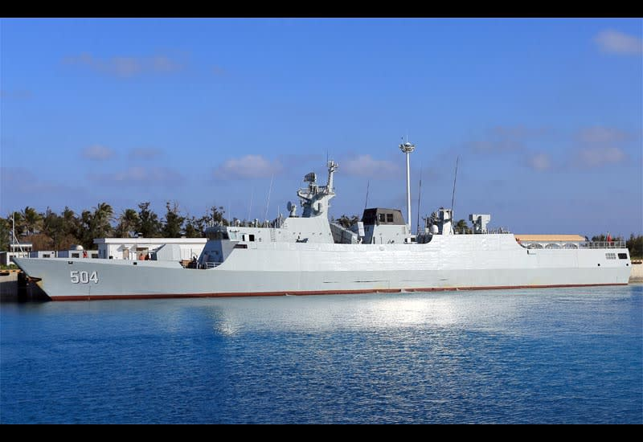
Type 056 corvette
| Specification | Detail |
|---|---|
| **Displacement** | ~4,000 tons |
| **VLS** | 32-cell; HHQ-16 medium-range SAM (range: ~70 km) |
| **Anti-Ship** | YJ-83 (range: ~180 km) |
| **ASW** | Towed array sonar; Yu-7 torpedoes; Z-9 helicopter[^48] |
| **CIWS** | AK-630 30 mm; AK-176 76 mm gun[^48] |
| **Range** | 3,800 nmi at 18 knots[^48] |

#### Type 056/056A "Jiangdao" Class — Corvette (60+ in service)

![Type 056A Jiangdao corvette (hull 501) at sea]
| Specification | Detail |
|---|---|
| **Displacement** | 1,500 tons[^49] |
| **Anti-Ship** | 4× YJ-83 pod launchers (range: ~180 km)[^49] |
| **AAW** | HHQ-10 8-cell SAM launcher[^49] |
| **ASW (056A)** | 2× triple 324 mm torpedo tubes; variable depth + towed array sonar[^48] |
| **Gun** | H/PJ-26 76 mm[^49] |
| **Role** | Littoral combat, escort, ASW, blockade enforcement[^48] |

***
### 3.2 US/Allied Surface Combatants

USS Arleigh Burke (DDG 51)
#### Arleigh Burke Class (DDG-51) — US Navy Destroyer (70+ in service)

The Arleigh Burke class is the world's most numerous and combat-proven destroyer, equipped with the Aegis Combat System and over 90-cell VLS capacity.[^50][^51]

![Arleigh Burke-class destroyer at sea]
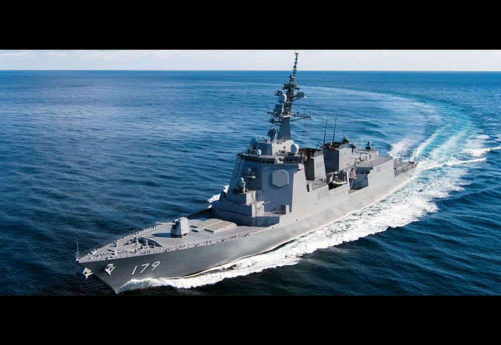
Guided-missile destroyer
| Specification | Detail |
|---|---|
| **Displacement** | ~9,700 tons (Flight IIA full load) |
| **Speed** | 30+ knots |
| **VLS Cells** | 96 cells (Flight IIA/III) Mk.41 VLS |
| **Tomahawk** | 56–90+ BGM-109 Tomahawk (range: 2,500 km, subsonic, GPS/TERCOM guided)[^50][^51] |
| **Anti-Ship** | RGM-84 Harpoon (range: 130 km) on equipped ships; Tomahawk Block V (maritime strike)[^51] |
| **AAW** | SM-2 Block IV (range: 150 km); SM-3 (range: 700 km ballistic intercept)[^51]; SM-6 (range: 240 km, multi-role A2/A2/ABM)[^51] |
| **ESSM** | RIM-162 ESSM (range: ~50 km) |
| **ASW** | RUM-139 VL-ASROC (range: 22 km to torpedo delivery)[^51]; Mk.46/Mk.54 torpedoes; towed sonar array[^51][^52] |
| **CIWS** | Mk.15 Phalanx 20 mm (some upgraded to RAM) |
| **Gun** | Mk.45 5-inch/62 (range: 24 km standard; 37 km with HVP guided)[^51] |
| **Aegis** | AN/SPY-1D(V) phased array radar; cooperative engagement capability (CEC) |

#### JMSDF Maya Class — Japan's Most Advanced Aegis Destroyer

![JMSDF JS Maya (DDG-179) at sea]
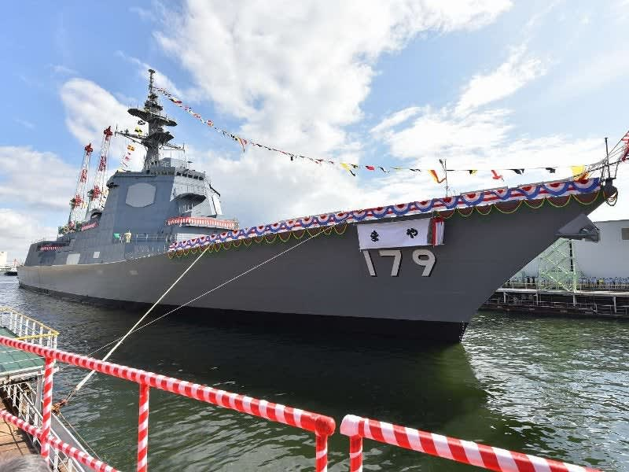
Maya-class destroyer (179)
![Maya-class destroyer docked at port with flags]
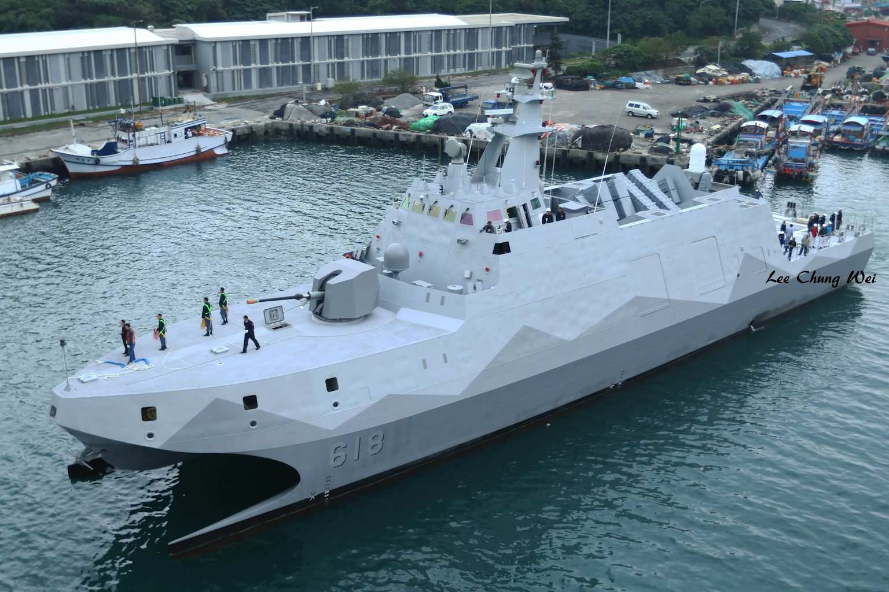
Tuo Chiang-class corvette
| Specification | Detail |
|---|---|
| **Platforms** | 2× Maya-class (Mk.41 VLS, SM-6); 2× Atago-class (Mk.41, SM-3); 4× Kongō-class Aegis DDGs |
| **Armament** | SM-2, SM-3, SM-6, VL-ASROC, Tomahawk (being fielded)[^53] |
| **Type 12 Kai** | Extended-range version: 900–1,200 km range; can threaten PLAN ships across East China Sea[^53] |
| **Submarines** | Taigei-class SSK: 6× 533 mm torpedo tubes; HU-606 torpedoes + UGM-84 Harpoon; future sub-launched cruise missile[^53] |
| **Role** | Integrated into US carrier strike group aegis picket; anti-ballistic missile defense; first island chain interdiction[^53][^54] |

#### Taiwan (ROC) Navy

Taiwan operates a layered defensive fleet optimized for Taiwan Strait denial operations.

| Platform | Armament | Range |
|---|---|---|
| **Keelung-class destroyer (4)** | SM-2 (range: ~90 nmi); Hsiung Feng II & III ASMs; ASROC | [^55] |
| **Cheng Kung-class frigate (8)** | SM-2; Hsiung Feng II (range: 150 km); HF-III (range: 120–400 km)[^56]; ASROC | |
| **Tuo Chiang-class corvette (3+)** | 16× HF-2 + HF-3 ASMs; TC-2N SAMs; top speed 43 knots[^57] | |
| **Kang Ding-class frigate (6)** | Exocet MM40; Mistral SAM | |
| **New Light Frigate** | HF-3 ASM; Phalanx CIWS; ARTISAN radar; TC-2N SAMs; towed sonar[^58] | |

Taiwan's Tuo Chiang-class "carrier killer" corvette with 16 anti-ship missiles:

![Taiwan Tuo Chiang-class corvette from above at harbor]
**Key Taiwan Asset — Hsiung Feng III (HF-3):**
- Speed: Mach 3.5 terminal phase[^56][^59]
- Range: 120–150 km (standard); 400 km (extended range "ER" variant)[^60][^56]
- Guidance: INS + active radar seeker with ECCM[^61]
- Deployment: Destroyers, corvettes, frigates, shore batteries, air-launched from F-CK-1 IDF[^60]
- Warhead: 225 kg semi-armor-piercing, self-forging fragment[^56]
- Role: "Carrier killer" — high terminal speed reduces enemy reaction time to near zero[^60]

***
## PART IV: SUBMARINE FORCES
### 4.1 PLAN Submarine Fleet
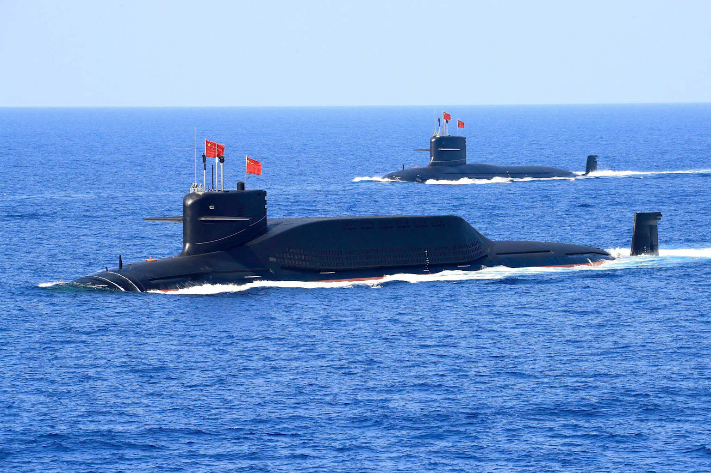
Type 094 submarine
China operates approximately 60 submarines across multiple classes, forming the most numerically significant undersea force in the Pacific after the United States.[^62]

#### Type 094 "Jin" Class — SSBN (6 operational)

![Type 094 Jin-class SSBN at sea]
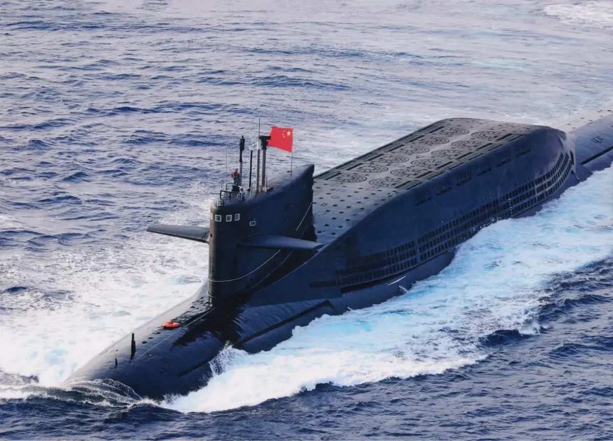
Type 094 submarine
![Type 094 viewed from above surface]
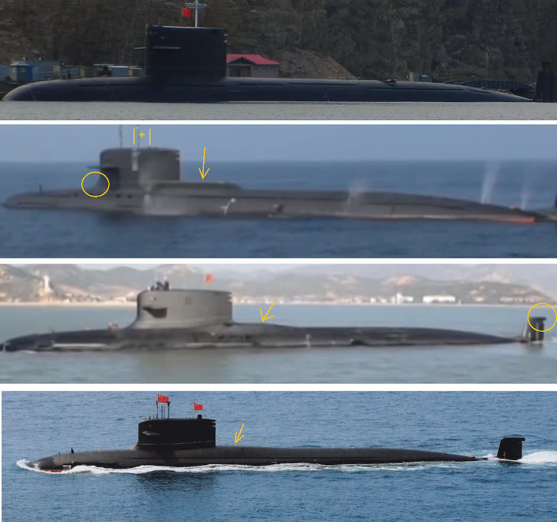
Type 093 Shang-class submarine
| Specification | Detail |
|---|---|
| **Type** | Nuclear ballistic missile submarine (SSBN) |
| **Displacement** | ~11,000 tons (submerged)[^63] |
| **Length** | 135 m[^63] |
| **Speed** | 20+ knots submerged |
| **Missiles** | 12× JL-2 SLBM (range: 7,400–9,000 km) or JL-3 SLBM (range: 10,000–12,000 km)[^63][^64][^65] |
| **Warheads** | 1 warhead per JL-2; multi-MIRV capability on JL-3 |
| **Role** | Nuclear deterrence; second-strike capability against Hawaii, Guam, Alaska (JL-2); CONUS (JL-3)[^64] |
| **Limitation** | High acoustic signature — noisier than US Los Angeles class; detected more easily[^64] |
| **Patrols** | Nuclear deterrent patrols since December 2015[^65] |

#### Type 093/093A/093B "Shang" Class — SSN (6–14 operational)

![Type 093 Shang-class SSN collage from Covert Shores]
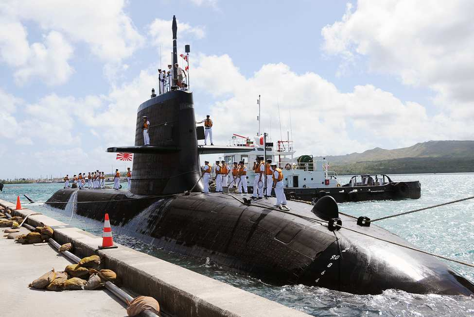
Yuan-class submarine
| Specification | Detail |
|---|---|
| **Type** | Nuclear-powered attack submarine (SSN) |
| **Displacement** | ~7,000 tons (submerged)[^66][^67] |
| **Length** | 110–108.5 m |
| **Speed** | 28–30 knots submerged[^68] |
| **Range** | Unlimited (nuclear) |
| **Torpedo Tubes** | 6× 533 mm bow tubes[^66] |
| **Anti-Ship** | YJ-18/YJ-18B (range: 220–540 km, Mach 2.5–3.0 terminal)[^44] |
| **Land Attack** | CJ-10 LACM (via VLS on 093B variant)[^66][^69] |
| **VLS** | Type 093B hump behind sail accommodates VLS for YJ-18 and CJ-10[^66] |
| **Mines** | 36 mines as alternative load[^66] |
| **Role** | Anti-surface/anti-submarine warfare; blue-water patrol; land attack[^66][^67] |

#### Type 039A/B/C "Yuan" Class — SSK/AIP (21+ operational)

The Yuan class is the backbone of China's conventional submarine force and features air-independent propulsion (AIP) for extended submerged endurance without snorkeling.[^70][^71]

![Yuan-class Type 039C submarine at pier with crew]
| Specification | Detail |
|---|---|
| **Type** | Diesel-electric AIP attack submarine (SSP) |
| **Displacement** | ~3,950 tons (submerged)[^72] |
| **Speed** | 20 knots submerged |
| **Endurance** | 7,500 nmi on snorkel; 45 days[^72] |
| **Torpedo Tubes** | 6× 533 mm[^70] |
| **Anti-Ship** | YJ-18B ASCM (range: ~290 nmi / 540 km)[^73]; YJ-82 (range: ~30–42 km legacy)[^71] |
| **Torpedoes** | Yu-6 thermal-powered; electric wire-guided dual-purpose[^73] |
| **Mines** | Naval mines as alternative load[^73] |
| **AIP Advantage** | Can remain submerged far longer than non-AIP diesels; very quiet during AIP operations |

***
### 4.2 US Submarine Forces

Virginia-class submarine
#### Virginia Class (Block V) — SSN (35+ in commission)

![Virginia-class submarine at sea]
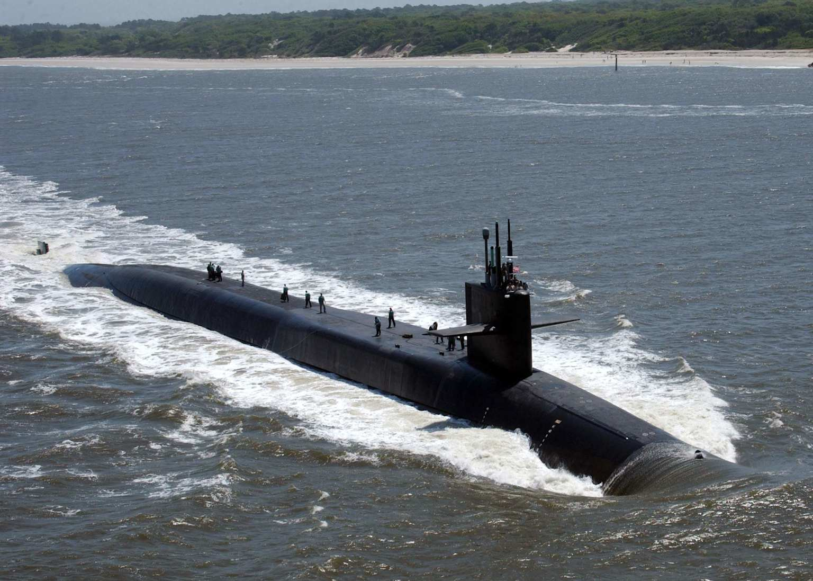
Ohio-class submarine
| Specification | Detail |
|---|---|
| **Type** | Nuclear fast-attack submarine (SSN) |
| **Displacement** | 7,700 tons (submerged)[^74] |
| **Length** | 377 ft (115 m)[^74] |
| **Speed** | 25+ knots[^74] |
| **Torpedo Tubes** | 4× tubes[^75] |
| **VPM (Block V+)** | 4 additional payload tubes, each carrying 7× Tomahawk = +28 missiles[^76] |
| **Total Weapons** | Up to 65+ weapons (Tomahawks + Mk.48 torpedoes + mines)[^76] |
| **Tomahawk** | BGM-109 range: 2,500 km; Block V adds maritime strike anti-ship mode[^76] |
| **Torpedoes** | Mk.48 ADCAP heavyweight (anti-ship + anti-submarine)[^74] |
| **Mines** | Mk.60 CAPTOR; Hammerhead advanced mobile mine; Clandestine Delivered Mine[^74][^76] |

#### Ohio Class SSGN (4 converted — SSGNs 726–729)

![Ohio-class SSGN at sea]
Four Ohio-class submarines were converted from SSBNs to SSGNs (guided-missile submarines), each capable of carrying 154 Tomahawk cruise missiles in their converted missile tubes. Each SSGN is a formidable deep-strike platform capable of devastating a PLAN amphibious fleet from stand-off range.

| Specification | Detail |
|---|---|
| **Tomahawk capacity** | 154× BGM-109 Tomahawk per hull |
| **Range** | 2,500 km per missile |
| **Torpedoes** | 4× Mk.48 ADCAP |
| **Special Ops** | 66 SOF personnel; 2 dry deck shelters |

#### Seawolf Class — SSN (3: SSN-21, 22, 23)

The Seawolf is the quietest and most lethal hunter-killer submarine ever built.[^77][^78]

| Specification | Detail |
|---|---|
| **Torpedo Tubes** | 8× 660 mm (double the Los Angeles/Virginia)[^78] |
| **Weapons Load** | Up to 50 weapons (torpedoes + Tomahawk missiles)[^77][^78] |
| **Speed** | 35 knots submerged[^79] |
| **Key Advantage** | Extreme quietness; superior ASW capability; biggest weapons load of any US SSN |

#### Japan JMSDF — Taigei/Soryu/Oyashio Class SSK

Japan operates 22 submarines — the second-largest non-nuclear submarine force among US allies.[^80]

| Class | Key Features |
|---|---|
| **Taigei (newest)** | 6× 533 mm torpedo tubes; Type 18 heavyweight torpedo; future sub-launched cruise missile[^53] |
| **Soryu** | AIP-equipped; 6× 533 mm; UGM-84 Harpoon; one of quietest SSKs in the world[^80] |
| **Oyashio** | 6× 533 mm; Type 89 torpedoes; UGM-84 Harpoon[^80] |

***
## PART V: COMPREHENSIVE SIDE-BY-SIDE COMPARISON TABLES
### 5.1 Big-Deck Amphibious Assault Ships
| Feature | Type 076 (PLAN) | Type 075 (PLAN) | America LHA (USN) | Wasp LHD (USN) |
|---|---|---|---|---|
| **Status** | Sea trials 2025[^3] | 4 operational[^4] | 2 operational[^33] | 7–8 operational[^34] |
| **Displacement** | 40,000+ tons[^3] | 35,000–40,000 tons[^7] | 45,693 tons[^34] | 41,150 tons[^34] |
| **Length** | 264 m[^3] | 232–250 m[^7] | 257 m[^33] | 257 m |
| **Speed** | Unknown | 23–24 kts[^7] | 20+ kts[^33] | 22 kts[^34] |
| **Troops** | 1,000+ | 800–1,600[^7] | 1,687 Marines[^33] | 2,000 Marines[^36] |
| **Fixed-Wing** | UCAVs (GJ-11) via EMALS[^3] | None | F-35B[^33] | F-35B |
| **Helicopters** | 30+ (Z-20, Z-18 + drones)[^1] | 28–30 (Z-8, Z-18, Z-20)[^6] | Mix per mission | Mix per mission |
| **Well Deck** | Yes (LCAC + vehicles)[^2] | Yes (2–3 LCAC)[^7] | Flight 0: No; Flight I: Yes[^33] | Yes (3 LCAC)[^34] |
| **Catapult** | EMALS[^3] | None | None | None |
| **SAM Defense** | HHQ-10 | HHQ-10 + 30mm CIWS[^8] | RAM + ESSM[^33] | RAM + Sea Sparrow[^34] |
| **CIWS** | H/PJ-14 30mm | H/PJ-14 30mm[^8] | 2× Phalanx 20mm[^33] | 3× Phalanx 20mm[^34] |
### 5.2 Landing Bridge / Shuiqiao Class — No Allied Equivalent
| Feature | Shuiqiao-110 | Shuiqiao-135 | Shuiqiao-185 | Combined System |
|---|---|---|---|---|
| **Hull Length** | 110 m (361 ft)[^25] | 135 m (443 ft)[^25] | 185 m (607 ft)[^25] | — |
| **Beam** | 38 m[^25] | 36 m[^25] | 36 m[^25] | — |
| **Draft** | ~2 m or less[^25] | ~4 m[^25] | ~4 m[^25] | — |
| **Jack-Up Legs** | 4 (short)[^23] | 6 (164 ft)[^26] | 8 (180 ft)[^26] | — |
| **Bailey Bridge** | 140 m extendable[^23] | 140 m extendable[^23] | 140 m extendable[^23] | 820 m total[^18] |
| **Ship Docking** | Shore only | 2 side berths[^24] | 3 berths (sides+stern)[^24] | 5 points total[^19] |
| **Throughput** | — | — | — | 150 vehicles / 40–60 min[^24] |
| **Allied Equivalent** | None | None | None | US Mulberry Harbor (WWII only) |
### 5.3 Amphibious Transport Docks (LPDs)
| Feature | Type 071 (PLAN) | San Antonio LPD-17 (USN) |
|---|---|---|
| **Quantity** | 9 operational[^11] | 11+ operational[^37] |
| **Displacement** | 25,000 tons[^10] | ~25,300 tons (full) |
| **Speed** | 25 knots[^10] | 22 knots |
| **Troops** | 600–800[^10] | 700+ |
| **Well Deck** | 4× Type 726 LCAC[^11] | 2× LCAC or 1× LCU[^38] |
| **Vehicles** | 60 AFVs[^10] | 14 AAVs[^38] |
| **Main Armament** | AK-176 76mm gun; 4× AK-630 30mm CIWS[^10] | 2× Mk.46 30mm; 2× RAM[^38] |
| **Range** | 10,000 nmi[^10] | Classified |
### 5.4 Principal Destroyers / Cruisers
| Feature | Type 055 (PLAN) | Type 052D (PLAN) | Arleigh Burke Flt IIA (USN) | Maya/Atago (JMSDF) |
|---|---|---|---|---|
| **Displacement** | 11,000–13,000 tons[^42] | 7,500–7,700 tons[^47] | ~9,700 tons | ~10,250 tons |
| **VLS Cells** | 112[^42] | 64[^47] | 96 (Mk.41) | 96 (Mk.41) |
| **Anti-Ship Missiles** | YJ-18A (220–540 km)[^44]; YJ-21 (Mach 10 terminal)[^42] | YJ-18 (220–540 km)[^47] | Tomahawk Block V; Harpoon[^51] | Tomahawk; Type 12 (900–1,200 km)[^53] |
| **Land Attack** | CJ-10 LACM[^42] | CJ-10 LACM[^47] | Tomahawk (2,500 km)[^50] | Tomahawk (2,500 km)[^53] |
| **Area Air Defense** | HHQ-9B (185 km)[^45] | HHQ-9/B (~200 km)[^46] | SM-2 (150 km); SM-6 (240 km)[^51] | SM-6 (240 km); SM-3 (700 km)[^53] |
| **BMD** | Not confirmed | Not confirmed | SM-3 (700 km exoatmospheric)[^51] | SM-3 (700 km)[^53] |
| **ASW** | Yu-8 ASROC (VLS); Yu-7 torpedoes[^43] | CY-5 ASROC; torpedo tubes[^47] | VL-ASROC (22 km); Mk.54 torpedo[^51] | VL-ASROC; Type 89 torpedo |
| **Main Gun** | 130 mm H/PJ-38[^43] | 130 mm H/PJ-45[^47] | 5-inch Mk.45 (24–37 km)[^51] | 5-inch Mk.45 |
| **CIWS** | H/PJ-11 30mm 11-barrel[^42] | Type 730 + HHQ-10[^47] | Phalanx 20mm or RAM[^51] | Phalanx 20mm |
### 5.5 Submarine Comparison
| Feature | Type 094 Jin (PLAN) | Type 093 Shang (PLAN) | Type 039 Yuan (PLAN) | Virginia Block V (USN) | Ohio SSGN (USN) | Seawolf (USN) |
|---|---|---|---|---|---|---|
| **Type** | SSBN | SSN | SSK/AIP | SSN | SSGN | SSN |
| **Propulsion** | Nuclear | Nuclear | Diesel + AIP | Nuclear | Nuclear | Nuclear |
| **Displacement** | 11,000 tons[^63] | 7,000 tons[^66] | 3,950 tons[^72] | 7,700 tons[^74] | 18,750 tons | ~9,000 tons |
| **Speed** | 20 kts | 28–30 kts[^68] | 20 kts[^72] | 25+ kts[^74] | 20 kts | 35 kts[^79] |
| **Key Weapon** | JL-2/3 SLBM (7,400–12,000 km)[^63][^64] | YJ-18 ASCM (220–540 km)[^44] | YJ-18B (220–540 km)[^73] | Tomahawk (2,500 km)[^75] | 154× Tomahawk (2,500 km each) | Tomahawk (2,500 km)[^77] |
| **Torpedo Tubes** | 4–6 × 533mm | 6 × 533mm[^66] | 6 × 533mm[^70] | 4 tubes[^75] | 4 tubes | 8 × 660mm[^78] |
| **VLS/Payload** | 12 SLBM tubes | Yes (093B)[^66] | — | VPTs + VPM (65+ weapons)[^76] | 154 cruise missile tubes | None[^81] |
| **Stealth** | Relatively noisy[^64] | Moderate | Very quiet (AIP) | Very quiet | Moderate | Quietest SSN ever[^78] |
| **Role** | Nuclear deterrence | Strike/ASW | Near-seas patrol/strike | Multi-mission strike | Massive stand-off strike | Hunter-killer |

***
## PART VI: KEY WEAPONS SYSTEMS RANGE COMPARISON
| Weapon | Platform | Range | Speed | Warhead | Side |
|---|---|---|---|---|---|
| **JL-3 SLBM** | Type 094 SSBN | 10,000–12,000 km[^64] | ICBM | Nuclear | PLAN |
| **YJ-21 Anti-Ship Ballistic Missile** | Type 055 | ~1,000–2,000 km est. | Mach 10 terminal[^42][^45] | Conventional | PLAN |
| **CJ-10 LACM** | Type 055/052D/093B | 2,000+ km | Subsonic | HE | PLAN |
| **YJ-18/18A ASCM** | Ships/submarines | 220–540 km[^44] | Mach 0.8 cruise → Mach 2.5–3.0 terminal[^44] | 150–300 kg HE | PLAN |
| **HHQ-9B SAM** | Type 055/052D | ~185 km[^45] | High supersonic | Proximity fuse | PLAN |
| **YJ-83 ASCM** | Corvette/Frigate | ~180 km | Subsonic | HE | PLAN |
| **HHQ-16 SAM** | Type 054A | ~70 km | Supersonic | Proximity fuse | PLAN |
| **BGM-109 Tomahawk Block V** | USN ships/submarines | 2,500 km[^50][^51] | Subsonic (880 km/h) | 450 kg conventional | US |
| **SM-6** | Arleigh Burke / JMSDF | 240 km (surface); BMD capable[^51] | Supersonic | Blast-frag | US |
| **SM-3 Block IIA** | Arleigh Burke / JMSDF | 700 km exoatmospheric[^51] | Mach 15 | Kinetic kill | US |
| **RIM-116 RAM** | LHA/LHD/LPD | ~9 km | Supersonic | Frag | US |
| **Mk.48 ADCAP torpedo** | All USN SSNs | ~50 km | ~55 knots | 290 kg PBXN-103 | US |
| **VL-ASROC (RUM-139)** | Arleigh Burke | 22 km to delivery[^51] | Rocket | Mk.46/54 torpedo | US |
| **Harpoon RGM-84** | USN / Allies | 130 km[^51] | Subsonic | 225 kg | US |
| **Hsiung Feng III ER** | ROC Navy/Air Force | 120–400 km[^56][^60] | Mach 3.5[^59] | 225 kg AP-SFFP | Taiwan |
| **Hsiung Feng II** | ROC Navy | 150 km[^57] | Subsonic | HE | Taiwan |
| **Type 12 Kai** | JMSDF (shore/ship) | 900–1,200 km[^53] | Subsonic | HE | Japan |

***
## PART VII: STRATEGIC ASSESSMENT
### China's Amphibious Capacity vs. Requirements
Analysts consistently note that China's dedicated military amphibious fleet — even with 4 Type 075s, 1 Type 076, and 9 Type 071s — falls significantly short of the lift capacity required for a full-scale invasion of Taiwan. The reason is scale: a successful forced lodgement requires delivering multiple armored divisions simultaneously under fire. The PLAN's solution is the massive requisition of civilian sealift, with the Shuiqiao LPU barge system serving as the critical "last mile" interface between civilian ships and the Taiwanese shoreline:[^19][^24][^32][^82]

- **Dedicated military lift**: ~18 major amphibious ships + 32 LSTs (Type 072 variants) could deliver roughly 30,000–50,000 troops + armor in an initial assault wave
- **Civilian RO-RO augmentation**: Hundreds of Chinese coastal RO-RO ferries, capable of carrying main battle tanks, add three to five times the sealift but are slower and more vulnerable[^30][^32]
- **Shuiqiao bridge barge system**: Transforms civilian RO-RO ferries into effective amphibious ships by providing a deployable pier to previously inaccessible coastlines; can offload 150 vehicles per 40–60 minutes at each formation[^24][^19]
### Allied Counter-Amphibious Strengths
The US/Allied response combines undersea, aerial, and surface-based interdiction to attack the PLAN amphibious fleet during its most vulnerable phase — the crossing and beach approach:

1. **Submarine strike**: US Virginia and Seawolf SSNs with Tomahawk Block V can engage PLAN surface combatants and RO-RO ships from safe standoff distances. Each Block V Virginia carries 65+ weapons. Ohio SSGNs add 154 Tomahawks per hull.[^76][^77]
2. **Taiwan island chain denial**: Taiwan's HF-3 (Mach 3.5, up to 400 km range) targets PLAN warships in the Strait; land-based batteries using the missile provide overlapping fields of fire.[^56][^60]
3. **Japanese Type 12 Kai**: Shore-based missiles with 900–1,200 km range cover the entire Strait from Kyushu and Ryukyu Islands, threatening PLAN formations before they embark.[^53]
4. **Aegis air defense**: US Arleigh Burke and JMSDF Maya/Kongō destroyers use SM-6 (240 km) and SM-3 (700 km BMD) to protect the carrier strike group and intercept PLAN aircraft and missiles.[^51][^53]
5. **F-35B from LHAs**: US America-class ships can rapidly close to provide F-35B close air support and ISR against landing beaches and inland logistics.[^33][^9]
### PLAN Asymmetric Advantages
China counters Allied naval superiority with several structural advantages:

- **Quantity and proximity**: China can launch from home ports and saturate any defensive perimeter with sheer numbers of ships, missiles, and aircraft.
- **Anti-Access/Area Denial (A2/AD)**: The DF-21D and DF-26 "carrier killer" ballistic missiles force US carrier strike groups to operate from beyond ~1,500 km, limiting response time.[^62]
- **YJ-21 hypersonic anti-ship missile** on Type 055 can approach at Mach 10 terminal speed — leaving almost zero time for missile defense reaction.[^42][^45]
- **Shuiqiao LPU system**: Multiplies viable landing zones from ~13 to dozens; no current Allied countermeasure exists specifically for this system.[^19][^29]
- **Civil-military fusion**: The gray zone between a commercial ferry and a military transport vessel complicates preemptive targeting decisions under international law.[^32][^5]
### Critical Vulnerabilities on Each Side
**PLAN Vulnerabilities:**
- The cross-strait transit is the kill zone — concentrated, slow-moving sealift ships are extremely vulnerable to submarine torpedoes, ASCMs, and mines
- RO-RO ferries are unarmed and require significant naval escort (tying down warships)
- Shuiqiao barges are slow, have no self-defense weapons, and are completely immobilized once jack-up legs are deployed[^24]
- Chinese SSBN force is noisier and less reliable than US equivalents[^64]
- Logistics sustainment after the initial landing remains the greatest operational challenge

**US/Allied Vulnerabilities:**
- Carrier strike groups must operate outside the A2/AD "no-go" zone (~1,500 km) to avoid DF-21D/DF-26 ballistic missiles
- Taiwan has only 4 aging submarines and limited indigenous surface forces[^83][^84]
- A rapidly initiated surprise attack could overwhelm early-warning and pre-positioning timelines
- Japan's constitutional and legal constraints historically limited proactive offensive operations (though these are changing rapidly under the 2022 defense review)[^53]
- PLAN's numerical superiority in corvettes and missile boats can overwhelm point defenses through salvo tactics

***
## Conclusion
The balance of naval power in a Taiwan Strait scenario is contested and dynamic. China fields the world's largest amphibious force by hull count but remains constrained by cross-strait logistics capacity, relying heavily on civilian sealift. The Type 076, with its EMALS catapult and UCAV capability, is a genuine strategic surprise with no Allied equivalent yet. The newly revealed Shuiqiao landing bridge system addresses China's most critical operational gap — delivering heavy armor to unsuitable coastlines — and represents the most significant development in China's Taiwan invasion toolkit since the Type 075. However, the US submarine force — particularly Block V Virginias and Ohio SSGNs — combined with Taiwan's Hsiung Feng III batteries and Japan's Type 12 Kai missiles, creates a layered, long-range kill chain capable of severely attriting an invasion fleet during the most vulnerable transit phase. The outcome would depend critically on timing, surprise, the degree of US pre-positioning, and whether Japan exercises its new counter-strike doctrine under the 2022 National Security Strategy.

---

## References

1. [China's New Amphibious Assault Ship Launched — Analysis of the ...](https://www.spf.org/iina/en/articles/kawakami_05.html) - Introduction. The People's Liberation Army Navy's (PLAN) new Type 076 amphibious assault ship “Sichu...

2. [China's Massive Next-Generation Amphibious Assault Ship Takes ...](https://www.csis.org/analysis/chinas-massive-next-generation-amphibious-assault-ship-takes-shape) - New satellite imagery shows China's rapid progress on the construction of a brand new class of warsh...

3. [China's Type 076 Supersized Amphibious Assault Ship Heads To ...](https://www.twz.com/sea/chinas-type-076-supersized-amphibious-assault-ship-heads-to-sea-on-its-maiden-voyage) - China's first super-sized Type 076 amphibious assault ship, the Sichuan, has left port for its first...

4. [The 4th Type 075 LHD for the PLAN entered service on August 1st ...](https://www.reddit.com/r/WarshipPorn/comments/1mepcy0/the_4th_type_075_lhd_for_the_plan_entered_service/) - The project called for a helicopter carrier displacing more than 30,000 tonnes. Its aim is likely to...

5. [Why China's New 'Special Barges' Are a Worrying Sign for Taiwan](https://thediplomat.com/2025/02/why-chinas-new-special-barges-are-a-worrying-sign-for-taiwan/) - The new vessels, a prime example of China's civil-military fusion strategy, aim to enhance the PLA's...

6. [The Rise of PLAN Type 075 Landing Helicopter Dock - - YouTube](https://www.youtube.com/watch?v=AHjnB3AG9bQ) - ... Army Navy (PLAN). In this video, MilitaryLeak ... capability, the Type 075 represents a major le...

7. [China's Amphibious Apex: Type 075 Assault Ships | Proceedings](https://www.usni.org/magazines/proceedings/2024/august/chinas-amphibious-apex-type-075-assault-ships) - The Type 075 displaces 35,000 tons and measures around 780 feet long with a 118-foot beam and 27-foo...

8. [Type 075 landing helicopter dock - Wikipedia](https://en.wikipedia.org/wiki/Type_075_landing_helicopter_dock) - Type 075 landing helicopter dock ; 60 armoured fighting vehicle · 800 troops · 2 × H/PJ-14 30 mm (1....

9. [China Finishes Its Second Large Amphibious Assault Ship](https://nationalinterest.org/blog/buzz/china-finishes-its-second-large-amphibious-assault-ship-162635) - This Chinese amphibious assault ship reportedly displaces as much as 30,000 tons and is able to carr...

10. [Type 071 amphibious transport dock - Wikipedia](https://en.wikipedia.org/wiki/Type_071_amphibious_transport_dock) - Type 071 amphibious transport dock · 1 × AK-176 76 mm (3.0 in) gun · 4 × AK-630 30 mm (1.2 in) CIWS ...

11. [New Images Offer Belated Sign Of Increasingly Regular Type 726 ...](https://www.spasconsulting.com/p/new-images-offer-belated-sign-of) - While the PLAN's nine Type 071-class LPD can each accommodate up to four Type 726-class LCACs, this ...

12. [Type 071 Yuzhao: The power of China's amphibious ships - YouTube](https://www.youtube.com/watch?v=sEVAuSThQ3g) - Type 071, NATO reporting name: Yuzhao, classified as an amphibious transport dock class. The Type 07...

13. [Type 072A Landing Ship Tank (LST) - Military Factory](https://www.militaryfactory.com/ships/detail.php?ship_id=type-072a-landing-ship-tank-chinese-navy) - The Type 072A LST is a class of landing ships that encompasses fifteen total vessels operating throu...

14. [Type 072III Yuting I class Tank Landing Ship LST China Navy](https://www.seaforces.org/marint/China-Navy-PLAN/Amphibious/Type-072III-Yuting-I-class.htm) - type 072iii yuting class lst amphibious tank landing ship china navy plans. ... Aviation: helicopter...

15. [China Just Sent Its Type 072A Landing Ship to Taiwan](https://nationalinterest.org/blog/buzz/china-sent-type-072a-landing-ship-taiwan-bw) - The Type 072A can carry up to 250 fully armed soldiers. Around 10 tanks or a mix of armored vehicles...

16. [Type 726 LCAC - Wikipedia](https://en.wikipedia.org/wiki/Type_726_LCAC) - Type 726 LCAC ; 150 tons (normal); 160 tons (full load) · 33 metres · 16.8 metres · 2 gas turbine en...

17. [The PLAN LCAC Type 726 Yuyi Class | Page 35 | Sino Defence Forum](https://www.sinodefenceforum.com/t/the-plan-lcac-type-726-yuyi-class.5620/page-35) - Type 726 appears to have a larger compartment for transporting infantry. This probably reflect a dif...

18. ["CMSI Note 14: Bridges Over Troubled Waters: Shuiqiao-Class ...](https://digital-commons.usnwc.edu/cmsi-notes/14/) - In early March 2025, the first set of three barges conducted sea trials and formed a relocatable pie...

19. [China's Shuiqiao-Class Barges Are Purpose-Built for Invasion](https://www.popularmechanics.com/military/navy-ships/a64288351/chinese-barges-long-ramps/) - The shortest barge has only four legs and no ramps, but has a depth below waterline of just 2 meters...

20. [Shuiqiao Bridge Barges Expand & Extend PRC Amphibious ...](https://www.andrewerickson.com/2025/03/shuiqiao-bridge-barges-expand-extend-prc-amphibious-landing-capabilities-threatening-taiwan/) - Shuiqiao Bridge Barges Expand & Extend PRC Amphibious Landing Capabilities, Threatening Taiwan (Upda...

21. [Shuiqiao-Class Barges Spotted At least three more ... - Facebook](https://www.facebook.com/61578057501295/posts/more-shuiqiao-class-barges-spottedat-least-three-more-shuiqiao-class-amphibious-/122116218290935250/) - More Shuiqiao-Class Barges Spotted At least three more Shuiqiao-class amphibious landing barges are ...

22. [Are China's Invasion 'Barges' Too Short? - Domino Theory](https://dominotheory.com/are-chinas-invasion-barges-too-short/) - The shortest landing platform, the Shuiqiao 110, is optimized for connecting to the beach and shallo...

23. [Stairway To Taiwan – The Chinese Amphibious Bridging System](https://www.navalnews.com/naval-news/2025/03/stairway-to-taiwan-the-chinese-amphibious-bridging-system/) - The final variant is the Type 3, or “Shuiqiao 185”. Tom Shugart measures this design at 185 metres l...

24. [Shuiqiao: China's Novel Invasion Ship - Grey Dynamics](https://greydynamics.com/shuiqiao-chinas-novel-invasion-ship/) - These Shuiqiao vessels, meaning “water bridge”, are designed to land high volumes of military vehicl...

25. [[PDF] CMSI Note 14: Bridges Over Troubled Waters - Andrew Erickson](https://www.andrewerickson.com/wp-content/uploads/2025/03/CMSI-NOTE-14_Bridges-Over-Troubled-Waters-Shuiqiao-Class-Landing-Barges-in-PLA-Navy-Amphibious-Operations_Dahm-Shugart_20250320.pdf) - In early March 2025, the first set of three barges conducted sea trials and formed a relocatable pie...

26. [These New Chinese Ships Could Bring a D-Day-Style Invasion to ...](https://www.youtube.com/watch?v=DtrGMsGsZiU) - As China escalates its military activity around Taiwan and rapidly builds its naval and civilian fle...

27. [How do China's new 'Water Bridge' ships work? - YouTube](https://www.youtube.com/watch?v=ZFpw1Mazymc) - -The Shuiqiao ships come in 110, 135, and 185 classes and connect using Bailey bridges. ... -While t...

28. [China Suddenly Building Fleet Of Special Barges Suitable For ...](https://www.navalnews.com/naval-news/2025/01/china-suddenly-building-fleet-of-special-barges-suitable-for-taiwan-landings/) - China is building at least five new special purpose barges which appear tailor made for amphibious a...

29. [China's Secret Weapon for Taiwan Invasion? Meet the Shuiqiao ...](https://www.19fortyfive.com/2025/04/chinas-secret-weapon-for-taiwan-invasion-meet-the-shuiqiao-bridge-barges/) - China's new Shuiqiao bridge barges, purpose-built for a potential invasion of Taiwan, offer Beijing ...

30. [Chinese Launch Assault Craft from Civilian Car Ferries in Mass ...](https://news.usni.org/2022/09/28/chinese-launch-assault-craft-from-civilian-car-ferries-in-mass-amphibious-invasion-drill-satellite-photos-show) - The PLAN brought amphibious landing craft to a Chinese beach near the Taiwan Strait, according to Au...

31. [China's Invasion Barges, Leading Indicator Of Plans For Taiwan](https://www.reddit.com/r/LessCredibleDefence/comments/1i43sq1/chinas_invasion_barges_leading_indicator_of_plans/) - ... Ro Tank Ferries to quickly deploy large armored ... landing location for a "traditional" naval i...

32. [Civilian transportation capacity is evolving the capability of the ...](https://www.spf.org/japan-us-taiwan-research/en/article/takei_01.html) - RO-RO ships make a Taiwan emergency more complex. The amphibious capability of the Chinese military ...

33. [America class Amphibious Assault Ship LHA US Navy - Seaforces.org](https://www.seaforces.org/usnships/lha/America-class.htm) - Displacement: 45690 tons (full load) Length: 257 meters (844 ft) Beam: 32 meters (106 ft) Draft: 7.9...

34. [America vs Wasp: Warships Full Comparison (2026)](https://www.globalmilitary.net/compare/ships/america-vs-lhd-1-wasp/) - The America class shares similar dimensions (257m x 32m) but displaces 45,693 tons—approximately 4,5...

35. [US Navy to extend service life of amphibious assault ship USS ...](https://www.navytimes.com/news/your-navy/2026/04/30/us-navy-to-extend-service-life-of-amphibious-assault-ship-uss-wasp-by-5-years/) - The U.S. Navy and Marine Corps have extended the lifespan of the lead Wasp-class amphibious assault ...

36. [How Powerful USS Wasp (LHD-1) The United States ... - YouTube](https://www.youtube.com/watch?v=A_DUHIriuY0) - How Powerful USS Wasp (LHD-1) The United States Navy Amphibious Assault Ship. 1.6K views · 1 year ag...

37. [San Antonio Class Landing Platform Dock - Naval Technology](https://www.naval-technology.com/projects/lpd17/) - The US Navy has commissioned 11 San Antonio class LPD flight I ships to date. ... Weapon systems. Tw...

38. [Amphibious Transport Dock - LPD - Navy.mil](https://www.navy.mil/Resources/Fact-Files/Display-FactFiles/Article/2222713/amphibious-transport-dock-lpd/) - The LPD 17 SAN ANTONIO Class consists of two flights. LPD Flight I is the functional replacement for...

39. [USS San Antonio - Amphibious Transport Dock LPD](https://www.navsource.net/archives/10/09/0917.htm) - The San Antonio-class will functionally replace over 41 ships (LPD 4, LSD 36, LKA 113 and LST 1179 c...

40. [US Navy Accepts New Ship-to-Shore Hovercraft From Textron](https://thedefensepost.com/2024/06/03/us-ship-to-shore-hovercraft-textron/) - The US Navy's LCAC is 92 feet (28 meters) long and has a 48-foot (15-meter) beam. It is designed wit...

41. [Landing Craft, Air Cushion (LCAC) - Navy.mil](https://www.navy.mil/Resources/Fact-Files/Display-FactFiles/Article/2170004/landing-craft-air-cushion-lcac/) - The Landing Craft, Air Cushion (LCAC) is a high-speed, over-the-beach, fully amphibious landing craf...

42. [Type 055 destroyer - Wikipedia](https://en.wikipedia.org/wiki/Type_055_destroyer) - Guided-missile destroyer · Guided-missile cruiser (per NATO) · 11,000 t (11,000 long tons) (standard...

43. [Type 055 Class Destroyers - Naval Technology](https://www.naval-technology.com/projects/type-055-class-destroyers/) - Type 055 is a 10,000t-class guided-missile destroyer, integrating a stealth hull design. The ship fe...

44. [YJ-18 - Missile Threat - CSIS](https://missilethreat.csis.org/missile/yj-18/) - The YJ-18 has an estimated range of 220 to 540 km while carrying a 150 to 300 kg payload. · The miss...

45. [China's Type 055 Destroyer Missile Power, Advanced Radar & ASW ...](https://www.youtube.com/watch?v=ZYk5mhTr2qw) - ... range air defense to precision strike missions, every system is ... China's Type 055 Destroyer M...

46. [China's Luyang III/Type 052D Destroyer Is a Potent Adversary](https://www.usni.org/magazines/proceedings/2020/january/chinas-luyang-iiitype-052d-destroyer-potent-adversary) - Maximum engagement range estimates for the HHQ-9 vary widely across publications, from as little as ...

47. [Type 052D destroyer - Wikipedia](https://en.wikipedia.org/wiki/Type_052D_destroyer) - Guided-missile destroyer · Type 052D: 7,500 tons (full load) · Type 052DL: 7,700 tons (full load) · ...

48. [Chinese Navy Commissions Sub Killer Stealth Warship for Service ...](https://thediplomat.com/2017/04/chinese-navy-commissions-sub-killer-stealth-warship-for-service-in-south-china-sea/) - The 1,500-ton ASW variant of the corvette (designated Type 056A) is equipped with towed and variable...

49. [Type 056 corvette - Wikipedia](https://en.wikipedia.org/wiki/Type_056_corvette) - Type 056 corvette · 1 × H/PJ-26 76 mm (3.0 in) gun · 2 × H/PJ-17 30 mm (1.2 in) autocannon · 2× 2-ce...

50. [Arleigh Burke destroyers deliver rapid missile-strike capability for US ...](https://centcomcitadel.com/en_GB/articles/ssc/features/2023/04/09/feature-01) - Arleigh Burke-class destroyers can carry more than 90 Tomahawk missiles. The ships are also equipped...

51. [Arleigh Burke-Class Destroyer: All Weapons Explained - YouTube](https://www.youtube.com/watch?v=zjppUvdmNZw&vl=en-US) - USS Arleigh Burke (DDG-51), an Aegis-class missile-guided destroyer, is the backbone of the US Navy,...

52. [Arleigh Burke-class (DDG 51) Destroyers, US - Naval Technology](https://www.naval-technology.com/projects/burke/) - The ships are armed with 56 Raytheon Tomahawk cruise missiles, including a combination of land-attac...

53. [Japan's Defense Shift With New Submarines and Long-Range ...](https://armyrecognition.com/news/navy-news/2025/japans-defense-shift-with-new-submarines-and-long-range-missiles-draws-chinas-concern) - The move fits into Japan's broader shift toward long-range strike and expanded undersea capabilities...

54. [Japan is significantly strengthening its naval and military presence ...](https://www.facebook.com/japandailydotjp/posts/japan-is-significantly-strengthening-its-naval-and-military-presence-across-the-/1363736885795962/) - These vessels are designed for integrated air and missile defense, anti- submarine warfare, and long...

55. [Entire In-Service Submarine, Frigate & Destroyer Navies | Sea Power](https://www.youtube.com/watch?v=AARb-Wl7gcQ) - Australia vs Taiwan Naval War Simulation 2026 — Who Would Win? In this Sea Power modern naval warfar...

56. [Hsiung Feng III - Missile Threat - CSIS](https://missilethreat.csis.org/missile/hsiung-feng-iii/) - The Hsiung Feng III can likely range between 120-150 km. The missile is propelled by a solid-fueled ...

57. [Taiwan's Navy Caught Between Two Strategies to Counter Chinese ...](https://news.usni.org/2023/06/07/taiwans-navy-caught-between-two-strategies-to-counter-chinese-threat) - At least eight and up to a possible 12 frigates are expected and will be delivered in two variants: ...

58. [Taiwan Starts Construction of New Light ASW Frigate - Naval News](https://www.navalnews.com/naval-news/2024/01/taiwan-starts-construction-of-new-light-asw-frigate/) - On 16 January 2024, Taiwan started construction of a new light frigate for the Republic of China Nav...

59. [C-601 vs Hsiung Feng III - GlobalMilitary.net](https://www.globalmilitary.net/compare/missiles/c-601-vs-hsiung-feng-3/) - The Hsiung Feng III has a range of 250 km — 2.5x the C-601's 100 km. The C-601 reaches 1,111 km/h vs...

60. [Hsiung Feng III Anti-Ship Missiles Seen on Taiwan's F-CK-1 Ching ...](https://theaviationist.com/2025/08/17/hsiung-feng-iii-ashm-f-ck-1-ching-kuo/) - According to UDN, the basic version of the missile can reach a speed of Mach 3.5 and touch ranges be...

61. [HF Ⅲ Supersonic Anti-Ship Missile - Defense Systems - NCSIST](https://www.ncsist.org.tw/eng/csistdup/products/product.aspx?product_Id=10&catalog=30) - The HF III supersonic anti-ship missile adopts the advanced design of Integrated Rocket Ramjet (IRR)...

62. [China Submarine Capabilities | Strategic Naval Developments](https://www.nti.org/analysis/articles/china-submarine-capabilities/) - The People's Liberation Army Navy (PLAN) of China possesses both a nuclear-powered submarine fleet a...

63. [Type 094 submarine - Wikipedia](https://en.wikipedia.org/wiki/Type_094_submarine) - Range, Unlimited. Test depth, 400 m. Complement, 140. Armament, Missiles: 12 JL-2 or JL-3 SLBM. Cont...

64. [China's Type 094 Jin-Class Missile Submarines Can 'Hit' America ...](https://nationalinterest.org/blog/buzz/chinas-type-094-jin-class-missile-submarines-can-hit-america-nukes-208821) - These Julang-2 (JL-2) SLBMs are believed to carry a single nuclear warhead each with a range of roug...

65. [Type 094 Class (Jin Class) Chinese Nuclear-Powered Ballistic ...](https://odin.t2com.army.mil/WEG/Asset/e9abff9d94c4503bfdeb09e913e9ea0f) - Nuclear deterrent patrols commenced in December 2015. Type 094 is armed with 12 JL-2 SLBMs, each wit...

66. [Shang-Class Nuclear-Powered Attack Submarines, China](https://www.naval-technology.com/projects/shang-class-nuclear-powered-attack-submarines-china/) - The Type 093 submarine can be armed with six 533mm bow-mounted torpedo tubes, four above and two bel...

67. [Type 093-class (Shang) - Submarine - GlobalMilitary.net](https://www.globalmilitary.net/ships/type-093/) - Technical specifications ; Width, 11.0 m (36.1 ft) ; Length, 108.5 m (356.0 ft) ; Max. depth, 400 m ...

68. [Type 093 submarine - Wikipedia](https://en.wikipedia.org/wiki/Type_093_submarine) - Speed. Type 093: 28 knots (52 km/h; 32 mph) Type 093A/B 30 knots (56 km/h; 35 mph) · Range, Unlimite...

69. [Type 095 09V Sui class Attack Submarine SSN China Navy PLAN](https://www.seaforces.org/marint/China-Navy-PLAN/Submarines/Type-093-Shang-class.htm) - The Type 093 is estimated to be roughly 7,000-ton displacement when submerged, 110 metres (360 ft 11...

70. [Type 039A/B/C submarine - Wikipedia](https://en.wikipedia.org/wiki/Type_039A/B/C_submarine) - The type 39A class is armed with wired-guided and wake-homing torpedoes, long-range land-attack and ...

71. [Essay: Inside the Design of China's Yuan-class Submarine](https://news.usni.org/2015/08/31/essay-inside-the-design-of-chinas-yuan-class-submarine) - The Type 039A/B Yuan-class submarine was “designed primarily as an anti-ship cruise missile (ASCM) p...

72. [China reveals key capabilities of four major submarine classes ...](https://armyrecognition.com/news/navy-news/2025/china-reveals-key-capabilities-of-four-major-submarine-classes-during-navy-day) - The Chinese People's Liberation Army Navy (PLA Navy) released key technical specifications for four ...

73. [Submarine Guide: Chinese Navy's Latest Type-039C Yuan Class](https://www.hisutton.com/Chinese-Type-039C-Yuan-Class-Submarine.html) - Already the backbone of the Chinese Navy's (PLAN) submarine force. The AIP equipped Yuan Class now l...

74. [Virginia Class - General Dynamics Electric Boat](https://www.gdeb.com/about/oursubmarines/virginia/) - The Virginia class is the US Navy's latest class of advanced capability nuclear-powered fast-attack ...

75. [Attack Submarines - SSN > United States Navy > Display-FactFiles](https://www.navy.mil/resources/fact-files/display-factfiles/article/2169558/attack-submarines-ssn/) - Each VPM payload tube is capable of carrying seven Tomahawk cruise missiles adding 28 missiles per V...

76. [U.S. Navy's Virginia Class Submarines To Get 76% More Firepower](https://www.navalnews.com/naval-news/2021/07/us-navys-virginia-class-submarines-get-more-tomahawk-missiles/) - Each boat can carry up to 37 torpedo-sized weapons, such as Tomahawk cruise missiles. Twelve of thes...

77. [Seawolf-class submarine - Wikipedia](https://en.wikipedia.org/wiki/Seawolf-class_submarine) - The Seawolf class is a class of nuclear-powered, fast attack submarines (SSN) in service with the Un...

78. [The Seawolf-Class Has 1 Big Advantage over Any U.S. Navy ...](https://www.19fortyfive.com/2025/11/the-seawolf-class-has-1-big-advantage-over-any-u-s-navy-submarine/) - Seawolf-class submarines are the most lethal hunters ever built—but only three exist. How a post–Col...

79. [China's Own Seawolf-class Submarine: The Type 095 - Reddit](https://www.reddit.com/r/LessCredibleDefence/comments/1s3eaxf/chinas_own_seawolfclass_submarine_the_type_095/) - Navy open day display states that YJ-18A anti-ship missile can strike warships such as America's Arl...

80. [Japan Submarine Capabilities](https://www.nti.org/analysis/articles/japan-submarine-capabilities/) - Japan possesses nine Oyashio-class diesel-electric attack submarines. These submarines are 81.7 mete...

81. [Los Angeles, Sea Wolf, Virginia & Ohio: The U.S. Navy's 4 Undersea ...](https://www.youtube.com/watch?v=qmD_5DOafVg) - From Cold War hunters to modern stealth giants, the U.S. Navy's submarine force is a masterclass in ...

82. [The load on PLA Navy Amphibious Assault Ships - The Dupuy Institute](https://dupuyinstitute.org/2024/12/03/the-load-on-pla-navy-amphibious-assault-ships/) - The load on PLA Navy Amphibious Assault Ships · 15 Yuting III class (4,800 tons) · 10 or 11 Yuting I...

83. [Taiwan Strait Crisis: An assessment of the naval and air force ...](https://www.unav.edu/web/global-affairs/taiwan-strait-crisis-an-assessment-of-the-naval-and-air-force-capabilities-of-the-stakeholders) - Taiwan, it operates 4 destroyers. The PLAN for its part, operates a large destroyer force ranging fr...

84. [Taiwan Submarine Capabilities](https://www.nti.org/analysis/articles/taiwan-submarine-capabilities/) - The submarine was launched in February 2024 and is expected to be completed and delivered to the ROC...
