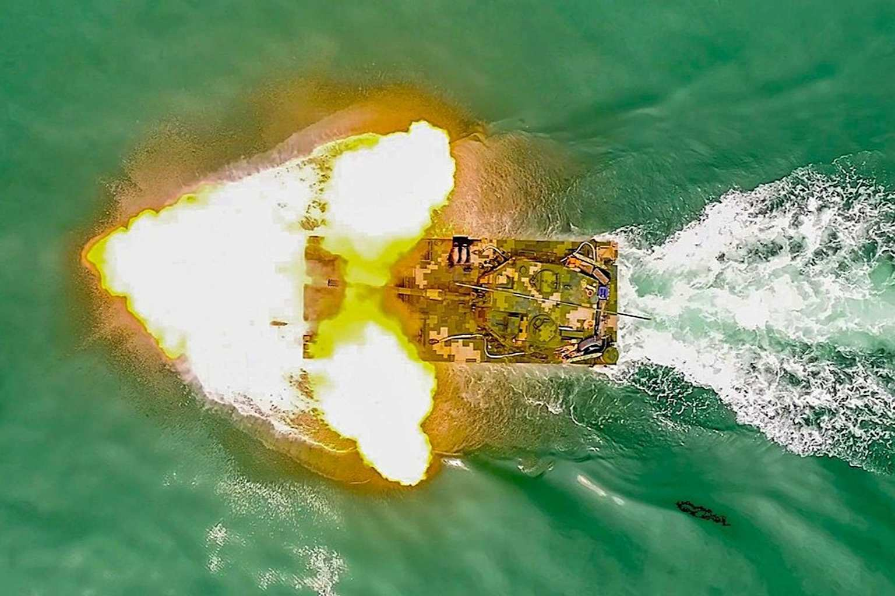
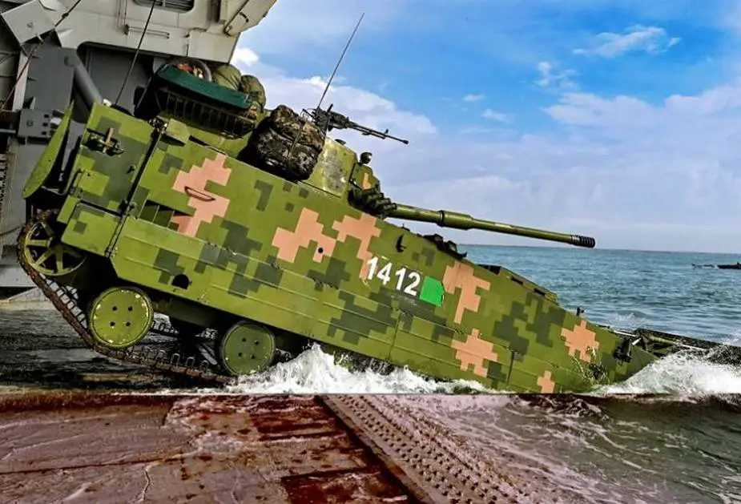
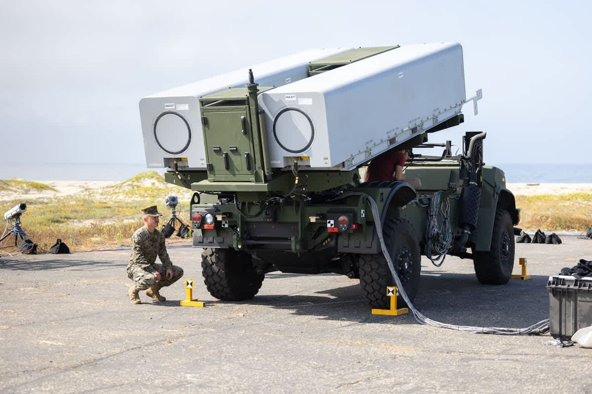
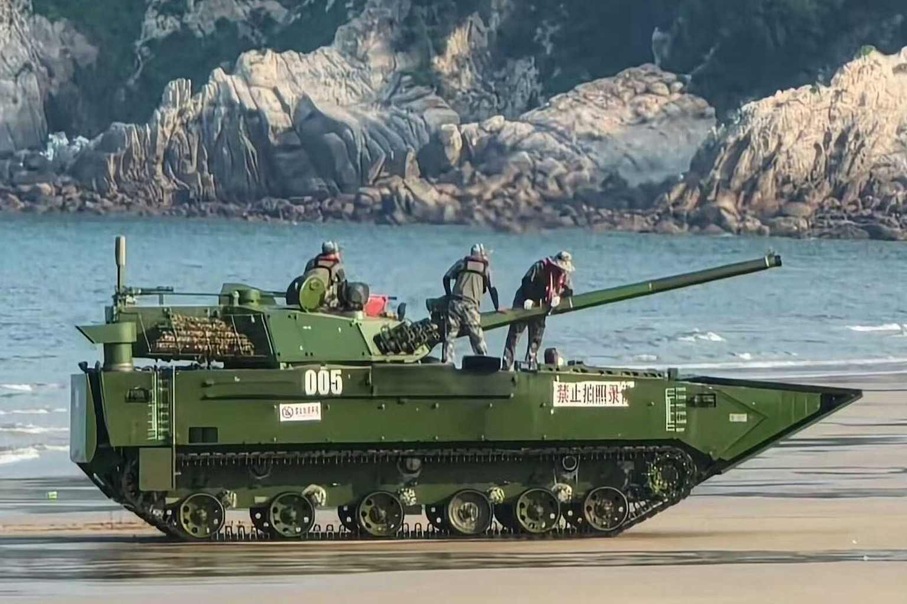
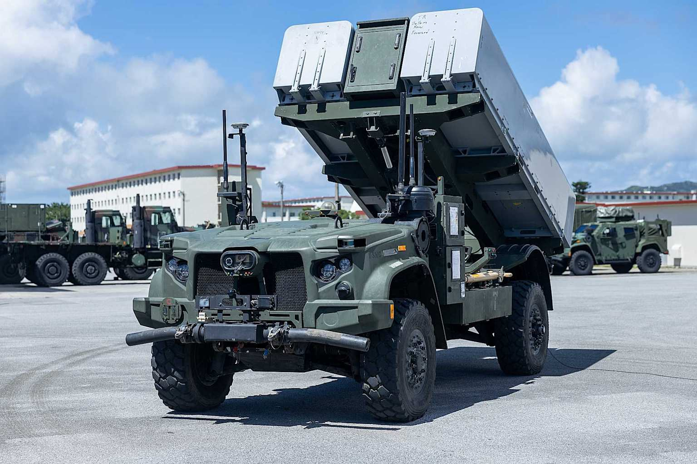
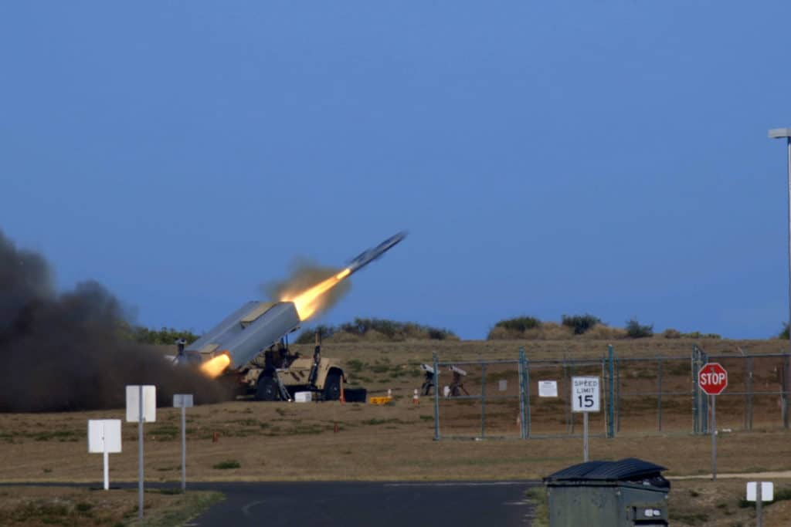
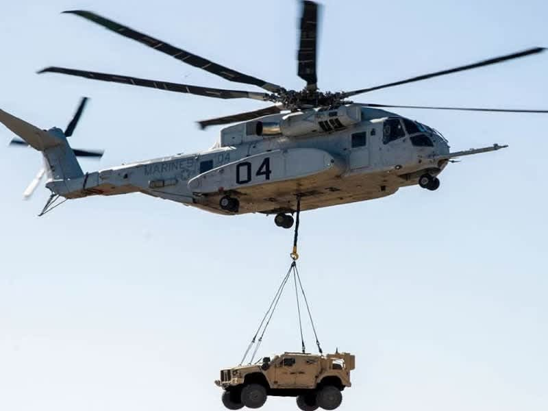
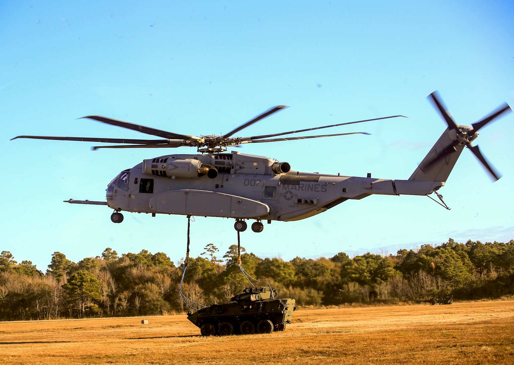

# Marines Comparison: PLAN Marine Corps vs. USMC & Allied Amphibious Forces — Taiwan Scenario
### Comprehensive Platform-by-Platform Analysis Including Amphibious Assault Vehicles, Aviation, Anti-Ship Fires, Island-Chain Operations, Loitering Munitions, and Emerging Systems — Updated June 2026
---
## Executive Summary
The battle for Taiwan's beaches would be decided in the first 72 hours. China's PLAN Marine Corps (PLANMC) has grown from two brigades in 2015 to eight combined-arms brigades today, now incorporating organic tank companies, self-propelled howitzers, and newly unveiled next-generation amphibious IFV designs featuring unmanned turrets and active protection systems. Their primary assault vehicle, the ZTD-05, remains the world's fastest amphibious armored vehicle and uniquely fires its 105mm gun while still swimming — engaging beach defenses before landing. However, China's sealift gap — estimated to support only ~670 ZTD-05s across the strait per wave — fundamentally limits how much combat power the PLANMC can actually put on Taiwan's beaches.[^1][^2][^3]

The US Marine Corps has undergone its most radical redesign since World War II under Force Design 2030, deliberately shedding tanks, towed artillery, and mass in exchange for speed, dispersion, and the ability to operate as small "stand-in forces" inside China's own weapons engagement zone (WEZ). The USMC's new centerpiece is not a tank but an unmanned anti-ship missile launcher (NMESIS) that is now deployed to Okinawa and was exercised in the Luzon Strait — putting every PLAN vessel transiting to Taiwan at risk from island-chain fires. Three Marine Littoral Regiments (MLRs) — now armed with NMESIS, HIMARS, organic loitering munitions, and F-35Bs operating from austere island strips — constitute the most innovative application of amphibious doctrine since the Pacific island campaigns of WWII. Japan's Amphibious Rapid Deployment Brigade (ARDB), South Korea's newly "reborn" ROKMC, and Australia's growing amphibious capacity are all now rehearsing simultaneous amphibious landings alongside US forces.[^4][^5][^6][^7][^8]

***
## PART I: FORCE STRUCTURE — PLANMC vs. USMC
### 1.1 China — PLA Navy Marine Corps (PLANMC): Order of Battle 2026
China's Marine Corps underwent massive expansion from 2017–2022, growing from approximately 20,000 troops in two brigades to a force of approximately 100,000 in eight combined-arms brigades.[^9][^10]

| Unit | Location | Role | Key Organic Assets |
|---|---|---|---|
| **1st Marine Brigade** | Zhanjiang, Guangdong | Amphibious assault — South China Sea | ZTD-05, ZBD-05, PCL-181, HJ-10 ATGM |
| **2nd Marine Brigade** | Zhanjiang, Guangdong | Amphibious assault — South China Sea / Taiwan | ZTD-05, ZBD-05, PCL-181 |
| **3rd Marine Brigade** | Zhangzhou, Fujian | **Taiwan focus** — directly opposite Taiwan Strait | ZTD-05, ZBD-05, HJ-10 ATGM, Type 15 tank company[^1] |
| **4th Marine Brigade** | Zhangzhou, Fujian | **Taiwan focus** | ZTD-05, ZBD-05, PCL-181, ADA battery |
| **5th Marine Brigade** | Sanya, Hainan | South China Sea / island seizure | ZTD-05, ZBD-05 |
| **6th Marine Brigade** | Sanya, Hainan | South China Sea | ZTD-05, ZBD-05 |
| **7th Marine Brigade** | Northern coast | Taiwan Strait — northern axis | Reported forming 2023–2025[^10] |
| **8th Marine Brigade** | Northern coast | Taiwan Strait — northern axis | Reported forming 2023–2025[^10] |

**Key Recent Development:** In January 2026, the US Army's Army War College confirmed that the PLANMC has established organic tank companies within each brigade specifically to destroy US/Taiwanese M1A2 Abrams and Japanese Type 10 tanks. Each brigade also now incorporates PCL-181 155mm truck-mounted howitzers, amphibious Type-05 120mm mortar systems, and AFT-10 ATGM carriers.[^1][^11]

**Sealift Limitation:** Despite the expansion, the PLAN's total sealift is assessed to support approximately 20,000 troops in the first wave — roughly the equivalent of two reinforced PLANMC brigades plus supporting armor. The PLAN does not currently have enough dedicated landing ships to simultaneously transport the full capacity of all eight marine brigades in a single wave.[^2]

***
### 1.2 US Marine Corps: Force Design 2030 — Pacific Posture (October 2025 Update)
The October 2025 Force Design Update confirmed that the Marine Corps' decade-long transformation is in its most aggressive phase:[^5][^12]

| Formation | Location | Primary Mission |
|---|---|---|
| **I MEF** | Camp Pendleton, California | Global strategic reserve; Indo-Pacific secondary; largest force[^4] |
| **III MEF** | Okinawa/Camp Hansen, Japan | **First Island Chain operations** — primary Pacific MEF; only MEF with all three MLRs[^4][^13] |
| **3rd MLR** (1st of 3 MLRs) | MCB Hawaii | Stand-in forces; NMESIS anti-ship; HIMARS; island-chain denial |
| **12th MLR** | Camp Hansen, Okinawa | **Forward deployed** — NMESIS trained in Japan Sep 2025[^14][^15]; EABO island-hopping |
| **4th MLR (forming)** | Planning stage | Third MLR for III MEF[^4][^16] |

**Force Design 2030 Key Trades:**
- **Divested:** All M1 Abrams tanks (MOS eliminated); all towed cannon artillery batteries (21 → 5)[^16]
- **Gained:** 300% increase in rocket artillery capacity; NMESIS anti-ship batteries; organic loitering munitions; UAS squadrons (doubled)[^16]
- **Aircraft:** Retiring AV-8B Harrier IIs and F/A-18 Hornets in favor of F-35B Lightning II[^5]
- **Vehicles:** ACV family replacing all AAV7s; 257 ACVs delivered by end 2025, target 632 total[^17][^5]
- **Experimental:** XQ-58A Valkyrie CCA drone integrated into 2025 experimentation program[^5]

***
## PART II: AMPHIBIOUS ASSAULT VEHICLES
### 2.1 China — ZTD-05 Assault Gun / ZBD-05 IFV (Type 05 Family)

ZTD-05 tanks firing

Amphibious armored vehicle

Military launcher vehicle
The Type 05 family is the backbone of the PLANMC and PLAA amphibious forces. It is the world's fastest amphibious combat vehicle, achieving 45 km/h (28 mph) in water — compared to the US ACV's modest 10 km/h at sea.[^18][^19]

| Specification | ZTD-05 (Assault Gun) | ZBD-05 (IFV) |
|---|---|---|
| **Role** | Direct fire support from water to shore[^2] | Infantry transport + fire support |
| **Main Armament** | ZPL-98A 105mm rifled gun — fires while swimming[^2] | ZPT-99 30mm autocannon[^20] |
| **Anti-Tank** | Barrel-launched laser-guided ATGM (top-attack); penetrates 600mm RHA[^2] | HJ-73C ATGM, 3.5 km range[^20] |
| **Water Speed** | **45 km/h (28 mph)**[^2] — 5× faster than ACV at sea | 45 km/h[^2] |
| **Land Speed** | 65 km/h | 65 km/h |
| **Weight** | ~26.5 tonnes[^2] | ~26.5 tonnes[^2] |
| **Passengers** | 3 crew + 4 troops | 3 crew + 8 marines[^20] |
| **PLAA Qty** | 750 ZTD-05[^2] | 750 ZBD-05[^2] |
| **PLANMC Qty** | 80 ZTD-05 + 150 more ZBD-05[^2] | 240 ZBD-05[^2] |

**HJ-10 ATGM Launcher Variant (Revealed May 2025):** A radically upgunned ZTD-05 variant was revealed in Chinese social media in May 2025 during a PLA exercise — the original 105mm turret was replaced with two launchers carrying 12 HJ-10 ("Red Arrow 10") top-attack anti-tank missiles. This creates an amphibious tank destroyer capable of engaging M1A2 Abrams from water, with a 8,000 m range and tandem-HEAT warhead that defeats any known ERA.[^21]

Amphibious infantry fighting vehicle
**Next-Generation Amphibious IFV (Development — March 2025):** Chinese military imagery released March 2025 confirmed testing of a new-generation amphibious IFV with an unmanned turret (hull number 003), likely incorporating APS. This eventual replacement for the ZBD-05 would combine the PLANMC's assault speed advantage with the Type 100 tank's unmanned-turret survivability concept.[^3][^22]
---
### 2.2 US — Amphibious Combat Vehicle (ACV) Family
The ACV-P replaced the legacy AAV7 (Vietnam-era) as the USMC's primary ship-to-shore transport. As of September 2025, 300 ACVs have been delivered to the Marines.[^17]

| Specification | ACV-P (Personnel) | ACV-30 (IOC Q3 2026) |
|---|---|---|
| **Role** | Ship-to-shore infantry transport | Direct fire support + infantry[^23][^24] |
| **Main Armament** | .50-cal HMG or 40mm grenade launcher[^17] | Mk 44 Stretch 30mm Bushmaster dual-feed cannon[^24][^25] |
| **Detection Range** | N/A | 30mm sights detect targets **beyond 5 km**[^24] |
| **Passengers** | 13 combat Marines + 3 crew[^26] | 8 infantry + 3 crew[^23] |
| **Water Speed** | ~10 km/h (from 12 nmi offshore)[^18] | Same |
| **Road Speed** | 89 km/h (55 mph)[^18] | Same |
| **Amphibious Range** | 12 nautical miles from ship to shore[^18] | Same |
| **Engine** | 690 hp six-cylinder[^18] | Same |
| **Armor** | STANAG Level 4+ blast/ballistic; NBC capable[^26] | Enhanced |
| **Deliveries** | 300 delivered by Sep 2025[^17]; target 632 total[^17] | First 6 series vehicles FY2026[^24][^27] |
| **USMC Total** | 390 ACV-P; 175 ACV-30; 34 ACV-R; 33 ACV-C[^24] | IOC Q3 2026[^24][^27] |

**Critical Comparison — ACV vs. ZTD-05:**

| Metric | ZTD-05 (China) | ACV-P + ACV-30 (US) | Edge |
|---|---|---|---|
| **Water Speed** | 45 km/h[^2] | 10 km/h[^18] | **China — decisive** |
| **Fires while afloat** | 105mm gun + ATGM[^2] | Machine gun only (ACV-P)[^17] | **China** |
| **30mm cannon** | ZBD-05 has 30mm | ACV-30 IOC Q3 2026[^24] | Parity (when ACV-30 fields) |
| **Unmanned turret** | Next-gen in development[^3] | No | **China (future)** |
| **Reliability** | Untested in contested seas | Modern, tested design | US edge |
| **Detection range** | Integrated optics | ACV-30: 5+ km detection[^24] | US edge (ACV-30) |

***
## PART III: USMC ISLAND-CHAIN ANTI-SHIP FIRES — NMESIS / EABO CONCEPT
### 3.1 NMESIS — Navy Marine Expeditionary Ship Interdiction System

Missile launcher vehicle

Missile launch
NMESIS is the centerpiece of the USMC's Force Design 2030 transition — a ground-launched Naval Strike Missile (NSM) on an unmanned ROGUE-Fires JLTV platform. It is the weapon that transforms dispersed Marines on Pacific islands into a fleet-killing force that no PLAN admiral can ignore.[^28][^29][^30]

| Specification | NMESIS |
|---|---|
| **Platform** | Oshkosh JLTV converted to ROGUE-Fires unmanned ground vehicle[^6][^31] |
| **Missile** | Kongsberg/Raytheon Naval Strike Missile (NSM RGM-184A)[^6] |
| **Missiles per launcher** | 2 NSM in self-contained canisters[^6] |
| **NSM Range** | 185 km (110 nmi) baseline[^14]; NSM 1A upgrades extend to 250 km+[^32]; 2025 upgrade: 300+ km[^32] |
| **NSM Speed** | Mach 0.93 — sea skimming, evasive flight path[^33] |
| **NSM Warhead** | ~500 lb (227 kg) semi-armour-piercing[^33] |
| **NSM Stealth** | Low-observable radar signature; sea-skimming flight path avoids ship-based search radar horizon[^31] |
| **NSM Guidance** | INS + passive multi-spectral imaging seeker (no active radar = no detectable emissions)[^31] |
| **Unmanned operation** | Remotely operated; minimal signature; can be hidden on island terrain[^31] |
| **First NMESIS unit** | 3rd MLR, MCB Hawaii — November 26, 2024[^29][^30] |
| **12th MLR deployment** | 12th LCT, Camp Hansen Okinawa — anti-ship battery of 18 NMESIS[^6] |
| **Luzon Strait deployment** | Exercise Balikatan 2025 — deployed to Luzon Strait, Philippines — closest US missiles ever to Chinese mainland[^7] |
| **Japan deployment** | 12th MLR NMESIS trained in Japan September 2025 (Resolute Dragon 25)[^14][^15] |

**EABO Island Placement Context:**
From the heart of the Luzon Strait with baseline NSM (185 km range), NMESIS can threaten any vessel between the tip of Taiwan, the northern reaches of Luzon, and 100 miles east-west. With the 2025 NSM upgrade to 300+ km, a single NMESIS battery on Miyako Island can range the entire Taiwan Strait approach corridor and the PLAN's amphibious staging ports at Xiamen and Zhangzhou — without a single surface ship at risk.[^7]

***
### 3.2 USMC HIMARS — Rocket Artillery in EABO
The 2025 Force Design Update confirmed that the USMC has completed fielding of all planned HIMARS across 10 active and reserve batteries. In an EABO context, HIMARS batteries on Pacific islands with PrSM munitions extend the USMC's engagement envelope to 500 km — potentially reaching PLAN staging ports from forward Ryukyu Island positions.[^5]

***
### 3.3 USMC Organic Precision Fires — Light (OPF-L): Loitering Munitions for Every Platoon
In December 2025, the USMC awarded $42.5 million to Teledyne FLIR Defense and Anduril Industries to equip Marines with the Rogue 1 lethal loitering munition under the OPF-L program.[^34][^35]

| Specification | OPF-L (Rogue 1 — Teledyne FLIR) |
|---|---|
| **Role** | Rifle squad and platoon-level organic precision strike[^35] |
| **Type** | Man-packable lethal loitering munition[^34] |
| **Guidance** | Waypoint navigation + target-locking; EO/IR seeker[^35] |
| **Delivery** | 600+ systems being delivered starting summer 2026[^34] |
| **Target** | Infantry, light armor, crew-served weapons, light vehicles |
| **Contractor** | Teledyne FLIR (Rogue 1) + Anduril (competing variant)[^35] |
| **Strategic Implication** | Every 13-man Marine rifle squad gains organic, AI-guided precision strike without calling for external fire support |

***
## PART IV: USMC AVIATION IN AMPHIBIOUS CONTEXT
### 4.1 F-35B Lightning II — The Island Chain Enabler

F-35B Lightning II

F-35B fighter jet
The F-35B's STOVL capability is what makes Force Design 2030 viable. Any island with a road, parking lot, or primitive strip can become an F-35B operating base. An MV-22B Osprey carries fuel bladders forward; the F-35B refuels from a hose dropped from the Osprey's ramp — creating a "distributed forward arming and refueling point" (FARP) with zero fixed infrastructure.[^36]

| Specification | F-35B (USMC) |
|---|---|
| **Role** | STOVL multirole stealth fighter; amphibious aviation support |
| **Takeoff** | Short takeoff / vertical landing (STOVL)[^36] |
| **Combat Radius** | 450 nmi (conventional STO mode)[^37] |
| **Internal Weapons** | 2× AIM-120 + 2× GBU-31 JDAM or GBU-12 Paveway II[^37] |
| **External Weapons (beast mode)** | JASSM, LRASM, JSOW, SDB II, AMRAAM — up to 15,000 lb[^37] |
| **Key USMC Integration** | MV-22B forward FARP enables operations from beaches, cleared lots, straight roads[^36] |
| **Austere base concept** | F-35B operated from Highway 1 paved road in Okinawa during exercises 2024–2025[^38] |
| **USMC Fleet** | ~350 F-35Bs total planned; 200+ delivered 2026 |
| **Japan JASDF** | 42 F-35Bs for JS *Izumo*-class carriers (converting)[^39] |

***
### 4.2 MV-22B Osprey — The Tiltrotor Assault Transport
| Specification | MV-22B Osprey |
|---|---|
| **Speed** | 280 kn (518 km/h) in airplane mode[^40] |
| **Range** | 1,011 nmi (1,873 km) self-ferry[^40] |
| **Troops** | 24 combat-equipped Marines or 20,000 lb cargo[^40] |
| **Key Pacific Role** | Rapid island-to-island insertion across 1st island chain; F-35B forward FARP refueling[^36][^40] |
| **Bases** | Djibouti, Hawaii, Okinawa — geographically forward-deployed[^40] |
| **Limitation** | Vulnerable to ground fire during approach to contested LZ; no armor protection |

***
### 4.3 CH-53K King Stallion — Heavy Lift for Island Operations

CH-53K King Stallion helicopter

CH-53K helicopter
The CH-53K King Stallion is the most powerful helicopter in the US Department of Defense — three times the lifting capacity of its predecessor CH-53E.[^41]

| Specification | CH-53K King Stallion |
|---|---|
| **Max External Lift** | 36,000 lbs (16,329 kg)[^42][^41] |
| **Mission Radius** | 110 nmi (203 km) carrying 27,000 lb[^41] |
| **Cruise Speed** | 170 kn (310 km/h)[^43] |
| **Range (ferry)** | 460 nmi (850 km)[^43] |
| **Engine** | 3× T408-GE-400 turboshaft, 7,332 SHP each[^41] |
| **Crew** | 2 pilots + 1–3 aircrewmen[^41] |
| **Air-to-Air Refueling** | Yes — extends operational range for island-hopping missions[^42] |
| **USMC Goal** | 200 total aircraft[^41]; 44 on contract / delivered as of 2026[^41] |
| **Pacific Capability** | Can lift a Light Tactical Vehicle (JLTV/NMESIS) and M777 howitzer to any island across the Ryukyus in a single lift |
| **MCAS Yuma (Pacific Staging)** | First CH-53Ks arrived MCAS Yuma June 2024[^42] |

***
### 4.4 AH-1Z Viper + UH-1Y Venom — The MAGTF Multi-Tool
| Specification | AH-1Z Viper | UH-1Y Venom |
|---|---|---|
| **Role** | Attack helicopter — close air support, anti-armor | Utility / medevac / armed reconnaissance[^40] |
| **Weapons (Viper)** | M197 20mm Gatling gun; AGM-114 Hellfire (8 km); AIM-9X Sidewinder; Hydra 70 rockets; TOW missiles | M240 7.62mm; Hydra 70 rockets; limited AGM-114 |
| **Speed** | 222 kn (411 km/h) | 170 kn (315 km/h) |
| **Key Pacific Role** | Direct fire support for Marines during amphibious assault; kill ZTD-05s as they hit the beach[^40] | Medical evacuation of casualties from islands; C2 relay |
| **Limitation** | No stealth; vulnerable to MANPADS on beach approaches — must operate above ZBD-05's HJ-73C ATGM range |

***
## PART V: CHINA'S PLANMC AVIATION AND ASSAULT SUPPORT
The PLANMC does not operate its own fixed-wing aircraft in the way the USMC operates the F-35B — PLANMC relies on PLAAF and PLAN Aviation for air cover and CAS. However, PLANMC does have organic aviation support in the form of Z-8/Z-8G assault transport helicopters (Chinese equivalent of CH-53E), Z-20 medium transport helicopters, and armed Z-10 attack helicopters.

| Platform | Role | Speed | Capability |
|---|---|---|---|
| **Z-20 (PLANMC)** | Medium transport/assault — carries 12–15 troops | 295 km/h | Derived from Black Hawk; fast rope insertion; inland raids |
| **Z-8G/Z-8L** | Heavy transport — amphibious assault | 250 km/h | Carries 30 troops or internal cargo; ship-to-shore vertical assault |
| **Z-10ME** | Armed attack helicopter — fire support | 270 km/h | TY-90 AAMs, HJ-10 ATGMs, 23mm cannon; provides direct CAS during beach assault |
| **J-10C / J-15 (PLAN Aviation)** | Fixed-wing air cover for PLANMC | Mach 2+ | Not PLANMC organic — assigned from PLAN carrier or shore base |
| **GJ-11 UCAV** | Stealthy strike drone | High subsonic | Provides CAS/ISR without risking piloted aircraft in beach approach |

**PLANMC vs. USMC Aviation — Critical Asymmetry:** The USMC's F-35B can operate from any flat surface across the island chain, independent of carrier or airfield. The PLANMC has no equivalent STOVL fixed-wing asset — a significant gap that matters most during the first-wave assault when air superiority is most contested. Without F-35B-equivalent STOVL capability, the PLANMC's assault is dependent on the survivability of PLAN carriers or Fujian-based air bases during the critical assault window.

***
## PART VI: ALLIED MARINE AND AMPHIBIOUS FORCES
### 6.1 Japan — Amphibious Rapid Deployment Brigade (ARDB)
Japan's ARDB, established in 2018 and headquartered at Camp Ainoura in Nagasaki, is Japan's first amphibious force since WWII.[^44]

| Specification | JGSDF ARDB |
|---|---|
| **Strength** | ~3,000 troops (6 amphibious infantry regiments + support)[^44] |
| **Assault Vehicle** | AAV7 (US-supplied); AAV-P7 replacement under evaluation |
| **Key Exercise** | Trains with USMC III MEF; participated in simultaneous amphibious landings exercise Aug 2025[^8] |
| **AH-64D Apache** | Organic attack helicopters for direct fire support |
| **CH-47J Chinook** | Heavy assault transport |
| **Weapons** | Type 12 anti-ship missile (ground-launched, 1,200 km range)[^45]; 01-ATGM (man-portable ATGM) |
| **Role in Taiwan Scenario** | Reinforce Ryukyu islands; retake Miyako or Yonaguni if seized; deny PLAN resupply corridors through island chain |
| **FY2026 Budget** | Record ¥9.04 trillion ($58B)[^46]; ARDB expansion funded |

***
### 6.2 South Korea — Republic of Korea Marine Corps (ROKMC) "Reborn" — December 2025
On December 31, 2025, South Korea's Defense Minister declared the ROKMC "reborn" in its most significant restructuring in 50+ years.[^44]

| Specification | ROKMC |
|---|---|
| **Strength** | ~29,000 marines in 2 divisions (1st and 2nd)[^44] |
| **Restructuring** | December 2025: Marines granted "quasi-fourth service" status; removed from Army command; operational control returned to Marine Commandant by 2026–2028[^44] |
| **New Legal Mission** | Expanded from "amphibious operations" to "island defense, amphibious operations, and rapid-response operations"[^44] |
| **F/A-50 Fighting Eagle** | ROKAF light attack jet; ROKMC air integration |
| **K2 Black Panther Tank** | 120mm smoothbore; APS; 68 km/h; organic to marine divisions |
| **K21 IFV** | 40mm cannon; anti-tank missiles; amphibious |
| **AMPV / KAAV-P (K-AAV)** | Korean-developed amphibious assault vehicle |
| **Exercises with USMC** | Simultaneous amphibious landings rehearsed with US, Australia, Japan — August 2025[^8] |
| **Role in Taiwan Scenario** | Committed primarily to Korean Peninsula deterrence; strategic reserve for Pacific contingencies if DPRK remains inactive |

***
### 6.3 Australia — 2nd Battalion, Royal Australian Regiment (2RAR) and Landing Ships
Australia's growing amphibious force, centered on HMAS *Canberra* and HMAS *Adelaide* (LHDs), can project 1,000+ marines with 150 vehicles anywhere in the Pacific.[^8][^47]

| Specification | Australian Amphibious Force |
|---|---|
| **Ships** | 2× LHD (*Canberra* class); each carries 1,000 troops, 110 vehicles, 8 × MRH90/NH90 helicopters |
| **Ground Force** | 2RAR (2nd Battalion, Royal Australian Regiment) — amphibious infantry battalion |
| **Vehicles** | ASLAV (8-wheeled APC); Hawkei PMV; M1A2 Abrams (delivered 2023)[^48] |
| **Air Assets** | F/A-18F Super Hornet + 12 × EA-18G Growler (RAAF) — only allied Growler operator outside US[^47] |
| **Exercises** | Talisman Sabre 2025 — practiced simultaneous amphibious landings with US, Japan, South Korea[^8] |

***
## PART VII: SIDE-BY-SIDE COMPARISON TABLES
### 7.1 Amphibious Assault Vehicle Head-to-Head
| Feature | ZTD-05 (PLANMC) | ZBD-05 (PLANMC) | ACV-P (USMC) | ACV-30 (USMC — IOC 2026) |
|---|---|---|---|---|
| **Main Armament** | 105mm gun + barrel ATGM[^2] | 30mm autocannon + HJ-73C ATGM[^20] | .50-cal HMG[^17] | 30mm Mk 44 Bushmaster[^24] |
| **Water Speed** | 45 km/h[^2] | 45 km/h[^2] | 10 km/h[^18] | 10 km/h[^18] |
| **Fires while afloat** | Yes — 105mm + ATGM[^2] | Yes — 30mm + ATGM[^20] | Machine gun only | Machine gun only |
| **Passengers** | 3 crew + 4 troops | 3 crew + 8 troops[^20] | 3 crew + 13 Marines[^26] | 3 crew + 8 Marines[^23] |
| **Detection Range** | Integrated optics | Integrated optics | N/A (personnel carrier) | 5+ km[^24] |
| **APS** | Variant in development[^3] | Variant in development[^3] | None | None |
| **Anti-tank** | HJ-10 12-round variant (May 2025)[^21] | HJ-73C (3.5 km)[^20] | Javelin integration possible | 30mm APFSDS |
| **Edge** | **China — water speed, firepower while afloat** | **China — water speed** | **US — troop capacity** | **US (partial) — detection range, modern cannon** |
### 7.2 Anti-Ship Fires from Islands — USMC NMESIS vs. PLANMC Options
| System | Side | Range | Speed | Guidance | Platform | Notes |
|---|---|---|---|---|---|---|
| **NMESIS/NSM** | USMC | 185–300+ km[^32][^14] | Mach 0.93 (sea-skim)[^33] | Passive multi-spectral IIR; INS[^31] | Unmanned JLTV (invisible signature)[^31] | Deployed Okinawa + Luzon Strait 2025[^6][^7] |
| **HIMARS / PrSM Increment 2** | US/USMC | 500+ km (anti-ship)[^49] | Supersonic | Multi-mode seeker | HIMARS launchers | Development; would be transformative |
| **Type 12 Kai (Japan ARDB)** | Japan | 900–1,200 km[^50] | Subsonic | Active radar + INS | Ground mobile | Deployed Kumamoto March 2026[^45] |
| **HJ-10 amphibious launcher** | PLANMC | 8+ km (anti-armor) | Subsonic | Imaging IR, laser | ZTD-05 chassis[^21] | Anti-armor, not anti-ship |
| **YJ-12 (PLAN, not PLANMC)** | China | 400+ km | Mach 2+ | Active radar | H-6K, J-16, surface ships | Not PLANMC organic — PLAN asset |

**Key Insight:** The PLANMC has no equivalent to NMESIS or the Type 12 Kai for island-chain sea denial. The PLANMC's mission is offensive amphibious assault — it does not play a sea denial role. The USMC has fundamentally redefined its role from "assault" to "sea denial + EABO," with NMESIS as the primary instrument.
### 7.3 Aviation — USMC vs. PLANMC
| Platform | Side | Role | Key Capability | Edge |
|---|---|---|---|---|
| **F-35B** | USMC | STOVL stealth multirole | Operates from any 300m paved surface; 450 nmi radius; 5th-gen stealth | **USMC — decisive** (PLANMC has no equivalent) |
| **MV-22B Osprey** | USMC | Assault transport | 518 km/h; 1,873 km ferry; FARP refueling for F-35B[^36] | **USMC — decisive** (no tiltrotor in PLANMC inventory) |
| **CH-53K King Stallion** | USMC | Heavy lift | 36,000 lb external lift; 110 nmi combat radius[^41] | **USMC** |
| **AH-1Z Viper** | USMC | Attack helo | AGM-114 Hellfire (8 km); AIM-9X; 20mm cannon[^40] | **USMC (quality)** |
| **Z-20** | PLANMC | Medium transport | 12–15 troops; fast rope capable | China (numbers) |
| **Z-8G** | PLANMC | Heavy transport | 30 troops; ship-to-shore | Slightly lighter than CH-53K |
| **Z-10ME** | PLANMC | Attack helo | HJ-10 ATGMs; TY-90 AAMs; 23mm cannon | Comparable to AH-1Z; untested |
### 7.4 Marine Corps Force Structure Comparison
| Metric | PLANMC | USMC |
|---|---|---|
| **Total Strength** | ~100,000 in 8 brigades[^9][^10] | ~172,500 (Force Design 2030 target)[^16] |
| **Tanks organic** | Type 15 light + company-level Type 99A (organic to brigades)[^1] | **Eliminated all M1A2 Abrams (Force Design 2030)**[^16] |
| **Primary Assault Vehicle** | ZTD-05 (fires 105mm while swimming)[^2] | ACV-P / ACV-30 (replaces AAV7) |
| **Anti-ship Missiles** | None organic to PLANMC (relies on PLAN Navy assets) | **NMESIS NSM (185–300+ km)**[^32][^14] — dedicated PLANMC sea denial asset |
| **Rocket Artillery** | PCL-181 155mm (organic to each brigade)[^11] | HIMARS (10 batteries — 300% increase)[^5][^16] |
| **STOVL aviation** | None | F-35B (350+ total planned) |
| **Loitering munitions** | ZTD-05/ZBD-05 mounted variants; infantry-level Chinese commercial clones | OPF-L Rogue 1 — 600+ systems from summer 2026[^34] |
| **Island-chain posture** | Offensive assault-oriented | **Defensive sea-denial / EABO — permanently based in 1st island chain**[^4][^38] |

***
## PART VIII: STRATEGIC ASSESSMENT
### USMC EABO — The Archipelago Defense Grid
Force Design 2030 essentially turns the USMC into the world's most lethally equipped coast artillery corps — dispersed across dozens of Pacific islands, hidden from satellite reconnaissance, equipped with sea-skimming missiles that can kill any ship within 300 km, HIMARS that can reach staging ports at 500 km, and F-35Bs that need no runway. A PLANMC brigade commander trying to coordinate a 200-ship amphibious assault must simultaneously suppress NMESIS batteries on Miyako Island, HIMARS on Ishigaki, F-35Bs operating from a highway on Okinawa, and an 18-vehicle NMESIS battery on Luzon — all while his ZTD-05s are still 185 km from the beach.[^4][^7][^38][^51]
### China's Amphibious Edge Is Real but Bounded
The ZTD-05's ability to fire its 105mm gun while swimming remains the single most operationally dangerous capability in the assault wave, and the PLANMC's 100,000-strong force dwarfs the active-duty USMC in raw numbers. But two structural limits constrain this advantage: First, the sealift gap caps the first-wave assault at ~20,000 troops regardless of how many ZTD-05s exist. Second, getting those troops to Taiwan's beaches requires surviving NMESIS, HIMARS, Japanese Type 12 Kai, and Typhon Tomahawk fires that begin when the fleet leaves port — not when it arrives at the beach.[^10][^2]
### South Korea's "Reborn" ROKMC Is a Wildcard
The December 2025 restructuring that elevated the ROKMC to quasi-fourth-service status and expanded its mission to "island defense, amphibious operations, and rapid-response operations" signals Seoul's long-term intent. A ROKMC with independent operational authority, trained with USMC and JGSDF in simultaneous amphibious landings, and equipped with K2 Black Panthers and K21 IFVs becomes a genuine second amphibious prong for any Allied Pacific operation — or a deterrent that forces Beijing to keep PLA forces on the peninsula rather than concentrating them on Taiwan.[^44][^8]
### The PLANMC's Most Dangerous Near-Future Gap-Filler: New Amphibious IFV
The March 2025 imagery of hull number 003 — an unmanned-turret amphibious IFV with APS — suggests China is working to combine the ZTD-05's speed advantage with the Type 100 tank's survivability concept. If this next-generation vehicle achieves production at scale by 2030, it would simultaneously address the ZTD-05's vulnerability to Javelin and OPF-L loitering munitions while maintaining the 45 km/h water speed that gives Chinese assault forces a 4× water-transit-time advantage over the ACV. That combination — speed, firepower while swimming, and drone-killing APS — would be a genuinely novel threat that current Allied beach-defense doctrine has no proven answer for.[^3]

---

## References

1. [PLA Navy Marine Corps Tank Companies Emphasize Expeditionary ...](https://ssi.armywarcollege.edu/SSI-Media/Recent-Publications/Article/4391061/pla-navy-marine-corps-tank-companies-emphasize-expeditionary-capabilities/) - The PLANMC would require its brigades to be modular units that can be modified according to the miss...

2. [Amphibious Warfare - The Dupuy Institute](https://dupuyinstitute.org/category/amphibious-warfare/) - Both the PLA Army (PLAA) and PLA Navy Marine Corps (PLANMC) use the Type-05, landing operations agai...

3. [China tests new family of amphibious infantry fighting vehicles to ...](https://armyrecognition.com/news/army-news/2025/china-tests-new-family-of-amphibious-infantry-fighting-vehicles-to-replace-the-type-05) - The Type 05 is designed for rapid amphibious landings and operations in coastal environments. The Ty...

4. [Marine Corps Force Design 2030: Examining the Capabilities ... - CSIS](https://www.csis.org/analysis/marine-corps-force-design-2030-examining-capabilities-and-critiques) - In the Indo-Pacific scenario, Marines will be positioned along the First Island Chain and deter Chin...

5. [Marine Corps' latest Force Design update advances revamp geared ...](https://www.stripes.com/branches/marine_corps/2025-10-24/force-design-updates-marine-corps-19529096.html) - The NMESIS is among several capabilities being fielded across the force as part of the service's For...

6. [USMC's First Anti-Ship Littoral Combat Team Established in Okinawa](https://www.navalnews.com/naval-news/2025/03/usmcs-first-anti-ship-littoral-combat-team-established-in-okinawa/) - The U.S. Marine Corps' 12th Littoral Combat Team will field the first forward deployed NMESIS unmann...

7. [USMC Anti-Ship Missile Deployment To Highly Strategic Luzon ...](https://www.twz.com/air/usmc-anti-ship-missile-deployment-to-highly-strategic-luzon-strait-is-unprecedented) - USMC Anti-Ship Missile Deployment To Highly Strategic Luzon Strait Is Unprecedented · A map showing ...

8. [U.S., Allies Rehearse Simultaneous Amphibious Landings](https://news.usni.org/2025/08/04/u-s-allies-rehearse-simultaneous-amphibious-landings) - The U.S. teamed with Australia, South Korea and Japan to conduct a major amphibious assault, an amph...

9. [CMSI China Maritime Report #15: “The New Chinese Marine Corps](https://www.linkedin.com/pulse/cmsi-china-maritime-report-15-new-chinese-marine-corps-erickson) - This report discusses the recent expansion/reform of the Chinese Marine Corps in the context of a Ta...

10. [[PDF] The Current Status and Prospects of China's Growing Marine Corps](https://www.nids.mod.go.jp/english/publication/commentary/pdf/commentary238e.pdf) - Furthermore, the PLA has been expanding its opportunities and capabilities for overseas deployment, ...

11. [PLA Navy Marine Corps Tank Companies Emphasize Expeditionary ...](https://innovation.army.mil/News/Article-View/Article/4391061/pla-navy-marine-corps-tank-companies-emphasize-expeditionary-capabilities/) - The PLANMC created the tank companies to provide the brigades with an organic anti-armor capability ...

12. [2025 Force Design Update Announcement - YouTube](https://www.youtube.com/watch?v=urFRFRwgccs) - The Commandant of the Marine Corps, Gen. Eric M. Smith, published the 2025 Force Design Update, whic...

13. [3rd Marine Littoral Regiment - Wikipedia](https://en.wikipedia.org/wiki/3rd_Marine_Littoral_Regiment) - The 3d Marine Littoral Regiment (3d MLR) is a regiment of the United States Marine Corps that is opt...

14. [U.S. Marines Train with NMESIS Anti-ship Launcher in Japan for ...](https://news.usni.org/2025/09/05/u-s-marines-train-with-nmesis-anti-ship-launcher-in-japan-for-first-time) - The system is equipped with two low-observable Kongsberg Naval Strike Missiles and has a striking ra...

15. [U.S. Marine Corps - Facebook](https://www.facebook.com/marines/posts/rounds-of-resolvemarines-with-12th-marine-littoral-regiment-3rd-marine-division-/1343762564081744/) - Resolute Dragon 25 is an annual bilateral exercise in Japan that strengthens the command, control, a...

16. [U.S. Marine Corps Force Design Initiative - Every CRS Report](https://www.everycrsreport.com/reports/R47614.html) - As defined by the Marines, "EABO are a form of expeditionary warfare that involve the employment of ...

17. [Why have Marines replaced their iconic amphibious AAVs with this ...](https://www.youtube.com/watch?v=R35_TIAG7MY&vl=en) - . 00:00 Intro 00:48 AAV and EFV replacement 02:18 ACV program and AAV upgrade 03:53 Marines change 0...

18. [USMC orders 30 additional ACV-30 from BAE Systems](https://www.calibredefence.co.uk/usmc-orders-30-additional-acv-30-from-bae-systems/) - Platform: Based on the Iveco Super AV · Engine: Six-cylinder, 690 hp · Speed: Over 55 mph (89 km/h) ...

19. [Type 05 amphibious fighting vehicle - Wikipedia](https://en.wikipedia.org/wiki/Type_05_amphibious_fighting_vehicle) - As the world's fastest amphibious combat vehicle, the Type 05 offers the unique high water speed (HW...

20. [Chinese Navy combat units training signals amphibious escalation ...](https://stationhypo.com/2025/07/14/chinese-navy-combat-units-training-signals-amphibious-escalation-opposite-taiwan/) - The ZBD-05 is armed with a 30mm automatic cannon, a 7.62mm coaxial machine gun, and HJ-73C anti-tank...

21. [PLA Showcases Heavily Modified Amphibious Armored Vehicle with ...](https://www.china-arms.com/2025/05/china-heavily-modified-amphibious-armored-vehicle-with-hj-10-missiles/) - The latest variant of the ZTD-05 amphibious assault vehicle, equipped with 12 HJ-10 top-attack anti-...

22. [China tests new family of amphibious infantry fighting vehicles to ...](https://www.reddit.com/r/WorldDefenseNews/comments/1jazy5q/china_tests_new_family_of_amphibious_infantry/) - China tests new family of amphibious infantry fighting vehicles to replace the Type 05. As reported ...

23. [[PDF] Amphibious Combat Vehicle (ACV)](https://www.marcorsyscom.marines.mil/Portals/105/Industry%20Engagement/acq_4.29_1315_PM%20AAA.pdf?ver=sLkJht-W8O5U-fa3PYPyKA%3D%3D) - Carries up to 7 embarked battle staff and has a medium machine gun for vehicle defense. • ACV-30 (30...

24. [Marines Poised To Get Their 30mm Cannon-Armed Amphibious ...](https://www.twz.com/sea/marines-poised-to-get-their-30mm-cannon-armed-amphibious-combat-vehicle) - Armed with a 30mm Bushmaster cannon, the ACV-30 will provide the US Marine Corps with its largest di...

25. [The Marines have their incoming ACV-30 on display at Modern Day ...](https://www.instagram.com/reel/DXrq25QiVoB/) - Unlike the earlier ACV‑1.1 with a 12.7mm machine gun, the ACV‑30 mounts a 30mm automatic cannon in a...

26. [Amphibious Combat Vehicle - BAE Systems](https://www.baesystems.com/en/product/amphibious-combat-vehicle) - The ACV-P is exceptionally mobile and can transport 13 combat-loaded Marines, plus 3 crew. The ACV-C...

27. [Capability delivered The first fielding of the Amphibious Combat ...](https://www.facebook.com/BAESystemsInc/posts/capability-delivered-the-first-fielding-of-the-amphibious-combat-vehicle-30-is-n/1409639104533708/) - “ACV-30 equips Marines with organic, direct fire support to dismounted Marines, allowing them to sim...

28. [3d MLR receives NMESIS #Marines with 3d Marine Littoral ...](https://www.facebook.com/IIIMEF/posts/3d-mlr-receives-nmesismarines-with-3d-marine-littoral-regiment-3rd-marine-divisi/911081814493705/) - The NMESIS - a mountable, ground-based anti-ship missile launcher - provides the regiment a potent s...

29. [3d Marine Littoral Regiment Receives NMESIS](https://www.29palms.marines.mil/Articles/Article/3980303/3d-marine-littoral-regiment-receives-nmesis/) - The NMESIS provides this Regiment a potent sea denial capability in support of our mission essential...

30. [3d Marine Littoral Regiment Receives NMESIS - PACOM](https://www.pacom.mil/Media/NEWS/Article/3983873/3d-marine-littoral-regiment-receives-nmesis/) - The NMESIS provides this Regiment a potent sea denial capability in support of our mission essential...

31. [USMC NMESIS and Naval Strike Missiles Logistics Explained](https://www.navalnews.com/naval-news/2022/01/usmc-nmesis-and-naval-strike-missiles-logistics-explained/) - The NSM cruises at subsonic speeds of 0.7 to 0.9 Mach and uses advanced passive seekers that can det...

32. [Naval Strike Missile - Wikipedia](https://en.wikipedia.org/wiki/Naval_Strike_Missile) - >200 km (110 nmi; 120 mi) NSM; 250 km (130 nmi; 160 mi) NSM 1A. >300 km (190 mi; 160 nmi) (2025) · S...

33. [United States Marines Upgrade weapon system For NMESIS Naval ...](https://www.youtube.com/watch?v=3hRst-XB7uU) - The Naval Strike Missile is a long-range, precision strike ... United States Marines Upgrade weapon ...

34. [Teledyne FLIR Defense Awarded $42.5 Million Drone Contract for ...](https://defense.flir.com/about/news/teledyne-flir-defense-awarded-$42.5-million-drone-contract-for-u.s.-marine-corps-organic-precision-fires-light-program/) - Organic Precision Fires-Light is a program designed to provide rifle squads and platoons with a man-...

35. [On the Frontlines of Precision: Program Office Ground Weapons ...](https://www.marcorsyscom.marines.mil/News/News-Article-Display/Article/4360548/on-the-frontlines-of-precision-program-office-ground-weapons-system-advances-or/) - Organic Precision Fires – Light (OPF-L) will provide infantry Marines with a precision strike and a ...

36. [Marine Osprey flies in to fuel up F-35B - Air Force Materiel Command](https://www.afmc.af.mil/News/Article-Display/Article/803674/marine-osprey-flies-in-to-fuel-up-f-35b) - A U.S. Marine Corps MV-22B Osprey descended on Edwards to link up with a Marine F-35B Joint Strike F...

37. [F-35A Lightning II > Air Force > Fact Sheet Display - AF.mil](https://www.af.mil/About-Us/Fact-Sheets/Display/Article/478441/f-35a-lightning-ii/) - The F-35A is the U.S. Air Force's latest fifth-generation fighter. It will replace the U.S. Air Forc...

38. [Projecting Power in Contested Regions: Marine Corps' EABO Moves ...](https://seapowermagazine.org/projecting-power-in-contested-regions-marine-corps-eabo-moves-from-paper-to-reality/) - The rapid move from 2019 theory to present-day reality includes the just-completed 2025 Aviation Pla...

39. [Japan - F35.com](https://www.f35.com/f35/global-enterprise/japan.html) - The F-35 Lightning II is designed and built to counter the most advanced threats – making it a perfe...

40. [The Core USMC Air Assets: 2025 | Defense.info](https://defense.info/re-thinking-strategy/2025/03/the-core-usmc-air-assets-2025/) - MV-22Bs currently based in Djibouti, Hawaii, and Okinawa provide the ability to respond to crisis, c...

41. [CH-53K King Stallion - NAVAIR](https://www.navair.navy.mil/product/CH-53K-King-Stallion) - Aircraft Length: 99 ft. 0.5 in. ; Aircraft Height: 28 feet, 4 inches ; Max Gross Weight: 88,000 lbs ...

42. [The CH-53K King Stallion arrives at MCAS Yuma - DVIDS](https://www.dvidshub.net/news/475310/ch-53k-king-stallion-arrives-mcas-yuma) - The CH-53K is notable for its maximum external lift capability of 36,000 pounds, air-to-air refuelin...

43. [Sikorsky CH-53K King Stallion - Wikipedia](https://en.wikipedia.org/wiki/Sikorsky_CH-53K_King_Stallion) - Specifications (CH-53K) · Cruise speed: 170 kn (200 mph, 310 km/h) · Range: 460 nmi (530 mi, 850 km)...

44. [From the Peninsula to the Indo-Pacific: The Rebirth of South Korea's ...](https://thediplomat.com/2026/02/from-the-peninsula-to-the-indo-pacific-the-rebirth-of-south-koreas-marines/) - Japan's Amphibious Rapid Deployment Brigade and Australia's growing amphibious capability are part o...

45. [Japan builds up its 'southern shield' as faith in US security cover falters](https://www.aljazeera.com/news/2026/4/24/japan-builds-up-its-southern-shield-as-faith-in-us-security-cover-falters) - Much of Japan's growing defence budget, which hit a record $58bn for the fiscal year 2026, has been ...

46. [Japan Accelerates Defense Buildup With Record Budget and ...](https://thediplomat.com/2025/12/japan-accelerates-defense-buildup-with-record-budget-and-expanded-unmanned-capabilities/) - December 26, 2025. Japan Accelerates Defense Buildup With Record Budget and Expanded Unmanned Capabi...

47. [Australia Receives Its 72nd F-35 Stealth Fighter - The National Interest](https://nationalinterest.org/blog/buzz/australia-receives-its-72nd-f-35-stealth-fighter-214201) - In December, the Australian military received its seventy-second F-35A stealth fighter jet, completi...

48. [M1A2 Abrams tank - Australian Army](https://www.army.gov.au/equipment/vehicles-and-surveillance/m1a2-abrams-tank) - Weight 67 mt Length 9.7 m Width 3.7 m Height 3.09 m Crew engine 1500 shaft horsepower Speed More tha...

49. [Precision Strike Missile, made possible by Trump's treaty withdrawal ...](https://defensescoop.com/2026/03/05/prsm-precision-strike-missile-iran-operation-epic-fury/) - The most notable capability of the PrSM is its extended range, as it is able to strike targets from ...

50. [Japan's Defense Shift With New Submarines and Long-Range ...](https://armyrecognition.com/news/navy-news/2025/japans-defense-shift-with-new-submarines-and-long-range-missiles-draws-chinas-concern) - The move fits into Japan's broader shift toward long-range strike and expanded undersea capabilities...

51. [The United States Needs Its Marine Corps Now More Than Ever](https://www.csis.org/analysis/united-states-needs-its-marine-corps-now-more-ever) - The Marine Corps' Expeditionary Advanced Base Operations (EABO) concept serves as sea denial or sea-...
