# Special Forces Comparison: China PLA/PAP SOF vs. US JSOC & Allied Special Operations Forces — Taiwan Scenario
### Comprehensive Analysis of All-Domain Special Operations: Decapitation Strikes, Sabotage, Reconnaissance, UW/FID, Maritime SOF, Gray-Zone Operations, Autonomous Warfare, and Emerging Capabilities — Updated June 2026
---
## Executive Summary
Special Operations Forces (SOF) in a Taiwan conflict scenario will not be the tip of the spear in the conventional military sense — they will be the ghost war fought before, during, and after any large-scale amphibious assault. China's SOF apparatus is structurally optimized for a unique set of missions: pre-invasion gray-zone sabotage, decapitation of Taiwan's political and military leadership, precision strike guidance for the PLA's rocket forces, and post-seizure occupation control through the People's Armed Police (PAP). US and Allied SOF, by contrast, are oriented toward Unconventional Warfare (UW) — building, advising, and enabling Taiwan's indigenous resistance, conducting precision raids on high-value targets, and integrating AI-driven autonomous systems that give a small team the firepower of a company.[^1][^2][^3][^4]

The critical asymmetry is structural. China has invested in a hardened, centrally controlled SOF architecture designed for a short, decisive operation — neutralize Taiwan's leadership, guide missile fires, control urban centers, and embed PAP occupation forces within 72 hours. US JSOC, by contrast, is the world's most experienced and technologically advanced SOF community — but its greatest contribution in a Taiwan conflict may not be direct combat on the island at all. It will be the shadow war: pre-positioned intelligence networks, persistent surveillance of PLAN submarine pens and missile TELs, and the most consequential capability shift in modern SOF history — SOCOM's absorption of the Replicator drone program into the Defense Autonomous Warfare Group (DAWG), backed by the Trump administration's FY2027 request of $54.6 billion — a 24,000% single-year budget increase.[^5][^6]

***
## PART I: CHINA — PLA SPECIAL OPERATIONS FORCES ARCHITECTURE
### 1.1 PLA SOF Overview and Doctrine
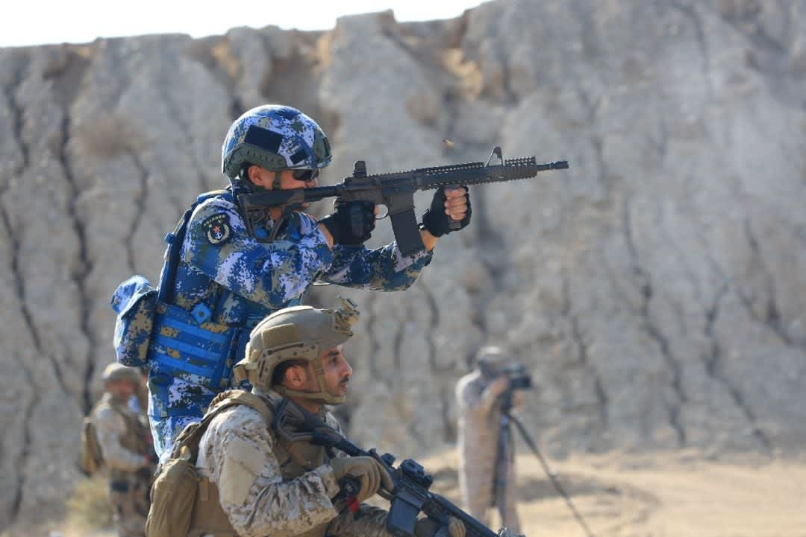
PLA Marines training exercise
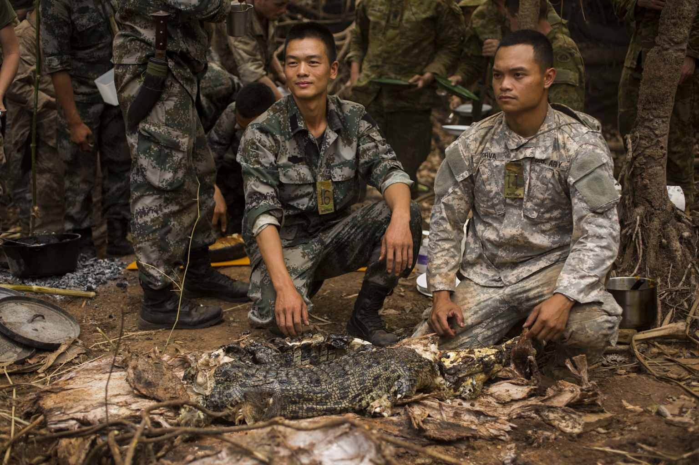
Chinese special forces with crocodile

Chinese navy special forces
The PLA SOF community is fragmented across the Ground Force, Navy, Air Force, Rocket Force, and the People's Armed Police — creating a layered but sometimes poorly integrated structure. Total estimated SOF strength across all branches is 20,000–30,000 personnel. Unlike Western SOF, PLA SOF units historically lack dedicated special mission aircraft, long-range strategic airlift support, and independent logistics chains — limitations acknowledged by multiple authoritative sources including the US Army War College.[^7][^8][^9]

| PLA SOF Branch | Units | Primary Mission | Approx. Strength |
|---|---|---|---|
| **PLAA Ground SOF** | 8 SOF brigades + 3 SOF groups across theater commands[^9] | Special reconnaissance, direct action, sabotage, CBRN[^7] | ~10,000–15,000 |
| **PLAN Navy SOF** | "Sea Dragon" PLANMC commando companies + Navy SEAL-equivalent frogmen | Underwater demolition, port sabotage, anti-ship mining, beach reconnaissance | ~2,000–3,000 |
| **PLAAF Airborne SOF** | 15th Airborne Army, "Thunder Gods" (Hubei)[^10] | Airborne direct action; seize Taiwan's key airfields in first hours | ~3,000–5,000 |
| **PLA Rocket Force SOF** | Embedded recce/target acquisition cells | Strike coordination; BDA; guidance for DF-11/DF-15/DF-21D targeting[^2] | Classified |
| **PAP Snow Leopard CU** | Beijing-based, 2nd PAP Mobile Corps[^11][^12] | Counter-terrorism; hostage rescue; high-value target protection; occupation enforcement[^11] | ~300–500 operators |
| **PAP Falcon Commando Unit** | Beijing-based, 1st PAP Mobile Corps[^13][^14] | Hostage rescue; HVT seizure; urban occupation; protection of CCP leadership in Taiwan post-seizure[^15] | ~300–500 operators |
---
### 1.2 PLA SOF Doctrine for a Taiwan Operation
Based on PLA Academy of Military Science publications and analysis by authoritative US defense researchers, PLA SOF in a Taiwan campaign would execute the following mission sequence:[^2][^6]

**Phase 0 (Gray Zone — Ongoing Now):**
- Maritime militia vessels and intelligence operatives map Taiwan's undersea cable routes, power infrastructure, radar sites, and SOF unit locations[^16]
- Shadow fleet vessels execute cable-cutting operations — 4 subsea cable disruptions between January–February 2025 alone; Chinese captain Wang convicted in Taiwanese court June 2025 for intentionally severing TP3 cable[^17][^16]
- Cognitive warfare campaigns targeting Taiwan's civilian morale, inducing doubt about US commitment, and creating political divisions — classified by researchers as "Deterrence," "Punishment," "Mobilization," and "Appeasement" influence vectors[^18]
- Ongoing since 2022: "Justice Mission 2025" exercise (December 29–30, 2025) specifically rehearsed four doctrinal missions: coverage fires, blockade, precision strike, and **decapitation strike** against "key symbolic targets associated with ringleaders of Taiwan independence"[^19][^20]

**Phase 1 (Pre-H-Hour — 72 Hours Before Invasion):**
- PLA SOF infiltrate Taiwan via fishing vessels, commercial aircraft, and pre-positioned "sleeper" cells to designate targets for DF-11/DF-15 strikes[^2]
- PLAN frogmen conduct underwater reconnaissance of beach gradients, defensive obstacles, and mine patterns at designated landing zones[^10]
- Cyber units (not classified as SOF but closely coordinated) attack Taiwan's power grid, communications, and HIMARS fire control networks
- PAP Falcon and Snow Leopard teams stage in Fujian and Guangdong for rapid insertion into Taipei via civilian aircraft or military helicopters once airspace is cleared[^15][^12]

**Phase 2 (H-Hour to H+72):**
- Decapitation strikes against President Lai Ching-te, military commanders, and senior defense officials — specifically rehearsed in Justice Mission 2025[^19]
- Airborne "Thunder Gods" (15th Airborne Army) seize Songshan Airport (Taipei) and Taoyuan International Airport within first 6 hours[^10]
- PLANMC "Sea Dragon" commandos conduct underwater obstacle clearance at designated beaches ahead of ZTD-05 assault wave
- PLARF SOF teams conduct terminal guidance for second and third missile salvo waves, targeting surviving Patriot/Sky Bow batteries

**Phase 3 (Occupation, D+3 onward):**
- PAP units embed in Taipei and other major cities to establish checkpoint networks, identify DPP political cadres and pro-independence leaders, and prevent armed resistance[^1][^6]
- PRC academic literature now openly discusses "immediate security crackdown," "institutional restructuring beyond Hong Kong," and a "decades-long psychological re-engineering campaign" — all of which require SOF-level operations for initial implementation[^6]

***
### 1.3 China's Shadow Fleet and Subsea Sabotage Capability
The most consequential SOF-adjacent capability China has demonstrated is the use of commercial vessels as instruments of strategic sabotage. In March 2025, the China Ship Scientific Research Centre unveiled a ship capable of cutting cables at depths of **4,000 meters** — five times deeper than the cables China has been cutting to date. Taiwan now patrols 24 of its subsea cables continuously with coast guard vessels, but interdiction of 96 blacklisted Chinese-linked vessels remains an enormous force concentration challenge.[^21][^17]

***
### 1.4 China's Gray-Zone Cognitive Warfare
The PLA's "Three Warfares" doctrine (Legal Warfare, Media Warfare, Psychological Warfare) is operationalized by a dedicated Cognitive Warfare apparatus targeting Taiwan continuously. Taiwan's 2025 Han Kuang Exercise — the longest in Taiwan's history at 10 full days — explicitly integrated gray-zone scenarios as a primary combat driver for the first time, acknowledging that the conflict may begin not with a missile but with a disinformation campaign, cable cut, and coast guard incursion:[^18][^22][^23]

- Phase 1 (July 9–11, 2025): Gray zone — PRC coast guard + maritime militia incursions, cable disruptions[^23]
- Phase 2 (July 12–14, 2025): Conventional combat — HIMARS fires at coastal defenses, beach fortification, overnight urban maneuvers[^23]
- Phase 3 (July 15–18, 2025): Urban warfare + whole-of-society resilience — civilian integration, energy site defense, mass evacuation[^23]

***
## PART II: US SPECIAL OPERATIONS FORCES — JSOC AND SOCOM STRUCTURE
### 2.1 JSOC Units Relevant to Taiwan
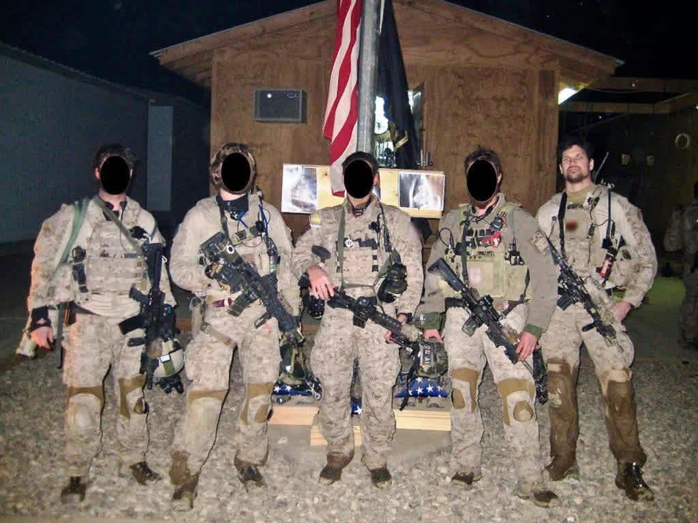
SEAL Team Six operators
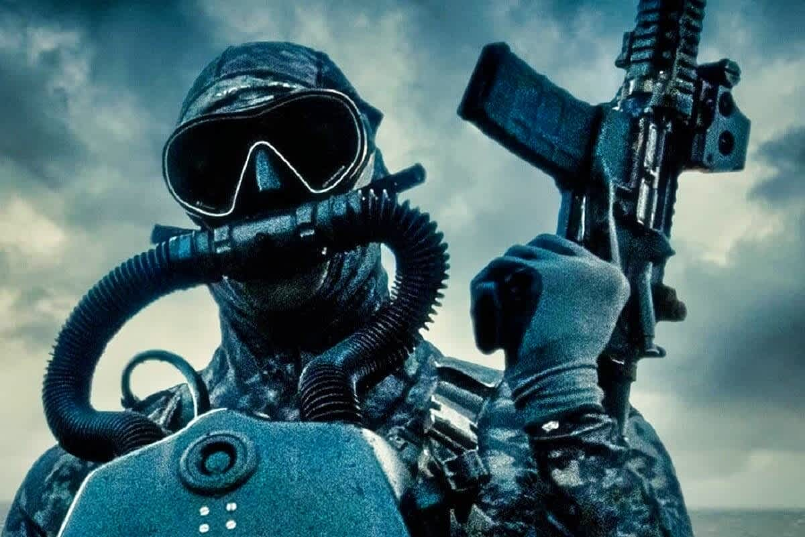
Navy SEAL with rifle
The Joint Special Operations Command (JSOC) is the US's "Tier 1" SOF architecture — a small, permanent task force of the most capable operators in the world, normally operating under Title 50 (intelligence/covert action) authorities rather than Title 10 (military) when deployed to non-declared conflict zones.[^24]

| Unit | Command | Size | Primary Taiwan-Relevant Role |
|---|---|---|---|
| **1st SFOD-D "Delta Force"** | JSOC | ~1,000 operators | HVT direct action; CSAR; demolition of critical infrastructure targets (airfields, bridges) in China's logistics zone; rescue of Taiwan leadership[^25][^8] |
| **DEVGRU / SEAL Team 6** | JSOC | ~300 operators (assault + support) | Maritime direct action; underwater demolitions; covert extraction of Taiwan leadership; protection of critical naval assets; port infiltration[^26][^27] |
| **75th Ranger Regiment** | JSOC | ~3,600 Rangers (3 battalions) | Airfield seizure; rapid reaction; SOF support force; provides assault force for JSOC raids; Objective Rhino-style operations at night with no warning[^25] |
| **160th SOAR "Night Stalkers"** | JSOC | ~1,800 + MH-60M/MH-47G fleet | Infiltration/exfiltration of all JSOC units; covert night flying; precision navigation; the taxi service that makes every JSOC raid possible[^25] |
| **24th Special Tactics Squadron** | JSOC/USAF | ~250 Combat Controllers + PJs | Joint Terminal Attack Control (JTAC); Combat Search & Rescue; covert airfield establishment; can declare and manage air traffic at a captured airstrip from a backpack[^25] |

**SEAL Team 6 / Taiwan — Current Status:**
DEVGRU confirmed to be training for Taiwan-related missions at its Virginia Beach headquarters for over a year, per *Financial Times* reporting. Former Navy SEAL analysts assess the role as "high-end maritime missions" — port area operations, underwater special reconnaissance of PLAN amphibious staging areas, and covert extraction/protection of Taiwan's senior leadership rather than massed direct combat.[^26][^28][^29][^27]

***
### 2.2 US Army Special Forces — 1st SFG Forward Deployment to Taiwan
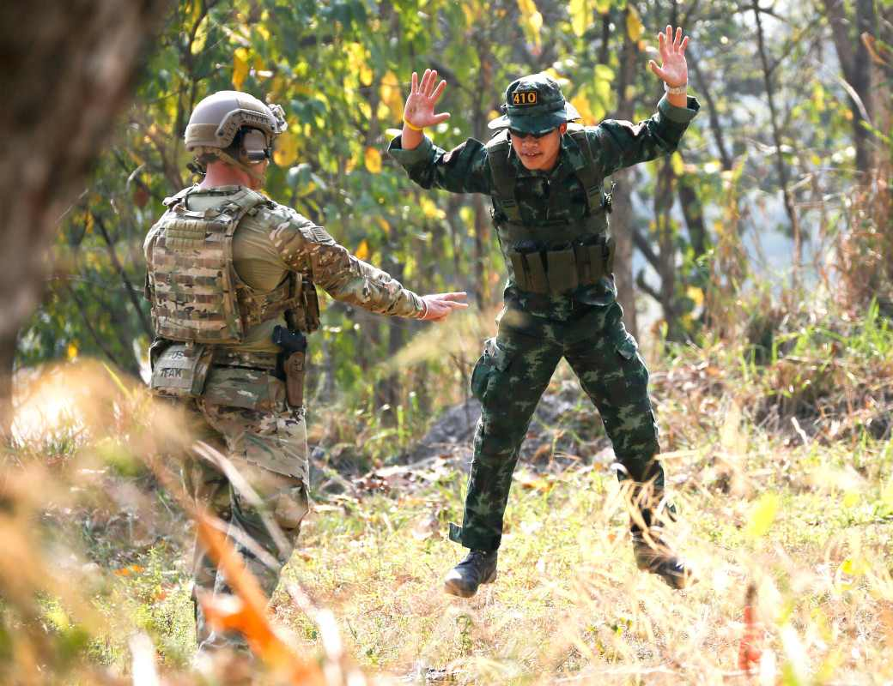
Military training exercise

Military training exercise
The 1st Special Forces Group (Airborne) is the US Army's Pacific-focused SF group, headquartered at Joint Base Lewis-McChord, Washington, with a forward element at Torii Station, Okinawa.[^30][^31]
**1st SFG Green Berets in Taiwan — Current Deployment (2025–2026):**
Under the 2023 National Defense Authorization Act's Special Operations Forces Liaison Element (SOFLE) provision, Green Berets from 1st SFG, 2nd Battalion, Alpha Company are permanently stationed at Taiwan Army amphibious command centers in **Kinmen** and **Penghu**. This is the first enduring US military presence on Taiwan in over four decades.[^32][^33]

In April 2025, the *China in Arms* publication confirmed that 1st SFG advisors completed a **three-year evaluation** of Taiwan's special forces on the outer islands and recommended that the 101st ARB "Sea Dragon Frogmen" **reposition from Kinmen to Penghu** — a strategic shift moving Taiwan's most capable amphibious reconnaissance unit out of the first-strike zone and preserving it for the follow-on defense campaign.[^34][^35]

The SOFLE coordinates all US SOF activities in Taiwan from a base in **Taoyuan's Longtan District**, running joint training with Taiwan's 101st Amphibious Reconnaissance Battalion and Airborne Special Service Company. Activities span Kinmen (6 miles from mainland China), Matsu, Penghu, and the Tamsui River estuary.[^33]

| 1st SFG Taiwan Mission | Detail |
|---|---|
| **Foreign Internal Defense (FID)** | Primary mission — train, advise, assist Taiwan SOF units[^33] |
| **Unconventional Warfare prep** | Building infrastructure for sustained guerrilla resistance against occupation[^6] |
| **101st ARB integration** | Sea Dragon Frogmen — HAHO, combat diving, beach reconnaissance, underwater demolition[^36] |
| **ASSC integration** | Airborne Special Service Company — decapitation-strike counterpart; Taiwan's most secretive unit[^37] |
| **Joint exercises** | Han Kuang 2025 — 10-day exercise with Gray Zone Phase + conventional defense[^23][^38] |

***
### 2.3 SOCOM Autonomous Warfare — The Game-Changer: DAWG and Replicator
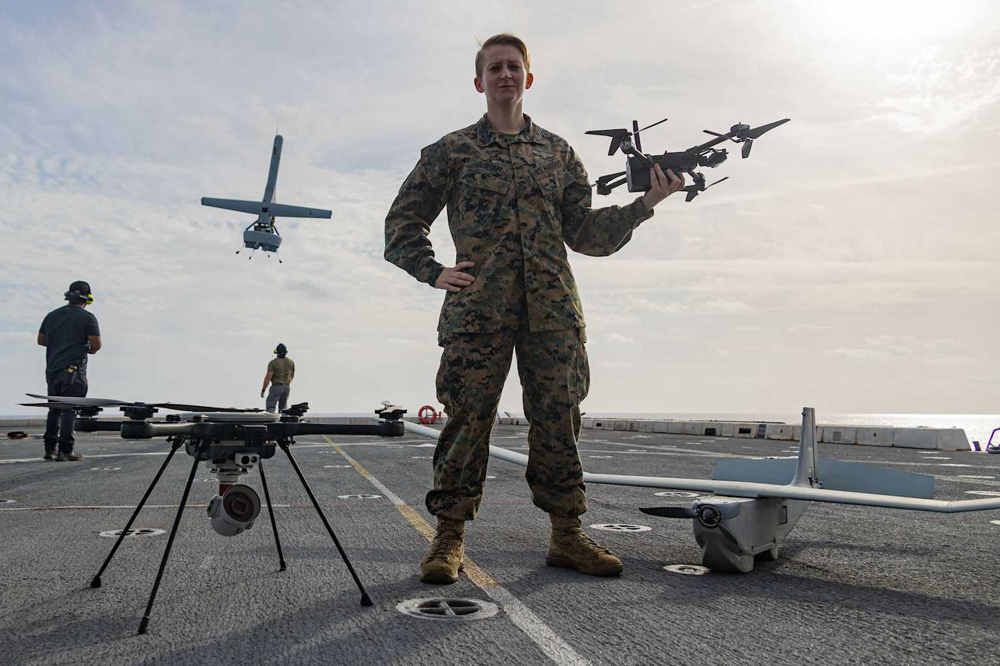
Marine with drone
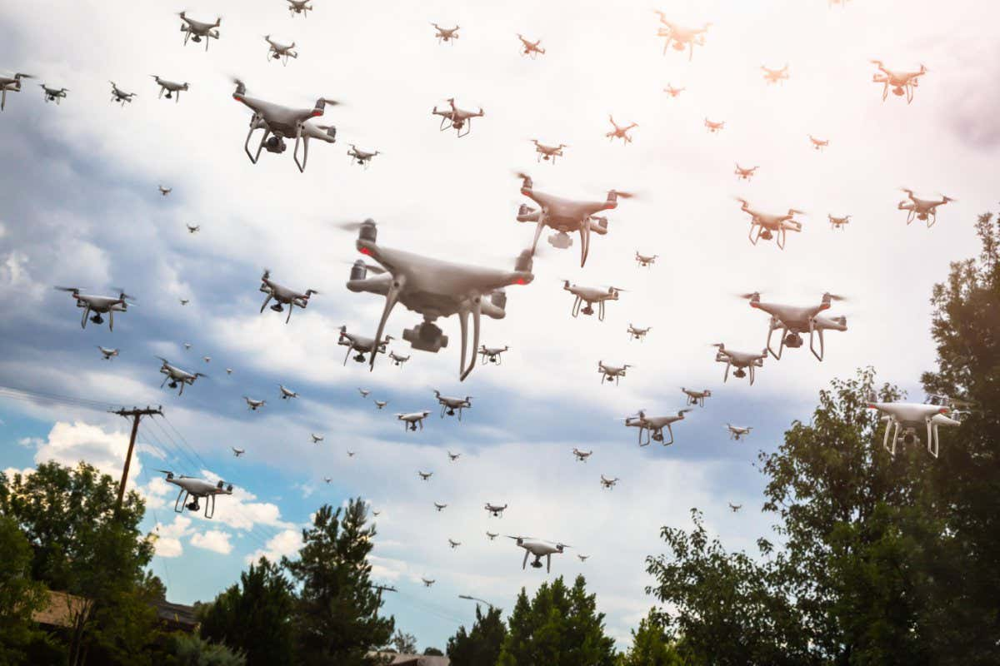
Drone swarm
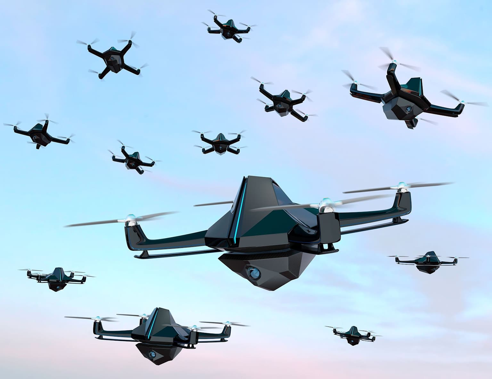
Drone swarm
The single most consequential SOF development of 2025–2026 is the transformation of the Replicator autonomous drone program into the **Defense Autonomous Warfare Group (DAWG)**, now assigned to SOCOM, with a FY2027 budget request of **$54.6 billion** — the "largest single commitment to autonomous warfare in history" per former CIA Director David Petraeus.[^5]

| DAWG / Replicator Development | Detail |
|---|---|
| **Origin** | Replicator initiative — field "thousands" of attritable drones to counter China[^39] |
| **Phase 1 result** | "Hundreds" not thousands fielded by August 2025 target; technical integration issues with existing command structures[^39] |
| **Replicator absorption** | Late 2025: Pentagon dissolved Replicator; absorbed into newly minted DAWG under SOCOM[^5][^40] |
| **FY2026 budget** | $225.9 million (original modest estimate)[^5] |
| **FY2027 request** | $54.6 billion — 24,000% single-year increase[^5] |
| **Fund flexibility** | $53 billion in flexible reconciliation pot — DAWG has 5 years to obligate[^5] |
| **SOCOM integration** | "AI and autonomy at every level" — SOCOM Admiral Frank "Mitch" Bradley, April 2026 Senate Armed Services Committee[^4] |
| **Autonomous proving ground** | SOCOM + SOFWERX at NASA Stennis Space Center — all-domain unmanned systems integration and testing under "Drone Dominance" initiative[^3] |
| **Taiwan Anduril link** | Anduril Industries delivering AI drone warfare suite to Taiwan directly — OPF-L loitering munitions + AI integration for Taiwan's own forces[^40][^41] |

**What This Means in Practice:**
SOCOM's pivot to autonomous warfare transforms what a 12-man Operational Detachment Alpha (ODA) team can accomplish. An ODA currently planning to train Taiwan's reserves could instead deploy a 200-drone swarm covering a 50 km grid of beach approaches, relay real-time targeting data to a HIMARS battery, and autonomously track PLAN submarine periscopes — all without additional personnel. SOF Week 2026 (Tampa, May 2026) was dominated by drone/AI discussions, with the theme explicitly: special operators as orchestrators of autonomous systems rather than kinetic operators alone.[^42][^5]

***
## PART III: TAIWAN'S SPECIAL OPERATIONS FORCES
### 3.1 Force Structure — Aviation and Special Forces Command (New 2026)
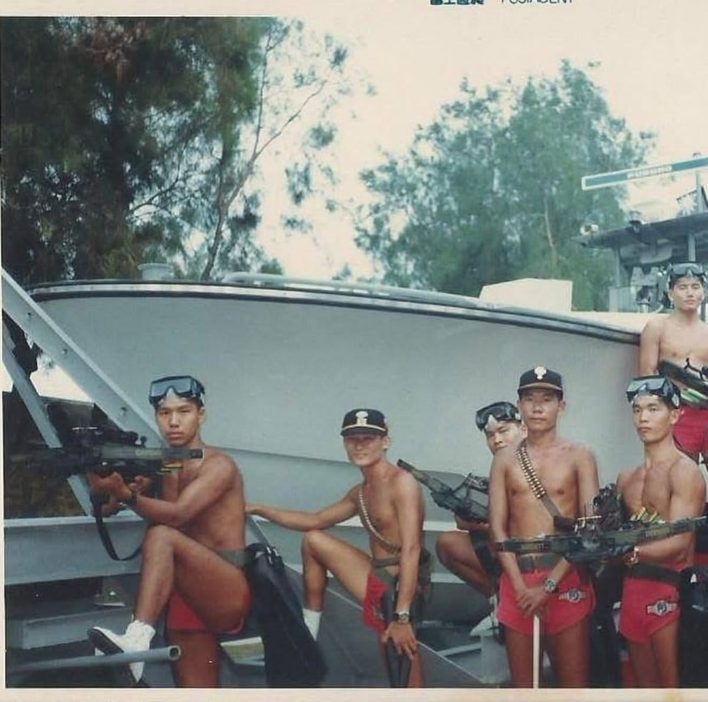
Taiwanese Sea Dragon Frogmen
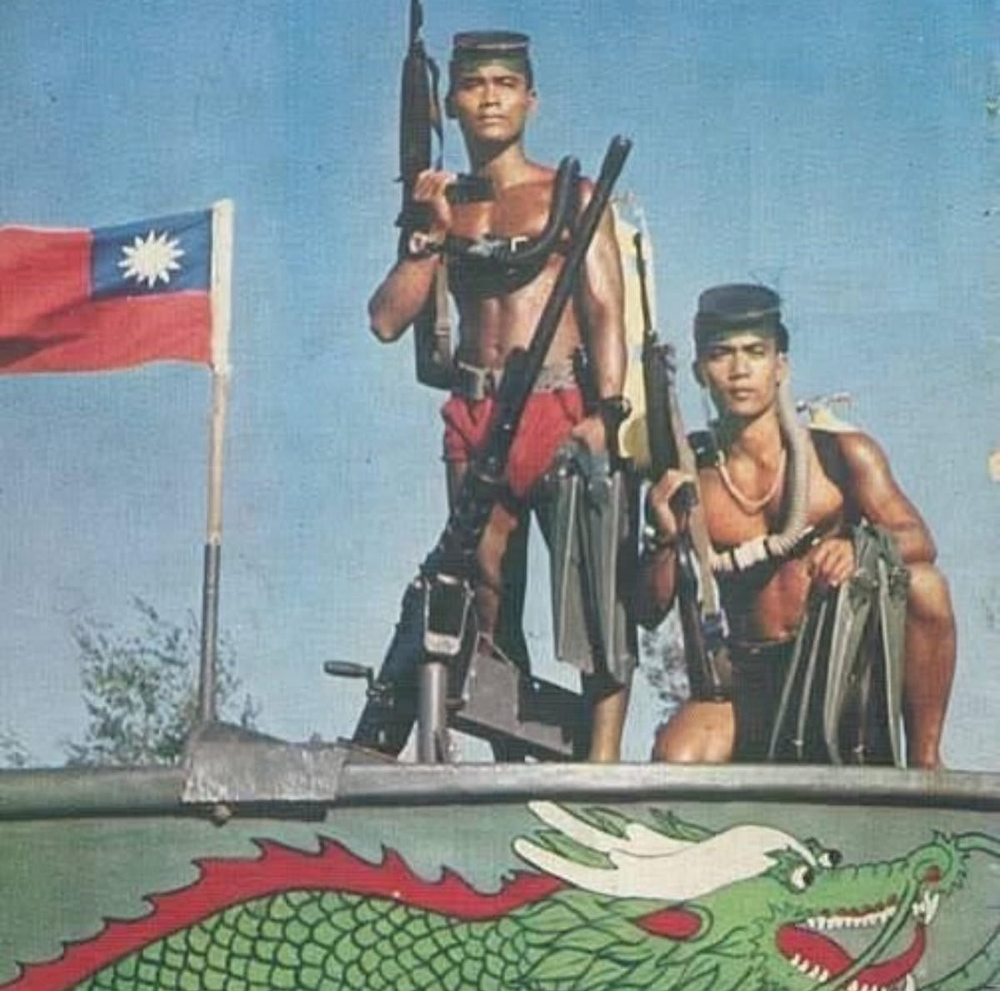
Taiwanese frogmen
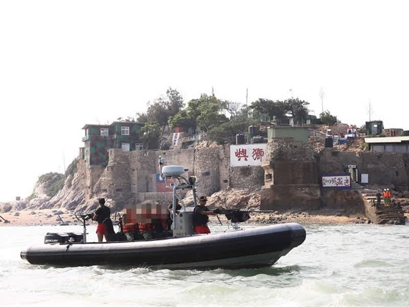
Inflatable boat near shore
In October 2025, Taiwan transferred both the 101st Amphibious Reconnaissance Battalion and the Airborne Special Service Company to a newly established **Aviation and Special Forces Command**, merging them into a single combined unit effective January 1, 2026. This consolidation reflects the US Green Beret advisors' recommendation after three years of evaluation — creating a unified, rapidly-deployable SOF command rather than fragmented branch assets.[^43]

| Taiwan SOF Unit | Branch | Classification | Role |
|---|---|---|---|
| **101st Amphibious Reconnaissance Battalion (ARB)** | ROCA (Army) | "Sea Dragon Frogmen"[^36] | Combat diving; beach reconnaissance; underwater demolitions; raiding; coastal surveillance and infiltration[^35] |
| **Airborne Special Service Company (ASSC)** | ROCA (Army) | "Liang Shan" — Taiwan's most secretive unit[^37] | HAHO/HALO airborne operations; **decapitation strikes against PRC leadership**; deep penetration missions into mainland China; personnel recovery[^44] |
| **ROCMC Amphibious Reconnaissance and Patrol (ARP)** | ROC Marine Corps | Counter-terrorism | Maritime special reconnaissance; CT; distinct from ARB[^36] |
| **ROC Military Police Special Services Company (MPSSC)** | Military Police | VIP protection | Protection of government leaders; CT; special reconnaissance; personnel recovery[^44] |
| **ROC Air Force Combat Controller Teams** | ROCAF | JTAC/pathfinder | Airfield seizure/seizure defense; terminal attack control for allied airstrikes |
**101st ARB Relocation (2025 — Strategic Significance):**
The Sea Dragon Frogmen completed relocation from **Kinmen Island** (6 miles from mainland China, indefensible in opening strike) to **Penghu Island** (off Taiwan's southwest coast, within Taiwan's territorial waters) in November 2025. US Green Berets confirmed training will continue without interruption. The move preserves Taiwan's most capable HUMINT/amphibious SOF asset beyond the range of PLA artillery and the first strike missile salvo — a critical decision that, if the opposite had been chosen, would have placed the ARB within the PLA's initial kinetic kill zone.[^35][^43]

**ASSC — Taiwan's Mirror of Delta Force:**
The Airborne Special Service Company is the most classified unit in Taiwan's entire military. Based in Pingtung County, ASSC operators are trained in HAHO/HALO (High Altitude High Opening / High Altitude Low Opening) parachuting, enabling infiltration into mainland China from 30,000+ feet — well beyond radar detection range. Their explicit wartime mission includes **decapitation strikes against PRC leadership** — the mirror image of Beijing's rehearsed strikes against Taiwan's leadership in Justice Mission 2025. ASSC operators are assessed to train with US JSOC units, though this is not officially confirmed.[^37][^44]

***
## PART IV: ALLIED SPECIAL OPERATIONS FORCES
### 4.1 Japan — JGSDF Special Operations Group (SOG)
Japan's Special Operations Group is the most integrated Allied SOF unit for any Taiwan contingency, given Japan's geographic position and treaty obligations.[^45][^46]

| Specification | JGSDF Special Operations Group |
|---|---|
| **Established** | 2004 — first dedicated SF unit in postwar Japan |
| **Strength** | ~300 operators |
| **Headquarters** | Camp Narashino, Chiba Prefecture |
| **Training (2025)** | Joint FTX with US Army Special Operations Command, January–February 2025[^46] |
| **Training (2026)** | Joint FTX with Australian SASR and US ASOC, April 2026[^45] |
| **Capabilities** | Direct action; special reconnaissance; hostage rescue; unconventional warfare[^46] |
| **Key strength** | Operates natively within the geography of the Ryukyu chain — knows every island, underwater feature, and civilian infrastructure layout between Okinawa and Taiwan |
| **JGSDF Airborne** | 1st Airborne Brigade — 600 paratroopers; can air-insert to Ryukyu islands or Taiwan within range of C-2 transport aircraft |
| **Taiwan relevance** | Pre-positioned intelligence on Chinese undersea survey vessels operating near Ryukyu cables; potential EABO support for USMC MLR island-chain denial operations |

***
### 4.2 South Korea — 707th Special Mission Group
South Korea's premier CT/direct action unit is modeled partly on Delta Force and GIGN.[^47]

| Specification | ROK 707th Special Mission Group |
|---|---|
| **Mission** | Counter-terrorism; hostage rescue; direct action; special reconnaissance |
| **Training** | Regular exchanges with US JSOC units |
| **Key capability** | Tier 1 CQB; HALO insertion; maritime operations |
| **Taiwan relevance** | Strategic reserve — primarily committed to Korean Peninsula deterrence; if DPRK remains non-belligerent, could provide HVT direct action capacity in a broader China contingency |
| **ROK Special Warfare Command** | 7 SF brigades + 1 SF group totaling ~15,000 Korean Special Forces — largest SOF community among US Pacific allies |

***
### 4.3 Australia — Special Air Service Regiment (SASR) and 2nd Commando Regiment
Australia's SASR is the Australian analogue of the British SAS, with deep US JSOC integration from Iraq and Afghanistan.[^48]

| Specification | Australian SASR + 2 Cdo Regt |
|---|---|
| **SASR Strength** | ~600 operators (3 sabre squadrons) |
| **2 Cdo Regt** | ~600 operators — direct action; raid; SSE |
| **2025 Exercise** | Talisman Sabre 2025 — 35,000 personnel from 19 nations; simultaneous amphibious landings; Australia's largest warfighting exercise in history[^49] |
| **Key capability** | CANSOFCOM compatibility; US JSOC integration; long-range desert/jungle SOF skills; maritime direct action |
| **Taiwan relevance** | 1,800 km from Darwin to Taiwan — within MV-22B range for insertion from HMAS *Canberra* or USS equivalent staging platform |

***
### 4.4 Canada — CANSOFCOM / JTF-2
Canada's Joint Task Force 2 maintains Indo-Pacific deployment rotations and deep US JSOC integration.[^48]

| Specification | JTF-2 / CSOR |
|---|---|
| **JTF-2** | Counter-terrorism; direct action; hostage rescue |
| **CSOR** | Unconventional warfare; FID; special reconnaissance |
| **2025 deployments** | Arctic sovereignty + Indo-Pacific rotations with Talisman Sabre 2025[^48] |
| **Key niche** | CBRN response; cold-weather expertise; SIGINT support to JSOC in Pacific |

***
## PART V: SIDE-BY-SIDE CAPABILITY COMPARISONS
### 5.1 Core Missions — China PLA/PAP SOF vs. US JSOC vs. Taiwan SOF
| Mission | China PLA/PAP SOF | US JSOC | Taiwan SOF | Allied SOF |
|---|---|---|---|---|
| **Decapitation Strike** | Core doctrine — Justice Mission 2025 rehearsed strikes on Taiwan leadership[^19] | Countered by protection missions (DEVGRU leadership protection, 24th STS)[^28] | ASSC operates mirror missions against PRC leadership[^37] | Japan SOG/Australia SASR — support capacity |
| **Underwater Demolition** | PLAN frogmen — beach clearing, harbor mining[^10] | DEVGRU — port infiltration, PLAN sub pen reconnaissance[^27] | ARB 101st — beach recce, obstacle clearance[^36] | Australia SASR — maritime/underwater |
| **Special Reconnaissance** | Priority mission — target marking for DF missiles[^2] | 75th Rangers + Delta SR teams — PLAN staging area surveillance | ASSC/ARB — mainland Chinese coastal infiltration | Japan SOG — Ryukyu island surveillance |
| **Urban CQB/CT** | PAP Falcon + Snow Leopard — primary occupation enforcement[^11][^15] | Delta Force — HVT raids; embassy/leadership protection | MPSSC — VIP protection, CT | SASR/707th — allied CT support |
| **Airborne Insertion** | 15th Airborne "Thunder Gods" — airfield seizure[^10] | 75th Rangers — RGR airfield seizure (JSOC supported) | ASSC — HAHO into mainland China[^37] | Japan 1st Airborne Bde |
| **Autonomous Drones** | Commercial UAS + military micro-drones[^10] | DAWG/SOCOM $54.6B autonomous warfare[^5] | Anduril AI warfare suite being delivered[^40] | Australia/Japan: growing organic UAS |
| **Gray Zone / Cable Sabotage** | Shadow fleet + PAP maritime units — 4 cable cuts Jan–Feb 2025[^16] | US Navy UUV + intelligence monitoring[^17] | Coast guard patrols of 24 cables[^21] | NATO Baltic Sentry as model |
| **Unconventional Warfare** | No UW mission — conventional seizure focus | 1st SFG building Taiwan resistance networks[^33] | Han Kuang Phase 3 — whole-of-society resilience[^23] | Regional ally integration |
### 5.2 Individual Unit Capability Matrix
| Unit | Country | Size | Primary Role | Tier | Combat Experience | Taiwan-Specific Training |
|---|---|---|---|---|---|---|
| **DEVGRU / SEAL Team 6** | USA | ~300 | Maritime DA; HVT; leadership protection[^24][^26] | Tier 1 | 25+ years continuous combat — GWOT, bin Laden raid | Active Taiwan training 1+ years[^26] |
| **1st SFOD-D Delta Force** | USA | ~1,000 | DA; CT; strategic reconnaissance[^25] | Tier 1 | 25+ years continuous — Mogadishu, Iraq, Syria | Not publicly confirmed Taiwan-specific |
| **1st SFG Green Berets** | USA | ~1,400 | FID; UW; FID; direct action[^31] | Tier 2 | GWOT; Philippines; Korea; JCET | **Permanently deployed Kinmen/Penghu**[^33] |
| **Airborne Special Service Company (ASSC)** | Taiwan | ~100 | Decapitation; HAHO; deep recon[^37] | Tier 1 | Limited — CT focused | Trains with US JSOC (assessed); US training confirmed[^33] |
| **101st ARB "Sea Dragon Frogmen"** | Taiwan | ~300 | Combat diving; beach recon; infiltration[^36] | Tier 1 | CT; regular cross-strait ops | Active — joint training US 1st SFG confirmed[^33] |
| **PLANMC "Sea Dragon" commandos** | China | ~500–1,000 | Underwater demolition; beach clearing; coastal raiding | Tier 1/2 | Exercises only — no confirmed combat | Taiwan Strait focused — exercises annual |
| **PAP Falcon Commando Unit** | China (PAP) | ~400 | CT; HVT seizure; occupation enforcement[^15][^13] | Tier 1 | Domestic CT | Taiwan occupation Phase 3 planning[^6] |
| **PAP Snow Leopard Commando Unit** | China (PAP) | ~300 | CT; rapid response; VIP protection[^11] | Tier 1 | Domestic CT | Assessed for Taiwan occupation control |
| **PLA 15th Airborne "Thunder Gods"** | China | ~2,000–3,000 | Airfield seizure; air assault[^10] | Tier 2 | No significant combat experience | Annual exercises — airfield seizure scenarios |
| **Japan JGSDF SOG** | Japan | ~300 | DA; SR; HVT; UW[^46] | Tier 1/2 | Limited — GSDF framework | Joint FTX with US ASOC Jan–Feb 2025[^46] |
| **ROK 707th Special Mission Group** | South Korea | ~300 | CT; DA; hostage rescue[^47] | Tier 1 | Korean Peninsula — counterinfiltration | JSOC exchanges; Talisman Sabre 2025[^49] |
| **Australian SASR** | Australia | ~600 | DA; SR; UW; maritime[^48] | Tier 1 | Afghanistan; Iraq; GWOT — extensive | Talisman Sabre 2025 — amphib + SOF[^49] |
### 5.3 Technology — Autonomous and AI-Enabled SOF Capabilities
| Capability | China | USA / JSOC | Taiwan | Allied |
|---|---|---|---|---|
| **Drone swarms** | Commercial DJI derivatives + military micro-drones; limited autonomous coordination[^10] | DAWG/SOCOM — $54.6B FY27 request; "mass autonomy" targeting[^5][^4] | Anduril AI suite being delivered[^40] | Japan/Australia — growing programs |
| **Loitering munitions** | CH-901 + "Butterfly Bomb" (man-portable); FH-901 (rotary-launched)[^10] | Switchblade 600; ALTIUS-600; Rogue 1 (OPF-L USMC)[^41] | Anduril Roadrunner derivative; domestic development | ROK: Loitering munitions fielded with SWC |
| **AI targeting / ISR** | Limited integration at SOF level — mostly larger formation-level[^8] | Maven Smart System + joint fires network integration (III MEF)[^50]; SOCOM "at every level"[^4] | Anduril AI war suite[^40] | Japan/Australia: allied AI integration |
| **Subsea autonomous** | UUV cable-cutting vessel (4,000m depth, March 2025)[^17] | USN UUV + SOCOM maritime autonomous proving ground[^3] | Coast guard AI monitoring + UUV[^17] | NATO Baltic Sentry model UUV patrols |
| **Cognitive/info ops** | Most sophisticated — 4 vector cognitive warfare campaigns against Taiwan since 2022[^18] | MISO + PSYOP — countering PRC influence campaigns in Taiwan | 2025 Han Kuang — first gray-zone integration[^23] | FVEY SIGINT sharing network |

***
## PART VI: STRATEGIC ASSESSMENT
### The Pre-Invasion Ghost War Is Already Happening
The most important finding from all available open-source intelligence is that the special operations / gray-zone conflict between China and Taiwan is **not a future scenario — it is the present reality**. Four cable cuts in two months (January–February 2025), a convicted Chinese captain who intentionally severed the TP3 cable, ongoing cognitive warfare campaigns mapped by Taiwan's 2025 Han Kuang exercises, Justice Mission 2025's explicit rehearsal of "decapitation strikes" against Taiwan's political leadership on December 29, 2025 — these are Phase 0 of the PLA's campaign plan, and they are ongoing.[^19][^22][^16][^17][^23]
### China's Critical SOF Advantage: Patience and Persistence in Phase 0
The PLA's gray-zone architecture has no parallel among US or Allied SOF — not because of capability, but because of legal and political authority. China can deploy maritime militia, shadow fleet vessels, intelligence operatives, and cyber units against Taiwan continuously, at scale, with legal deniability, for years before any kinetic operation. US JSOC is structurally oriented toward discrete, time-limited operations; it cannot conduct continuous gray-zone pressure against China's coastline at the scale China applies to Taiwan. This asymmetry is the most underappreciated SOF advantage China holds.
### US/Allied Critical SOF Advantage: Depth, Technology, and the Resistance Framework
What the US SOF community has built in Taiwan since 2023 is not primarily a combat force — it is a resistance infrastructure. The 1st SFG's three-year evaluation program, the SOFLE at Longtan coordinating all US SOF activity, the joint training with ASSC and ARB units, and the Anduril AI warfare suite now being delivered to Taiwan all point to the same conclusion: if China cannot achieve its political objectives in the first 72 hours, it faces a Taiwan that has been prepared to conduct long-duration, AI-assisted, US-advised unconventional warfare from a network of pre-positioned resistance cells. Every ASSC HAHO operator trained to infiltrate mainland China, every ARB frogman relocated from Kinmen to the more survivable Penghu, and every Green Beret ODA teaching Taiwan's reserve forces how to fight in a distributed, contested environment is a direct investment in making occupation prohibitively costly.[^33][^34][^40]
### The DAWG Wildcard: $54.6 Billion Changes the SOF Equation
The FY2027 $54.6 billion DAWG request under SOCOM — if appropriated — will fundamentally transform what special operations forces can accomplish in an island-chain environment. A 12-man ODA team controlling 200 AI-directed loitering munitions, a DEVGRU element that can simultaneously surveil every PLAN submarine transit with UUVs and autonomous aerial systems, a Taiwan resistance cell that can swarm a PLAN beachhead with hundreds of semi-autonomous attack drones guided by Anduril's AI targeting architecture — these are not science fiction scenarios in 2027. They are the direct programmatic output of the Replicator-to-DAWG transition that was formally announced at SOF Week 2026 in Tampa in May 2026.[^42][^5]

China's PLA SOF architecture, with its commercial drone adaptation and limited organic special mission aircraft, has not demonstrated a comparable autonomous warfare integration capability. The PLA's SOF community was described by the US Army War College as "highly trained light infantry" operating "not too far from friendly units" — effective in the short-duration, high-intensity Phase 0 and Phase 1 missions they are designed for, but not equipped for the persistent, AI-integrated, long-range autonomous warfare the US/Allied SOF community is now building.[^8]

---

## References

1. [China's Way of Occupation: Implications for Taiwan](https://irregularwarfarecenter.org/publications/research-studies/chinas-way-of-occupation-implications-for-taiwan/) - In Taiwan, this would likely involve embedding PAP units in major cities while PLA forces secure inf...

2. [PLA Special Operations Threat to Taiwan](https://globaltaiwan.org/2017/11/pla-special-operations-threat-to-taiwan/) - Psychological missions could include decapitation strikes and attacks against key military targets o...

3. [SOCOM seeks autonomous warfare proving ground - DefenseScoop](https://defensescoop.com/2026/05/27/socom-seeks-autonomous-warfare-proving-ground/) - SOCOM officials plan to create an autonomous warfare providing ground at NASA's Stennis Space Center...

4. [SOCOM adding AI, autonomy 'at every level,' commander says](https://www.defenseone.com/technology/2026/04/socom-adding-ai-autonomy-every-level-commander-says/413186/) - AI and autonomy are being integrated into special operations “at every level,” the leader of U.S. Sp...

5. [A New DAWG in the Fight: The Pentagon's $54 Billion Bet on ...](https://dsm.forecastinternational.com/2026/05/21/a-new-dawg-in-the-fight-the-pentagons-54-billion-bet-on-autonomous-warfare/) - In late 2025, the Pentagon officially dissolved Replicator, absorbing it into the newly minted Defen...

6. [China's Occupation Playbook for Taiwan Is Already Written](https://smallwarsjournal.com/2026/05/12/china-taiwan-occupation-strategy/) - PRC scholars are no longer debating how to take Taiwan, but how to rule it. New studies outline Beij...

7. [People's Liberation Army Special Operations Forces - Wikipedia](https://en.wikipedia.org/wiki/People's_Liberation_Army_Special_Operations_Forces) - They specialize in direct action, reconnaissance, intelligence gathering, and counter-terrorism oper...

8. [Chinese Special Operations Forces: Not Like "Back at Bragg"](https://warontherocks.com/chinese-special-operations-forces-not-like-back-at-bragg/) - Chinese SOF units are provided the most modern weapons and equipment in the PLA and PAP for experime...

9. [What do we know about China's Special Forces? - Reddit](https://www.reddit.com/r/WarCollege/comments/e8996l/what_do_we_know_about_chinas_special_forces/) - The Falcons are under the First Armed Police Mobile Corps, and the Snow Leopards are under the Secon...

10. [Chinese Special Forces: Dragons of the East - Grey Dynamics](https://greydynamics.com/chinese-special-forces-dragons-of-the-east/) - Chinese special forces are largely an enigma to outside observers. This article seeks to examine the...

11. [Snow Leopard Commando Unit - Wikipedia](https://en.wikipedia.org/wiki/Snow_Leopard_Commando_Unit) - The Snow Leopard Commando Unit formerly known as the Snow Wolf Commando Unit is a People's Armed Pol...

12. [People's Armed Police (PAP) Special Operations Forces](https://bootcampmilitaryfitnessinstitute.com/elite-special-forces/chinese-elite-special-forces/peoples-armed-police-pap-special-operations-forces/) - PAP has two SOF units, or Special Police Units (SPU), both stationed in Beijing, and they are the tw...

13. [[PDF] Military and Security Developments Involving the People's Republic ...](https://media.defense.gov/2024/dec/18/2003615520/-1/-1/0/military-and-security-developments-involving-the-peoples-republic-of-china-2024.pdf) - The updated PLA organizational structure features ... the Snow Leopards Commando Unit and the Falcon...

14. [Global Times - Facebook](https://www.facebook.com/globaltimesnews/posts/a-recent-official-media-program-unveiled-some-of-the-equipment-and-tactics-used-/1419474660224737/?locale=id_ID) - They are based in Beijing and operate under the Ministry of Public Security. o Falcon Commando Unit ...

15. [Waging War without Disruption: China's People's Armed Police in a ...](https://ssi.armywarcollege.edu/SSI-Media/Recent-Publications/Article/4165397/waging-war-without-disruption-chinas-peoples-armed-police-in-a-future-conflict/) - ... Falcon Commandos to “remain at the forefront of special operations, continually improving mechan...

16. [Countering China's Subsea Cable Sabotage - Global Taiwan Institute](https://globaltaiwan.org/2025/03/countering-chinas-subsea-cable-sabotage/) - In early 2025, the Xingshun 39 (興順39), a Tanzania-flagged vessel controlled by a Chinese entity, del...

17. [Undersea Cable Sabotage Underscores Ongoing Threat of Grey ...](https://www.globalsitu.com/post/global-deep-dive-undersea-cable-sabotage-underscores-ongoing-threat-of-grey-zone-warfare) - On 12 June 2025, a Taiwanese court handed a three-year prison term to a Chinese captain named Wang f...

18. [a typological analysis of the PLA's cognitive warfare against Taiwan ...](https://www.tandfonline.com/doi/abs/10.1080/14799855.2026.2620715) - Between 2022 and 2024, China targeted Taiwan with four large-scale military exercises, integrating m...

19. [Joint military drills "Justice Mission 2025" around Taiwan, starting ...](https://x.com/ChinaMilBugle/status/2005591693568168297) - The fourth keyword is "decapitation strike." The exercises conducted simulated strikes against key s...

20. [Justice Mission-2025 - Wikipedia](https://en.wikipedia.org/wiki/Justice_Mission-2025) - Justice Mission 2025 (Chinese: 正义使命—2025) was a large-scale military exercise conducted by the Peopl...

21. [Exclusive: Facing new China 'grey-zone' threat, Taiwan steps up sea ...](https://www.reuters.com/world/china/facing-new-china-grey-zone-threat-taiwan-steps-up-sea-cable-patrols-2025-09-11/) - Taiwan increases patrols to protect undersea cables from sabotage · Especially monitoring 96 blackli...

22. [Beijing's Grey Zone Tactics Present a Growing Threat to Taiwan](https://thesoufancenter.org/intelbrief-2025-july-10/) - The PRC has increased its grey zone activities targeting Taiwan, such as launching disinformation ca...

23. [[PDF] Han Kuang 2025 - United Service Institution of India](https://usiofindia.org/pdf/Han_kuang_2025_SP.pdf) - The Han Kuang 2025 marks a clear evolution in Taiwan's defence posture by recognising that conflict ...

24. [SEAL Team Six - Wikipedia](https://en.wikipedia.org/wiki/SEAL_Team_Six) - DEVGRU and the Army's Delta Force train and deploy together on counter-terrorist missions usually as...

25. [Delta Force vs SEAL Team 6 - Selection - YouTube](https://www.youtube.com/watch?v=M1mowX2S1Mw) - ... (SEAL Team 6) selection, breaking down their brutal training, philosophies, and what it takes to...

26. [DEVGRU in the news: "US Navy Seal unit that killed bin Laden ...](https://www.reddit.com/r/JSOCarchive/comments/1ff556j/devgru_in_the_news_us_navy_seal_unit_that_killed/) - ... China, a 200 per cent rise in three years. “That Seal Team 6 is planning for possible Taiwan-rel...

27. [What SEAL Team 6 Could Do in a Fight With China Over Taiwan](https://www.businessinsider.com/seal-team-6-fight-with-china-over-taiwan-2024-10) - SEAL Team 6 is said to be training for a fight with China over Taiwan. Here's what it could do if Be...

28. [Limited role for US Navy SEAL team in defense of Taiwan - VOA](https://www.voanews.com/a/limited-role-for-us-navy-seal-team-in-defense-of-taiwan/7784108.html) - The United States Navy's elite SEAL Team Six would likely have a limited role in defending Taiwan sh...

29. [Elite US Seal Team 6 preparing to defend Taiwan: Report](https://san.com/cc/elite-us-seal-team-6-preparing-to-defend-taiwan-report/) - The commandos of Seal Team 6 are training for the potential invasion of Taiwan by Chinese forces, ac...

30. [Reel: 1st SFG(A) Green Berets conduct close-quarters battle drills](https://www.dvidshub.net/video/1002689/reel-1st-sfga-green-berets-conduct-close-quarters-battle-drills) - JOINT BASE LEWIS-MCCHORD, WASHINGTON, UNITED STATES · 06.18.2025 · Video by Spc. Noah Martin · 1st S...

31. [1st Special Forces Group (United States) - Wikipedia](https://en.wikipedia.org/wiki/1st_Special_Forces_Group_(United_States)) - The 1st Special Forces Group (Airborne) (1st SFG) (A) is a unit of the US Army Special Forces operat...

32. [US Green Berets will permanently deploy to Taiwan](https://san.com/cc/us-green-berets-will-permanently-deploy-to-taiwan/) - US Army Green Berets will deploy in three-man teams to a couple of amphibious camps, acting as consu...

33. [U.S. Special Forces Deepen Presence in Taiwan Overview](https://sofsupport.org/u-s-special-forces-deepen-presence-in-taiwan-amid-rising-regional-tensions/) - Discover the implications of U.S. Special Forces deepening their presence in Taiwan due to increasin...

34. [Green Berets Advise Taiwan Army Frogmen to Reposition](https://chinainarms.substack.com/p/green-berets-advise-taiwan-army-frogmen) - The US Green Berets have recommended that Taiwan's special operation forces on the outer islands res...

35. [101st Amphibious Reconnaisance Battalion “Frogmen” Relocation](https://tsm.schar.gmu.edu/visualization-101st-amphibious-reconnaisance-battalion-frogmen-relocation/) - The ARB-101st operates as a special-purpose coastal surveillance, infiltration, and clandestine oper...

36. [101st Amphibious Reconnaissance Battalion - Wikipedia](https://en.wikipedia.org/wiki/101st_Amphibious_Reconnaissance_Battalion) - The 101st Amphibious Reconnaissance Battalion known as the Sea Dragon Frogmen is a special operation...

37. [Airborne Special Service Company - Wikipedia](https://en.wikipedia.org/wiki/Airborne_Special_Service_Company) - Considered the most secretive unit in Taiwan, the ASSC is reportedly based in Taiwan Pingtung County...

38. [Taiwan Wraps Up Its Largest-Ever Han Kuang Military Exercises](https://www.youtube.com/watch?v=ZguxIo94s54) - Taiwan's military has wrapped up ten straight days of exercises. This year's Han Kuang drills weren'...

39. [DoD promised a 'swarm' of attack drones. We're still waiting.](https://responsiblestatecraft.org/replicator/) - Defense officials consistently tout the Replicator initiative — an ambitious effort to “swarm” thous...

40. [SOCOM, DAWG, and Drones - Sep 30, 2025 - SOF News](https://sof.news/drones/20250930/) - A suite of weapons associated with AI and drone warfare is in the future for Taiwan courtesy of an A...

41. [Teledyne FLIR Defense Awarded $42.5 Million Drone Contract for ...](https://defense.flir.com/about/news/teledyne-flir-defense-awarded-$42.5-million-drone-contract-for-u.s.-marine-corps-organic-precision-fires-light-program/) - Organic Precision Fires-Light is a program designed to provide rifle squads and platoons with a man-...

42. [SOF Week 2026 in Tampa highlights the military's growing reliance ...](https://www.facebook.com/10TampaBay/posts/sof-week-2026-in-tampa-highlights-the-militarys-growing-reliance-on-drones-ai-an/1410044554486726/) - SOF Week 2026 in Tampa highlights the military's growing reliance on drones, AI, and autonomous syst...

43. [WATCH: Taiwan combines special forces in response to strait tension](https://www.rti.org.tw/en/news?uid=3&pid=178079) - Quickly subduing enemy forces is the goal of the 101st Amphibious Reconnaissance Battalion, otherwis...

44. [Republic of China (Taiwan) Special Forces Explained - YouTube](https://www.youtube.com/watch?v=kngpb9ximQw) - ... Aviation and Special Forces Command 1:40 ROC Marine Corps Amphibious Reconnaissance and Patrol U...

45. [#JGSDF Special Operations Group conducted joint training with the ...](https://www.facebook.com/jgsdf.fep/posts/jgsdf-special-operations-group-conducted-joint-training-with-the-australian-and-/1278242097751149/) - #JGSDF Special Operations Group (#SOG) conducted a FTX with the US Army Special Operations Command f...

46. [Japan Ground Self-Defense Force - Facebook](https://www.facebook.com/jgsdf.fep/posts/jgsdf-special-operations-group-sog-conducted-a-ftx-with-the-us-army-special-oper/991864176388944/) - JGSDF Special Operations Group (#SOG) conducted a FTX with the US Army Special Operations Command fr...

47. [707th Special Mission Group - Wikipedia](https://en.wikipedia.org/wiki/707th_Special_Mission_Group) - The 707th Special Mission Group is a general-purpose special forces unit of the Republic of Korea Ar...

48. [Canada's Special Operators in 2025: Arctic Muscle... - SOFREP](https://sofrep.com/news/canadas-special-operators-in-2025-arctic-muscle-indo-pacific-reps-and-the-niche-skills-allies-count-on/) - In 2025, Canada's special operations command balanced Arctic sovereignty patrols and cold-weather tr...

49. [A military exercise drawing together 19 nations and 35,000 ... - NPR](https://www.npr.org/2025/07/14/g-s1-77431/military-exercise-19-nations-australia) - An Australian Airforce F35 fighter jet participates in Exercise Talisman Sabre 2025, Australia's lar...

50. [III MEF Advances into 2025: Building on a Year of Milestones and ...](https://www.pacom.mil/Media/NEWS/Article/4042993/iii-mef-advances-into-2025-building-on-a-year-of-milestones-and-strengthening-r/) - III Marine Expeditionary Force are poised to build on the successes of 2024, a year marked by signif...
